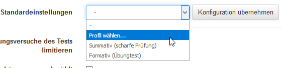
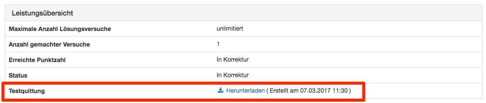

# Test settings - administration

In the "Administration" area of a test, you will find further menus, similar to other learning resources. Here you can configure the test in more detail. The "Settings" and "Edit content" menus are particularly important. 

{ class="shadow" }

The basic configuration of the entire test is largely carried out in the **"Settings "**, particularly in the "Options" tab (see below).

The **"Member administration"** menu is particularly relevant if the test is to be used independently of the course, otherwise the member administration of the test participants is carried out via the linked course.

Under **["Edit content"](Test_editor_QTI_2.1.md)** you can access the test editor. The actual test is created here.

The **"Assessment tool"** of the test only appears if the test is to be used independently of the course (Settings -> Release tab -> Purpose "Independent").

Correctors can be added for the test in the **"Correction workflow"** menu (see below). 

The **"Test statistics"** menu only appears for independent tests, otherwise the test statistics are displayed in the respective course menu. 

The **"Booking options"** menu is only active if the test has been configured as bookable.

A wizard can be used to generate **"Handwritten exams"** based on the online test (see below). 

The tests can be copied or saved using the "Copy", "Export content" and "Export as Word file" menus. 

**"Delete test"** deletes the test learning resource. It can then be found in the author area in the "Deleted" tab. 

On this page you will find more detailed explanations of the following administration menus of the learning resource Test:
* Settings
* Correction-Workflow
* Generate handwritten tests
* Save as word document

## "Settings" of a test

The "Options" tab is particularly important for tests. This is where you configure the entire test. 

{ class="shadow" }

In addition, further settings for the learning resource can be made in the other tabs "Info", "Metadata", "Release" and "Catalog". Make sure that the license information under "Metadata" corresponds to your requirements.

### Tab Options

The following configurations can be made:

**Standard Settings**

Here you can choose a preconfigured selection of typical settings for different test usage situations.

Decide, for example, whether it is a summative or formative test or use a different preset configuration. This makes it easier for inexperienced authors in particular to quickly find a suitable setting. However, later changes and individual adjustments are still possible.

{ class="shadow" }

**Limit the number of solution attempts**

Enter the maximum number of possible solution attempts for a test here. The value can be a maximum of 20. 

**First passed solution attempt counts**

As soon as the result "passed" is achieved, the user cannot perform the test again.

**Allow anonymous users (guests) {: #guest}** 

People without an OpenOlat account can also take the test. However, guests cannot interrupt the test. Only completed tests are counted. The results are also available in the test statistics.

**Display module only, hide LMS**

This selection is made to prevent a user from accessing other OpenOlat functions during a test. OpenOlat is hidden and only displayed again once the test has been completed. 

**Show question title**

Select the checkbox to show users the titles of the questions. If the titles are not to be displayed but the navigation is activated, an anonymized title will appear in the menu navigation.

**Display menu navigation**

If you _do not_ allow menu navigation:

* If "non-linear navigation" is set on the test, the navigation below the question can be called up via a button to select a different question.
* If "linear navigation" is set on the test, the next question appears automatically after submitting an answer and the respondent cannot navigate to other questions.

**Personal notes  {: #notes}**

You can allow users to create personal notes during the test, which are no longer available after the test has been completed.

**Show number of questions and progress in the test**

Select the checkbox to show users the number of questions. 

**Display number of points and score in the test**

Select the checkbox to show users their current score in the test history.

**Show max. points of the question** 

If the checkbox is marked, the maximum achievable points per question in the test are displayed. 

**Allow interruption**

Ticking the checkbox allows users to interrupt the test. The previous answers are saved and users can continue answering the questions at a later time.

**Allow to cancel**

By ticking the checkbox, you allow course participants to cancel the test without saving their answers.

**Create test receipt**

If this option is selected, a test receipt is created at the end of the test, which can be downloaded as an XML file. It is used to verify the test.

{ class="shadow" }

If the "Create test receipt" option is selected, the option Send test receipt by email can also be activated. The XML file created is then also sent to the participant by email.

**Display feedback**

As long as this checkbox is selected, the feedback is displayed in the test history. If the checkbox is no longer selected, feedback is no longer displayed. This applies to the feedback for all question items and also the feedback that can be added at the test level. The individual feedbacks are configured in the test editor.

**Show results after test completion {: #results}**

If this checkbox is selected, the result is displayed after the test has been completed. What exactly is displayed can be selected.

* **Test summary**: The metadata of the entire test is displayed as a summary (incl. points and pass/fail).
* **Section summary**: The metadata of the section is displayed as a summary.
* **Question summary**: The metadata for each individual question is displayed.
* **Answer provided by the participant**: The question is displayed together with the participant's answer.
* **Solution**: The question is displayed together with the correct solution. If a correct solution is stored in the Feedback tab, it is also displayed in the results view with this option.

!!! info "Note"

    The settings made under Options are automatically adopted when the test is included in a [course](Tests_at_course_level.md) and, if desired, can be adapted in the respective course element Test in the course editor in the tabs "Test configuration" or "Options".

    Whether the results are displayed on the test start page in the course is also configured directly in the course.

### Tab "Configuration"

Here the external grading is generally switched on. You can then define whether the test items are evaluated anonymously or with a visible name. The correction period specifies the maximum time available to the grader.

The respective graders are automatically notified when new edits of the test are available. The notification can be sent either immediately after the test is completed or once a day. For this purpose, a suitable mail text can be stored or a template ("Choose language template") can be used. After the first mail notification, two reminder mails can be sent at user-defined intervals (days).

### Tab "Graders"

Here you add the persons who are to grade a test. It does not matter which role the person has in OpenOlat. Users can also be added as graders. Further configurations can be made via the gear wheel, e.g. a grader can be contacted,
deactivated or removed and the respective grading assignments can be displayed.

### Tab "Grading assignments"

Here the processing status of the grading assignments of the different graders can be displayed and filtered according to various criteria.

For more information on cross-course correction, see the [Coaching Tool](../area_modules/Coaching.md).

### Generate handwritten exams

If you want to run a test offline, you can use this wizard to generate a cover sheet and different versions of your test resource with randomly selected answers.

1. In the options you select the language and the number of tests, as well as a prefix for the file names. You can also specify whether you want to generate a cover page or an additional page.

    { class="shadow" }

2. In the second step you choose the attributes that should be copied to the cover page. Some attributes, like the description of the test resource, are still customizable.

    { class="shadow" }

3. Here you have the possibility to select and overwrite certain fields. The description field is copied over from the test resource and can be customized again here.

    { class="shadow" }

4. The summary contains an overview of all settings made and a preview of the tests to be generated. Please note that if there is a large number of generations, it may take some time and the browser may not always respond.

    { class="shadow" }

## Export as Word document

The test is then downloaded in zip format with two Word files, one of which contains only the questions and the other also contains the solutions. The exported file contains all the important information about the test, including the score, so that you can use the document directly.

