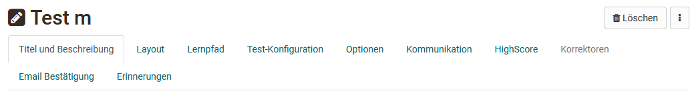
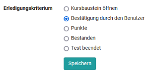
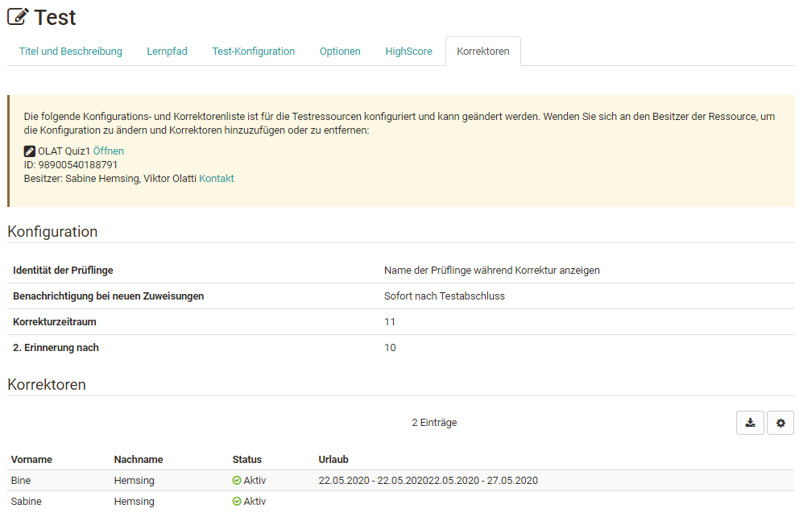
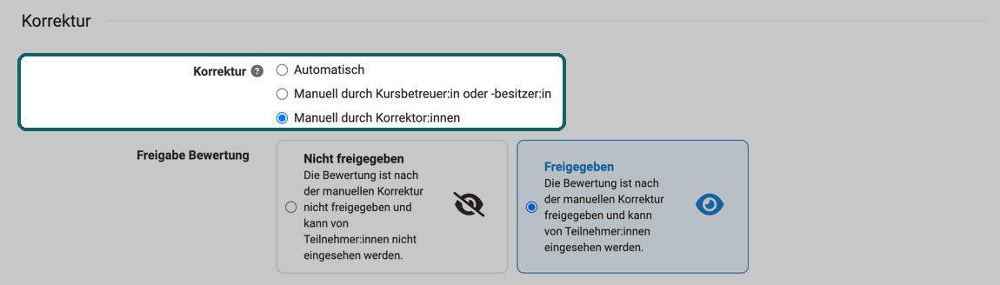
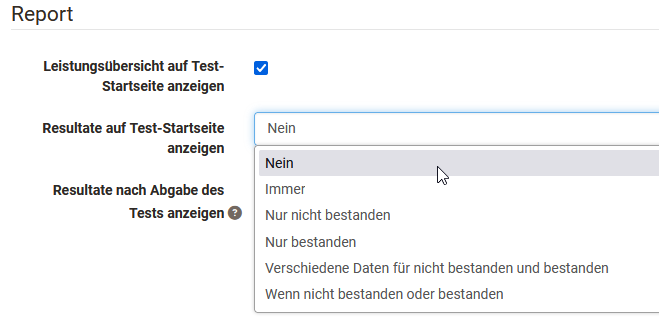
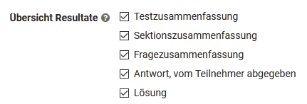
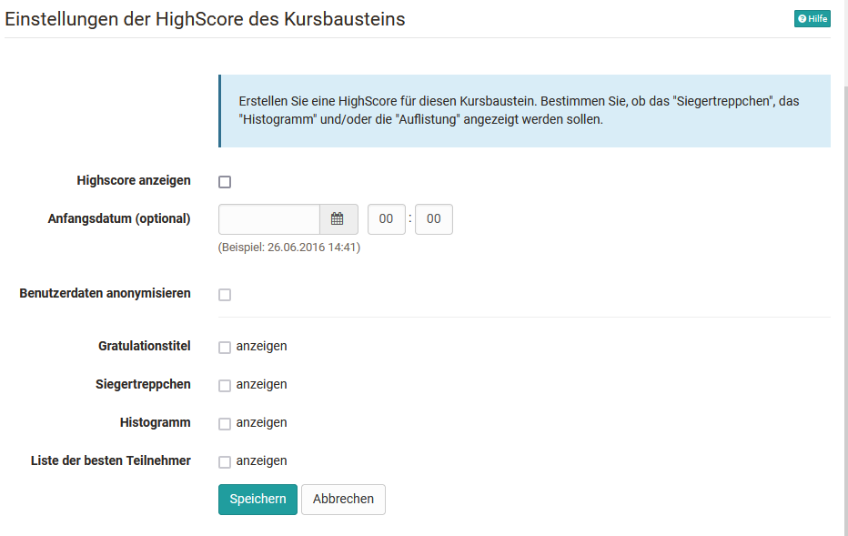
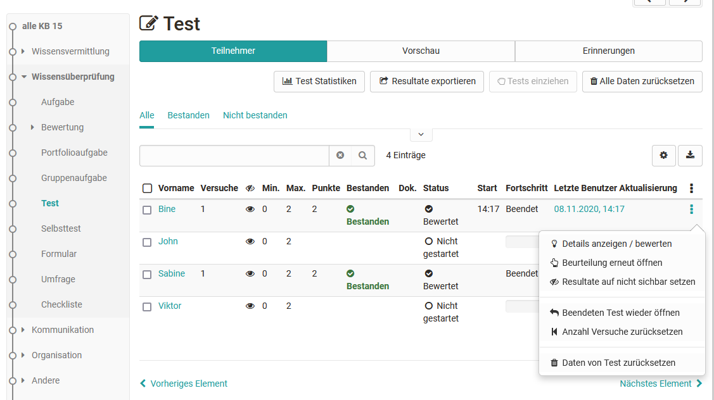

# Tests auf Kursebene

Hier erhalten Sie einen Überblick wie Sie einen Test in einem Kurs weiter konfigurieren, manuelle Bewertungen vornehmen und die Ergebnisse speichern können.

## Testkonfiguration auf Kursebene

Den Kurseditor öffnen Besitzer:innen des Kurses, Lernressourcenverwalter:innen und Administrator:innen sowie Personen mit dem Recht "Kurseditor". Öffnen Sie dafür den Kurs, gehen Sie in den Kurseditor und fügen Sie einen Kursbaustein "Test" hinzu bzw. wählen Sie einen bereits hinzugefügten Kursbaustein Test. Sie sehen nun die folgenden Tabs:

{ class="shadow lightbox" title="Kursbaustein Test im Kurseditor" }

Die Tabs "Titel und Beschreibung" sowie "Layout" sind bei allen Kursbausteinen gleich. 

### Tab "Lernpfad"

Im Tab Lernpfad kann definiert werden, ob der Kursbaustein obligatorisch für den Lernpfad Kurs ist, ob er nicht für die Lernpfad Anzeige verwendet werden soll (Einstellung "Freiwillig") oder ob der Kursbaustein gar nicht angezeigt werden soll (Einstellung "Ausgenommen"). Ferner können ein Freigabedatum, ein maximales Bearbeitungsdatum sowie die voraussichtliche Bearbeitungszeit definiert werden. Des Weiteren stehen für Tests folgende Erledigungskriterien zur Verfügung:

{ class="shadow lightbox" title="Tab Lernpfad des Kursbausteins Test" }

### Tab "Test-Konfiguration"

Hier wählen oder erstellen Sie den Test, den Sie einsetzen und dem Kursbaustein Test zuordnen möchten. Anschliessend können weitere Einstellungen vorgenommen werden, z.B. die Art der Korrektur oder die Art der Darstellung der Testresultate definiert werden.

Im Einzelnen sind folgende Einstellungen möglich nachdem Sie eine Lernressource Test erstellt oder zugeordnet haben:

#### Abschnitt Test

**Bewertung mit Einstufung/Noten**: Wählen Sie eine der vorgegebenen Bewertungsskalen z.B. Noten, Niveaustufen oder Emojis aus. Sie können anschliessend die Punkte Untergrenze auch noch anpassen. Entscheiden Sie auch ob die Stufenzuordnung automatisch für die Teilnehmenden sichtbar sein soll oder ob die Zuordnung manuell durch die Betreuer:in bereitgestellt werden soll.

**Bei Kurs-Bewertung berücksichtigen**: Schalten Sie diesen Schalter aus, bleibt der Test bei der Kurs-Bewertung in einem [Lernpfad Kurs](../learningresources/Learning_path_course.de.md) unberücksichtigt. Bei einem herkömmlichen Kurs ist diese Einstellung nicht vorhanden.

**Testzeitraum festlegen**: Während des Testzeitraums kann der Test gestartet werden. Sobald die "bis-Zeit" erreicht ist, wird der Test automatisch beendet. Auch dann, wenn die definierte Zeitbeschränkung noch nicht abgelaufen ist. Statt eines fixen Datums kann auch ein relatives Datum gewählt werden, z.B. x Tage nach dem ersten Kursbesuch. Wie Testzeitraum und Prüfungsmodus zusammenwirken, zeigt [Wie hängen die Zeiten einer Prüfung zusammen?](../../manual_how-to/exam_preparation/exam_preparation.de.md#exam_times)

#### Abschnitt Korrektur {: #correction}

**Korrektur**: Hier bestimmen Sie, wer den Test auswertet. Drei Varianten stehen zur Auswahl. Sobald der Test einen manuell auszuwertenden [Fragetyp](Test_question_types.de.md) enthält, also Freitext, Datei hochladen oder Zeichnen, wählen Sie eine der beiden manuellen Varianten. Auch bei einem Test aus rein automatisch auswertbaren Fragen können Sie manuell korrigieren lassen. Die Korrektur ist ein Schritt der Bewertung: Wer korrigiert, vergibt die Punkte, daraus entsteht die Bewertung des Tests. Was Bewertung, Korrektur und Einstufung unterscheidet, steht unter [Bewertung, Korrektur und Einstufung](../area_modules/Coaching_Assessment_Orders.de.md#assessment_terms).

* **Automatisch**: OpenOlat wertet alle Fragen direkt aus. Das Resultat ist sofort sichtbar.
* **Manuell durch Kursbetreuer:in oder -besitzer:in**: Die Korrektur übernimmt das Kursteam. Für jede abgeschlossene Bearbeitung entsteht ein Auftrag im Coaching unter [Bewertungsaufträge](../area_modules/Coaching_Assessment_Orders.de.md#tab_open_assessments), im Tab "Offene Bewertungen".
* **Manuell durch Korrektor:innen**: Die Korrektur übernehmen die im Korrektur-Workflow eingetragenen Personen. Sie brauchen dafür weder eine Mitgliedschaft noch die Rolle Betreuer:in im Kurs. Ihre Aufträge erscheinen im Coaching im Tab [Korrekturaufträge](../area_modules/Coaching_Assessment_Orders.de.md#tab_grading_assignments). Mit dieser Wahl erscheint im Kursbaustein zusätzlich der Tab "Korrektor:innen" mit den zugeordneten Personen.

{ class="shadow lightbox" title="Tab Korrektor:innen des Kursbausteins Test" }

!!! tip "Voraussetzung"

    Die Option "Manuell durch Korrektor:innen" steht zur Auswahl, sobald in der Lernressource Test der [Korrektur-Workflow](Test_settings.de.md#correction-workflow) eingeschaltet ist.

**Freigabe Bewertung**: Das Feld erscheint bei den beiden manuellen Varianten. Es steuert, ob OpenOlat die Bewertung nach abgeschlossener Korrektur selbst freigibt.

* Nicht freigegeben: Die Bewertung bleibt nach der Korrektur bei Ihnen, bis Sie sie freigeben. Bis dahin steht der Eintrag im Coaching im Tab [Freizugebende Bewertungen](../area_modules/Coaching_Assessment_Orders.de.md#tab_assessments_to_be_released).
* Freigegeben: OpenOlat gibt die Bewertung mit dem Abschluss der Korrektur frei, die Teilnehmenden sehen sie danach.

{ class="shadow lightbox" title="Abschnitt Korrektur im Tab Test-Konfiguration · 2026.09.28" }

#### Abschnitt Report {: #report}

**Leistungsübersicht auf Test-Startseite anzeigen**: Wenn diese Option angewählt ist, werden die Punkte und weitere Leistungsinformationen auf der Startseite des Tests für die Teilnehmenden angezeigt.

**Resultate auf Test-Startseite anzeigen**: Hiermit kann definiert werden, ob bzw. unter welchen Bedingungen die Resultate auf der Test-Startseite angezeigt werden sollen.

{ class="shadow lightbox" title="Abschnitt Report im Tab Test-Konfiguration" }

Wenn das Feld "immer" gewählt wird, stehen die Resultate direkt nach Beenden des Tests zur Verfügung. Bei der Auswahl "Nein" werden die Ergebnisse gar nicht angezeigt. Und bei den anderen Optionen können kriterien- bzw. datumsabhängige Anzeigen definiert werden.

**Resultate nach Abgabe des Tests anzeigen**: Hier wird konfiguriert, ob die Lernenden die Resultate direkt nach der Abgabe sehen. Welche Informationen sie erhalten, legen Sie unter "Übersicht Resultate" fest. Die gewählte Auswahl ist dieselbe für "Resultate auf Test-Startseite anzeigen" und "Resultate nach Abgabe des Tests anzeigen":

{ class="shadow lightbox" title="Feld Übersicht Resultate im Abschnitt Report" }

Bei der **Testzusammenfassung** wird u.a. die erreichte Prozentzahl, die Bearbeitungsdauer, die Anzahl der bearbeiteten Fragen und die erreichte Punktzahl sowie der Status angezeigt.

Die **Sektionszusammenfassung** ist nur relevant, wenn ein Test auch [Sektionen](Configure_tests.de.md) enthält.

Bei der **Fragezusammenfassung** wird der Titel der Frage, die jeweils erreichte Punkte bzw. der passende Prozentwert angezeigt aber nicht die Fragestellung selbst.

Bei der Option **Antwort, von Teilnehmer:in abgegeben** wird die Frage, alle Antwortoptionen sowie die Wahl der Teilnehmenden angezeigt, allerdings keine Bewertung ob die Frage richtig oder falsch beantwortet wurde. Ist dies gewünscht muss die Option mit weiteren Feedback-Optionen kombiniert werden.

Die **Lösung** beinhaltet die korrekten Antworten.

Je nach Kombination der Anzeige Optionen können den Teilnehmenden somit unterschiedliche Arten von Feedback hinterlassen werden.

### Tab "Optionen"

Bindet man einen Test in einen Kurs ein, werden die Einstellungen aus der Konfiguration der Lernressource Test (siehe  "[Test Einstellungen](Test_settings.de.md)" und "[Test konfigurieren](Configure_tests.de.md)") standardmässig übernommen. Im Tab "Optionen" ist deshalb "Konfiguration von Lernressource übernehmen" vorausgewählt und die entsprechenden Einstellungen, die in der Lernressource Test vorgenommen wurden, werden hier angezeigt.

Wenn die Einstellungen für einen im Kurs eingebundenen Test geändert werden sollen, kann "Konfiguration anpassen" ausgewählt und die gewünschten Änderungen vorgenommen werden. Diese Anpassungen im Test haben keine Auswirkungen auf die Konfiguration der Lernressource Test selbst.

### Tab "Kommunikation" [:octicons-tag-16:{ title="ab Release 16.2.0 (OO-5966)" }](https://track.frentix.com/issue/OO-5966)
Hier kann eingestellt werden ob während der Durchführung des Tests Teilnehmende live Anfragen per Chat an die Betreuer:innen bzw. Besitzer:innen des Kurses senden dürfen. Das macht natürlich nur dann Sinn, wenn während eines definierten Test-Zeitraums auch reale betreuende Personen die Testdurchführung beobachten.

### Tab "HighScore" [:octicons-tag-16:{ title="ab Release 11.3 (OO-2133)" }](https://track.frentix.com/issue/OO-2133)

Hier kann für einen Test auch eine Highscore Übersicht aktiviert und weiter konfiguriert werden.

{ class="shadow lightbox" title="Tab HighScore des Kursbausteins Test" }

### Tab "Korrektor:innen" [:octicons-tag-16:{ title="ab Release 15.0 (OO-4442)" }](https://track.frentix.com/issue/OO-4442)
Es erscheint eine Übersicht der Korrektor:innen sowie weitere Informationen. Per Link zur Lernressource des Tests können Änderungen vorgenommen werden. 

### E-Mail Bestätigung [:octicons-tag-16:{ title="ab Release 17.2.0 (OO-6672)" }](https://track.frentix.com/issue/OO-6672)
Aktivieren Sie die Email Bestätigung, wenn Sie die Abgabe des Testes per Email bestätigen wollen. Sie können in dem Mailtext auf verschiedene Variablen wie Name oder Punktezahl zurückgreifen. Eine Kopie der Mail kann auch an die Kursbesitzer:innen, zuständige Betreuer:innen oder externe Mail-Adressen verschickt werden. 

Für den Mailtext kann die Vorlage und ein voreingestellter Betreff mit dem Titel des Test-Kursbausteins im Betreff verwendet werden. Alternativ können die Vorlage und der Betreff auch geändert werden. Wählen Sie in diesem Fall bei "Vorlage" -> "Eigener Text" um den Mailingtext zu bearbeiten oder komplett zu ändern. 

Weitere Informationen zur Verwendung von Variablen in Mailing-Texten finden Sie [hier](Administration_and_Organisation.de.md#einsatz-von-variablen).

### Tab "Erinnerungen" [:octicons-tag-16:{ title="ab Release 16.0.0 (OO-5447)" }](https://track.frentix.com/issue/OO-5447)
Hier können Erinnerungsmails nach bestimmten Kriterien konfiguriert werden. Weitere Informationen zum Versand von Erinnerungen erhalten Sie [hier](../learningresources/Course_Reminders.de.md).

## Test und Selbsttest im Vergleich

Merkmal | :fontawesome-solid-square-pen: Test | :fontawesome-solid-square-pen: Selbsttest
------|------|------
 Einsatzzweck | Prüfungstest, Test mit Prüfungsmöglichkeit durch den Lehrenden, Standard Test | Übung, Selbstevaluation, keine Einsicht durch Lehrperson
 Herstellung mit | [Testeditor](Test_editor_QTI_2.1.de.md) | [Testeditor](Test_editor_QTI_2.1.de.md)
 Fragetypen QTI 2.1 | Alle [Fragetypen](Test_question_types.de.md) möglich | Alle [Fragetypen](Test_question_types.de.md) möglich, aber nur automatisch auswertbare Fragetypten können auch für Punkte verwendet werden.
 Einbindung mit Kursbaustein | Test| Selbsttest
 Anzahl Aufrufe durch Teilnehmende | konfigurierbar | unlimitiert
 Ergebnisse | erscheinen im [Bewertungswerkzeug](../learningresources/Assessment_tool_overview.de.md) sowie in den [Test Statistiken](../learningresources/Statistics_Test.de.md) und sind für Betreuer:innen einsehbar | erscheinen _nicht_ im [Bewertungswerkzeug](../learningresources/Assessment_tool_overview.de.md) und in den [Test Statistiken](../learningresources/Statistics_Test.de.md) und sind nicht personalisiert für Betreuer:innen und Besitzer:innen einsehbar
 Datenarchivierung| ja, personalisiert| ja, anonymisiert. Eine personenbezogene Zuordnung oder Feedbacks sind aber nicht möglich.

!!! tip "Tipp"

    Manchmal ist es sinnvoll, den Typ "Test" zu verwenden, auch wenn man den Lernenden eigentlich einen Selbsttest zur Verfügung stellen möchte. Tests ermöglichen, bei Bedarf die Lernenden individuell zu unterstützen und auch Feedback zu manuell bewertbaren Fragetypen bereitzustellen.

## Änderungen an Tests und Selbsttests

!!! warning "Achtung"

    Sobald ein Test oder Selbsttest in einen Kurs eingebunden wird, können nur noch sehr eingeschränkt Änderungen im "Testeditor" vorgenommen werden. Deshalb sollten Test erst in einen Kurs eingebunden werden, wenn sie vollkommen fertiggestellt sind.

Warum ist das so? Angenommen Sie könnten in einem eingebundenen Test noch Fragen hinzufügen oder andere Antworten als korrekt markieren, würden einerseits nicht alle Teilnehmenden die gleichen Voraussetzungen antreffen. Andererseits könnten bereits Resultate gespeichert worden sein, die nach der Änderung nicht eindeutig einer Version der Testdatei zugewiesen werden können. Deshalb ist das Editieren bereits eingebundener Tests und Selbsttests stark eingeschränkt.

Wenn Sie einem Test beispielsweise eine neue Frage hinzufügen möchten oder fälschlicherweise eine Antwort als korrekt markiert wurde, kopieren Sie die Lernressource Test im Autorenbereich und speichern den Test so neu. Bearbeiten und korrigieren Sie den Test und binden Sie den Test anschliessend in dem gewünschten Kurs ein. Wechseln Sie dafür in den Kurseditor und tauschen Sie im Kursbaustein des gewünschten Tests die Datei aus. Wenn bereits Resultate eingegangen sind, werden diese in Ihrem persönlichen Ordner (private) archiviert und Sie können entscheiden, ob OpenOlat diejenigen Teilnehmenden, die den Test bereits absolviert haben, über die Änderung informieren soll.

## Tests einsehen und bewerten

Zugriff auf von Teilnehmenden ausgefüllte Tests erhalten Sie im "[Bewertungswerkzeug](../learningresources/Assessment_tool_overview.de.md)". Das Bewertungswerkzeug finden Sie unter `Kurs > Administration > Bewertungswerkzeug`. Wählen Sie dort den gewünschten Kursbaustein Test. Im Tab "Teilnehmer:innen" werden alle Teilnehmenden angezeigt, ihre Tests können personenbezogen aufgerufen, eingesehen, geändert und kommentiert werden.

Alternativ können die Ergebnisse auch im Kursrun bei geschlossenem Editor eingesehen und verwaltet werden. Im Kursrun besteht auch die Möglichkeit, Erinnerungen zu dem jeweiligen Test zu konfigurieren und so einen bedingungsabhängigen Mailversand auszulösen.

{ class="shadow lightbox" title="Tab Teilnehmer eines Tests im Kursrun" }

Sofern für einen Test der Korrektur-Workflow eingeschaltet ist, nehmen die eingetragenen Korrektor:innen die Bewertungen über das [Coaching Tool](../area_modules/Coaching.de.md) vor.

## Testergebnisse und Archivierung

Wählen Sie dafür `Kurs > Administration > Archivierung & Reports`, siehe [Archivierung & Reports](../learningresources/Course_Archiving.de.md). Dort können Sie alle Kursresultate herunterladen oder unter `Kurs > Administration > Archivierung & Reports > Kursarchivierung > Archiv erstellen` ein Teilarchiv nur mit den gewünschten Tests erstellen. Die Resultate von Selbsttests werden anonymisiert gespeichert.

Nach der Archivierung finden Sie alle Angaben dazu, welche Person (bei Selbsttest anonymisiert durch eine Laufnummer) welche Fragen beantwortet hat, welche Antworten sie gegeben hat und beim Selbsttest wie viele Punkte erreicht wurden.

Über `Kurs > Administration > Test Statistiken` ([Test Statistiken](../learningresources/Statistics_Test.de.md)) können Sie auch schnell auf die grafische Auswertung Ihrer Testdaten zugreifen.

## Weiterführende Informationen {: #further_information}

**Auf dieser Seite erwähnt** 
[Lernpfadkurs - Überblick >](../learningresources/Learning_path_course.de.md) 
[Wie bereite ich eine Online-Prüfung vor? >](../../manual_how-to/exam_preparation/exam_preparation.de.md) 
[Test Fragetypen >](Test_question_types.de.md) 
[Test Einstellungen - Administration >](Test_settings.de.md) 
[Test konfigurieren >](Configure_tests.de.md) 
[Verwaltung und Organisation >](Administration_and_Organisation.de.md) 
[Erinnerungen >](../learningresources/Course_Reminders.de.md) 
[Testeditor >](Test_editor_QTI_2.1.de.md) 
[Bewertungswerkzeug - Übersicht >](../learningresources/Assessment_tool_overview.de.md) 
[Test Statistiken >](../learningresources/Statistics_Test.de.md) 
[Coaching - Übersicht >](../area_modules/Coaching.de.md) 
[Coaching - Bewertungsaufträge >](../area_modules/Coaching_Assessment_Orders.de.md) 
[Kursadministration - Archivierung & Reports >](../learningresources/Course_Archiving.de.md)

[Zum Seitenanfang ^](#tests-auf-kursebene)
