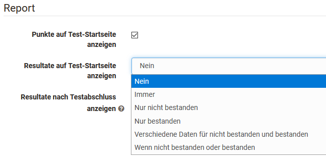

# Tests auf Kursebene

Hier erhalten Sie einen Überblick wie Sie einen Test in einem Kurs weiter konfigurieren, manuelle Bewertungen vornehmen und die Ergebnisse speichern können.

## Testkonfiguration auf Kursebene

Öffnen Sie dafür den Kurs, gehen Sie in den Kurseditor und fügen Sie einen Kursbaustein "Test" hinzu bzw. wählen Sie einen bereits hinzugefügten Kursbaustein Test. Sie sehen nun die folgenden Tabs:

{ class="shadow" }

Die Tabs "Titel und Beschreibung" sowie "Layout" sind bei allen Kursbausteinen gleich. 

### Tab "Lernpfad"

Im Tab Lernpfad kann definiert werden, ob der Kursbaustein obligatorisch für den Lernpfad Kurs ist, ob er nicht für die Lernpfad Anzeige verwendet werden soll (Einstellung "Freiwillig") oder ob der Kursbaustein gar nicht angezeigt werden soll (Einstellung "Ausgenommen"). Ferner können ein Freigabedatum, ein maximales Bearbeitungsdatum sowie die voraussichtliche Bearbeitungszeit definiert werden. Des Weiteren stehen für Tests folgende Erledigungskriterien zur Verfügung:

{ class="shadow" }

### Tab "Test-Konfiguration"

Hier wählen oder erstellen Sie den Test, den Sie einsetzen und dem Kursbaustein Test zuordnen möchten. Anschliessend können weitere Einstellungen vorgenommen werden, z.B. die Art der Korrektur oder die Art der Darstellung der Testresultate definiert werden.

Im Einzelnen sind folgende Einstellungen möglich nachdem Sie eine Lernressource Test erstellt oder zugeordnet haben:

#### Abschnitt Test

**Bewertung mit Einstufung/Noten**
Wählen Sie eine der vorgegebenen Bewertungsskalen z.B. Noten, Niveaustufen oder Emojis aus. Sie können anschliessend die Punkte Untergrenze auch noch anpassen. Entscheiden Sie auch ob die Stufenzuordnung automatisch für den User sichtbar sein soll oder ob die Zuordnung manuell durch den Betreuer bereitgestellt werden soll.  

**Bei Kursbewertung ausschliessen**: Wird hier der Haken gesetzt, bleibt der Test bei der Fortschrittsberechnung in einem [Lernpfad Kurs](../learningresources/Learning_path_course.de.md) unberücksichtigt. Bei einem herkömmlichen Kurs ist diese Einstellung nicht vorhanden.

**Testzeitraum festlegen**: Während des Testzeitraum kann der Test gestartet werden. Sobald die "bis-Zeit" erreicht ist, wird der Test automatisch beendet. Auch dann, wenn die definierte Bearbeitungszeitdauer noch nicht aufgebraucht ist. Statt eines fixen Datums kann auch ein relatives Datum gewählt werden, z.B.  x Tage nach dem ersten Kursbesuch.
  
#### Abschnitt Korrektur {: #correction}

**Korrektur**: Die Korrektur wird entweder **automatisch oder manuell** durchgeführt. Sobald ein manuell auszuwertender [Fragetyp](Test_question_types.de.md), z.B. Freitext vorhanden ist, muss zwingend eine manuelle Variante gewählt werden. Bei der automatischen Korrektur werden alle Fragen automatisch und direkt korrigiert, das Resultat ist sofort sichtbar.

Bei einer manuellen Korrektur ist die Sichtbarkeit des Ergebnisses eingeschränkt und der Betreuer bzw. Korrektor muss die Korrektur manuell ergänzen. Zu den manuell zu bearbeitenden Fragen gehören Freitext, Datei hochladen und Zeichnen. Eine manuelle Korrektur kann bei Bedarf aber auch eingestellt werden, wenn der Test nur aus automatisch auswertbaren Fragetypen besteht.

Aktiviert man die Option " **Manuell durch externe Korrektoren"** können auch OpenOlat Benutzer einen Test korrigieren, ohne dass sie Mitglied oder gar Betreuer des Kurses sind. Durch diese Wahl wird auch der Tab "Korrektoren" aktiviert und man erkennt, wer als Korrektor dem Test zugeordnet ist.

{ class="shadow" }

!!! info "Hinweis"

    Steht die Option "Manuell durch externe Korrektoren" nicht zur Verfügung, wurden in der Lernressource Test keine [externen Korrektoren](Test_settings.de.md) konfiguriert.

**Freigabe Bewertung**: Stellen Sie hier ein, ob die Resultate standarmässig freigegeben sind oder nicht.

* Nicht freigegeben: Die Bewertung des Tests ist standardmässig nicht freigegeben und kann von den Teilnehmenden nicht eingesehen werden.
* Freigegeben: Die Bewertung wird standardmässig freigegeben und kann von den Teilnehmenden eingesehen werden.

{ class="shadow" }
  
#### Abschnitt Report {: #report}

**Punkte auf Test-Startseite anzeigen**: Wenn diese Option angewählt ist, werden die Punkte auf der Startseite des Tests für den Benutzer angezeigt.

**Bewertung auf Test-Startseite anzeigen**: Hiermit kann definiert werden, ob bzw. unter welchen Bedingungen die Bewertung auf der Test-Startseite angezeigt werden sollen.

{ class="shadow" }

Wenn das Feld "immer" gewählt wird, stehen die Resultate direkt nach Beenden des Tests zur Verfügung. Bei der Auswahl "Nein" werden die Ergebnisse gar nicht angezeigt. Und bei den anderen Optionen können kriterien- bzw. datumsabhängige Anzeigen definiert werden.

**Bewertung nach Testabschluss anzeigen**: Hier wird konfiguriert, welche Informationen die Lernenden erhalten. Die gewählte Auswahl ist dieselbe für "Resultate auf Test-Startseite anzeigen" und "Resultate nach Testabschluss anzeigen":

{ class="shadow" }

Bei der **Testzusammenfassung** wird u.a. die erreichte Prozentzahl, die Bearbeitungsdauer, die Anzahl der bearbeiteten Fragen und die erreichte Punktzahl sowie der Status angezeigt.

Die **Sektionszusammenfassung** ist nur relevant, wenn ein Test auch [Sektionen](Configure_tests.de.md) enthält.

Bei der **Fragenzusammenfassung** wird der Titel der Frage, die jeweils erreichte Punkte bzw. der passende Prozentwert angezeigt aber nicht die Fragestellung selbst.

Bei der **Antwort der Teilnehmer** wird die Frage, alle Antwortoptionen sowie die Wahl des Users angezeigt, allerdings keine Bewertung ob die Frage richtig oder falsch beantwortet wurde. Ist dies gewünscht muss die Option mit weiteren Feedback-Optionen kombiniert werden.

Die **Lösung** beinhaltet die korrekten Antworten.

Je nach Kombination der Anzeige Optionen können dem User somit unterschiedliche Arten von Feedback hinterlassen werden.  

### Tab "Optionen"

Bindet man einen Test in einen Kurs ein, werden die Einstellungen aus der Konfiguration der Lernressource Test (siehe  "[Test Einstellungen](Test_settings.de.md)" und "[Test konfigurieren](Configure_tests.de.md)") standardmässig übernommen. Im Tab "Optionen" ist deshalb "Konfiguration von Lernressource übernehmen" vorausgewählt und die entsprechenden Einstellungen, die in der Lernressource Test vorgenommen wurden, werden hier angezeigt.

Wenn die Einstellungen für einen im Kurs eingebundenen Test geändert werden sollen, kann "Konfiguration anpassen" ausgewählt und die gewünschten Änderungen vorgenommen werden. Diese Anpassungen im Test haben keine Auswirkungen auf die Konfiguration der Lernressource Test selbst.

### Tab "Kommunikation"
Hier kann eingestellt werden ob während der Durchführung des Tests Teilnehmende live Anfragen per Chat an die Kurs Betreuer bzw. Besitzer senden dürfen. Das macht natürlich nur dann Sinn, wenn während eines definierten Test-Zeitraums auch reale betreuende Personen die Testdurchführung beobachten.

### Tab "HighScore"

Hier kann für einen Test auch eine Highscore Übersicht aktiviert und weiter konfiguriert werden.

{ class="shadow" }

### Tab "Korrektoren"
Es erscheint eine Übersicht der Korrektoren sowie weitere Informationen. Per Link zur Lernressource des Tests können Änderungen vorgenommen werden. 

### Email Bestätigung (:octicons-tag-24: Release 17.2. )
Aktivieren Sie die Email Bestätigung, wenn Sie die Abgabe des Testes per Email bestätigen wollen. Sie können in dem Mailtext auf verschiedene Variablen wie Name oder Punktezahl zurückgreifen. Eine Kopie der Mail kann auch an die Kursbesitzer, zuständige Betreuer oder externe Mail-Adressen verschickt werden. 

Für den Mailtext kann die Vorlage und ein voreingestellter Betreff mit dem Titel des Test-Kursbausteins im Betreff verwendet werden. Alternativ können die Vorlage und der Betreff auch geändert werden. Wählen Sie in diesem Fall bei "Vorlage" -> "Eigener Text" um den Mailingtext zu bearbeiten oder komplett zu ändern. 

Weitere Informationen zur Verwendung von Variablen in Mailing-Texten finden Sie [hier](Course_Elements.de.md#einsatz-von-variablen).

### Tab "Erinnerungen"
Hier können Einnerungsmails nach bestimmten Kriterien konfiguriert werden. Weitere Informationen zum Versand von Erinnerungen erhalten Sie [hier](../learningresources/Course_Reminders.de.md).

## Test und Selbsttest im Vergleich

Merkmal | { class=size16 } Test | { class=size16 } Selbsttest
------|------|------
 Einsatzzweck | Prüfungstest, Test mit Prüfungsmöglichkeit durch den Lehrenden, Standard Test | Übung, Selbstevaluation, keine Einsicht durch Lehrperson
 Herstellung mit | [Testeditor](Test_editor_QTI_2.1.de.md) | [Testeditor](Test_editor_QTI_2.1.de.md)
 Fragetypen QTI 2.1 | Alle [Fragetypen](Test_question_types.de.md) möglich | Alle [Fragetypen](Test_question_types.de.md) möglich, aber nur automatisch auswertbare Fragetypten können auch für Punkte verwendet werden.
 Einbindung mit Kursbaustein | Test| Selbsttest
 Anzahl Aufrufe durch Kursteilnehmer | konfigurierbar | unlimitiert
 Ergebnisse | erscheinen im [Bewertungswerkzeug](../learningresources/Assessment_tool_overview.de.md) sowie in den [Test Statistiken](../learningresources/Using_Course_Tools.de.md#statistics) und sind für Betreuer einsehbar | erscheinen _nicht_ im [Bewertungswerkzeug](../learningresources/Assessment_tool_overview.de.md) und in den [Test Statistiken](../learningresources/Using_Course_Tools.de.md#statistics) und sind nicht personalisiert für Betreuer und Besitzer einsehbar
 Datenarchivierung| ja, personalisiert| ja, anonymisiert. Eine personenbezogene Zuordnung oder Feedbacks sind aber nicht möglich.

!!! tip "Tipp"

    Manchmal ist es sinnvoll, den Typ "Test" zu verwenden, auch wenn man den Lernenden eigentlich einen Selbsttest zur Verfügung stellen möchte. Tests ermöglichen, bei Bedarf die Lernenden individuell zu unterstützen und auch Feedback zu manuell bewertbaren Fragetypen bereitzustellen.

## Änderungen an Tests und Selbsttests

!!! warning "Achtung"

    Sobald ein Test oder Selbsttest in einen Kurs eingebunden wird, können nur noch sehr eingeschränkt Änderungen unter "Inhalt editieren" vorgenommen werden. Deshalb sollten Test erst in einen Kurs eingebunden werden, wenn sie vollkommen fertiggestellt sind.

Warum ist das so? Angenommen Sie könnten in einem eingebundenen Test noch Fragen hinzufügen oder andere Antworten als korrekt markieren, würden einerseits nicht alle Testpersonen die gleichen Voraussetzungen antreffen. Andererseits könnten bereits Resultate gespeichert worden sein, die nach der Änderung nicht eindeutig einer Version der Testdatei zugewiesen werden können. Deshalb ist das Editieren bereits eingebundener Tests und Selbsttests stark eingeschränkt.

Wenn Sie einem Test beispielsweise eine neue Frage hinzufügen möchten oder fälschlicherweise eine Antwort als korrekt markiert wurde, kopieren Sie die Lernressource Test im Autorenbereich und speichern den Test so neu. Bearbeiten und korrigieren Sie den Test und binden Sie den Test anschließend in dem gewünschten Kurs ein. Wechseln Sie dafür in den Kurseditor und tauschen Sie im Kursbaustein des gewünschten Tests die Datei aus. Wenn bereits Resultate eingegangen sind, werden diese in Ihrem persönlichen Ordner (private) archiviert und Sie können entscheiden, ob OpenOlat diejenigen Kursteilnehmer, die den Test bereits absolviert haben, über die Änderung informieren soll.

## Tests einsehen und bewerten

Zugriff auf von Kursteilnehmern ausgefüllte Tests erhalten Sie im "[Bewertungswerkzeug](../learningresources/Assessment_tool_overview.de.md)". Das Bewertungswerkzeug finden Sie in der "Administration" des Kurses. Unter
"Benutzer" werden sämtliche Tests und weitere bewertbare Kursbausteine eines Kurses angezeigt und können personenbezogen aufgerufen, eingesehen, geändert und kommentiert werden. 
Alternativ können die Ergebnisse auch im Kursrun bei geschlossenem Editor eingesehen und verwaltet werden. Im Kursrun besteht auch die Möglichkeit, Erinnerungen zu dem jeweiligen Test zu konfigurieren und so einen bedingungsabhängigen Mailversand auszulösen.

{ class="shadow" }

Sofern für einen Test auch externe Korrektoren aktiviert wurden, können diese die Bewertungen über das [Coaching Tool](../area_modules/Coaching.de.md) vornehmen.

## Testergebnisse und Archivierung

Wählen Sie in der Kursansicht aus der "Administration“ -> [Datenarchivierung](../learningresources/Using_Course_Tools.de.md#archive)“. Gehen Sie links zu „Tests" oder auch komplett zu "Kursresultate" und speichern Sie die angezeigte Datei. Die Resultate von Selbsttests werden anonymisiert gespeichert.

Nach der Archivierung finden Sie alle Angaben dazu, welche Person (bei Selbsttest anonymisiert durch eine Laufnummer) welche Fragen beantwortet hat, welche Antworten sie gegeben hat und beim Selbsttest wie viele Punkte erreicht wurden.

Über Administration -> [„Test Statistiken"](../learningresources/Using_Course_Tools.de.md#statistics) können Sie auch schnell auf die grafische Auswertung Ihrer Testdaten zugreifen.
