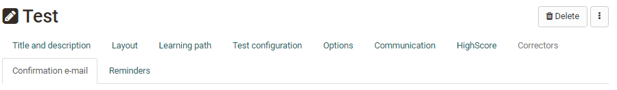
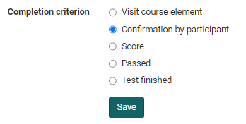
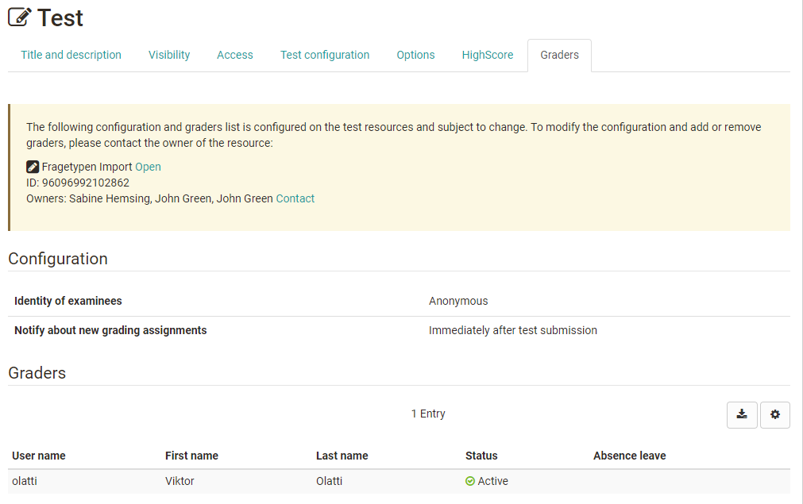
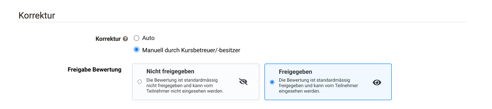
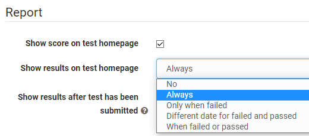
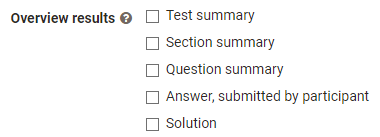
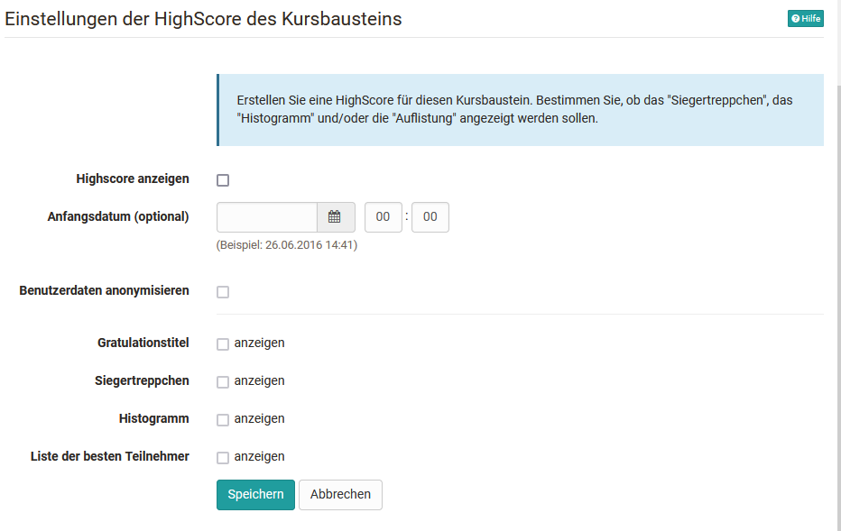
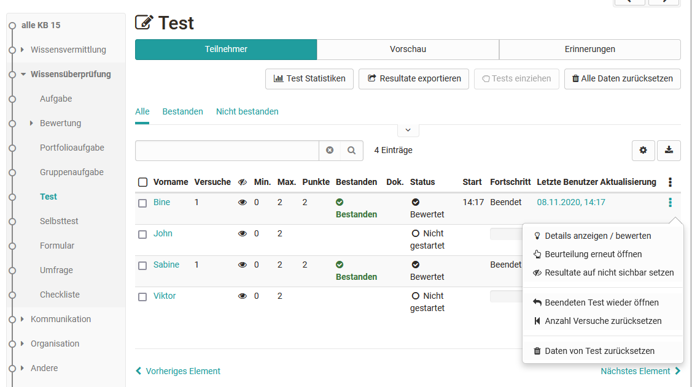

# Tests at course level

Here you get an overview of how to further configure a test in a course, how to make manual evaluations and how to save the results.

## Test Configuration at Course Level

Open the course, go to the course editor and add a course element "Test" or select an already added course element Test. You will now see the following tabs:

{ class="shadow lightbox" }

The "Title and description" and "Layout" tabs are the same for all course elements.

### Tab "Learning path"

In the Learning path tab, you can define whether the course element is mandatory for the learning path course, whether it should not be used for the learning path display (setting "Voluntary"), or whether the course element should not be displayed at all (setting "Excluded"). You can also define a release date, a maximum processing date and the expected processing time. The following completion criteria are also available for tests:

{ class="shadow lightbox" }

### Tab "Test configuration"

Here you select or create the test that you want to use and assign to the course element Test. You can then make further settings, e.g. define the type of correction or the way the test results are displayed.

The following settings are possible after you have created or assigned a learning resource test:

#### Section Test

**Assessment with grades**
Select one of the predefined rating scales, e.g. grades, levels or emojis. You can then also adjust the lower limit of points. Also decide whether the level assignment should be automatically visible to the participants or whether the assignment should be provided manually by the coach.

**Ignore in course assessment**: If the check mark is set here, the test is not taken into account when calculating progress in a [learning path course](../learningresources/Learning_path_course.md). This setting is not available for a conventional course.

**Set assessment period**: The test can be started during the test period. As soon as the "to" time is reached, the test is automatically terminated. This is also the case if the defined test time has not yet been used up. Instead of a fixed date, a relative date can also be selected, e.g. x days after the first course attendance.

#### Section Correction {: #correction}

**Correction**: The correction can be made **automatically or manually**. As soon as a [question type](Test_question_types.md) to be evaluated manually, e.g. free text, is available, it is mandatory to select a manual variant. For the auto correction the result is visible right away and all questions are revised automatically.

For a manual correction, the visibility of the result is limited and the coach or corrector must add the correction manually. The question types that must be corrected manually include free text, file upload and drawing. If needed, a manual correction can also be set even if the test only consists of automatically scorable question types.

By selecting the option "**Manual by external graders**", OpenOlat users can also correct a test without being a member or even coach of the course. This option also activates the tab "Graders" and you can see who is assigned to the test as corrector.

{ class="shadow lightbox" }

!!! info "Note"

    If the option "Manual by external graders" is not available, no [external correctors](Test_settings.md) were configured in the learning resource Test.

**Release assessment**: Set here whether the results are released by default or not.

* Not released: The test score is not released by default and cannot be viewed by the participant.
* Released: The assessment is released by default and can be viewed by the participant.

{ class="shadow lightbox" }

#### Section Report {: #report}

**Show score on test homepage**: If this option is selected, the score will be shown to the user on the test homepage.

**Show results on test homepage**: Here it can be defined, if the result should be shown on the test homepage.

{ class="shadow lightbox" }

If the "Always" field is selected, the results are available immediately after the test is completed. If "No" is selected, the results are not displayed at all. And with the other options, criteria- or date-dependent displays can be defined.

**Show results after test has been submitted**: Here you configure which information the learners receive. The selection chosen is the same for "Show results on test start page" and "Show results after test completion":

{ class="shadow lightbox" }

The **test summary** shows, among other things, the percentage achieved, the time taken to complete the test, the number of questions worked on and the score achieved, as well as the status.

The **section summary** is only relevant if a test also contains [sections](Configure_tests.md).

In the **question summary**, the title of the question, the points achieved in each case or the matching percentage value are displayed but not the question itself.

In the **answer of the participants** the question, all answer options as well as the choice of the user is shown, but no evaluation whether the question was answered correctly or incorrectly. If this is desired, the option must be combined with other feedback options.

The **Solution** contains the correct answers.

Depending on the combination of the display options, different types of feedback can be left for the participants.

### Tab "Options"

If you include a test in a course, the settings from the configuration of the learning resource Test (see "[Test settings](Test_settings.md)" and "[Configure test](Configure_tests.md)") will be adopted by default. Therefore, "Use configuration of the learning resource" is selected in the "Options" tab and the corresponding settings made in the learning resource Test are displayed here.

If the configuration needs to be adapted, "Adjust configuration" needs to be selected. These adaptions do not have any impact on the configuration of the learning resource itself.

### Tab "Communication"
Here you can set whether participants can send live chat requests to the course coaches or owners during the test. Of course, this only makes sense if real coaches observe the test being carried out during a defined test period.

### Tab "HighScore"

A highscore overview for the test can also be activated and further configured here.

{ class="shadow lightbox" }

### Tab "Correctors"
An overview of the correctors and further information will appear. Changes can be made via a link to the test's learning resource.

### E-Mail confirmation :octicons-tag-16:{ title="from Release 17.2" }
Activate the email confirmation if you want to confirm the submission of the test by email. You can use different variables such as name or score in the email text. A copy of the e-mail can also be sent to the course owners, responsible coaches or external e-mail addresses.

The template and a preset subject with the title of the test course element in the subject can be used for the email text. Alternatively, the template and subject can also be changed. In this case, select "Template" -> "Own text" to edit or completely change the mailing text.

Further information about variables in mailing texts can be found [here](Administration_and_Organisation.md#use-of-variables).

### Tab "Reminders"
Reminder e-mails can be configured here according to specific criteria. Further information on sending reminders can be found [here](../learningresources/Course_Reminders.md).

## Comparison: Test and Self-test

Feature | :fontawesome-solid-square-pen: Test | :fontawesome-solid-square-pen: Selftest
------|------|------
 Intended use | Examination test, test with the possibility of examination by the teacher, standard test | Exercise, self-evaluation, no insight for the teacher
 Created with | [Test editor](Test_editor_QTI_2.1.md) | [Test editor](Test_editor_QTI_2.1.md)
 Question types QTI 2.1 | All [question types](Test_question_types.md) possible | All [question types](Test_question_types.md) possible, but only automatically scorable question types can also be used for points.
 Embedding with course element | Test| Self-test
 Number of calls by participants | configurable | unlimited
 Results | appear in the [assessment tool](../learningresources/Assessment_tool_overview.md) as well as in the [test statistics](../learningresources/Statistics_Test.md) and are visible for coaches | appear _not_ in the [assessment tool](../learningresources/Assessment_tool_overview.md) and in the [test statistics](../learningresources/Statistics_Test.md) and are not visible in a personalized way for coaches and owners
 Archiving of results| yes, personalized| yes, anonymized. A personal correlation or feedback is not possible.

!!! tip "Tip"

    Sometimes it makes sense to use the type "test" even if you actually want to provide the learners with a self-test, because with tests you have the possibility to support the learners individually if necessary and also to provide feedback on manually assessable question types.

## Changes to tests and self-tests

!!! warning "Attention"

    As soon as a test or self-test is included in a course, only very limited changes can be made under "Edit content". Therefore, tests should not be included in a course until they are completely finished.

Why is that? Assuming you could add questions to an integrated test or mark other answers as correct, not all test subjects would meet the same requirements. On the other hand, results may already have been saved that cannot be unambiguously assigned to a version of the test file after the change. Therefore the editing of already integrated tests and self-tests is strongly restricted.

For example, if you want to add a new question to a test or if an answer was incorrectly marked as correct, copy the learning resource Test in the Author Area and save the test again. Edit and correct the test and then include the test in the course. To do this, switch to the course editor and exchange the file in the course element of the desired test. If results have already been received, they will be archived in your personal folder (private) and you can decide whether OpenOlat should inform the course participants who have already taken the test about the change.

## View and grade tests

Access to tests completed by course participants is available in the "[Assessment tool](../learningresources/Assessment_tool_overview.md)". The assessment tool can be found in the "Administration" of the course. All tests and other assessable course elements of a course are displayed under "User" and can be called up, viewed, changed and commented on in relation to a person. Alternatively, the results can also be viewed and managed in the course run with the editor closed. In the course run it is also possible to configure reminders for the respective test and thus trigger a condition-dependent mail dispatch.

{ class="shadow lightbox" }

If external graders have also been activated for a test, they can use the [Coaching Tool](../area_modules/Coaching.md) to make the assessments.

## Test results and archiving

Select the link "Administration" -> [Data archiving](../learningresources/Course_Archiving.md) in the course view. Go to "Tests" or "Course results" on the left and save the displayed file. The results of self-tests are saved anonymously.

After archiving, you will find all information about who answered which questions, which answers were given and how many points were achieved during the self-test.

Via "Administration" -> "[Test Statistics](../learningresources/Statistics_Test.md)" you can also quickly access the graphical assessment of your test data.

## Further information {: #further_information}

**Mentioned on this page** 
[Learning path course - Overview >](../learningresources/Learning_path_course.md) 
[Test question types >](Test_question_types.md) 
[Test settings - Administration >](Test_settings.md) 
[Configure tests >](Configure_tests.md) 
[Administration and Organisation >](Administration_and_Organisation.md) 
[Course Reminders >](../learningresources/Course_Reminders.md) 
[Test editor >](Test_editor_QTI_2.1.md) 
[Assessment tool - overview >](../learningresources/Assessment_tool_overview.md) 
[Test statistics >](../learningresources/Statistics_Test.md) 
[Coaching - Overview >](../area_modules/Coaching.md) 
[Course administration - Archiving & Reports >](../learningresources/Course_Archiving.md)

[To the top of the page ^](#tests-at-course-level)
