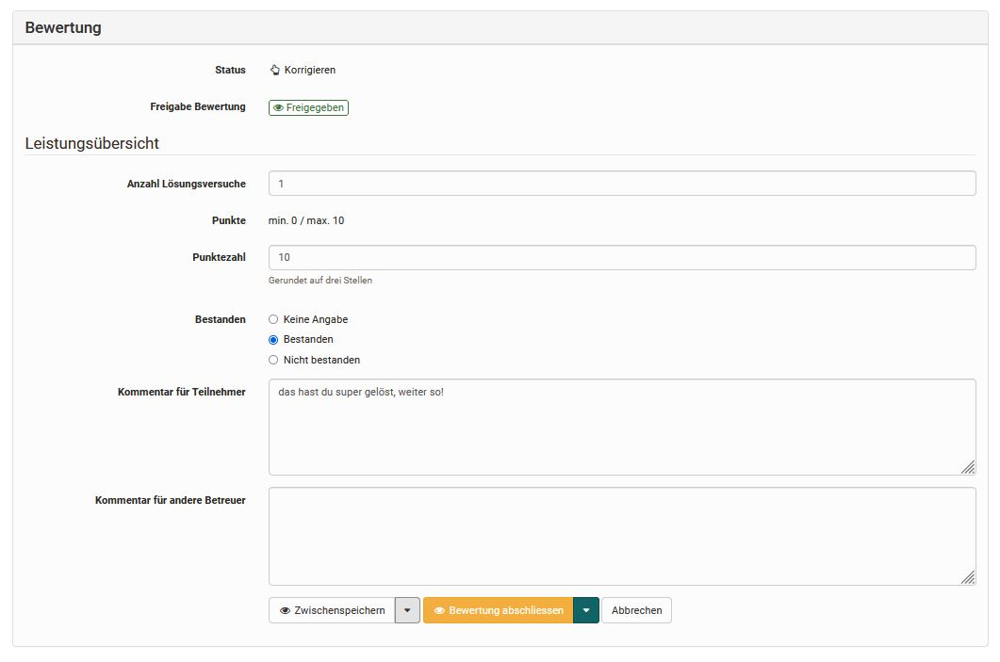
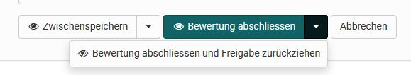

# Das Bewertungsformular {: #the_assessment_form}

Für alle bewertbaren Kursbausteine steht ein Bewertungsformular zur Verfügung. Die konkreten Möglichkeiten variieren je nach Kursbaustein und nach konkreter Konfiguration des Bausteins.

Grundsätzlich können im Bewertungsformular:

* kurze Feedbacks erstellt,
* ein bestanden/nicht bestanden definiert,
* Punkte vergeben,
* die Sichtbarkeit der Rückmeldung für den Lernenden eingestellt,
* Kommentare für andere Betreuende hinterlassen,
* Bewertungsdokumente verteilt,
* die Bewertung abgeschlossen werden.

{ class="shadow lightbox" }

Bei den Kursbausteinen [Aufgabe und Gruppenaufgaben](Assessing_tasks_and_group_tasks.de.md) wird neben dem Bewertungsformular auch der Einreichungsprozess angezeigt. Hier können in den einzelnen Bewertungsschritten Bewertungen vorgenommen werden.

Sofern über den bewerteten Kursbaustein Dateien eingereicht werden, kann auch die Anzahl der Versuche der Lernenden manuell angepasst werden.

Bei dem Kursbaustein "[Bewertung](../learningresources/Course_Element_Assessment.de.md)" steht, sofern entsprechend aktiviert, ergänzend ein [Rubrik](../learningresources/Forms_in_Rubric_Scoring.de.md) zur Bewertung zur Verfügung.

## Sichtbarkeit des Ergebnisses

Sobald im Bewertungswerkzeug Ergebnisse hinzugefügt werden, egal ob als Punkte oder bestanden/nicht bestanden, sind diese für die Teilnehmenden sichtbar. In einigen Fällen sollen jedoch die Ergebnisse für alle Teilnehmenden gleichzeitig zur Verfügung gestellt werden. Für solche Szenarien kann die Sichtbarkeit des Ergebnisses zunächst eingeschränkt werden. Das Augensymbol zeigt an, ob eine Bewertung für die Teilnehmenden angezeigt wird oder nicht. 

Standardmässig werden alle Ergebnisse der bewertbaren Bausteine sofort angezeigt. Einzige Ausnahme bildet der Test, wenn die Korrektur auf manuell gestellt wurde.

Um die Sichtbarkeit für eine einzelne teilnehmende Person einzustellen, öffnen Sie die gewünschte Person. Unten im Bewertungsformular kann sowohl für die Zwischenspeicherung als auch für die finale Freigabe (Bewertung abschliessen) definiert werden, ob die Bewertung der teilnehmenden Person direkt angezeigt werden soll oder nicht. 

{ class="shadow lightbox" }

Alternativ bzw. wenn die Sichtbarkeit für mehrere Teilnehmende angepasst werden soll, kann dies auch über die Teilnehmerliste für den entsprechenden Kursbaustein erfolgen. 
In der Spalte "Freigabe Bewertung" wird angezeigt, bei welchen Teilnehmenden das Ergebnis sichtbar ({ class=size16 }), respektive noch nicht sichtbar ({ class=size16 }) ist. Sofern kein Icon angezeigt wird, gilt die Standardeinstellung. 

Um die Sichtbarkeit zu ändern, können die gewünschten Teilnehmenden in der Spalte ganz links ausgewählt und entweder der Button "Freigeben" oder "Freigabe zurückziehen" angeklickt werden. 

## Finalisierung der Bewertung

Die Finalisierung eines bewertbaren Kursbausteins erfolgt über den Button "Bewertung abschliessen (und freigeben)". 

Mit der Schaltfläche "Bewertung abschliessen" wird der Status in der Spalte Status geändert. Alle ausgewählten Teilnehmenden, welche auf abgeschlossen gesetzt wurden, erhalten den Status "Bewertet". 

{ class="shadow lightbox" }

Änderungen sind dann nur noch möglich, wenn "Bewertung wieder eröffnen" gewählt wird. 

Dieser Status hilft Ihnen den Überblick über die bereits bewerteten Teilnehmenden zu behalten. Dieser Status hat keine Auswirkung auf die Sichtbarkeit der Ergebnisse für die Teilnehmenden.

## Weiterführende Informationen {: #further_information}

[Formular als Rubrik-Bewertung](Forms_in_Rubric_Scoring.de.md) 

[Zum Seitenanfang ^](#the_assessment_form)

