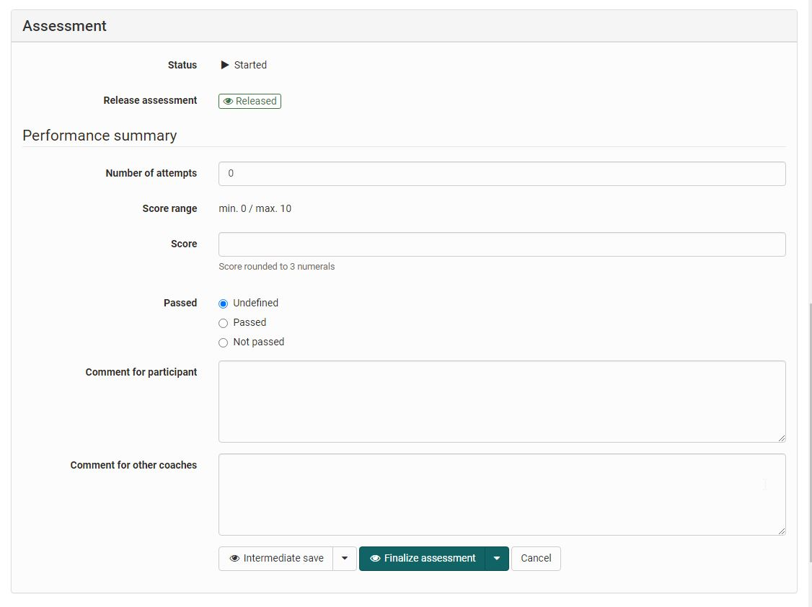
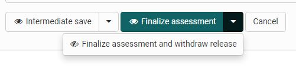
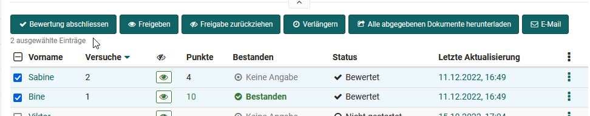

# The assessment form {: #the_assessment_form}

For all assessable course elements an assessment form is available. The specific options vary depending on the course element and its concrete configuration.

In general, the assessment form lets you:

* create short feedback,
* define a passed/failed,
* award points,
* set the visibility of the feedback for the learner,
* leave comments for other coaches,
* distribute assessment documents,
* close the assessment.

{ class="shadow lightbox" }

For the course elements [Task and Group tasks](Assessing_tasks_and_group_tasks.md), the submission process is displayed in addition to the assessment form. Assessments can be made in the individual assessment steps here.

If files are submitted via the assessed course element, the number of attempts by the learners can also be adjusted manually.

For the course element "[Assessment](../learningresources/Course_Element_Assessment.md)", if activated accordingly, a [rubric](../learningresources/Forms_in_Rubric_Scoring.md) is also available for assessment.

## Visibility of the result

Once results are added in the assessment tool, whether as points or passed/failed, they are visible to the participants. In some cases, however, the results should be made available to all participants at the same time. For such scenarios, the visibility of the result can first be restricted. The eye icon shows whether an assessment is displayed to the participants or not. 

By default, all results of the assessable elements are displayed immediately. The only exception is the test, if the correction is set to manual.

To set the visibility for a single participant, open the desired person. At the bottom of the assessment form, you can define, both for the intermediate save and for the final release (finalize assessment), whether the assessment should be displayed directly to the participant or not. 

{ class="shadow lightbox" }

Alternatively, or if the visibility for several participants is to be adjusted, this can also be done via the participant list for the corresponding course element. 
This column shows the participants for whom the result is visible ({ class=size16 }), or not yet visible ({ class=size16 }). If no icon is displayed, the default setting applies. 

To change the visibility, the desired participants can be selected in the leftmost column and either the "Release" or "Withdraw release" button can be clicked. 

## Finalizing the assessment

Finalizing an assessable course element is done via the "Finalize assessment (and release)" button. 

The "Finalize assessment" button changes the status in the Status column. All selected participants that have been set to completed receive the status "Assessed". 

{ class="shadow lightbox" }

Changes are then only possible if "Reopen assessment" is selected. 

This status helps you keep track of the participants who have already been assessed. This status has no effect on the visibility of the results for the participants.

## Further information {: #further_information}

[Rubric assessment form](Forms_in_Rubric_Scoring.md) 

[To the top of the page ^](#the_assessment_form)
