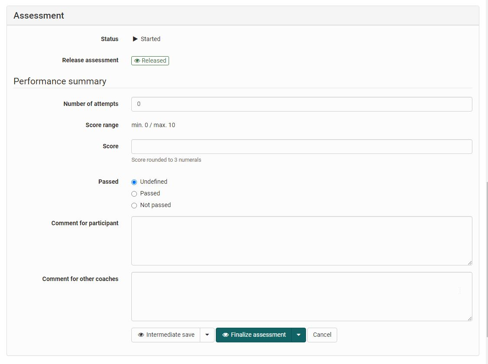
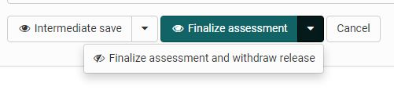
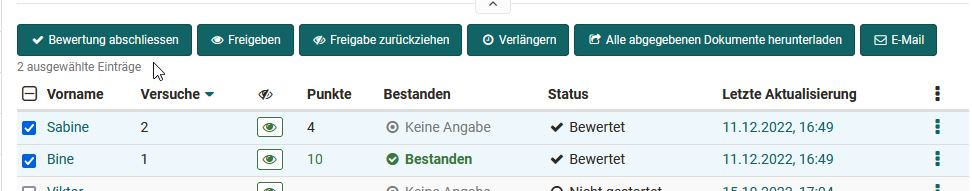

# The assessment form

For all assessable course elements an assessment form is available. The corresponding setting options vary between course elements.

In general here you can:

* create short feedback
* define passed/failed
* score
* set the visibility of the feedback for the learners
* make comments for other coaches
* distribute assessment documents
* close the assessment

{ class="shadow lightbox" }

For the course elements [Task and Group tasks](Assessing_tasks_and_group_tasks.md), the submission process is displayed in addition to the assessment form. Here, assessments can be made in the individual assessment steps.

If files are submitted via the assessed course element, the number of attempts by the learners can also be adjusted manually.

In the case of the course element "[Assessment](../e-assessment/Performance_assessment.md)", if activated accordingly, a [rubric](../forms/Rubric.md) for assessment is also available.

## Visibility of the result

Once results are added in the assessment tool, whether as points or pass/fail, they are visible to the user. In some cases, however, the results should be made available to all users at the same time. For such scenarios, the visibility of the result can be restricted and set to visible only at the desired time.

By default, all results of the assessable modules are displayed immediately. The only exception is the test, if the correction was set to manual.

To set the visibility for a single user, open the desired user. 

At the bottom of the rating form, you can define whether the rating should be displayed directly to the user or not, both for the intermediate storage and for the final release (complete rating). 

{ class="shadow lightbox" }

Alternatively, or if the visibility for multiple users is to be adjusted, this can also be done via the participant list for the corresponding course element. 

This column shows the users for whom the result is visible ({ class=size16 }) or not yet visible ({ class=size16 }). If no icon is displayed, the default setting applies. 

To change the visibility, the desired users can be selected in the leftmost column and either the "Release" or "Withdraw release" button can be clicked. 

The status completed has no effect on the visibility.

## Finalization of the assessment

The button "Finalize assessment" changes the status in the Status column. All selected users that have been set to completed will receive the status "Assessed". 

{ class="shadow lightbox" }

Changes are then only possible if "Reopen assessment" is selected. This status helps you to keep track of the users that have already been assessed. This status has no effect on the visibility of the results for the user.
