# Toolbar: Übersicht {: #toolbar}

Die Toolbar (Werkzeugleiste) befindet sich im Kopf der Seite, direkt unter der Hauptnavigation und zeigt verschiedenste Icons für Werkzeuge.

**Beispiel Teilnehmer:in**:

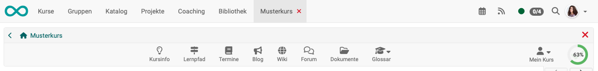{ class="shadow lightbox" }

**Beispiel Kursbesitzer:in/Betreuer:in**:

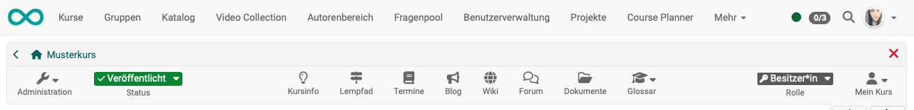{ class="shadow lightbox" }

Ob die Toolbar für die Kursteilnehmer:innen sichtbar ist, entscheidet die Kursbesitzer:in. Für Betreuer:innen und Besitzer:innen ist sie immer sichtbar. 
[Mehr dazu >](#show_icons)

Wird die Toolbar für die Teilnehmer:innen angezeigt, können Kursbesitzer:innen entscheiden, welche Icons dort angezeigt werden und sie kursspezifisch nach Bedarf ein- und ausschalten. 
[Mehr dazu >](#show_icons)

Die Tools erscheinen dann entweder in der Toolbar oder unter "Mein Kurs".

---

## Verfügbare Icons {: #available_icons}

### Administration {: #admin}

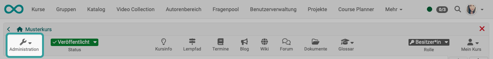{ class="shadow lightbox" }

Die Kurs-Administration wird nur den zur Bearbeitung Berechtigten angezeigt, nicht den Teilnehmer:innen. Dort sind viele Menüoptionen zur Verwaltung und Bearbeitung aufrufbar. 
[Mehr dazu >](../learningresources/Administration.de.md)

---

### Status {: #status}

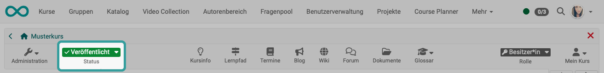{ class="shadow lightbox" }

Der Status wird nur den zur Bearbeitung Berechtigten angezeigt, nicht den Teilnehmer:innen. Der Status des Kurses kann hier gewechselt werden. 
[Mehr dazu >](../learningresources/Access_configuration.de.md)

---

### Kursinfo {: #info_page}

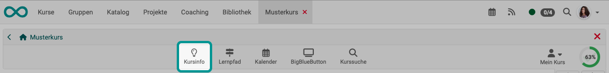{ class="shadow lightbox" }

Unter Kursinfo sind allgemeine Informationen über den Kurs abrufbar, wie z. B. die Beschreibung der Veranstaltung oder Durchführungszeitraum und Ort. Diese Informationen sind bereits sichtbar, bevor ein Kurs überhaupt von Lernenden aufgerufen werden kann. 
[Mehr dazu >](../learningresources/Info_page.de.md)

---

### Lernpfad {: #learning_path}

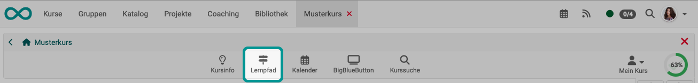{ class="shadow lightbox" }

**Aufruf durch Teilnehmer:innen** 
Über das Lernpfad-Icon in der Toolbar erhalten Lernende einen Überblick über ihren Fortschritt in allen Kursbausteinen. Je nach gewählten Spalten können ausserdem zusätzliche Informationen wie die Art der Durchführung und Termine angezeigt werden. So behalten Lernende ihre Aktivitäten im Kurs einfach im Blick.

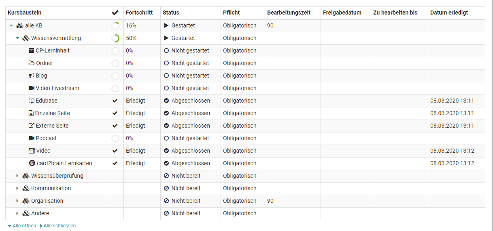{ class="shadow lightbox" }

**Aufruf durch Kursbesitzer:innen und Betreuer:innen** 
Kursbesitzer:innen und Betreuer:innen erhalten über den Link "Lernpfad" zunächst eine Übersicht über alle Teilnehmenden und können dann im nächsten Schritt eine Person auswählen, um sich ihren Lernfortschritt anzeigen zu lassen.

---

### Kalender {: #calendar}

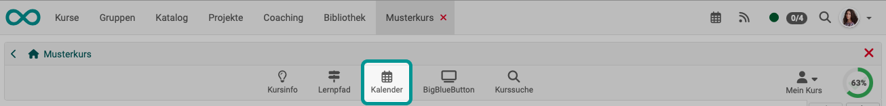{ class="shadow lightbox" }

Pro Kurs kann *ein* Kalender aktiviert werden. Für die Einbindung gibt es zwei Optionen. Der Kalender kann entweder als [Kalender-Kursbaustein](../learningresources/Course_Element_Calendar.de.md) oder an zentraler Position oben in der Kurstoolbar angezeigt werden.

Neben dem Kurskalender gibt es in OpenOlat noch weitere Kalender:

- [Persönlicher Kalender >](../personal_menu/Calendar.de.md)
- [Gruppenkalender >](../groups/Using_Group_Tools.de.md)

Neue Termine werden einfach mit Klick auf das gewünschte Datum erstellt. Anschliessend können Titel, Beschreibung, Beginn und Ende sowie eventuell ein Ort, mögliche Wiederholungen sowie die Sichtbarkeit eingestellt werden. Anschliessend erscheint der Termin im Kalender bzw. in allen Instanzen des Kurskalenders und kann mit Klick auf das Datum und der Option "Editieren" überarbeitet werden.

Mit dem "Editieren" erhält man auch Zugriff auf weitere Kalendertabs und kann Verlinkungen zu im Kurs verwendeten Kursbausteinen oder externen Webseiten setzen. Möchten Sie alle Termine eines Kurskalenders löschen, klicken Sie einfach auf das Zahnradsymbol im Kalenderbereich und wählen Sie "Kalender zurücksetzen".

Kurskalender werden ferner automatisch in den persönlichen Kalender der Kursmitglieder übertragen. So können alle Termine auch direkt über den persönlichen OpenOlat-Kalender aufgerufen werden. Gleiches gilt für Gruppenkalender. Bei Gruppenkalendern kann in der Gruppenadministration eingestellt werden, welche Schreib- bzw. Leserechte die Mitglieder erhalten.

Standardmässig haben nur Besitzer:innen eines Kurses Schreibrechte im Kalender. Kursteilnehmer:innen haben lediglich Leserechte, können also keine neuen Termine verfassen oder bestehende Termine editieren. Fügt man den Kalender allerdings als Kursbaustein ein, kann man die Berechtigung im Kurseditor im Tab "Zugang" konfigurieren.

---

### Liste der Teilnehmer:innen {: #participant_list}

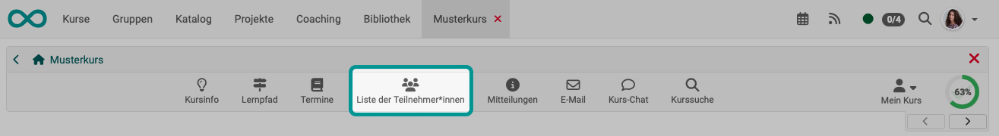{ class="shadow lightbox" }

Die Liste der Teilnehmer:innen kann in der Auflistung aller Kursmitglieder auch Kontaktmöglichkeiten enthalten. 
[Mehr dazu >](../learningresources/Course_Element_Participant_List.de.md)

---

### Mitteilungen {: #notifications}

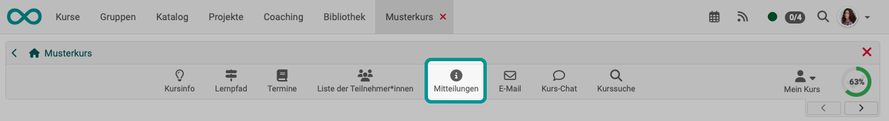{ class="shadow lightbox" }

In den Mitteilungen können Lehrende zentral Informationen zum Gesamtkurs hinterlegen. 
[Mehr dazu >](../learningresources/Course_Element_Notifications.de.md)

---

### E-Mail {: #email}

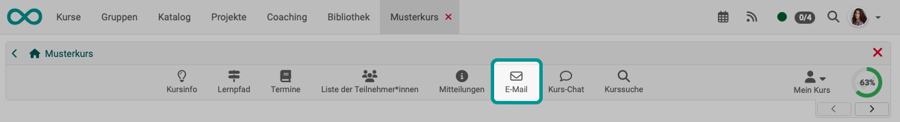{ class="shadow lightbox" }

E-Mails können an diversen Stellen versandt werden. Neben dem [persönlichen Menü](../personal_menu/E-Mail.de.md) ist das Icon in der Toolbar eine gute Möglichkeit, den Kursmitgliedern eine Kontaktmöglichkeit mit schnellem Zugriff anzubieten. 
[Mehr dazu >](../learningresources/Course_Element_EMail.de.md)

---

### BigBlueButton (oder andere virtuelle Klassenzimmer) {: #BBB}

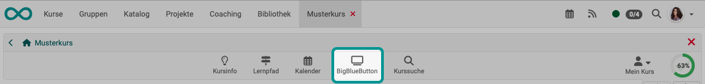{ class="shadow lightbox" }

Alternativ zu einem Kursbaustein kann der Zugriff auf ein Videokonferenz-Tool auch via Icon in der Toolbar ermöglicht werden. Neben BigBlueButton können auch andere installierte Videokonferenz-Tools in der Toolbar angezeigt werden (z. B. Microsoft Teams oder Zoom). 
[Mehr dazu >](../learningresources/bigbluebutton/index.de.md)

---

### Blog {: #blog}

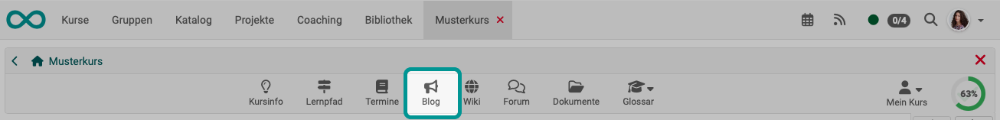{ class="shadow lightbox" }

In OpenOlat können mehrere Blogs eingebunden werden. Ein Aufruf durch das Icon in der Toolbar bietet sich an, wenn sich der Blog-Inhalt auf den gesamten Kurs bezieht. 
[Mehr dazu >](../learningresources/Course_Element_Blog.de.md)

---

### Wiki {: #wiki}

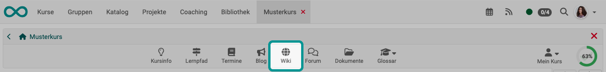{ class="shadow lightbox" }

In der Toolbar kann der Zugriff auf ein zentrales Wiki für den Gesamtkurs eingerichtet werden. 
[Mehr zum Erstellen eines Wikis >](../learningresources/Wiki.de.md) 
[Mehr zum Kursbaustein Wiki >](../learningresources/Course_Element_Wiki.de.md)

---

### Forum {: #forum}

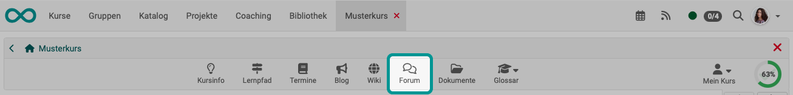{ class="shadow lightbox" }

Neben dem Kursbaustein "Forum" gibt es auch die Möglichkeit, ein zentrales Forum für den gesamten Kurs in der Kurstoolbar anzeigen zu lassen. Das bietet sich an, wenn der Kurs nur *ein* Forum umfasst, das permanent zur Verfügung stehen soll. Hier können jedoch keine weiteren Einstellungen wie Pseudonymisierung oder Vergabe von Moderationsrechten vorgenommen werden. 
[Mehr dazu >](../learningresources/Course_Element_Forum.de.md)

---

### Dokumente {: #documents}

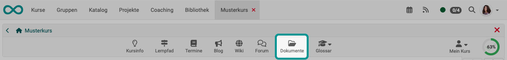{ class="shadow lightbox" }

Über diesen Link kann die Lehrkraft wichtige Dokumente des Kurses zentral zum Download bereitstellen. Die Lernenden können die Dokumente herunterladen, sich benachrichtigen lassen, wenn neue Dokumente bereitstehen (abonnieren) und bei Bedarf die Dateien per Mail versenden. Die Konfigurationsmöglichkeiten sind aber nicht so umfangreich wie beim Kursbaustein "Ordner". 
[Mehr dazu >](../learningresources/Storage_folder.de.md)

---

### Termine {: #events}

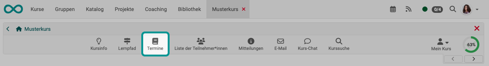{ class="shadow lightbox" }

Ist das Termin- und Absenzenmanagement eingeschaltet, kann es hier zur Ansicht bzw. Erfassung von Terminen und Absenzen aufgerufen werden. 
[Mehr dazu >](../learningresources/Toolbar_Events.de.md)

---

### Glossar {: #glossary}

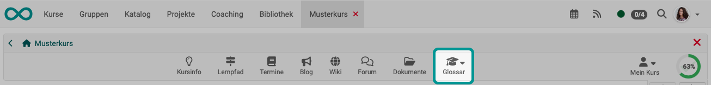{ class="shadow lightbox" }

Sofern ein Glossar mit dem Kurs verbunden wurde, kann es auch in der Toolbar aufgerufen werden. In einem Glossar können die Begriffe eines Kurses, eines Fachs bzw. einer Veranstaltung erklärt werden. Die Begriffe werden automatisch alphabetisch sortiert und können mit Klick auf den entsprechenden Startbuchstaben aufgerufen werden. 
[Mehr dazu >](../learningresources/Glossary.de.md)

---

### Kurs-Chat {: #chat}

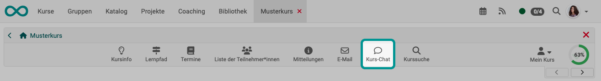{ class="shadow lightbox" }

Der Chat ermöglicht den synchronen Austausch unter den Kurs-Mitgliedern. 
[Mehr dazu >](../basic_concepts/Chat.de.md)

---

### Kurssuche {: #course_search}

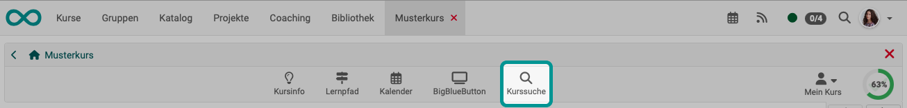{ class="shadow lightbox" }

Je nachdem, von wo die Suche gestartet wird, werden andere Bereiche durchsucht. Mit dem Icon in der Toolbar wird die Kurssuche ausgeführt. 
[Mehr dazu >](../basic_concepts/Search_in_Course.de.md)

---

### Externe Kurstools [:octicons-tag-16:{ title="ab Release 21.0 (OO-9488)" }](https://track.frentix.com/issue/OO-9488) {: #external_tools}

{ class="shadow lightbox" }

Kursbesitzer:innen können pro Kurs bis zu **vier externe Kurstools** konfigurieren. Ein externes Kurstool ist ein konfigurierbarer Link aus der Kurstoolbar zu einer externen Webanwendung (z. B. ein Absenzmanagementsystem, eine Schulinfoseite, ein Partnerportal, ein Raumbuchungstool, ein externes Mail- oder Kalendersystem).

Pro Tool konfigurierbar:

- **Name**: Bezeichnung des Toolbar-Buttons
- **URL**: muss mit `http://` oder `https://` beginnen
- **Icon**: aus dem Icon-Katalog wählbar (z. B. Link, E-Mail, Kalender, Stundenplan, Absenzen-Management, Schulportal, Buchungen, Videos, Dateien)
- **Sichtbar für**: separat einstellbar für *Teilnehmer:innen*, *Betreuer:innen* sowie *Besitzer:innen und Personen mit administrativen Rollen*. Administrator:innen, Lernressourcenverwalter:innen, Principals und Kursplaner:innen sehen das Tool, wenn die Besitzer-Option ausgewählt ist.

Der Klick auf das Tool öffnet die konfigurierte URL in einem **neuen Browserfenster**. Es werden keine Nutzerdaten an das Zielsystem übertragen. Teilen OpenOlat und das Zielsystem denselben Identity Provider, funktioniert Single Sign-on automatisch.

Die Konfiguration der vier externen Kurstools wird beim **Kopieren** eines Kurses mitübernommen. Beim **Importieren** werden alle vier Tools auf *deaktiviert* zurückgesetzt, damit der Importer sie bewusst aktivieren kann.

[Konfiguration >](../learningresources/Course_Settings_Toolbar.de.md#external_tools)

---

### Rolle {: #role}

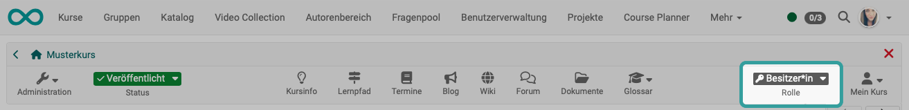{ class="shadow lightbox" }

Besitzt eine Person in diesem Kurs mehrere Rollen, kann die Rolle hier gewechselt werden. 
[Mehr dazu >](../basic_concepts/Roles.de.md#course)

---

### Mein Kurs {: #my_course}

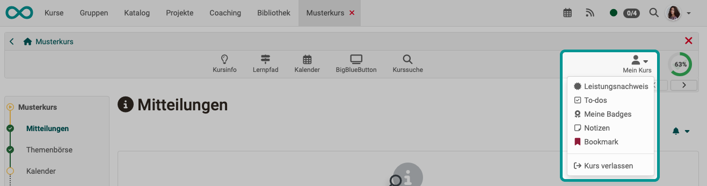{ class="shadow lightbox" }

Das Dropdown-Menü "Mein Kurs" der Toolbar bietet Zugriff auf personalisierte Bestandteile des Kurses. 
[Mehr dazu >](../learningresources/Toolbar_My_Course.de.md)

---

### Fortschrittsanzeige {: #progress}

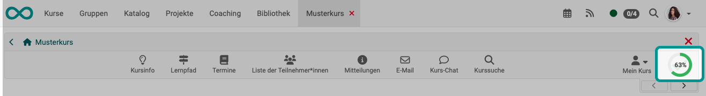{ class="shadow lightbox" }

Kursteilnehmer:innen sehen in Lernpfadkursen hier ihren Bearbeitungsstand in Form eines Kreisdiagramms. Für andere Rollen ist die Fortschrittsanzeige nicht relevant und wird deshalb nicht angezeigt. In herkömmlichen Kursen gibt es keinen Lernpfad, deshalb kann dort auch kein Lernfortschritt berechnet werden. 
[Mehr dazu >](../learningresources/Creating_learning_path_courses.de.md#konfiguration-zur-berechnung-des-lernfortschritts)

[Zum Seitenanfang ^](#toolbar)

---

## Icons (Tools) anzeigen {: #show_icons}

### Anzeige durch Kursbesitzer:innen {: #show_icons_by_owners}

Als Kursbesitzer:in legen Sie unter `Kurs > Administration > Einstellungen > Tab "Toolbar"` fest, ob die Teilnehmer:innen eine Toolbar angezeigt bekommen und, wenn ja, welche Icons (Werkzeuge) in der Toolbar angezeigt werden.

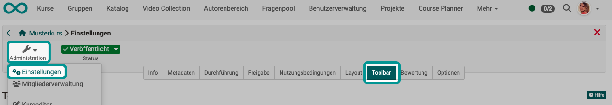{ class="shadow lightbox" }

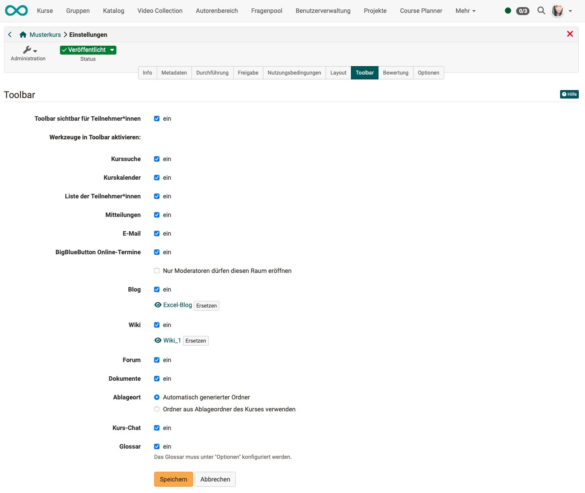{ class="shadow lightbox" }

### Ständig angezeigte Tool-Icons {: #show_icons_permanently}

Einige Icons werden in jedem Kurs angezeigt, sobald die Toolbar angezeigt wird. Dazu gehören:

- Administration
- Status
- Kursinfo
- Lernpfad
- Rolle
- Mein Kurs
- Fortschrittsanzeige (wenn Lernpfadkurs)

### Automatisch angezeigte Tool-Icons {: #show_icons_automatically}

Die Anzeige des Icons "Termine" kann nicht direkt manuell veranlasst werden. Es erscheint automatisch in der Toolbar, wenn das Termin- und Absenzenmanagement aktiviert wurde. 
[Mehr dazu >](../learningresources/Toolbar_Events.de.md)

[Zum Seitenanfang ^](#toolbar)
