# Toolbar: Übersicht {: #toolbar}

Die Toolbar (Werkzeugleiste) befindet sich im Kopf der Seite, direkt unter der Hauptnavigation und zeigt verschiedenste Icons für Werkzeuge.

**Beispiel Teilnehmer:in**:

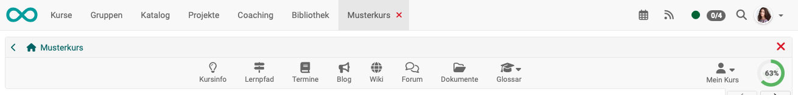{ class="shadow lightbox"}

**Beispiel Kursbesitzer:in/Betreuer:in**:

{ class="shadow lightbox"}

Ob die Toolbar für die Kursteilnehmer:innen sichtbar ist, entscheidet der/die Kursbesitzer:in. Für Betreuer:innen und Besitzer:innen ist sie immer sichtbar. 
[Mehr dazu >](#show_icons)

Wird die Toolbar für die Teilnehmer:innen angezeigt, können Kursbesitzer:innen entscheiden, welche Icons dort angezeigt werden und sie kursspezifisch nach Bedarf ein- und ausschalten. 
[Mehr dazu >](#show_icons)

Die Tools erscheinen dann entweder in der Toolbar oder unter "Mein Kurs".

---

## Verfügbare Icons {: #available_icons}

### Administration {: #admin}

{ class="shadow lightbox"}

Die (Kurs-)Administration wird nur den zur Bearbeitung Berechtigten angezeigt, nicht den Teilnehmer:innen. Dort sind viele Menüoptionen zur Verwaltung und Bearbeitung aufrufbar. 
[Mehr dazu >](../learningresources/Administration.de.md)

---

### Status {: #status}

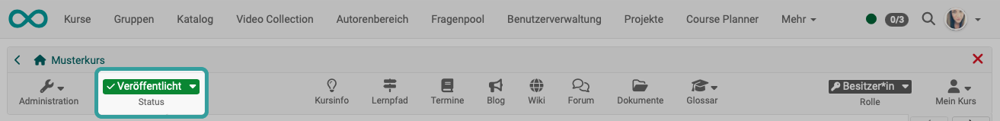{ class="shadow lightbox"}

Der Status wird nur den zur Bearbeitung Berechtigten angezeigt, nicht den Teilnehmer:innen. Der Status des Kurses kann hier gewechselt werden. 
[Mehr dazu >](../learningresources/Access_configuration.de.md)

---

### Kursinfo {: #info_page}

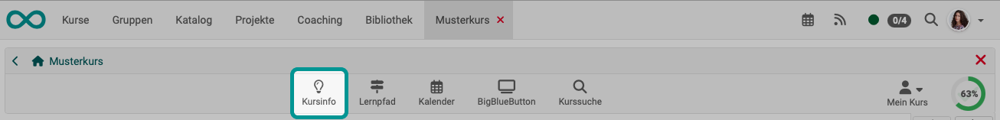{ class="shadow lightbox"}

Unter Kursinfo sind allgemeine Informationen über den Kurs abrufbar, wie z.B. die Beschreibung der Veranstaltung oder Durchführungszeitraum und Ort. 
Diese Informationen sind bereits sichtbar bevor ein Kurs überhaupt von Lernenden aufgerufen werden kann. 
[Mehr dazu >](../learningresources/Info_page.de.md)

---

### Lernpfad {: #learning_path}

{ class="shadow lightbox"}

**Aufruf durch Teilnehmer:innen** 
Über das Lernpfad-Icon in der Toolbar erhalten Lernende einen Überblick über ihren Fortschritt in allen Kursbausteinen. Je nach gewählten Spalten können außerdem zusätzliche Informationen wie die Art der Durchführung und Termine angezeigt werden. So behalten Lernende ihre Aktivitäten im Kurs einfach im Blick.

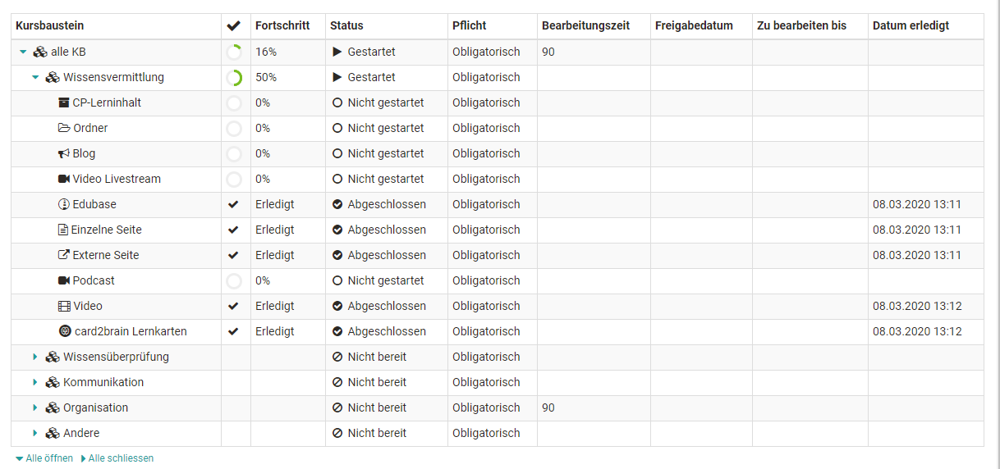

**Aufruf durch Kursbesitzer:innen und Betreuer:innen** 
Kursbesitzer:innen und Betreuende erhalten über den Link "Lernpfad" zunächst eine Übersicht über alle Teilnehmenden und können dann im nächsten Schritt eine Person auswählen um sich ihren Lernfortschritt anzeigen zu lassen. 

---

### Kalender {: #calendar}

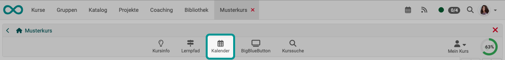{ class="shadow lightbox"}

Pro Kurs kann *ein* Kalender aktiviert werden. Für die Einbindung gibt es zwei Optionen. Der Kalender kann entweder als [Kalender-Kursbaustein](../learningresources/Course_Element_Calendar.de.md) oder an zentraler Position oben in der Kurstoolbar angezeigt werden.

Neben dem Kurskalender gibt es in OpenOlat noch weitere Kalender:

- [Persönlicher Kalender >](../personal_menu/Calendar.de.md)
- [Gruppenkalender >](../groups/Using_Group_Tools.de.md)

Neue Termine werden einfach mit Klick auf das gewünschte Datum erstellt. Anschließend können Titel, Beschreibung, Beginn und Ende sowie eventuell ein Ort, mögliche Wiederholungen sowie die Sichtbarkeit eingestellt werden Anschließend erscheint der Termin im Kalender bzw. in allen Instanzen des Kurskalenders und kann mit Klick auf das Datum und der Option „Editieren“ überarbeitet werden.

Mit dem "Editieren" erhält man auch Zugriff auf weitere Kalendertabs und kann Verlinken zu im Kurs verwendeten Kursbausteinen oder externen Webseiten setzen. Möchten Sie alle Termine eines Kurskalenders löschen, klicken Sie einfach auf das Zahnradsymbol im Kalenderbereich und wählen Sie "Kalender zurücksetzen".

Kurskalender werden ferner automatisch in den persönlichen Kalender der Kursmitglieder übertragen. So können alle Termine auch direkt über den persönlichen OpenOlat-Kalender aufgerufen werden. Gleiches gilt für Gruppenkalender. Bei Gruppenkalendern kann in der Gruppenadministration eingestellt werden welche Schreib- bzw. Leserechte die Mitglieder erhalten.

Standardmässig haben nur Besitzer eines Kurses Schreibrechte im Kalender. Kursteilnehmer:innen haben lediglich Leserechte, können also keine neuen Termine verfassen oder bestehende Termine editieren. Fügt man den Kalender allerdings als Kursbaustein ein, kann man die Berechtigung im Kurseditor im Tab "Zugang" konfigurieren.

---

### Teilnehmerliste {: #participant_list}

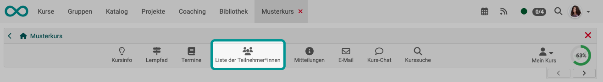{ class="shadow lightbox"}

Die Teilnehmerliste kann in der Auflistung aller Kursmitglieder auch Kontaktmöglchkeiten enthalten. 
[Mehr dazu >](../learningresources/Course_Element_Participant_List.de.md)

---

### Mitteilungen {: #notifications}

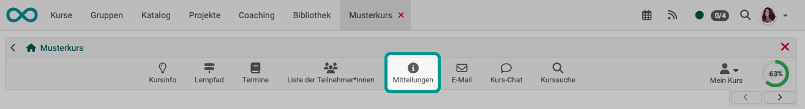{ class="shadow lightbox"}

In den Mitteilungen können Lehrende zentral Informationen zum Gesamtkurs hinterlegen. 
[Mehr dazu >](../learningresources/Course_Element_Notifications.de.md)

---

### E-Mail {: #email}

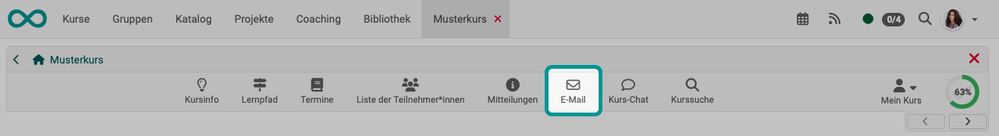{ class="shadow lightbox"}

E-Mails können an diversen Stellen versandt werden. Neben dem [persönlichen Menü](../personal_menu/E-Mail.de.md) ist das Icon in der Toolbar eine gute Möglichkeit, den Kursmitgliedern eine Kontaktmöglichkeit mit schnellem Zugriff anzubieten. 
[Mehr dazu >](../learningresources/Course_Element_EMail.de.md)

---

### BigBlueButton (oder andere virtuelle Klassenzimmer) {: #BBB}

{ class="shadow lightbox"}

Alternativ zu einem Kursbaustein kann der Zugriff auf ein Videokonferenz-Tool auch via Icon in der Toolbar ermöglicht werden. Neben BigBlueButton können auch andere installierte Videokonferenz-Tools in der Toolbar angezeigt werden (z.B. Microsoft Teams oder Zoom). 
[Mehr dazu >](../learningresources/Course_Element_BigBlueButton.de.md)

---

### Blog {: #blog}

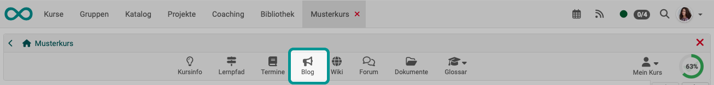{ class="shadow lightbox"}

In OpenOlat können mehrere Blogs eingebunden werden. Ein Aufruf durch das Icon in der Toolbar bietet sich an, wenn sich der Blog-Inhalt auf den gesamten Kurs bezieht. 
[Mehr dazu >](../learningresources/Course_Element_Blog.de.md)

---

### Wiki {: #wiki}

{ class="shadow lightbox"}

In der Toolbar kann der Zugriff auf ein zentrales Wiki für den Gesamtkurs eingerichtet werden. 
[Mehr zum Erstellen eines Wikis >](../learningresources/Wiki.de.md) 
[Mehr zum Kursbaustein Wiki >](../learningresources/Course_Element_Wiki.de.md)

---

### Forum {: #forum}

{ class="shadow lightbox"}

Neben dem Kursbaustein "Forum" gibt es auch die Möglichkeit ein zentrales Forum für den gesamten Kurs in der Kurs Toolbar anzeigen zu lassen. Das bietet sich an, wenn der Kurs nur *ein* Forum umfasst, das permanent zur Verfügung stehen soll. Hier können jedoch keine weiteren Einstellungen wie Pseudonymisierung oder Vergabe von Moderationsrechten vorgenommen werden. 
[Mehr dazu >](../learningresources/Course_Element_Forum.de.md)

---

### Dokumente {: #documents}

{ class="shadow lightbox"}

Über diesen Link kann die Lehrkraft wichtige Dokumente des Kurses zentral zum Download bereitstellen. Die Lernenden können die Dokumente herunterladen, sich benachrichtigen lassen, wenn neue Dokumente bereitstehen (abonnieren) und bei Bedarf die Dateien per Mail versenden. Die Konfigurationsmöglichkeiten sind aber nicht so umfangreich wie beim Kursbaustein "Ordner". 
[Mehr dazu >](../learningresources/Storage_folder.de.md)

---

### Termine {: #events}

{ class="shadow lightbox"}

Ist das Termin- und Absenzenmanagement eingeschaltet, kann es hier zur Ansicht bzw. Erfassung von Terminen und Absenzen aufgerufen werden. 
[Mehr dazu >](../learningresources/Toolbar_Events.de.md)

---

### Glossar {: #glossary}

{ class="shadow lightbox"}

Sofern ein Glossar mit dem Kurs verbunden wurde, kann es auch in der Toolbar aufgerufen werden.  
[Mehr dazu >](../learningresources/Toolbar_Glossary.de.md)

---

### Kurs-Chat {: #chat}

{ class="shadow lightbox"}

Der Chat ermöglicht den synchronen Austausch unter den Kurs-Mitgliedern. 
[Mehr dazu >](../basic_concepts/Chat.de.md)

---

### Kurssuche {: #course_search}

{ class="shadow lightbox"}

Je nachdem, von wo die Suche gestartet wird, werden andere Bereiche durchsucht.
Mit dem Icon in der Toolbar wird die Kurssuche ausgeführt. 
[Mehr dazu >](../basic_concepts/Search_in_Course.de.md)

---

### Rolle {: #role}

{ class="shadow lightbox"}

Besitzt eine Person in diesem Kurs mehrere Rollen, kann die Rolle hier gewechselt werden. 
[Mehr dazu >](../basic_concepts/Roles.de.md#course)

---

### Mein Kurs {: #my_course}

{ class="shadow lightbox"}

Das Dropdown-Menü "Mein Kurs" der Toolbar bietet Zugriff auf personalisierte Bestandteile des Kurses. 
[Mehr dazu >](../learningresources/Toolbar_My_Course.de.md)

---

### Fortschrittsanzeige {: #progress}

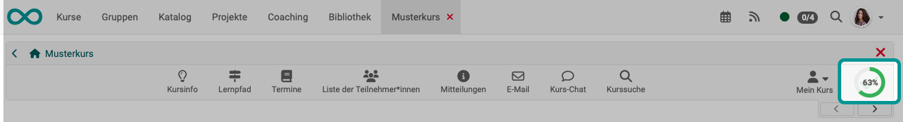{ class="shadow lightbox"}

Kursteilnehmer:innen sehen in Lernpfadkursen hier ihren Bearbeitungsstand in Form eines Kreisdiagramms. Für andere Rollen macht die Fortschrittsanzeige keinen Sinn und wird deshalb nicht angezeigt. In herkömmlichen Kursen gibt es keinen Lernpfad, deshalb kann dort auch kein Lernfortschritt berechnet werden. 
[Mehr dazu >](../learningresources/Creating_learning_path_courses.de.md#konfiguration-zur-berechnung-des-lernfortschritts)

[Zum Seitenanfang ^](#toolbar)

---

## Icons (Tools) anzeigen {: #show_icons}

### Anzeige durch Kursbesitzer:innen {: #show_icons_by_owners}

In der Kurs-Administration" unter "Einstellungen" können Sie im Tab "Toolbar" als Kursbesitzer:in festlegen, ob die Teilnehmer:innen eine Toolbar angezeigt bekommen. Und wenn ja, welche Icons (Werkzeuge) in der Toolbar angezeigt werden.

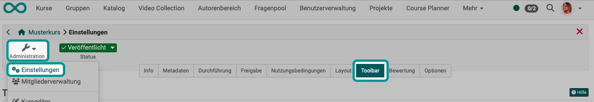{ class="shadow lightbox"}

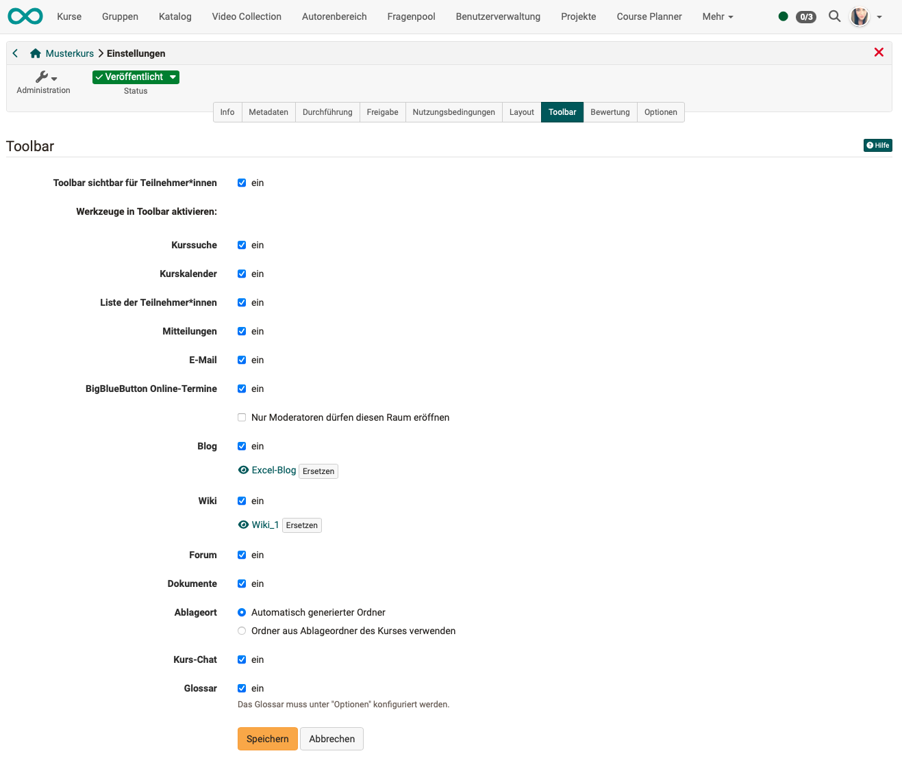{ class="shadow lightbox"}

### Ständig angezeigte Tool-Icons {: #show_icons_permanently}

Einige Icons werden in jedem Kurs angezeigt, sobald die Toolbar angezeigt wird. Dazu gehören

- Administration
- Status
- Kursinfo
- Lernpfad
- Rolle
- Mein Kurs
- Fortschrittsanzeige (wenn Lernpfadkurs)

### Automatisch angezeigte Tool-Icons {: #show_icons_automatically}

Die Anzeige des Icons "Termine" kann nicht direkt manuell veranlasst werden. Es erscheint automatisch in der Toolbar, wenn das Termin- und Absenzenmanagement aktiviert wurde.  [Mehr dazu >](../learningresources/Toolbar_Events.de.md) 

[Zum Seitenanfang ^](#toolbar)

