# Toolbar: Overview {: #toolbar}

The toolbar is located at the top of the page, directly below the main navigation bar, and displays various icons for tools.

**Example Participant**:

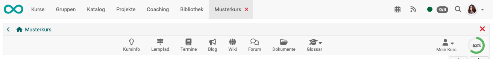{ class="shadow lightbox"}

**Example Course Owner/Coach**:

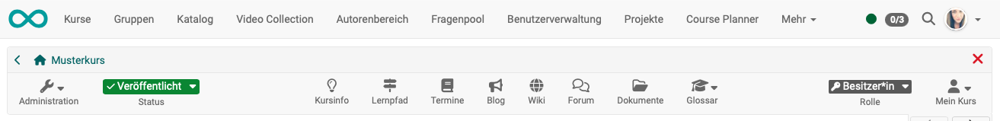{ class="shadow lightbox"}

The course owner decides whether the toolbar is visible to course participants. It is always visible to coaches and owners. 
[More >](#show_icons)

If the toolbar is displayed for participants, course owners can decide which icons are displayed there and enable or disable them for specific courses as needed.
[More >](#show_icons)

The tools then appear either in the toolbar or under "My Course".

---

## Available icons {: #available_icons}

### Administration  {: #admin}

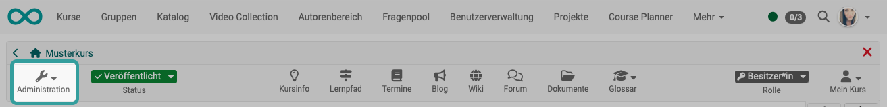{ class="shadow lightbox"}

The (course) administration is only displayed to those authorized to edit it, not to the participants. There are many menu options available for administration and editing. 
[More >](../learningresources/Administration.md)

---

### Status {: #status}

{ class="shadow lightbox"}

The status is only displayed to those authorized to edit it, not to participants. The status of the course can be changed here. 
[More >](../learningresources/Access_configuration.md)

---

### Course info {: #info_page}

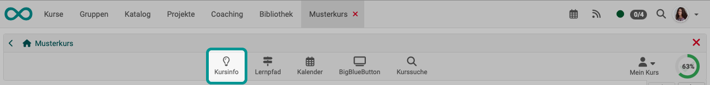{ class="shadow lightbox"}

General information about the course, such as a description of the event or the dates and location, can be found under Course Information.
This information is visible even before learners can access a course. 
[More >](../learningresources/Info_page.md)

---

### Learning path {: #learning_path}

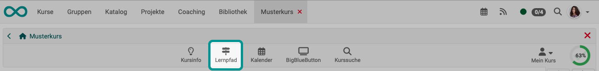{ class="shadow lightbox"}

**Appeal by participants** 
The learning path icon in the toolbar gives learners an overview of their progress in all course modules. Depending on the columns selected, additional information such as the type of implementation and dates can also be displayed. This makes it easy for learners to keep track of their activities in the course.

**Appeal by course owners and coaches** 
Course owners and coach can use the "Learning Path" link to get an overview of all participants and then select an individual to view their learning progress.

---

### Calendar {: #calendar}

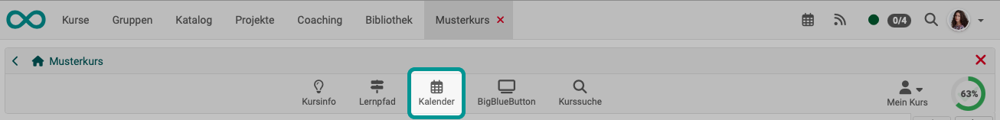{ class="shadow lightbox"}

One calendar can be activated per course. There are two options for integration. The calendar can either be displayed as a [calendar course element](../learningresources/Course_Element_Calendar.md) or in a central position at the top of the course toolbar.

In addition to the course calendar, OpenOlat offers other calendars:

- [Personal calendar >](../personal_menu/Calendar.md)
- [Group calendar >](../groups/Using_Group_Tools.md)

New events are easily created by clicking on the desired date. You can then set the title, description, start and end times, location (if applicable), possible repetitions, and visibility. The event will then appear in the calendar or in all instances of the course calendar and can be edited by clicking on the date and selecting the "Edit" option.

The "Edit" option also gives you access to additional calendar tabs and allows you to set links to course elements used in the course or external websites. If you want to delete all dates in a course calendar, simply click on the gear icon in the calendar area and select "Reset calendar."

Course calendars are also automatically transferred to the personal calendars of course members. This means that all dates can also be accessed directly via the personal OpenOlat calendar. The same applies to group calendars. For group calendars, the group administration can set the write and read permissions that members receive.

By default, only course owners have write access to the calendar. Course participants only have read access, meaning they cannot create new events or edit existing ones. However, if you add the calendar as a course element, you can configure the permissions in the course editor under the "Access" tab.

---

### Participant list {: #participant_list}

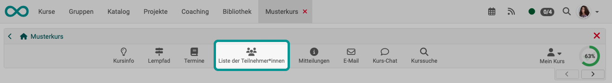{ class="shadow lightbox"}

The list of participants may also include contact details in the list of all course members. 
[More >](../learningresources/Course_Element_Participant_List.md)

---

### Notifications  {: #notifications}

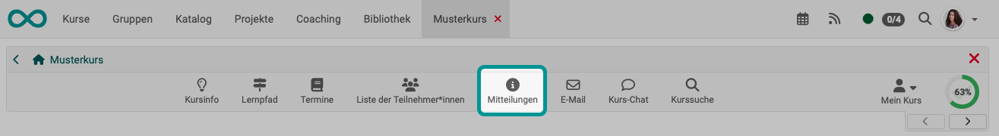{ class="shadow lightbox"}

Teachers can store information about the entire course centrally in the messages.
[More >](../learningresources/Course_Element_Notifications.md)

---

### E-Mail {: #email}

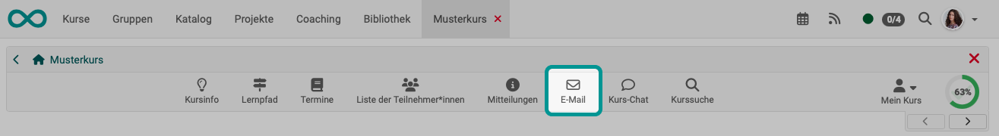{ class="shadow lightbox"}

E-mails can be sent from various locations. In addition to the [personal menu](../personal_menu/E-Mail.md), the icon in the toolbar is a good way to offer course members quick access to a contact option. 
[More >](../learningresources/Course_Element_EMail.md)

---

### BigBlueButton (or other virtual classrooms) {: #BBB}

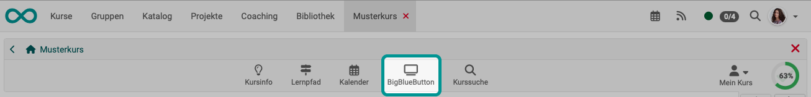{ class="shadow lightbox"}

As an alternative to a course module, access to a video conferencing tool can also be enabled via an icon in the toolbar. In addition to BigBlueButton, other installed video conferencing tools can also be displayed in the toolbar (e.g., Microsoft Teams or Zoom).
[More >](../learningresources/Course_Element_BigBlueButton.md)

---

### Blog {: #blog}

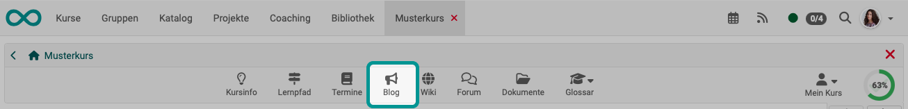{ class="shadow lightbox"}

Multiple blogs can be integrated into OpenOlat. Clicking on the icon in the toolbar is a good option if the blog content relates to the entire course. 
[More >](../learningresources/Course_Element_Blog.md)

---

### Wiki {: #wiki}

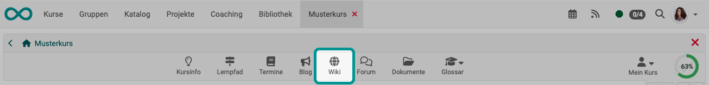{ class="shadow lightbox"}

Access to a central wiki for the entire course can be set up in the toolbar.
[More about creating a wiki >](../learningresources/Wiki.md) 
[More about the course element wiki >](../learningresources/Course_Element_Wiki.md)

---

### Forum {: #forum}

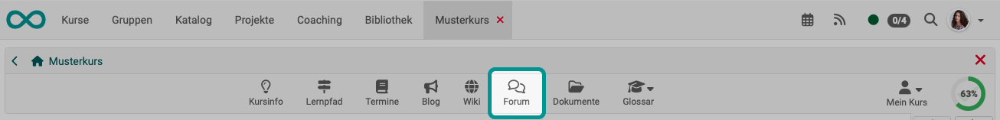{ class="shadow lightbox"}

In addition to the "Forum" course element, there is also the option of displaying a central forum for the entire course in the course toolbar. This is useful if the course only includes *one* forum that is to be permanently available. However, no further settings such as pseudonymization or the assignment of moderation rights can be made here. 
[More >](../learningresources/Course_Element_Forum.md)

---

### Documents {: #documents}

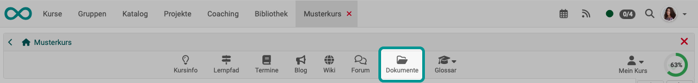{ class="shadow lightbox"}

Teachers can use this link to make important course documents available for download in one central location. Learners can download the documents, receive notifications when new documents are available (subscribe), and send the files by e-mail if necessary. However, the configuration options are not as extensive as those for the "Folder" course element.
[More >](../learningresources/Storage_folder.md)

---

### Events {: #events}

{ class="shadow lightbox"}

If appointment and absence management is enabled, it can be accessed here to view or enter appointments and absences. 
[More >](../learningresources/Toolbar_Events.md)

---

### Glossary {: #glossary}

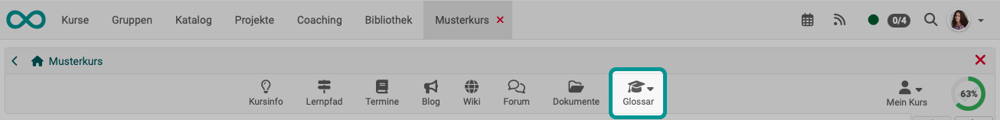{ class="shadow lightbox"}

If a glossary has been linked to the course, it can also be accessed from the toolbar.
A glossary can be used to explain the terms used in a course, subject, or event. The terms are automatically sorted alphabetically and can be accessed by clicking on the corresponding initial letter. 
[More >](../learningresources/Glossary.md)

---

### Course Chat {: #chat}

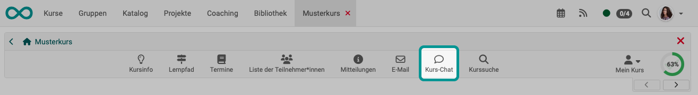{ class="shadow lightbox"}

The chat feature enables synchronous communication between course members.
[More >](../basic_concepts/Chat.md)

---

### Course search {: #course_search}

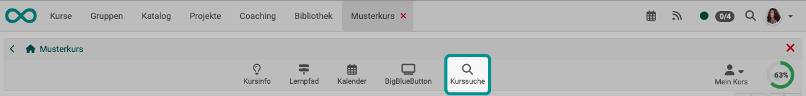{ class="shadow lightbox"}

Depending on where the search is started, different areas are searched.
The course search is performed using the icon in the toolbar.
[More >](../basic_concepts/Search_in_Course.md)

---

### Role {: #role}

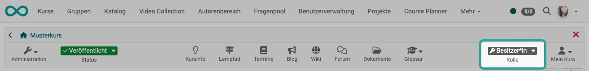{ class="shadow lightbox"}

If a person has multiple roles in this course, the role can be changed here. 
[More >](../basic_concepts/Roles.md#course)

---

### My Course {: #my_course}

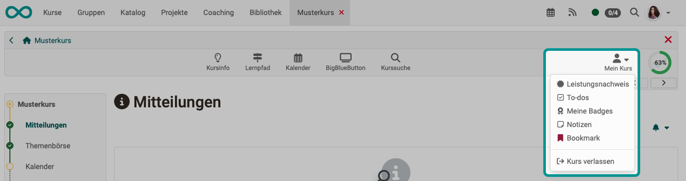{ class="shadow lightbox"}

The "My Course" drop-down menu in the toolbar provides access to personalized components of the course. 
[More >](../learningresources/Toolbar_My_Course.md)

---

### Progress {: #progress}

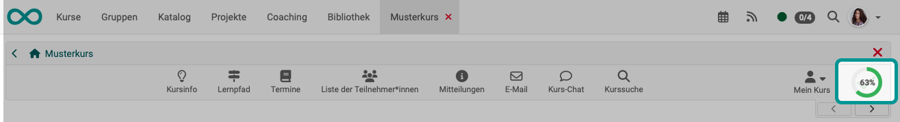{ class="shadow lightbox"}

Course participants can see their progress in learning path courses here in the form of a pie chart. For other roles, the progress indicator is not relevant and is therefore not displayed. There is no learning path in traditional courses, so learning progress cannot be calculated there. 
[More >](../learningresources/Creating_learning_path_courses.md)

[To the top of the page ^](#toolbar)

---

## Show Icons (Tools) {: #show_icons}

### Show icons by owners {: #show_icons_by_owners}

In the "Course Administration" section under "Settings," you can specify in the "Toolbar" tab as the course owner whether participants should see a toolbar. If so, you can also specify which icons (tools) should be displayed in the toolbar.

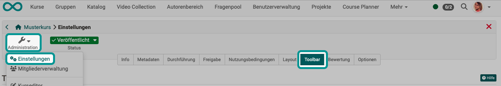{ class="shadow lightbox"}

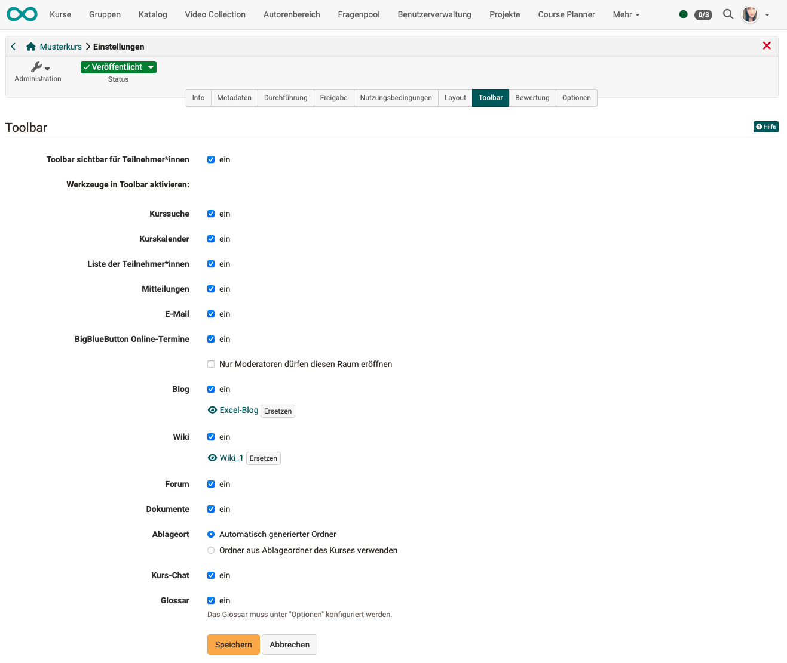{ class="shadow lightbox"}

### Show icons permanently {: #show_icons_permanently}

Some icons are displayed in every course as soon as the toolbar is displayed. These include

- Administration
- Status
- Course infos
- Learning path
- Role
- My course
- Progress (if Learning path)

### Show icons automatically {: #show_icons_automatically}

The "Events" icon cannot be displayed manually. It appears automatically in the toolbar when appointment and absence management has been activated. 
[More >](../learningresources/Toolbar_Events.md) 

[To the top of the page ^](#toolbar)
