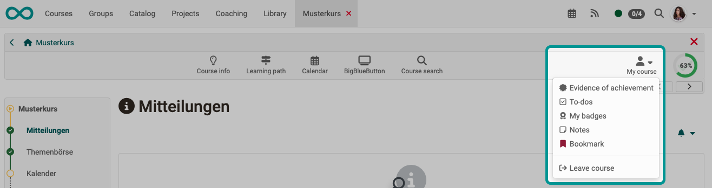

# Toolbar: Overview {: #toolbar}

The toolbar is located at the top of the page, directly below the main navigation, and displays various icons for tools.

**Example participant**:

{ class="shadow lightbox" }

**Example course owner/coach**:

{ class="shadow lightbox" }

The course owner decides whether the toolbar is visible to course participants. It is always visible to coaches and owners. 
[More >](#show_icons)

If the toolbar is displayed for participants, course owners can decide which icons are displayed there and switch them on and off for each course as needed. 
[More >](#show_icons)

The tools then appear either in the toolbar or under "My course".

---

## Available icons {: #available_icons}

### Administration {: #admin}

{ class="shadow lightbox" }

The course administration is only displayed to those authorized to edit, not to the participants. Many menu options for administration and editing can be accessed there. 
[More >](../learningresources/Administration.md)

---

### Status {: #status}

{ class="shadow lightbox" }

The status is only displayed to those authorized to edit, not to participants. The status of the course can be changed here. 
[More >](../learningresources/Access_configuration.md)

---

### Course info {: #info_page}

{ class="shadow lightbox" }

Under Course info, general information about the course is available, such as the description of the event or the execution period and location. This information is already visible before a course can be accessed by learners at all. 
[More >](../learningresources/Info_page.md)

---

### Learning path {: #learning_path}

{ class="shadow lightbox" }

**Access by participants** 
The learning path icon in the toolbar gives learners an overview of their progress in all course elements. Depending on the columns selected, additional information such as the type of execution and dates can also be displayed. This makes it easy for learners to keep track of their activities in the course.

{ class="shadow lightbox" }

**Access by course owners and coaches** 
Course owners and coaches can use the "Learning path" link to first get an overview of all participants and then, in the next step, select a person to display their learning progress.

---

### Calendar {: #calendar}

{ class="shadow lightbox" }

*One* calendar can be activated per course. There are two options for integration. The calendar can either be displayed as a [calendar course element](../learningresources/Course_Element_Calendar.md) or in a central position at the top of the course toolbar.

In addition to the course calendar, OpenOlat offers other calendars:

- [Personal calendar >](../personal_menu/Calendar.md)
- [Group calendar >](../groups/Using_Group_Tools.md)

New events are easily created by clicking on the desired date. You can then set the title, description, start and end, possibly a location, possible repetitions and the visibility. The event then appears in the calendar or in all instances of the course calendar and can be edited by clicking on the date and selecting the "Edit" option.

The "Edit" option also gives you access to additional calendar tabs and allows you to set links to course elements used in the course or to external websites. If you want to delete all events of a course calendar, simply click on the gear icon in the calendar area and select "Reset calendar".

Course calendars are also automatically transferred to the personal calendars of the course members. This means that all events can also be accessed directly via the personal OpenOlat calendar. The same applies to group calendars. For group calendars, the write and read permissions that members receive can be set in the group administration.

By default, only owners of a course have write access to the calendar. Course participants only have read access, meaning they cannot create new events or edit existing ones. However, if you add the calendar as a course element, you can configure the permissions in the course editor in the "Access" tab.

---

### Participant list {: #participant_list}

{ class="shadow lightbox" }

The participant list can also include contact options in the list of all course members. 
[More >](../learningresources/Course_Element_Participant_List.md)

---

### Notifications {: #notifications}

{ class="shadow lightbox" }

In the notifications, teachers can store information about the entire course centrally. 
[More >](../learningresources/Course_Element_Notifications.md)

---

### E-Mail {: #email}

{ class="shadow lightbox" }

E-mails can be sent from various places. In addition to the [personal menu](../personal_menu/E-Mail.md), the icon in the toolbar is a good way to offer course members a contact option with quick access. 
[More >](../learningresources/Course_Element_EMail.md)

---

### BigBlueButton (or other virtual classrooms) {: #BBB}

{ class="shadow lightbox" }

As an alternative to a course element, access to a video conferencing tool can also be enabled via an icon in the toolbar. In addition to BigBlueButton, other installed video conferencing tools can also be displayed in the toolbar (e.g. Microsoft Teams or Zoom). 
[More >](../learningresources/bigbluebutton/index.md)

---

### Blog {: #blog}

{ class="shadow lightbox" }

Multiple blogs can be integrated into OpenOlat. Access via the icon in the toolbar is a good option if the blog content relates to the entire course. 
[More >](../learningresources/Course_Element_Blog.md)

---

### Wiki {: #wiki}

{ class="shadow lightbox" }

Access to a central wiki for the entire course can be set up in the toolbar. 
[More about creating a wiki >](../learningresources/Wiki.md) 
[More about the course element Wiki >](../learningresources/Course_Element_Wiki.md)

---

### Forum {: #forum}

{ class="shadow lightbox" }

In addition to the "Forum" course element, there is also the option of displaying a central forum for the entire course in the course toolbar. This is useful if the course only includes *one* forum that is to be permanently available. However, no further settings such as pseudonymization or the assignment of moderation rights can be made here. 
[More >](../learningresources/Course_Element_Forum.md)

---

### Documents {: #documents}

{ class="shadow lightbox" }

Via this link, the teacher can make important course documents available for download in one central location. Learners can download the documents, receive notifications when new documents are available (subscribe), and send the files by e-mail if necessary. However, the configuration options are not as extensive as those of the "Folder" course element. 
[More >](../learningresources/Storage_folder.md)

---

### Events {: #events}

{ class="shadow lightbox" }

If the appointment and absence management is enabled, it can be accessed here to view or record events and absences. 
[More >](../learningresources/Toolbar_Events.md)

---

### Glossary {: #glossary}

{ class="shadow lightbox" }

If a glossary has been linked to the course, it can also be accessed from the toolbar. A glossary can be used to explain the terms of a course, a subject or an event. The terms are automatically sorted alphabetically and can be accessed by clicking on the corresponding initial letter. 
[More >](../learningresources/Glossary.md)

---

### Course chat {: #chat}

{ class="shadow lightbox" }

The chat enables synchronous exchange between the course members. 
[More >](../basic_concepts/Chat.md)

---

### Course search {: #course_search}

{ class="shadow lightbox" }

Depending on where the search is started, different areas are searched. The course search is performed with the icon in the toolbar. 
[More >](../basic_concepts/Search_in_Course.md)

---

### External course tools [:octicons-tag-16:{ title="from Release 21.0 (OO-9488)" }](https://track.frentix.com/issue/OO-9488) {: #external_tools}

{ class="shadow lightbox" }

Course owners can configure up to **four external course tools** per course. An external course tool is a configurable link from the course toolbar to an external web application (e.g. an absence management system, a school information page, a partner portal, a room booking tool, an external mail or calendar system).

Configurable per tool:

- **Name**: label of the toolbar button
- **URL**: must start with `http://` or `https://`
- **Icon**: selectable from the icon catalog (e.g. Link, E-mail, Calendar, Timetable, Absence management, School portal, Bookings, Videos, Files)
- **Visible to**: configurable separately for *Participants*, *Coaches* and *Owners and persons with administrative roles*. Administrators, learning resource managers, principals and course planners see the tool when the owner option is selected.

Clicking the tool opens the configured URL in a **new browser window**. No user data is transferred to the target system. If OpenOlat and the target system share the same identity provider, single sign-on works automatically.

The configuration of the four external course tools is included when a course is **copied**. On **import**, all four tools are reset to *disabled* so that the importer can activate them deliberately.

[Configuration >](../learningresources/Course_Settings_Toolbar.md#external_tools)

---

### Role {: #role}

{ class="shadow lightbox" }

If a person has multiple roles in this course, the role can be changed here. 
[More >](../basic_concepts/Roles.md#course)

---

### My course {: #my_course}

{ class="shadow lightbox" }

The "My course" drop-down menu in the toolbar provides access to personalized components of the course. 
[More >](../learningresources/Toolbar_My_Course.md)

---

### Progress {: #progress}

{ class="shadow lightbox" }

In learning path courses, course participants see their processing status here in the form of a pie chart. For other roles, the progress indicator is not relevant and is therefore not displayed. There is no learning path in conventional courses, so no learning progress can be calculated there. 
[More >](../learningresources/Creating_learning_path_courses.md#configuration-for-calculating-the-learning-progress)

[To the top of the page ^](#toolbar)

---

## Show icons (tools) {: #show_icons}

### Display by course owners {: #show_icons_by_owners}

As course owner you define under `Course > Administration > Settings > Tab "Toolbar"` whether participants see a toolbar and, if so, which icons (tools) are displayed in the toolbar.

{ class="shadow lightbox" }

{ class="shadow lightbox" }

### Permanently displayed tool icons {: #show_icons_permanently}

Some icons are displayed in every course as soon as the toolbar is displayed. These include:

- Administration
- Status
- Course info
- Learning path
- Role
- My course
- Progress (if learning path course)

### Automatically displayed tool icons {: #show_icons_automatically}

The display of the "Events" icon cannot be triggered manually. It appears automatically in the toolbar when the appointment and absence management has been activated. 
[More >](../learningresources/Toolbar_Events.md)

[To the top of the page ^](#toolbar)
