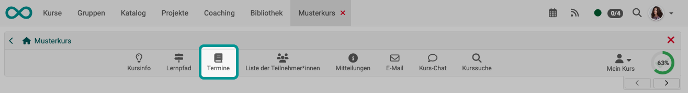

# Toolbar: Termine {: #toolbar_events}

!!! warning "Achtung"

    Dieser Artikel ist noch in Bearbeitung.

{ class="shadow lightbox"}

## Icon anzeigen {: #show_icon_events}

Das Icon "Termine" kann nicht manuell eingeblendet werden. Es wird automatisch angezeigt, wenn im Kurs die Termine und Absenzen aktiviert wurden. (Administration > Einstellungen > Durchführung)

[Zum Seitenanfang ^](#tooolbar_events)

---

## Tab Termine

### T

[Zum Seitenanfang ^](#tooolbar_events)

---

### Termine absagen {: #cancel_events}

tbd

[Zum Seitenanfang ^](#tooolbar_events)

---

### Termine abschliessen {: #close_events}

tbd

[Zum Seitenanfang ^](#tooolbar_events)

---

## Weiterführende Informationen {: #further_information}

[Basiskonzept Termine und Absenzen >](../basic_concepts/Events_and_Absences.de.md) 
[Aktivierung und Konfiguration des Absenzenmanagements durch Administrator:innen >](../../manual_admin/administration/Modules_Events_and_Absences.de.md) 
[Konfiguration der Absenzenverwaltung in einem Kurs >](../learningresources/Course_Settings_Execution.de.md#config_event_and_absence_management) 
[Erfassung und Verwaltung der Absenzen in einem Kurs durch Kursbesitzer:innen >](../learningresources/Events_and_absences.de.md) 
[Erfassung und Verwaltung der Absenzen in einem Kurs durch Betreuer:innen >](../learningresources/Toolbar_Events.de.md) 
[Persönliche Absenzen >](../personal_menu/Absences.de.md) 
[Kursübergreifende Absenzenerfassungung im Coachingtool >](../area_modules/Coaching.de.md) 
[Kursübergreifende Absenzenverwaltung durch Absenzenverwalter:innen>](../area_modules/Absence_Management.de.md) 
