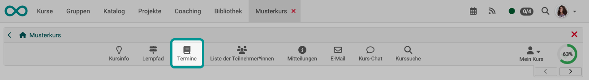
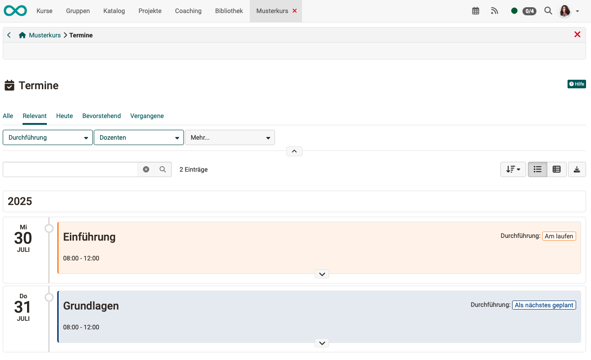
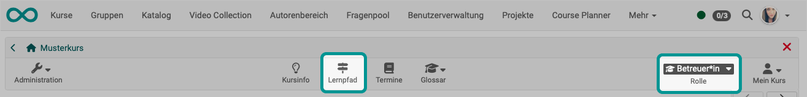
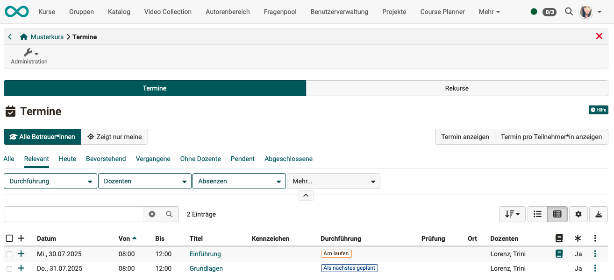
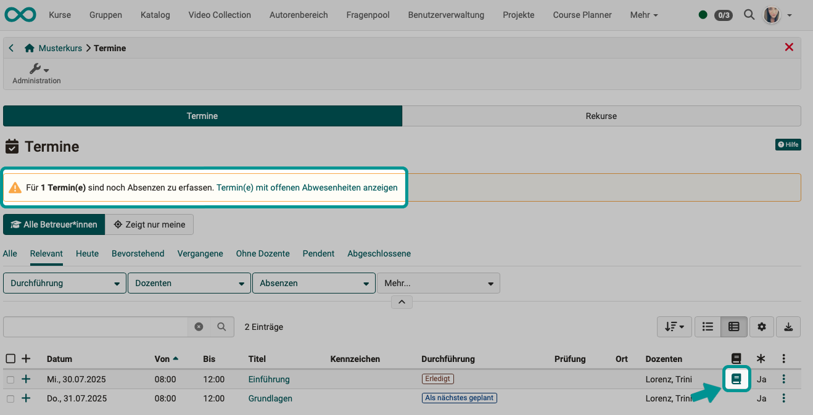
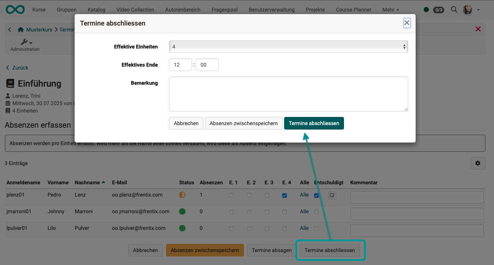
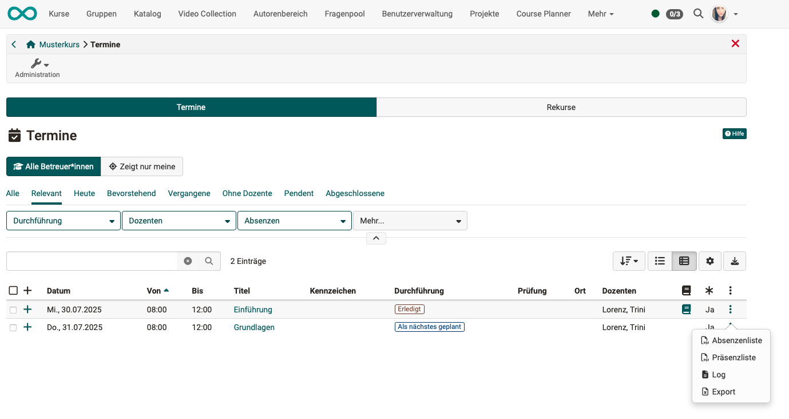
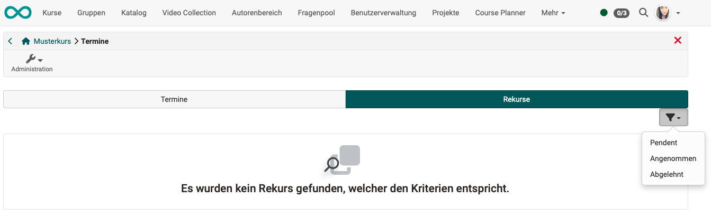
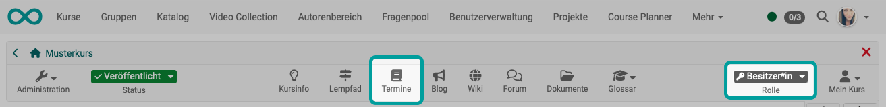

# Toolbar: Termine {: #toolbar_events}

Das Icon "Termine" wird automatisch angezeigt, wenn im Kurs die Termine und Absenzen aktiviert wurden. (Administration > Einstellungen > Durchführung)

Es steht dann Teilnehmer:innen, Betreuer:innen und Besitzer:innen des Kurses zur Verfügung. Doch je nach Rolle und den damit verbundenen Rechten, werden andere Optionen angezeigt. 

## Aufruf als Teilnehmer:in {: #call_as_participant}

{ class="shadow lightbox"}

Teilnehmer:innen werden die Termine lediglich als Information angezeigt.

{ class="shadow lightbox"}

[Zum Seitenanfang ^](#toolbar_events)

---

## Aufruf als Betreuer:in {: #call_as_coach}

Wird das Icon "Termine" in der Toolbar durch Betreuer:innen aufgerufen, können Termine und Absenzen **erfasst und verwaltet** werden. 

{ class="shadow lightbox"}

In der Betreuer:innen-Rolle finden Sie im Unterschied zu Besitzer:innen nur 2 Tabs angezeigt.

{ class="shadow lightbox"}

### Absenzen erfassen {: #record_absences}

Wurde ein Termin beendet, werden Sie als Betreuer:in darauf aufmerksam gemacht, dass noch Absenzen zu erfassen sind. Sie können den Link im Hinweis nutzen oder auf das Buch-Icon in der Zeile eines Termins klicken.

{ class="shadow lightbox"}

Die Termine sind in Einheiten unterteilt (z.B. ein Termin von 8.00 Uhr - 12.00 Uhr in 4 Einheiten zu je einer Stunde). Sie können die Absenzen für jede einzelne Einheit erfassen.
Markieren Sie ob die Abwesenheit entschuldigt ist und geben Sie einen Kommentar dazu an. Ein weiteres Kommentarfeld für den Gesamttermin ist ebenfalls pro Teilnehmer vorhanden.

{ class="shadow lightbox"}

Soll die Erfassung der Absenzen zu einem späteren Zeitpunkt vervollständigt werden, können Sie die Erfassung mit dem Button am unteren Rand zwischenspeichern.

### Termine abschliessen {: #close_events}

Kann die Erfassung der Absenzen endgültig abgeschlossen werden, gehen Sie folgendermassen vor:

1. Icon "Termine" in der Toolbar klicken
2. Tab "Termine" wählen
3. Bei dem betreffendem Termin in der Liste auf das Buch-Icon klicken (Absenz editieren)
  (nur möglich, wenn Termin bereits gestartet oder erledigt)
4. Button "Termine abschliessen" am unteren Rand der Liste klicken
5. Es öffnet sich ein Popup, in dem Sie die Absenzenerfassung endgültig abschliessen können.

{ class="shadow lightbox"}

### Termine absagen {: #cancel_events}

Als Betreuer:in können Sie einen laufenden Termin absagen, indem Sie

1. das Icon "Termine" in der Toolbar klicken
2. den Tab "Termine" wählen
3. Bei dem betreffendem Termin in der Liste auf das Buch-Icon klicken (Absenz editieren)
  (nur möglich, wenn Termin bereits gestartet)
4. den Button "Termine absagen" am unteren Rand der Liste klicken

### Listen erstellen und Export {: #lists_and_export}

Unter den 3 Punkten am Ende einer Zeile finden Sie Möglichkeiten zum Erstellen von Listen und dem Export des Termins als zip-Datei.  
So exportierte Termine können Sie an anderer Stelle wieder in OpenOlat [importieren](../learningresources/Events_and_absences.de.md#import_events).

{ class="shadow lightbox"}

### Rekurse {: #appeals}

Wurden Rekurse zu eventuell falsch erfassten Absenzen eingereicht, können Sie sich unter diesem Tab einen Überblick verschaffen. Filter helfen Ihnen bei einer grösseren Anzahl von Rekursen.

{ class="shadow lightbox" }

Die Bearbeitung der Rekurse erfolgt in der Regel durch Absenzenverwalter:innen, die kursübergreifend alle Rekurse in der zentralen [kursübergreifenden Absenzenverwaltung](../area_modules/Absence_Management.de.md) abrufen können. 

[Zum Seitenanfang ^](#toolbar_events)

---

## Aufruf als Besitzer:in {: #call_as_owner}

Kursbesitzer:innen steht das Icon ebenfalls zur Verfügung. Bei ihnen öffnet sich der Screen zum **Erfassen und Verwalten** von Terminen und Absenzen, der weitestgehend der Erfassung und Verwaltung unter **Administration > Termine und Absenzen** entspricht. 
Siehe [Erfassung und Verwaltung der Absenzen in einem Kurs durch Kursbesitzer:innen >](../learningresources/Events_and_absences.de.md) 

Technisch gesehen werden in diesen beiden Screens Laufzeitdaten erfasst, im Unterschied zur [Konfiguration](../learningresources/Course_Settings_Execution.de.md#config_event_and_absence_management).

{ class="shadow lightbox"}

[Zum Seitenanfang ^](#toolbar_events)

---

## Weiterführende Informationen {: #further_information}

[Toolbar Übersicht >](../learningresources/Toolbar.de.md) 

[Basiskonzept Termine und Absenzen >](../basic_concepts/Events_and_Absences.de.md) 
[Aktivierung und Konfiguration des Absenzenmanagements durch Administrator:innen >](../../manual_admin/administration/Modules_Events_and_Absences.de.md) 
[Konfiguration der Absenzenverwaltung in einem Kurs >](../learningresources/Course_Settings_Execution.de.md#config_event_and_absence_management) 
[Erfassung und Verwaltung der Absenzen in einem Kurs durch Kursbesitzer:innen >](../learningresources/Events_and_absences.de.md) 
[Persönliche Absenzen >](../personal_menu/Absences.de.md) 
[Kursübergreifende Absenzenerfassungung im Coachingtool >](../area_modules/Coaching.de.md) 
[Kursübergreifende Absenzenverwaltung durch Absenzenverwalter:innen>](../area_modules/Absence_Management.de.md) 

[Zum Seitenanfang ^](#toolbar_events)

