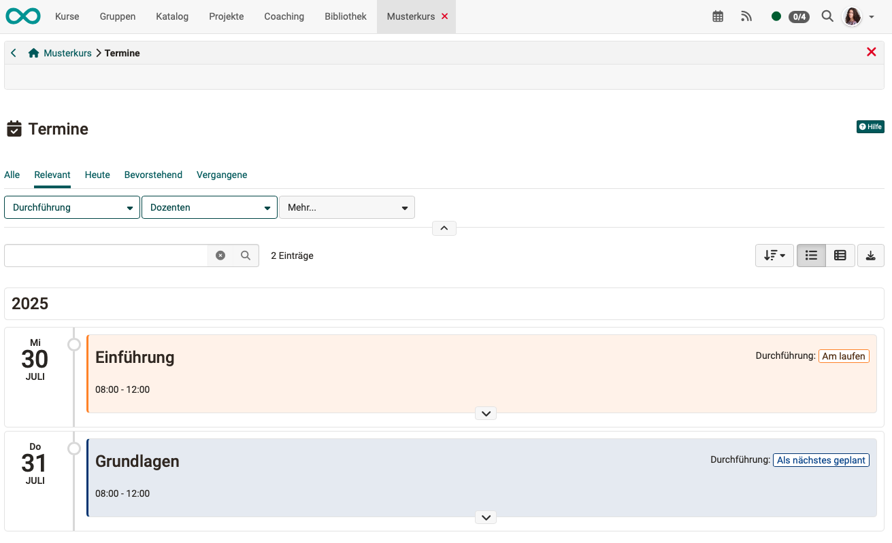
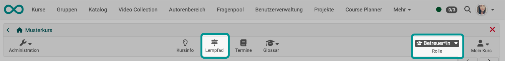
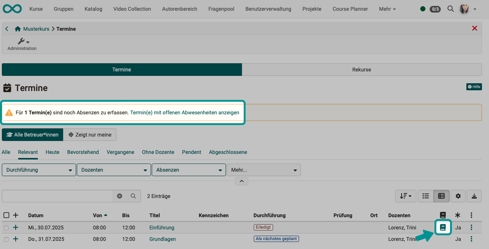
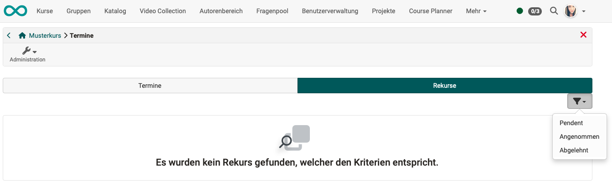

# Toolbar: Termine {: #toolbar_events}

Das Icon "Termine" wird automatisch angezeigt, wenn im Kurs die Termine und Absenzen aktiviert sind. 
`Kurs > Administration > Einstellungen > Durchführung`

Es steht dann Teilnehmer:innen, Betreuer:innen und Besitzer:innen des Kurses zur Verfügung. Doch je nach Rolle und den damit verbundenen Rechten, werden andere Optionen angezeigt. 

## Aufruf als Teilnehmer:in {: #call_as_participant}

{ class="shadow lightbox" title="Kurs-Toolbar in der Sicht der Teilnehmer:innen" }

Teilnehmer:innen werden die Termine lediglich als Information angezeigt. Sie sehen nur ihre eigenen Termine und nur die für sie relevanten Angaben. Absenzen können sie hier nicht erfassen.

Die Liste lässt sich über die Tabs "Alle", "Relevant", "Heute", "Bevorstehend" und "Vergangene" eingrenzen. Mit den beiden Symbolen rechts über der Liste wechseln Sie zwischen Zeitansicht und Tabellenansicht.

{ class="shadow lightbox" title="Terminliste in der Sicht der Teilnehmer:innen" }

[Zum Seitenanfang ^](#toolbar_events)

---

## Aufruf als Betreuer:in {: #call_as_coach}

Wird das Icon "Termine" in der Toolbar durch Betreuer:innen aufgerufen, können Termine und Absenzen **erfasst und verwaltet** werden. 

{ class="shadow lightbox" title="Kurs-Toolbar in der Sicht der Betreuer:innen" }

In der Betreuer:innen-Rolle fehlt Ihnen im Unterschied zu Besitzer:innen der Tab "Teilnehmer:innen". Den Tab "Rekurse" sehen Sie nur, wenn in der System-Administration die [Rekursmöglichkeit gewährt](../../manual_admin/administration/Modules_Events_and_Absences.de.md#appeal_enabled) und die Option ["Dozenten dürfen Rekurse einsehen"](../../manual_admin/administration/Modules_Events_and_Absences.de.md#teacher_see_appeal) eingeschaltet ist. Bleibt nur der Tab "Termine", zeigt OpenOlat die Terminliste ohne Tab-Leiste an.

{ class="shadow lightbox" title="Terminliste in der Sicht der Betreuer:innen" }

### Absenzen erfassen [:octicons-tag-16:{ title="ab Release 12.0 (OO-2637)" }](https://track.frentix.com/issue/OO-2637) {: #record_absences}

Wurde ein Termin beendet, werden Sie als Betreuer:in darauf aufmerksam gemacht, dass noch Absenzen zu erfassen sind. Sie können den Link im Hinweis nutzen oder auf das Buch-Icon in der Zeile eines Termins klicken.

{ class="shadow lightbox" title="Terminliste in der Sicht der Betreuer:innen" }

Die Termine sind in Einheiten unterteilt (z.B. ein Termin von 8.00 Uhr - 12.00 Uhr in 4 Einheiten zu je einer Stunde). Sie können die Absenzen für jede einzelne Einheit erfassen.
Markieren Sie, ob die Abwesenheit entschuldigt ist, und geben Sie einen Kommentar dazu an. Ein weiteres Kommentarfeld für den Gesamttermin ist ebenfalls pro Teilnehmer:in vorhanden.

{ class="shadow lightbox" title="Formular zum Erfassen der Absenzen" }

Soll die Erfassung der Absenzen zu einem späteren Zeitpunkt vervollständigt werden, können Sie die Erfassung mit dem Button am unteren Rand zwischenspeichern.

### Termine abschliessen {: #close_events}

Kann die Erfassung der Absenzen endgültig abgeschlossen werden, gehen Sie folgendermassen vor:

1. Icon "Termine" in der Toolbar klicken
2. Tab "Termine" wählen
3. Beim betreffenden Termin in der Liste auf das Buch-Icon klicken (Absenz editieren)
  (nur möglich, wenn Termin bereits gestartet oder erledigt)
4. Button "Termine abschliessen" am unteren Rand der Liste klicken
5. Es öffnet sich ein Popup, in dem Sie die Absenzenerfassung endgültig abschliessen können.

{ class="shadow lightbox" title="Dialog Termin abschliessen" }

### Termine absagen {: #cancel_events}

Als Betreuer:in können Sie einen laufenden Termin absagen, indem Sie

1. das Icon "Termine" in der Toolbar klicken
2. den Tab "Termine" wählen
3. Beim betreffenden Termin in der Liste auf das Buch-Icon klicken (Absenz editieren)
  (nur möglich, wenn Termin bereits gestartet)
4. den Button "Termine absagen" am unteren Rand der Liste klicken

### Menü am Zeilenende {: #lists_and_export}

Wer einen Termin vor- oder nachbereitet, braucht Listen zum Termin oder will ihn als Prüfung durchführen. Diese Aktionen liegen im 3-Punkte-Menü am Ende jeder Zeile. Als Betreuer:in finden Sie dort:

- **Als Prüfung markieren**: Der Termin wird im Prüfungsmodus durchgeführt, siehe [Termin als Prüfung markieren](#mark_event_as_exam). Ist der Termin bereits als Prüfung markiert, stehen an dieser Stelle "Prüfung editieren" und "Prüfung löschen".
- **Absenzenliste**: PDF-Liste der Teilnehmenden mit den erfassten Absenzen.
- **Präsenzliste**: PDF-Liste der Teilnehmenden zum Unterschreiben.
- **Log**: Excel-Datei mit den Änderungen an Termin und Absenzen.
- **Export**: Excel-Datei mit den Teilnehmenden des Termins und ihren Absenzen pro Einheit.

Bearbeiten, Kopieren und Löschen eines Termins stehen Betreuer:innen nicht zur Verfügung. Diese Einträge erhalten Kursbesitzer:innen: [3-Punkte-Menü der Kursbesitzer:innen](../learningresources/Events_and_absences.de.md#display_events)

Das folgende Bild zeigt das Menü bei einem Termin, der noch nicht als Prüfung markiert ist.

{ class="shadow lightbox" title="Terminliste in der Sicht der Betreuer:innen · 2026.10.02" }

### Termin als Prüfung markieren [:octicons-tag-16:{ title="ab Release 14.0 (OO-4045)" }](https://track.frentix.com/issue/OO-4045) {: #mark_event_as_exam}

Findet ein Termin als Prüfung statt, sperrt OpenOlat für die Teilnehmenden während der Prüfung alles ausser den gewählten Kursbausteinen, auf Wunsch zusammen mit dem Safe Exam Browser. Sie markieren den Termin dafür selbst, ohne die Prüfungsverwaltung des Kurses zu öffnen:

1. Icon "Termine" in der Toolbar klicken
2. Beim betreffenden Termin das 3-Punkte-Menü am Ende der Zeile öffnen
3. "Als Prüfung markieren" klicken
4. Im Dialog "Prüfung" die Kursbausteine der Prüfung wählen und bei Bedarf "Safe Exam Browser verwenden" einschalten
5. Speichern

Datum und Zeit sowie die Teilnehmenden übernimmt die Prüfung aus dem Termin. Vorlaufzeit, Nachlaufzeit und die erlaubten IP-Adressen kommen aus den [Vorgabewerten des Kurses](../learningresources/Course_Settings_Execution.de.md#event_as_exam). Welche Felder zum Safe Exam Browser der Dialog zeigt, bestimmt die System-Administration für alle Kurse: entweder das Feld "Konfiguration" mit den Konfigurationsvorlagen oder das Feld "Safe Exam Browser Keys". Den Dialog beschreibt die Seite zum Prüfungsmodus: [Prüfungsmodus aus einem Termin](../learningresources/Assessment_mode.de.md#exam_from_event)

Nach dem Speichern zeigt die Spalte "Prüfung" der Terminliste ein Symbol, und im 3-Punkte-Menü stehen "Prüfung editieren" und "Prüfung löschen".

**Wer einen Termin als Prüfung markieren kann:** In der Toolbar erhalten Betreuer:innen und die Dozent:innen eines Termins den Eintrag, ausserdem Kursbesitzer:innen. Klassenlehrer:innen, Kursplaner:innen und Personen mit dem Kursrecht "Kurseditor" markieren Termine über `Kurs > Administration > Termine und Absenzen`. Principals sehen die Terminliste, erhalten den Eintrag aber nicht.

#### Wenn "Als Prüfung markieren" fehlt {: #mark_as_exam_missing}

Der Eintrag erscheint nur, wenn alle folgenden Bedingungen erfüllt sind. Fehlt er, liegt die Ursache meist ausserhalb der Terminliste:

- **Der Prüfungsmodus ist systemweit eingeschaltet.** Ist er ausgeschaltet, fehlen auch "Prüfung editieren", "Prüfung löschen" und die Spalte "Prüfung". Den Schalter "Prüfungsmodus einschalten" setzen Administrator:innen in der System-Administration unter `Administration > e-Assessment > Prüfungsverwaltung`.
- **Im Kurs können Termine als Prüfung markiert werden.** Massgebend ist die Option "Termin kann als Prüfung markiert werden". Überschreibt der Kurs die Standardkonfiguration, gilt die [Einstellung des Kurses](../learningresources/Course_Settings_Execution.de.md#event_as_exam), die Kursbesitzer:innen ändern. Sonst gilt die [Vorgabe der System-Administration](../../manual_admin/administration/Modules_Events_and_Absences.de.md#event_as_exam) für alle Kurse.
- **Der Termin hat kein Online Meeting mit BigBlueButton oder Microsoft Teams.** Ein Sitzungs-Link zu einem anderen Anbieter verhindert den Eintrag nicht. Ist der Termin bereits als Prüfung markiert, spielt das Online Meeting keine Rolle mehr: "Prüfung editieren" und "Prüfung löschen" bleiben verfügbar.
- **Die Rolle erlaubt das Markieren.** Principals erhalten den Eintrag nie, siehe oben.

[Zum Seitenanfang ^](#toolbar_events)

### Rekurse {: #appeals}

Wurden Rekurse zu eventuell falsch erfassten Absenzen eingereicht, können Sie sich unter diesem Tab einen Überblick verschaffen. Filter helfen Ihnen bei einer grösseren Anzahl von Rekursen.

{ class="shadow lightbox" title="Tab Rekurse in der Sicht der Betreuer:innen" }

Die Bearbeitung der Rekurse erfolgt in der Regel durch Absenzenverwalter:innen, die kursübergreifend alle Rekurse in der zentralen [kursübergreifenden Absenzenverwaltung](../area_modules/Absence_Management.de.md) abrufen können. 

[Zum Seitenanfang ^](#toolbar_events)

---

## Aufruf als Besitzer:in {: #call_as_owner}

Kursbesitzer:innen steht das Icon ebenfalls zur Verfügung. Bei ihnen öffnet sich der Screen zum **Erfassen und Verwalten** von Terminen und Absenzen, der weitestgehend der Erfassung und Verwaltung unter `Kurs > Administration > Termine und Absenzen` entspricht. 
Siehe [Erfassung und Verwaltung der Absenzen in einem Kurs durch Kursbesitzer:innen >](../learningresources/Events_and_absences.de.md) 

Technisch gesehen werden in diesen beiden Screens Laufzeitdaten erfasst, im Unterschied zur [Konfiguration](../learningresources/Course_Settings_Execution.de.md#config_event_and_absence_management).

{ class="shadow lightbox" title="Kurs-Toolbar in der Sicht der Kursbesitzer:innen" }

[Zum Seitenanfang ^](#toolbar_events)

---

## Weiterführende Informationen {: #further_information}

**Auf dieser Seite erwähnt** 
[Modul Termine und Absenzen >](../../manual_admin/administration/Modules_Events_and_Absences.de.md) 
[Termine und Absenzen (Kurs-Administration) >](../learningresources/Events_and_absences.de.md) 
[Kurseinstellungen - Tab Durchführung >](../learningresources/Course_Settings_Execution.de.md) 
[Prüfungsverwaltung: Prüfungsmodus >](../learningresources/Assessment_mode.de.md) 
[Absenzenverwaltung >](../area_modules/Absence_Management.de.md)

**Weiterführend** 
[Toolbar: Übersicht >](../learningresources/Toolbar.de.md) 
[Termine und Absenzen (Basiskonzept) >](../basic_concepts/Events_and_Absences.de.md) 
[Persönliche Werkzeuge: Absenzen >](../personal_menu/Absences.de.md) 
[Coaching - Übersicht >](../area_modules/Coaching.de.md)

[Zum Seitenanfang ^](#toolbar_events)

