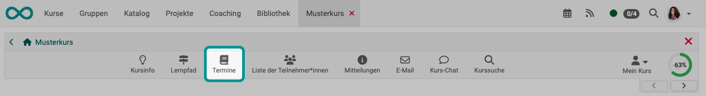
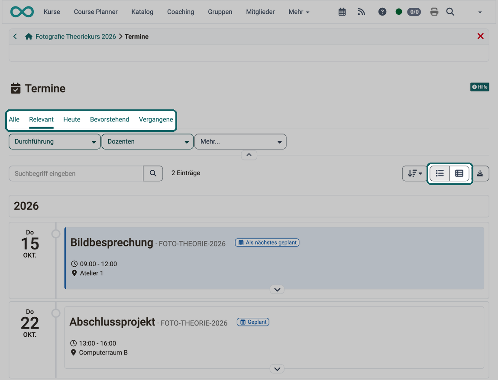
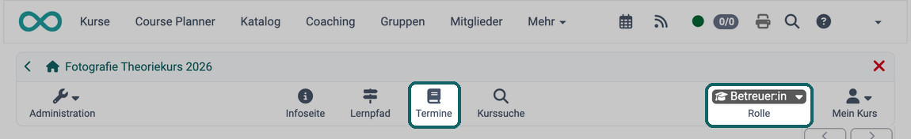
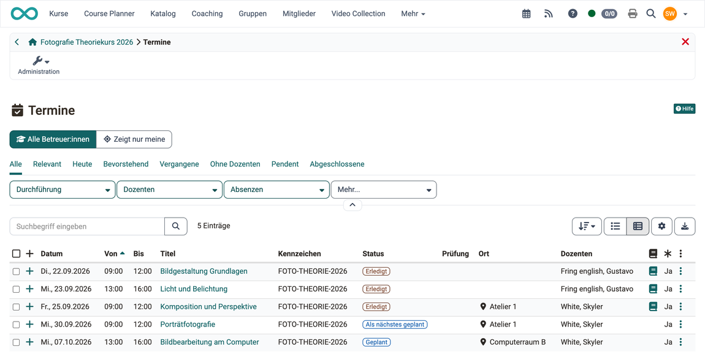
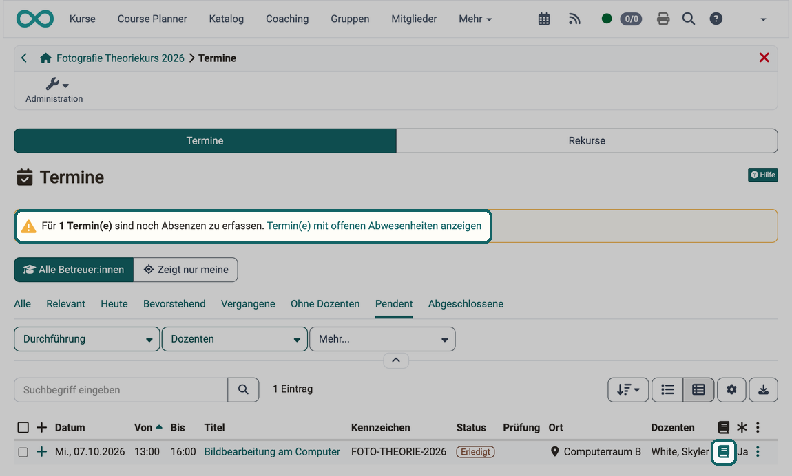
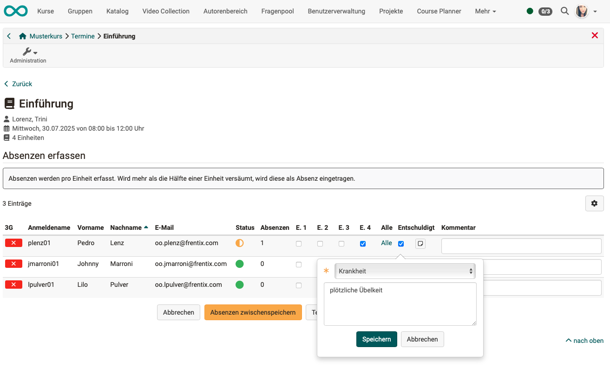
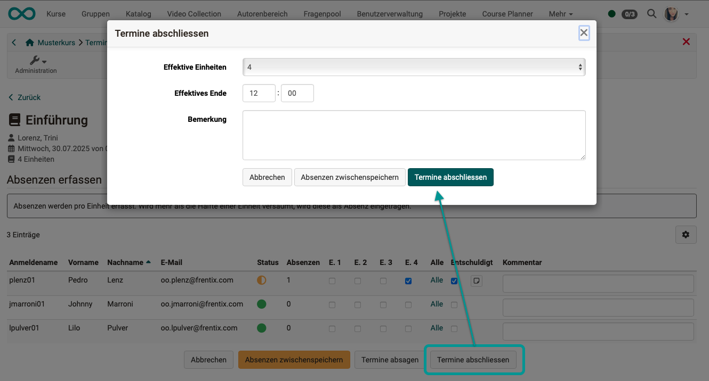
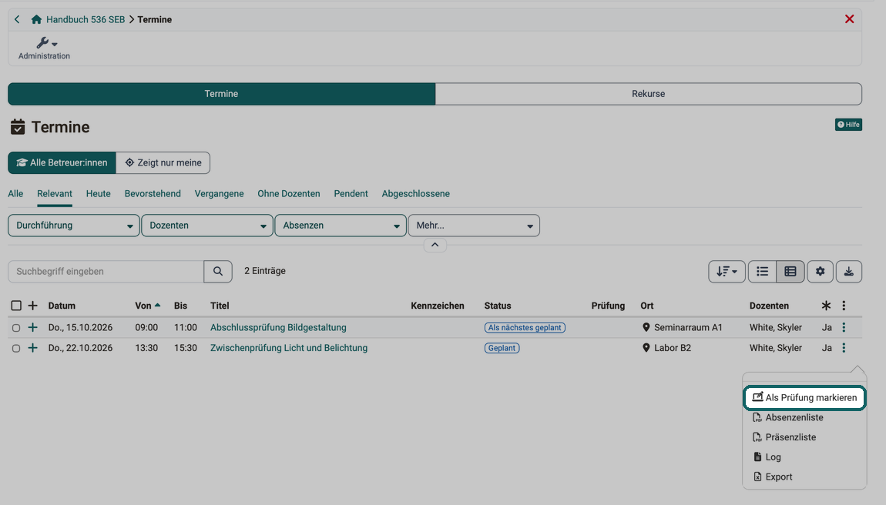
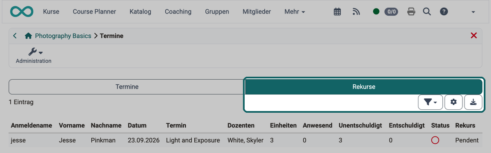
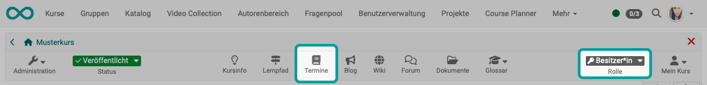

# Toolbar: Termine {: #toolbar_events}

Das Icon "Termine" erscheint in der Kurs-Toolbar, sobald im Kurs die "Termin- und Absenzenverwaltung" eingeschaltet ist: 
`Kurs > Administration > Einstellungen > Tab Durchführung`

Teilnehmer:innen, Betreuer:innen und Besitzer:innen des Kurses sehen das Icon. Was Sie nach dem Klick tun können, hängt von Ihrer Rolle ab.

## Aufruf als Teilnehmer:in {: #call_as_participant}

{ class="shadow lightbox" title="Kurs-Toolbar in der Sicht der Teilnehmer:innen" }

Als Teilnehmer:in sehen Sie hier Ihre eigenen Termine mit den Angaben, die für Sie gelten. Absenzen erfassen Sie hier nicht.

Die Liste lässt sich über die Tabs "Alle", "Relevant", "Heute", "Bevorstehend" und "Vergangene" eingrenzen. "Relevant" ist voreingestellt und zeigt die Termine ab heute. Mit den beiden Symbolen rechts über der Liste wechseln Sie zwischen Zeitansicht und Tabellenansicht.

{ class="shadow lightbox" title="Terminliste in der Sicht der Teilnehmer:innen · 2026.10.08" }

[Zum Seitenanfang ^](#toolbar_events)

---

## Aufruf als Betreuer:in {: #call_as_coach}

Als Betreuer:in öffnen Sie über das Icon "Termine" in der Kurs-Toolbar die Termine des Kurses. Dort erfassen Sie Absenzen und schliessen Termine ab. Neue Termine legen Sie hier nicht an. Unter "Rolle" sehen Sie, dass Sie den Kurs als Betreuer:in geöffnet haben.

{ class="shadow lightbox" title="Kurs-Toolbar in der Sicht der Betreuer:innen · 2026.10.08" }

In der Betreuer:innen-Rolle fehlt Ihnen im Unterschied zu Besitzer:innen der Tab "Teilnehmer:innen". Den Tab "Rekurse" sehen Sie nur, wenn in der System-Administration die [Rekursmöglichkeit gewährt](../../manual_admin/administration/Modules_Events_and_Absences.de.md#appeal_enabled) und die Option ["Dozenten dürfen Rekurse einsehen"](../../manual_admin/administration/Modules_Events_and_Absences.de.md#teacher_see_appeal) eingeschaltet ist. Bleibt nur der Tab "Termine", zeigt OpenOlat die Terminliste ohne Tab-Leiste an.

Über der Liste wählen Sie, welche Termine Sie sehen: "Alle Betreuer:innen" zeigt alle Termine des Kurses, "Zeigt nur meine" nur die Termine, bei denen Sie als Dozent:in eingetragen sind. Was beim ersten Öffnen gilt, legt die System-Administration mit der Einstellung [Anzeige in Kursen](../../manual_admin/administration/Modules_Events_and_Absences.de.md#display_in_courses) fest. Danach merkt sich OpenOlat Ihre Wahl.

{ class="shadow lightbox" title="Terminliste in der Sicht der Betreuer:innen" }

### Absenzen erfassen [:octicons-tag-16:{ title="ab Release 12.0 (OO-2637)" }](https://track.frentix.com/issue/OO-2637) {: #record_absences}

Ist einer Ihrer Termine vorbei und sind seine Absenzen noch nicht erfasst, steht über der Liste ein Hinweis mit der Anzahl dieser Termine. Ein Klick auf "Termin(e) mit offenen Abwesenheiten anzeigen" öffnet den Tab "Pendent", der nur diese Termine zeigt. Die Erfassung öffnen Sie mit einem Klick auf das Buch-Icon in der Zeile des Termins.

{ class="shadow lightbox" title="Terminliste in der Sicht der Betreuer:innen · 2026.10.08" }

Ein Termin ist in Einheiten unterteilt, zum Beispiel ein Vormittag von 8.00 bis 12.00 Uhr in 4 Einheiten zu je einer Stunde. Die Absenzen erfassen Sie pro Einheit: In den Spalten "E. 1", "E. 2" und so weiter setzen Sie ein Häkchen bei jeder Einheit, in der eine Person gefehlt hat. Mit "Entschuldigt" markieren Sie eine entschuldigte Absenz und begründen sie. In der Spalte "Kommentar" halten Sie pro Person eine Bemerkung zum ganzen Termin fest.

{ class="shadow lightbox" title="Formular zum Erfassen der Absenzen" }

Möchten Sie die Erfassung später fortsetzen, klicken Sie unten auf "Absenzen zwischenspeichern".

### Termine abschliessen {: #close_events}

Sind alle Absenzen eines Termins erfasst, schliessen Sie den Termin so ab:

1. Icon "Termine" in der Toolbar klicken
2. Tab "Termine" wählen
3. Beim betreffenden Termin in der Liste auf das Buch-Icon klicken (Absenz editieren)
  (nur möglich, wenn Termin bereits gestartet oder erledigt)
4. Button "Termine abschliessen" am unteren Rand der Liste klicken
5. Im Dialog "Termine abschliessen" das "Effektive Ende" prüfen, bei Bedarf eine "Bemerkung" eingeben und mit "Termine abschliessen" bestätigen

Das Feld "Effektive Einheiten" zeigt der Dialog nur, wenn die System-Administration die Option ["Termine partiell durchgeführt zulassen"](../../manual_admin/administration/Modules_Events_and_Absences.de.md#partially_done) eingeschaltet hat. Dort wählen Sie dann, wie viele Einheiten tatsächlich stattgefunden haben.

{ class="shadow lightbox" title="Dialog Termine abschliessen" }

### Termine absagen {: #cancel_events}

Als Betreuer:in können Sie einen laufenden Termin absagen, indem Sie

1. das Icon "Termine" in der Toolbar klicken
2. den Tab "Termine" wählen
3. Beim betreffenden Termin in der Liste auf das Buch-Icon klicken (Absenz editieren)
  (nur möglich, wenn Termin bereits gestartet)
4. den Button "Termine absagen" am unteren Rand der Liste klicken

### Menü am Zeilenende {: #lists_and_export}

Wer einen Termin vor- oder nachbereitet, braucht Listen zum Termin oder will ihn als Prüfung durchführen. Diese Aktionen liegen im 3-Punkte-Menü am Ende jeder Zeile. Als Betreuer:in finden Sie dort:

- **Als Prüfung markieren**: Der Termin wird im Prüfungsmodus durchgeführt, siehe [Termin als Prüfung markieren](#mark_event_as_exam). Ist der Termin bereits als Prüfung markiert, stehen an dieser Stelle "Prüfung editieren" und "Prüfung löschen".
- **Absenzenliste**: PDF-Liste der Teilnehmenden mit den erfassten Absenzen.
- **Präsenzliste**: PDF-Liste der Teilnehmenden zum Unterschreiben.
- **Log**: Excel-Datei mit den Änderungen an Termin und Absenzen.
- **Export**: Excel-Datei mit den Teilnehmenden des Termins und ihren Absenzen pro Einheit.

Bearbeiten, Kopieren und Löschen eines Termins stehen Betreuer:innen nicht zur Verfügung. Diese Einträge erhalten Kursbesitzer:innen: [3-Punkte-Menü der Kursbesitzer:innen](../learningresources/Events_and_absences.de.md#display_events)

Das folgende Bild zeigt das Menü bei einem Termin, der noch nicht als Prüfung markiert ist.

{ class="shadow lightbox" title="Terminliste in der Sicht der Betreuer:innen · 2026.10.02" }

### Termin als Prüfung markieren [:octicons-tag-16:{ title="ab Release 14.0 (OO-4045)" }](https://track.frentix.com/issue/OO-4045) {: #mark_event_as_exam}

Findet ein Termin als Prüfung statt, sperrt OpenOlat für die Teilnehmenden während der Prüfung alles ausser den gewählten Kursbausteinen, auf Wunsch zusammen mit dem Safe Exam Browser. Sie markieren den Termin dafür selbst, ohne die Prüfungsverwaltung des Kurses zu öffnen:

1. Icon "Termine" in der Toolbar klicken
2. Beim betreffenden Termin das 3-Punkte-Menü am Ende der Zeile öffnen
3. "Als Prüfung markieren" klicken
4. Im Dialog "Prüfung" die Kursbausteine der Prüfung wählen und bei Bedarf "Safe Exam Browser verwenden" einschalten
5. Speichern

Datum und Zeit sowie die Teilnehmenden übernimmt die Prüfung aus dem Termin. Vorlaufzeit, Nachlaufzeit und die erlaubten IP-Adressen kommen aus den [Vorgabewerten des Kurses](../learningresources/Course_Settings_Execution.de.md#event_as_exam). Welche Felder zum Safe Exam Browser der Dialog zeigt, bestimmt die System-Administration für alle Kurse: entweder das Feld "Konfiguration" mit den Konfigurationsvorlagen oder das Feld "Safe Exam Browser Keys". Den Dialog beschreibt die Seite zum Prüfungsmodus: [Prüfungsmodus aus einem Termin](../learningresources/Assessment_mode.de.md#exam_from_event)

Nach dem Speichern zeigt die Spalte "Prüfung" der Terminliste ein Symbol, und im 3-Punkte-Menü stehen "Prüfung editieren" und "Prüfung löschen".

**Wer einen Termin als Prüfung markieren kann:** In der Toolbar erhalten Betreuer:innen und die Dozent:innen eines Termins den Eintrag, ausserdem Kursbesitzer:innen. Klassenlehrer:innen, Kursplaner:innen und Personen mit dem Kursrecht "Kurseditor" markieren Termine über `Kurs > Administration > Termine und Absenzen`. Principals sehen die Terminliste, erhalten den Eintrag aber nicht.

#### Wenn "Als Prüfung markieren" fehlt {: #mark_as_exam_missing}

Der Eintrag erscheint nur, wenn alle folgenden Bedingungen erfüllt sind. Fehlt er, liegt die Ursache meist ausserhalb der Terminliste:

- **Der Prüfungsmodus ist systemweit eingeschaltet.** Ist er ausgeschaltet, fehlen auch "Prüfung editieren", "Prüfung löschen" und die Spalte "Prüfung". Den Schalter "Prüfungsmodus einschalten" setzen Administrator:innen in der System-Administration unter `Administration > e-Assessment > Prüfungsverwaltung`.
- **Im Kurs können Termine als Prüfung markiert werden.** Massgebend ist die Option "Termin kann als Prüfung markiert werden". Überschreibt der Kurs die Standardkonfiguration, gilt die [Einstellung des Kurses](../learningresources/Course_Settings_Execution.de.md#event_as_exam), die Kursbesitzer:innen ändern. Sonst gilt die [Vorgabe der System-Administration](../../manual_admin/administration/Modules_Events_and_Absences.de.md#event_as_exam) für alle Kurse.
- **Der Termin hat kein Online Meeting mit BigBlueButton oder Microsoft Teams.** Ein Sitzungs-Link zu einem anderen Anbieter verhindert den Eintrag nicht. Ist der Termin bereits als Prüfung markiert, spielt das Online Meeting keine Rolle mehr: "Prüfung editieren" und "Prüfung löschen" bleiben verfügbar.
- **Die Rolle erlaubt das Markieren.** Principals erhalten den Eintrag nie, siehe oben.

[Zum Seitenanfang ^](#toolbar_events)

### Rekurse {: #appeals}

Halten Teilnehmende eine erfasste Absenz für falsch, reichen sie einen Rekurs ein. Im Tab "Rekurse" sehen Sie diese Rekurse mit Person, Termin, Einheiten und dem Stand in der Spalte "Rekurs". Bei vielen Rekursen zeigen Sie mit dem Filter rechts über der Liste nur die pendenten, angenommenen oder abgelehnten an.

{ class="shadow lightbox" title="Tab Rekurse in der Sicht der Betreuer:innen · 2026.10.08" }

In der Regel bearbeiten Absenzenverwalter:innen die Rekurse, und zwar für alle Kurse gemeinsam in der [Absenzenverwaltung](../area_modules/Absence_Management.de.md).

[Zum Seitenanfang ^](#toolbar_events)

---

## Aufruf als Besitzer:in {: #call_as_owner}

Kursbesitzer:innen steht das Icon ebenfalls zur Verfügung. Bei ihnen öffnet sich die Ansicht zum Erfassen und Verwalten von Terminen und Absenzen, die weitestgehend der Ansicht unter `Kurs > Administration > Termine und Absenzen` entspricht. 
Siehe [Erfassung und Verwaltung der Absenzen in einem Kurs durch Kursbesitzer:innen >](../learningresources/Events_and_absences.de.md) 

Hier arbeiten Sie mit den Terminen selbst: Sie legen Termine an und erfassen Absenzen. Ob der Kurs überhaupt Termine hat und wie Absenzen zählen, legen Sie dagegen in den [Kurseinstellungen](../learningresources/Course_Settings_Execution.de.md#config_event_and_absence_management) fest.

{ class="shadow lightbox" title="Kurs-Toolbar in der Sicht der Kursbesitzer:innen" }

[Zum Seitenanfang ^](#toolbar_events)

---

## Weiterführende Informationen {: #further_information}

**Auf dieser Seite erwähnt** 
[Modul Termine und Absenzen >](../../manual_admin/administration/Modules_Events_and_Absences.de.md) 
[Termine und Absenzen (Kurs-Administration) >](../learningresources/Events_and_absences.de.md) 
[Kurseinstellungen - Tab Durchführung >](../learningresources/Course_Settings_Execution.de.md) 
[Prüfungsverwaltung: Prüfungsmodus >](../learningresources/Assessment_mode.de.md) 
[Absenzenverwaltung >](../area_modules/Absence_Management.de.md)

**Weiterführend** 
[Toolbar: Übersicht >](../learningresources/Toolbar.de.md) 
[Termine und Absenzen (Basiskonzept) >](../basic_concepts/Events_and_Absences.de.md) 
[Persönliche Werkzeuge: Absenzen >](../personal_menu/Absences.de.md) 
[Coaching - Übersicht >](../area_modules/Coaching.de.md)

[Zum Seitenanfang ^](#toolbar_events)

