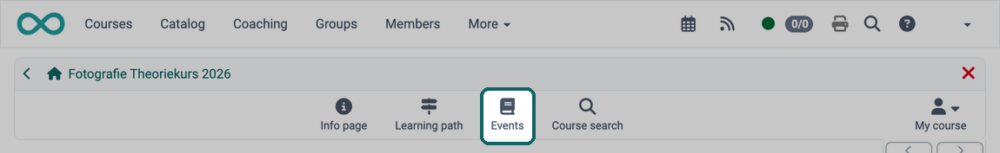
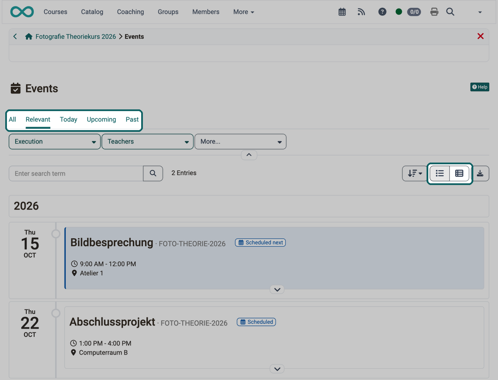
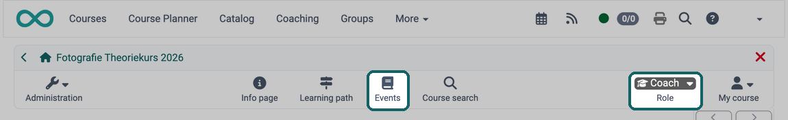
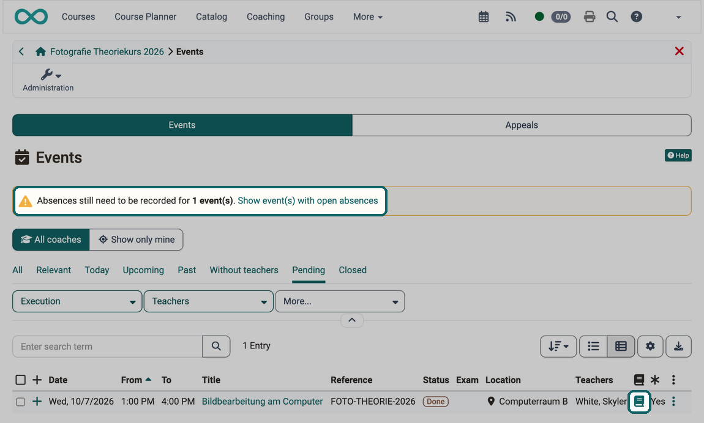
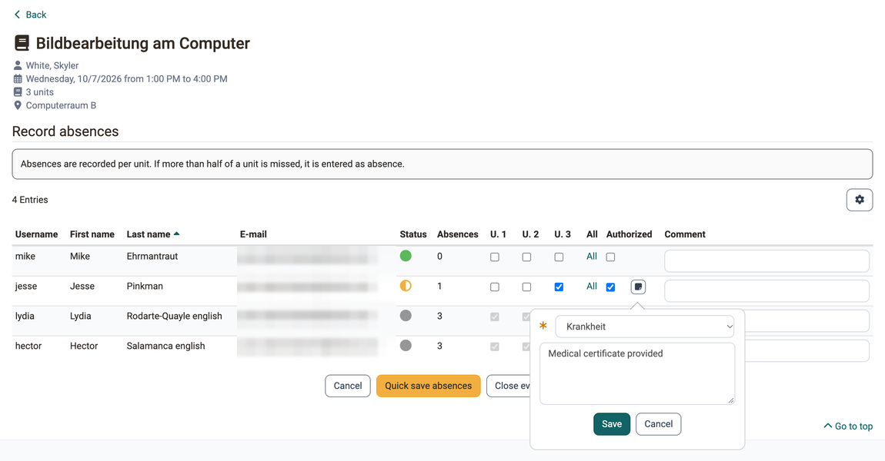
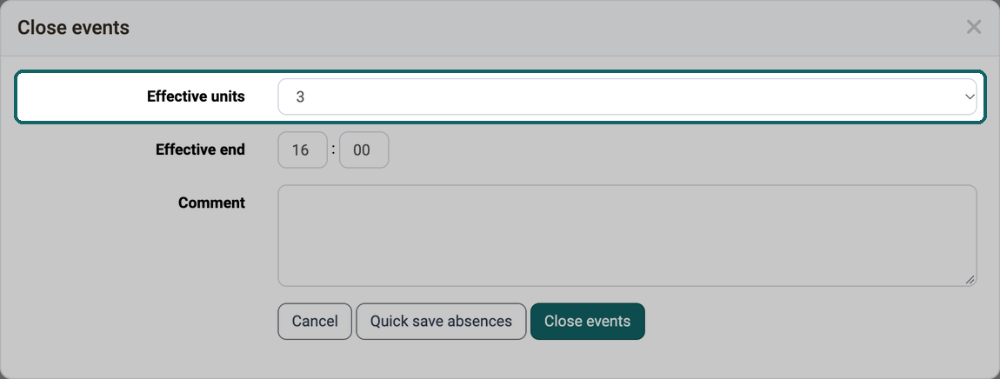
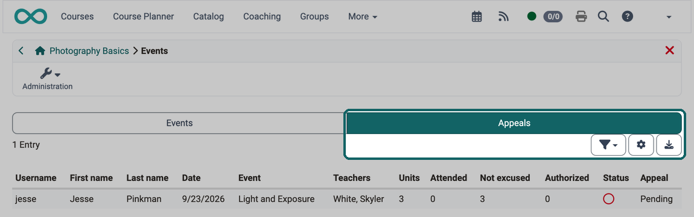
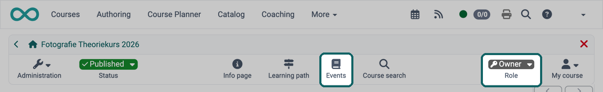

# Toolbar: Events {: #toolbar_events}

The "Events" icon appears in the course toolbar as soon as "Event & absence management" is switched on in the course: 
`Course > Administration > Settings > Tab Execution`

Participants, coaches and owners of the course see the icon. What you can do after the click depends on your role.

## Call as participant {: #call_as_participant}

{ class="shadow lightbox" title="Course toolbar in the participants' view · 2026.10.09" }

As a participant, you see your own events here with the details that apply to you. You do not record absences here.

You can narrow down the list with the tabs "All", "Relevant", "Today", "Upcoming" and "Past". "Relevant" is preselected and shows the events from today on. Use the two symbols above the list on the right to switch between the timeline and the table view.

{ class="shadow lightbox" title="Event list in the participants' view · 2026.10.08" }

[To the top of the page ^](#toolbar_events)

---

## Call as coach {: #call_as_coach}

As a coach, you open the events of the course via the "Events" icon in the course toolbar. There you record absences and close events. You do not create new events here. Under "Role" you see that you have opened the course as coach.

{ class="shadow lightbox" title="Course toolbar in the coaches' view · 2026.10.08" }

In the coach role, unlike owners, you do not have the tab "Participants". You only see the tab "Appeals" if the option ["Appeal absence enabled"](../../manual_admin/administration/Modules_Events_and_Absences.md#appeal_enabled) is switched on in the system administration and the option ["Teachers can see appeals"](../../manual_admin/administration/Modules_Events_and_Absences.md#teacher_see_appeal) as well. If only the tab "Events" remains, OpenOlat shows the event list without a tab bar.

Above the list you choose which events you see: "All coaches" shows all events of the course, "Show only mine" only the events where you are entered as teacher. What applies when you first open the list is set by the system administration with the setting [Default display in course](../../manual_admin/administration/Modules_Events_and_Absences.md#display_in_courses). After that, OpenOlat remembers your choice.

{ class="shadow lightbox" title="Event list in the coaches' view" }

### Record absences [:octicons-tag-16:{ title="from Release 12.0 (OO-2637)" }](https://track.frentix.com/issue/OO-2637) {: #record_absences}

If one of your events is over and its absences have not been recorded yet, a note with the number of these events appears above the list. A click on "Show event(s) with open absences" opens the tab "Pending", which shows only these events. You open the recording with a click on the book icon in the row of the event.

{ class="shadow lightbox" title="Event list in the coaches' view · 2026.10.08" }

An event is divided into units, for example a morning from 8:00 to 12:00 in 4 units of one hour each. You record the absences per unit: in the columns "U. 1", "U. 2" and so on, tick every unit in which a person was absent. With "Authorized" you mark an authorized absence and give a reason. In the column "Comment" you note a remark on the whole event for each person.

{ class="shadow lightbox" title="Form for recording absences · 2026.10.09" }

If you want to continue the recording later, click "Quick save absences" at the bottom.

### Close events {: #close_events}

Once all absences of an event are recorded, you close the event as follows:

1. Click the icon "Events" in the toolbar
2. Select the tab "Events"
3. Click the book icon for the relevant event in the list (edit absence)
    (only possible if the event has already started or is done)
4. Click the button "Close events" at the bottom of the list
5. In the dialog "Close events", check the "Effective end", enter a "Comment" if required and confirm with "Close events"

The dialog only shows the field "Effective units" if the system administration has switched on the option ["Allow holding partial events"](../../manual_admin/administration/Modules_Events_and_Absences.md#partially_done). There you then choose how many units actually took place.

{ class="shadow lightbox" title="Dialog Close events · 2026.10.09" }

### Cancel events {: #cancel_events}

As a coach, you can cancel a running event by

1. clicking the icon "Events" in the toolbar
2. selecting the tab "Events"
3. clicking the book icon for the relevant event in the list (edit absence)
    (only possible if the event has already started)
4. clicking the button "Cancel events" at the bottom of the list

### Menu at the end of the row {: #lists_and_export}

Anyone who prepares or follows up an event needs lists for the event or wants to hold it as an exam. These actions are in the 3-dot menu at the end of each row. As a coach, you find the following entries there:

- **Mark as exam**: The event is held in assessment mode, see [Mark an event as an exam](#mark_event_as_exam). If the event is already marked as an exam, this position shows "Edit exam" and "Delete exam".
- **Absence list**: PDF list of the participants with the recorded absences.
- **Attendance list**: PDF list of the participants for signing.
- **Log**: Excel file with the changes to the event and the absences.
- **Export**: Excel file with the participants of the event and their absences per unit.

Editing, copying and deleting an event are not available to coaches. Course owners have these entries: [3-dot menu of course owners](../learningresources/Events_and_absences.md#display_events)

The following image shows the menu for an event that is not yet marked as an exam.

{ class="shadow lightbox" title="Event list in the coaches' view · 2026.10.02" }

### Mark an event as an exam [:octicons-tag-16:{ title="from Release 14.0 (OO-4045)" }](https://track.frentix.com/issue/OO-4045) {: #mark_event_as_exam}

If an event takes place as an exam, OpenOlat locks everything except the selected course elements for the participants during the exam, optionally together with the Safe Exam Browser. You mark the event yourself for this, without opening the assessment management of the course:

1. Click the icon "Events" in the toolbar
2. Open the 3-dot menu at the end of the row of the relevant event
3. Click "Mark as exam"
4. In the dialog "Exam setting", select the course elements of the exam and, if required, switch on "Use Safe Exam Browser"
5. Save

The exam takes the date and time as well as the participants from the event. Prep time, follow-up and the admissible IP addresses come from the [default values of the course](../learningresources/Course_Settings_Execution.md#event_as_exam). Which Safe Exam Browser fields the dialog shows is determined by the system administration for all courses: either the field "Configuration" with the configuration templates or the field "Safe Exam Browser Keys". The page on the assessment mode describes the dialog: [Assessment mode from an event](../learningresources/Assessment_mode.md#exam_from_event)

After saving, the column "Exam" of the event list shows a symbol, and the 3-dot menu offers "Edit exam" and "Delete exam".

**Who can mark an event as an exam:** In the toolbar, coaches and the teachers of an event receive the entry, as do course owners. Master coaches, course planners and persons with the course right "Course editor" mark events via `Course > Administration > Events and Absences`. Principals see the event list but do not receive the entry.

#### If "Mark as exam" is missing {: #mark_as_exam_missing}

The entry only appears if all of the following conditions are met. If it is missing, the cause usually lies outside the event list:

- **The assessment mode is enabled system-wide.** If it is switched off, "Edit exam", "Delete exam" and the column "Exam" are missing as well. Administrators set the switch "Enable assessment mode" in the system administration under `Administration > e-Assessment > Assessment management`.
- **Events can be marked as an exam in the course.** The option "Event can be marked as an exam" is decisive. If the course overrides the default configuration, the [setting of the course](../learningresources/Course_Settings_Execution.md#event_as_exam) applies, which course owners change. Otherwise the [default of the system administration](../../manual_admin/administration/Modules_Events_and_Absences.md#event_as_exam) applies to all courses.
- **The event has no online meeting with BigBlueButton or Microsoft Teams.** A meeting link to another provider does not prevent the entry. If the event is already marked as an exam, the online meeting no longer matters: "Edit exam" and "Delete exam" remain available.
- **The role allows marking.** Principals never receive the entry, see above.

[To the top of the page ^](#toolbar_events)

### Appeals {: #appeals}

If participants consider a recorded absence to be wrong, they submit an appeal. In the tab "Appeals" you see these appeals with the person, the event, the units and the state in the column "Appeal". With many appeals, use the filter at the top right above the list to show only the pending, approved or rejected ones.

{ class="shadow lightbox" title="Tab Appeals in the coaches' view · 2026.10.08" }

As a rule, absence managers process the appeals, for all courses together in the [Absence management](../area_modules/Absence_Management.md).

[To the top of the page ^](#toolbar_events)

---

## Call as owner {: #call_as_owner}

Course owners also have access to the icon. For them, the view for recording and managing events and absences opens, which largely corresponds to the view under `Course > Administration > Events and Absences`. 
See [Recording and managing absences in a course by course owners >](../learningresources/Events_and_absences.md) 

Here you work with the events themselves: you create events and record absences. Whether the course has events at all and how absences count, you set in the [course settings](../learningresources/Course_Settings_Execution.md#config_event_and_absence_management) instead.

{ class="shadow lightbox" title="Course toolbar in the course owners' view · 2026.10.09" }

[To the top of the page ^](#toolbar_events)

---

## Further information {: #further_information}

**Mentioned on this page** 
[Module Events and Absences >](../../manual_admin/administration/Modules_Events_and_Absences.md) 
[Events and absences (course administration) >](../learningresources/Events_and_absences.md) 
[Course Settings - Tab Execution >](../learningresources/Course_Settings_Execution.md) 
[Assessment management: Assessment mode >](../learningresources/Assessment_mode.md) 
[Absence management >](../area_modules/Absence_Management.md)

**Further reading** 
[Toolbar: Overview >](../learningresources/Toolbar.md) 
[Events and Absences (basic concept) >](../basic_concepts/Events_and_Absences.md) 
[User tools: Absences >](../personal_menu/Absences.md) 
[Coaching - Overview >](../area_modules/Coaching.md)

[To the top of the page ^](#toolbar_events)
