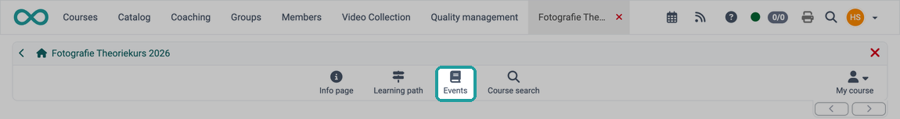
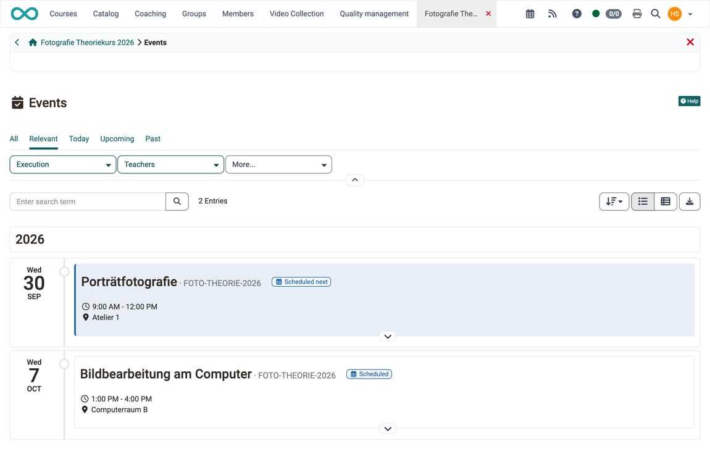
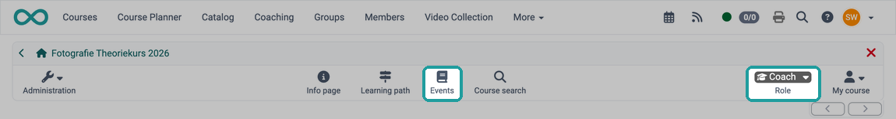
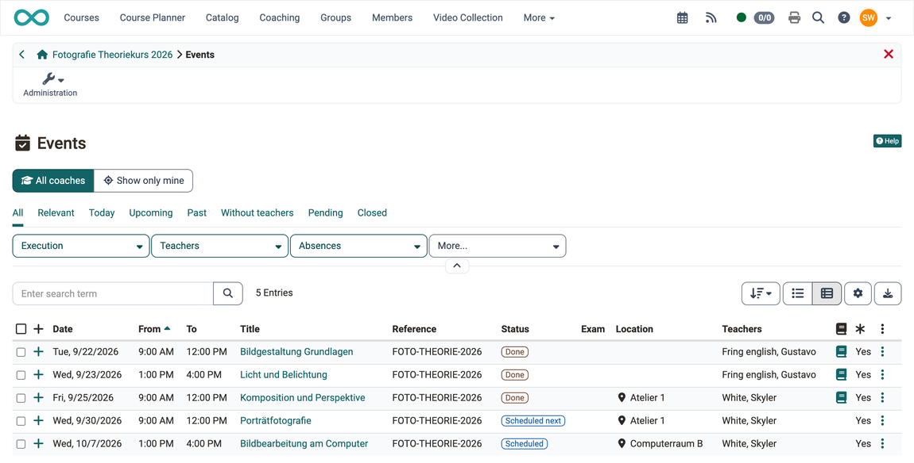
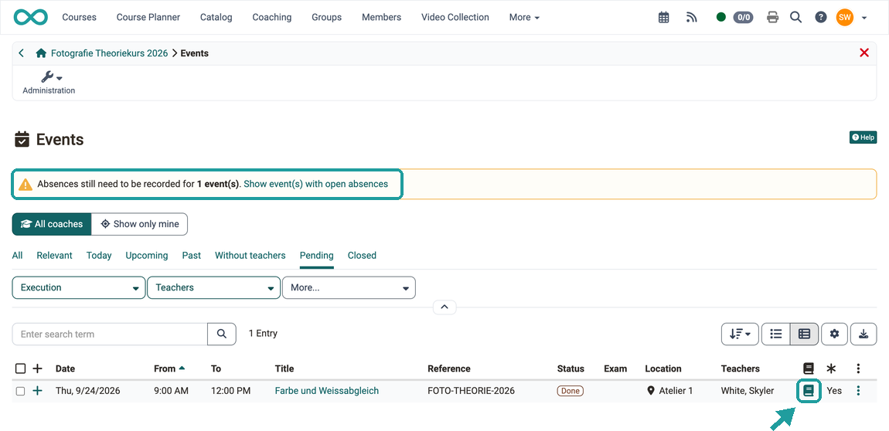
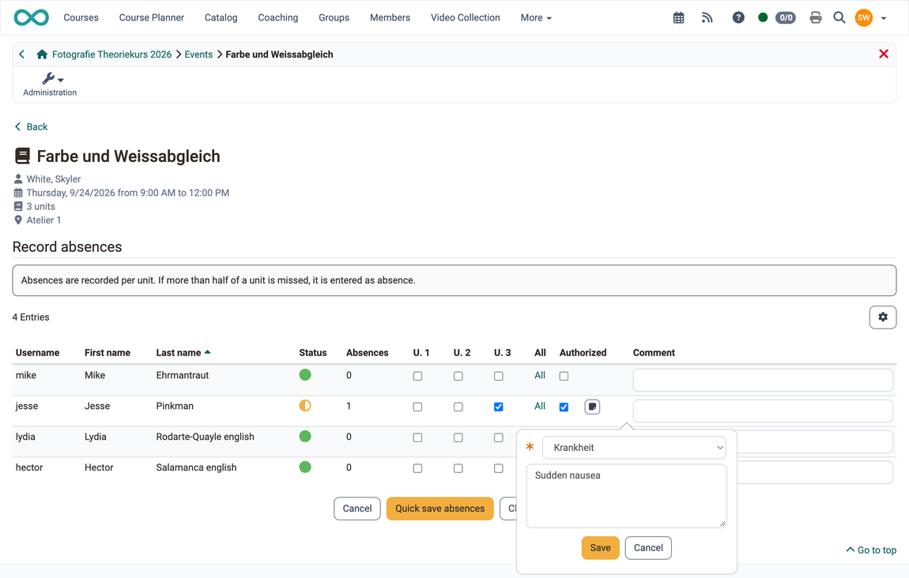
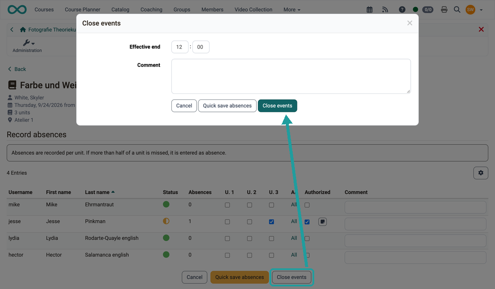
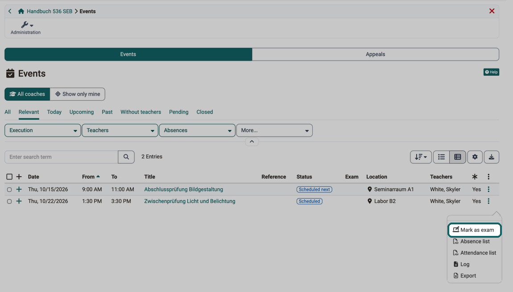
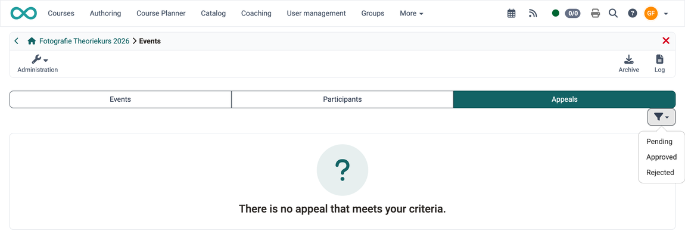
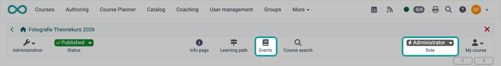

# Toolbar: Events {: #toolbar_events}

The "Events" icon is displayed automatically if events and absences are activated in the course. 
`Course > Administration > Settings > Execution`

It is then available to participants, coaches, and owners of the course. However, depending on the role and the associated rights, different options are displayed.

## Call as participant {: #call_as_participant}

{ class="shadow lightbox" title="Course toolbar in the participants' view" }

Participants only see the events for informational purposes. They only see their own events and only the information relevant to them. They cannot record absences here.

You can narrow down the list with the tabs "All", "Relevant", "Today", "Upcoming" and "Past". Use the two symbols above the list on the right to switch between the timeline and the table view.

{ class="shadow lightbox" title="Event list in the participants' view" }

[To the top of the page ^](#toolbar_events)

---

## Call as coach {: #call_as_coach}

When coaches click the "Events" icon in the toolbar, they can **record and manage** events and absences.

{ class="shadow lightbox" title="Course toolbar in the coaches' view" }

In the coach role, unlike owners, you do not have the tab "Participants". You only see the tab "Appeals" if the option ["Appeal absence enabled"](../../manual_admin/administration/Modules_Events_and_Absences.md#appeal_enabled) is switched on in the system administration and the option ["Teachers can see appeals"](../../manual_admin/administration/Modules_Events_and_Absences.md#teacher_see_appeal) as well. If only the tab "Events" remains, OpenOlat shows the event list without a tab bar.

{ class="shadow lightbox" title="Event list in the coaches' view" }

### Record absences [:octicons-tag-16:{ title="from Release 12.0 (OO-2637)" }](https://track.frentix.com/issue/OO-2637) {: #record_absences}

Once an event has ended, you as the coach are notified that absences still need to be recorded. You can use the link in the notification or click the book icon in the row of an event.

{ class="shadow lightbox" title="Event list in the coaches' view" }

The events are divided into units (e.g., an event from 8:00 a.m. to 12:00 p.m. in 4 units of one hour each). You can record the absences for each individual unit.
Indicate whether the absence is authorized and add a comment. There is also an additional comment field for the entire event for each participant.

{ class="shadow lightbox" title="Form for recording absences" }

If you want to complete the recording of absences at a later time, you can temporarily save your entries using the button at the bottom of the list.

### Close events {: #close_events}

Once the recording of absences can be finalized, proceed as follows:

1. Click the icon "Events" in the toolbar
2. Select the tab "Events"
3. Click the book icon for the relevant event in the list (edit absence)
    (only possible if the event has already started or is done)
4. Click the button "Close events" at the bottom of the list
5. A pop-up window opens where you can finalize the absence entry.

{ class="shadow lightbox" title="Dialog Close event" }

### Cancel events {: #cancel_events}

As a coach, you can cancel a running event by

1. clicking the icon "Events" in the toolbar
2. selecting the tab "Events"
3. clicking the book icon for the relevant event in the list (edit absence)
    (only possible if the event has already started)
4. clicking the button "Cancel events" at the bottom of the list

### Menu at the end of the row {: #lists_and_export}

Anyone who prepares or follows up an event needs lists for the event or wants to hold it as an exam. These actions are in the 3-dot menu at the end of each row. As a coach, you find the following entries there:

- **Mark as exam**: The event is held in assessment mode, see [Mark an event as an exam](#mark_event_as_exam). If the event is already marked as an exam, this position shows "Edit exam" and "Delete exam".
- **Absence list**: PDF list of the participants with the recorded absences.
- **Attendance list**: PDF list of the participants for signing.
- **Log**: Excel file with the changes to the event and the absences.
- **Export**: Excel file with the participants of the event and their absences per unit.

Editing, copying and deleting an event are not available to coaches. Course owners have these entries: [3-dot menu of course owners](../learningresources/Events_and_absences.md#display_events)

The following image shows the menu for an event that is not yet marked as an exam.

{ class="shadow lightbox" title="Event list in the coaches' view · 2026.10.02" }

### Mark an event as an exam [:octicons-tag-16:{ title="from Release 14.0 (OO-4045)" }](https://track.frentix.com/issue/OO-4045) {: #mark_event_as_exam}

If an event takes place as an exam, OpenOlat locks everything except the selected course elements for the participants during the exam, optionally together with the Safe Exam Browser. You mark the event yourself for this, without opening the assessment management of the course:

1. Click the icon "Events" in the toolbar
2. Open the 3-dot menu at the end of the row of the relevant event
3. Click "Mark as exam"
4. In the dialog "Exam setting", select the course elements of the exam and, if required, switch on "Use Safe Exam Browser"
5. Save

The exam takes the date and time as well as the participants from the event. Prep time, follow-up and the admissible IP addresses come from the [default values of the course](../learningresources/Course_Settings_Execution.md#event_as_exam). Which Safe Exam Browser fields the dialog shows is determined by the system administration for all courses: either the field "Configuration" with the configuration templates or the field "Safe Exam Browser Keys". The page on the assessment mode describes the dialog: [Assessment mode from an event](../learningresources/Assessment_mode.md#exam_from_event)

After saving, the column "Exam" of the event list shows a symbol, and the 3-dot menu offers "Edit exam" and "Delete exam".

**Who can mark an event as an exam:** In the toolbar, coaches and the teachers of an event receive the entry, as do course owners. Master coaches, course planners and persons with the course right "Course editor" mark events via `Course > Administration > Events and Absences`. Principals see the event list but do not receive the entry.

#### If "Mark as exam" is missing {: #mark_as_exam_missing}

The entry only appears if all of the following conditions are met. If it is missing, the cause usually lies outside the event list:

- **The assessment mode is enabled system-wide.** If it is switched off, "Edit exam", "Delete exam" and the column "Exam" are missing as well. Administrators set the switch "Enable assessment mode" in the system administration under `Administration > e-Assessment > Assessment management`.
- **Events can be marked as an exam in the course.** The option "Event can be marked as an exam" is decisive. If the course overrides the default configuration, the [setting of the course](../learningresources/Course_Settings_Execution.md#event_as_exam) applies, which course owners change. Otherwise the [default of the system administration](../../manual_admin/administration/Modules_Events_and_Absences.md#event_as_exam) applies to all courses.
- **The event has no online meeting with BigBlueButton or Microsoft Teams.** A meeting link to another provider does not prevent the entry. If the event is already marked as an exam, the online meeting no longer matters: "Edit exam" and "Delete exam" remain available.
- **The role allows marking.** Principals never receive the entry, see above.

[To the top of the page ^](#toolbar_events)

### Appeals {: #appeals}

If appeals have been submitted for absences that were possibly recorded incorrectly, you can get an overview under this tab. Filters help you when there is a large number of appeals.

{ class="shadow lightbox" title="Tab Appeals in the coaches' view" }

Appeals are usually processed by absence administrators, who can access all appeals across courses in the central [cross-course absence management](../area_modules/Absence_Management.md).

[To the top of the page ^](#toolbar_events)

---

## Call as owner {: #call_as_owner}

Course owners also have access to the icon. For them, the screen for **recording and managing** events and absences opens, which largely corresponds to the recording and management under `Course > Administration > Events and Absences`. 
See [Recording and managing absences in a course by course owners >](../learningresources/Events_and_absences.md) 

Technically speaking, runtime data is recorded in these two screens, in contrast to the [configuration](../learningresources/Course_Settings_Execution.md#config_event_and_absence_management).

{ class="shadow lightbox" title="Course toolbar in the course owners' view" }

[To the top of the page ^](#toolbar_events)

---

## Further information {: #further_information}

**Mentioned on this page** 
[Module Events and Absences >](../../manual_admin/administration/Modules_Events_and_Absences.md) 
[Events and absences (course administration) >](../learningresources/Events_and_absences.md) 
[Course Settings - Tab Execution >](../learningresources/Course_Settings_Execution.md) 
[Assessment management: Assessment mode >](../learningresources/Assessment_mode.md) 
[Absence management >](../area_modules/Absence_Management.md)

**Further reading** 
[Toolbar: Overview >](../learningresources/Toolbar.md) 
[Events and Absences (basic concept) >](../basic_concepts/Events_and_Absences.md) 
[Personal tools: Absences >](../personal_menu/Absences.md) 
[Coaching - Overview >](../area_modules/Coaching.md)

[To the top of the page ^](#toolbar_events)
