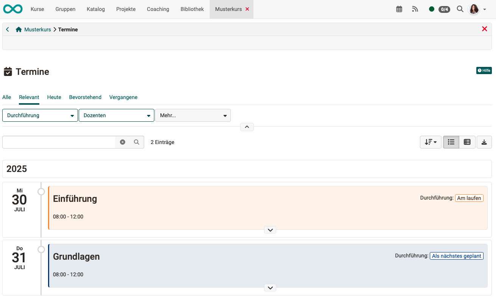
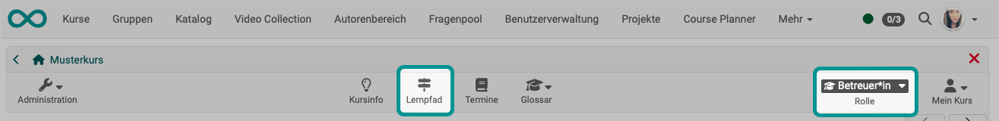
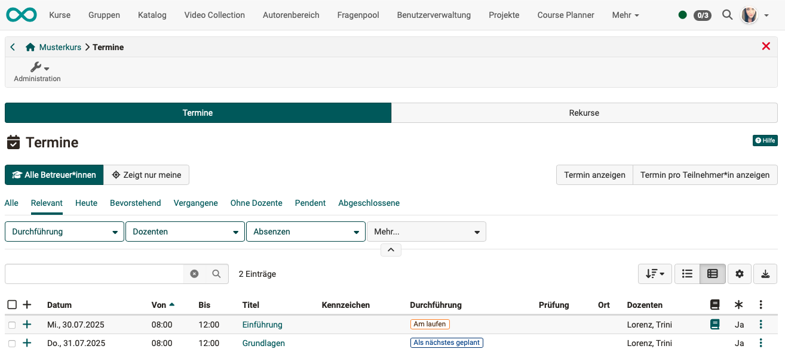
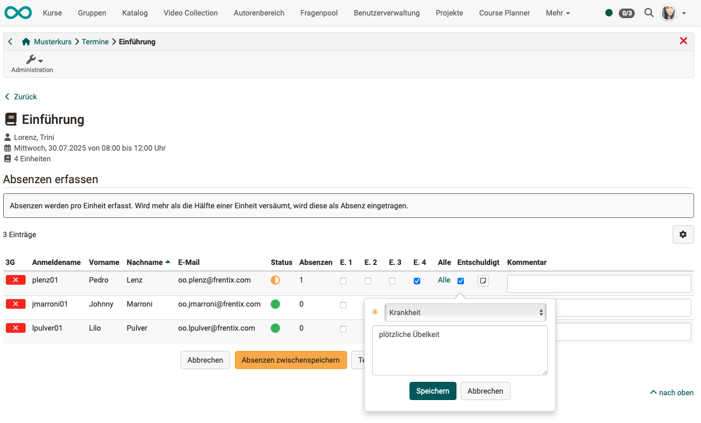
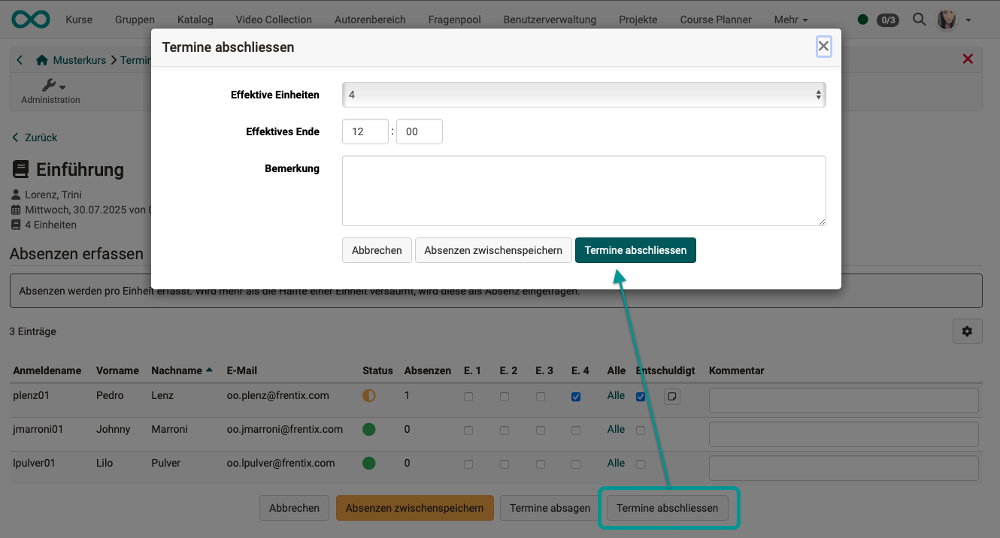
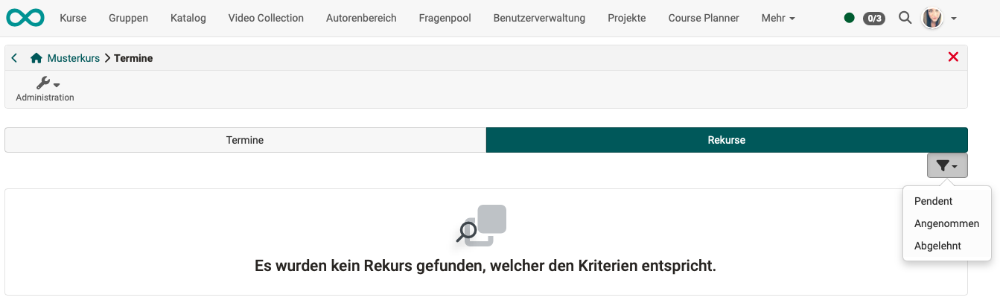

# Toolbar: Events {: #toolbar_events}

The "Dates" icon is automatically displayed if dates and absences have been activated in the course. 
(Administration > Settings > Implementation)

It is then available to participants, supervisors, and owners of the course. However, depending on the role and the associated rights, different options are displayed. 

## Call as participant {: #call_as_participant}

{ class="shadow lightbox"}

Participants will only see the dates for informational purposes.

{ class="shadow lightbox"}

[To the top of the page ^](#toolbar_events)

---

## Call es coach {: #call_as_coach}

When coaches click on the "Appointments" icon in the toolbar, they can **record and manage** appointments and absences. 

{ class="shadow lightbox"}

Unlike owners, only two tabs are displayed in the administrator role.

{ class="shadow lightbox"}

### Record absences {: #record_absences}

Once an appointment has ended, you as the caregiver will be notified that absences still need to be recorded. You can use the link in the notification or click on the book icon in the row of an appointment.

{ class="shadow lightbox"}

The appointments are divided into units (e.g., an appointment from 8:00 a.m. to 12:00 p.m. in 4 units of one hour each). You can record absences for each individual unit.
Indicate whether the absence is excused and add a comment. There is also an additional comment field for the entire appointment for each participant.

{ class="shadow lightbox"}

If you want to complete the recording of absences at a later time, you can temporarily save your entries using the button at the bottom of the screen.

### Close events {: #close_events}

Once you have finished recording absences, proceed as follows:

1. Click icon "Events" in the toolbar
2. Select tab "Events"
3. Click on the book icon for the relevant appointment in the list (edit absence)
    (only possible if appointment has already started or been completed)
4. Click on the button "Close event" at the bottom of the list
5. A pop-up window will open where you can finalize the absence entry.

{ class="shadow lightbox"}

### Cancel events {: #cancel_events}

As a coach, you can cancel a current event by

1. Click on the "Events" icon in the toolbar.
2. Select the tab "Events"
3. Click on the book icon for the relevant event in the list (edit absence)
    (only possible if event has already been started)
4. Click on the button "Cancel event" at the bottom of the list

### Create and export lists {: #lists_and_export}

Under the three dots at the end of a line, you will find options for creating lists and exporting the appointment as a zip file.
You can import events exported in this way back into OpenOlat [import](../learningresources/Events_and_absences.md#import_events).

{ class="shadow lightbox"}

### Appeals {: #appeals}

If appeals have been submitted for any incorrectly recorded absences, you can get an overview under this tab. Filters help you when there are a large number of appeals.

{ class="shadow lightbox" }

Appeals are usually processed by absence administrators, who can access all appeals across courses in the central [cross-course absence management system](../area_modules/Absence_Management.md).

[To the top of the page ^](#toolbar_events)

---

## Call as owner {: #call_as_owner}

Course owners also have access to the icon. This opens the screen for **recording and managing** appointments and absences, which is largely the same as the recording and management options under **Administration > Appointments and Absences**. 
See [Recording and managing absences in a course by course owners:](../learningresources/Events_and_absences.md) 

Technically speaking, runtime data is recorded in these two screens, in contrast to [configuration](../learningresources/Course_Settings_Execution.md#config_event_and_absence_management).

{ class="shadow lightbox"}

[To the top of the page ^](#toolbar_events)

---

## Further information {: #further_information}

[Toolbar Overview >](../learningresources/Toolbar.md) 

[Basic concept: Events and absences >](../basic_concepts/Events_and_Absences.md) 
[Activation and configuration of absence management by administrators >](../../manual_admin/administration/Modules_Events_and_Absences.md) 
[Configuring absence management in a course >](../learningresources/Course_Settings_Execution.md#config_event_and_absence_management) 
[Recording and managing absences in a course by course owners: >](../learningresources/Events_and_absences.md) 
[Personal absences >](../personal_menu/Absences.md) 
[Cross-course absence tracking in the coaching tool >](../area_modules/Coaching.md) 
[Cross-course absence management by absence administrators >](../area_modules/Absence_Management.de.md) 

[To the top of the page ^](#toolbar_events)

