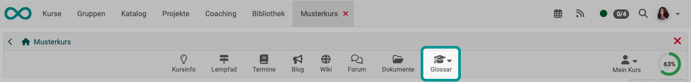
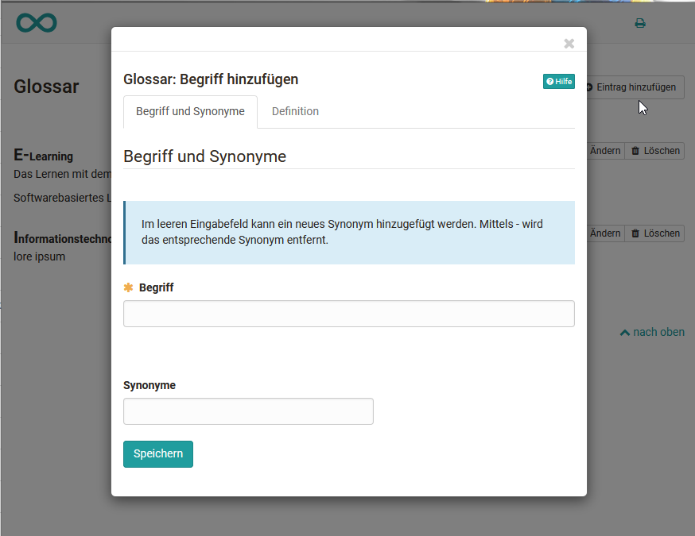

# Toolbar: Glossar {: #glossary}

!!! warning "Achtung"

    Dieser Artikel ist noch in Bearbeitung.

{ class="shadow lightbox"}

---

---

In einem Glossar können die Begriffe eines Kurses, eines Fachs bzw. einer Veranstaltung erklärt werden. Die Begriffe werden automatisch alphabetisch sortiert und können mit Klick auf den entsprechenden Startbuchstaben aufgerufen werden. 

Aktivieren Lehrende das Glossar im Tab „Toolbar“ der Kurseinstellungen muss das Glossar im nächsten Schritt noch ein konkretes Glossar ausgewählt oder erstellt werden. Wechseln Sie dafür in den Tab „Optionen“. Hier kann eine existierende Lernressource Glossar ausgewählt oder eine neue Lernressource Glossar erstellt werden. 

Ist ein Glossar definiert erscheint der Glossar-Link in der Toolbar und User können das gesamte Glossar in einem neuen Fenster öffnen oder Glossarbegriffe in Lerninhalten z.B. im Kursbaustein HTML-Seite, Seite oder Foren-Postings einblenden lassen.  

Als Kursbesitzer:in können Sie, wenn Sie das Glossar über den entsprechenden Link geöffnet haben, Einträge hinzufügen, unabhängig davon, ob Sie auch Besitzer:in der  Glossar Lernressource  sind. 

Geben Sie den Begriff, den Sie definieren möchten sowie eventuelle Synonyme ein. Wechseln Sie zum Tab „Definition“ und ergänzen Sie die Definition des Begriffs. Speichern Sie die Einträge und fertig. 

{ class="shadow lightbox" }

Alle Einträge können später natürlich auch wieder geändert oder gelöscht werden.  

!!! info "Hinweis"

    Bitte beachten Sie: Pro Kurs kann nur *ein* Glossar eingebunden werden.

Wenn Sie das Glossar nicht mehr verwenden oder ein anderes Glossar einbinden möchten, kann unter Kursadministration ->  Einstellungen -> "Optionen" die gewünschte Änderung vorgenommen werden.

!!! warning "Achtung"

    Die Besitzer:innen eines Kurses sind nicht automatisch auch Besitzer:innen der Glossar Lernressource. Kursbesitzer:innen haben nur solange Zugriff auf die Lernressource wie sie auch im Kurs eingebunden ist. Wird das Glossar entfernt können nur Personen, die auch Besiter:in des Glossars sind dieses wieder dem Kurs hinzufügen. 

Ob auch Kursteilnehmende Glossareinträge hinzufügen und bearbeiten können ist abhängig von den Einstellungen in der Lernressource Glossar. Standardmaessig können nur Kurs-Besitzer:innen Einträge im Glossar vornehmen. 

### So konfigurieren Sie ein Glossar mit weiteren Schreibrechten

Hierfür gibt es zwei Wege:

**Schreibrechte in der Lernressource Glossar definieren**

Wechseln Sie in den Autorenbereich und rufen Sie die gewünschte Lernressource "Glossar" auf. Hier kann im Tab "Schreibberechtigung" definiert werden ob nur die Besitzer:innen der Lernressource Beiträge erstellen und editieren dürfen oder ob auch Benutzer:innen das Recht erhalten. 

{ class="shadow lightbox" }

**Schreibrechte für bestimmte Personen des Kurses definieren**

Möchte man dagegen nur bestimmten Personen z.B. den Teilnehmenden *eines Kurses* das Schreibrecht für ein im Kurs eingebundenes Glossar vergeben, geht man einen anderen Weg. 

Gehen Sie in den Kurs in dem das Glossar eingebunden ist und wechseln Sie in die "[Mitgliederverwaltung](Members_management.de.md)". Erstellen Sie dort eine neue Gruppe und benennen Sie sie eindeutig z.B. "Rechtegruppe Glossar". Nachdem die Gruppe angelegt wurde werden Sie automatisch zur Gruppe geführt und können über die Gruppen Administration im Tab "Mitglieder" die gewünschten Personen, die Schreibrechte erhalten sollen als Teilnehmer:innen der Gruppe hinzufügen. 

Wechseln Sie wieder in die "Mitgliederverwaltung" des Kurses und wählen Sie dort den Bereich "Rechte. Dort können Sie für die Teilnehmenden der Rechtegruppe Glossar das Glossarwerkzeug aktivieren. 

Nun können die Personen der Gruppe Glossareinträge hinzufügen und ändern.

---

## Weiterführende Informationen {: #further_information}

[Toolbar Übersicht >](../learningresources/Toolbar.de.md) 

[Zum Seitenanfang ^](#glossary)

