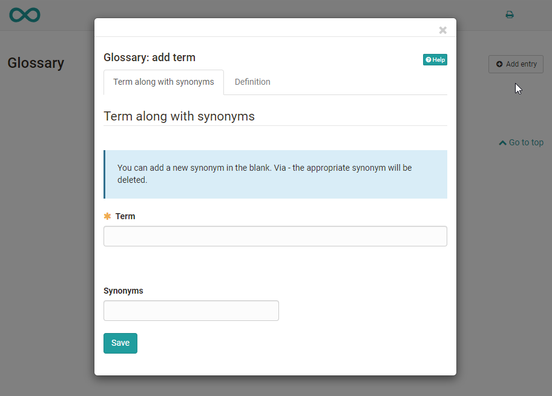

# Toolbar: Glossary {: #glossary}

!!! warning "Attention"

    This article is still under construction.

---

---

A glossary explains the terms of a course, subject or event to the participants. Glossaries are OpenOlat learning resources that can be used separately or integrated into a course.

The glossaries can be created as learning resources in the author area or directly in the course under "Settings-> Options".

Once a glossary has been integrated into a course, the link to the glossary will appear in the course toolbar. In order to make that glossary visible in the toolbar you have to activate the corresponding tool "Glossary" in the tab "Toolbar".

Enter the desired technical term under "Term". You can also add synonyms. For example, the term "Information Technology" can be supplemented with the synonym "IT". In the tab "Definition" you can then add the concrete definition of the term. Terms that have been entered can also be changed or deleted afterwards.

If you no longer use the glossary or want to integrate another glossary you can make the desired changes in the course or on the info page by using the drop-down menu "Course" via the menu item "[Options](../learningresources/Course_Settings.md)".

In the learning resource "Glossary" you can define in the tab "Write permission" if only owners of that learning resource are allowed to create and edit contributions or if users are granted that right as well. Owners of the learning resource "Glossary" can basically change and delete all glossary entries created. By default new glossary entries can only be made by course owners.

{ class="shadow lightbox" }

{ class="shadow lightbox" }

If you only want to give certain people, e.g. the participants of a course, the right to write a glossary, you take a different approach. For this purpose, the "[Members management](Members_management.md)" of a course is used. Create a new group there and add the desired persons as participants to that group. Then go to "Rights" in the course's "Members management" and check the box "Glossary tool" for course participants of that group. Now persons in that group can add and modify glossary entries.

!!! info "Note"

    Per course only one glossary is allowed.

!!! warning "Attention"

    The owners of a course are not automatically also owners of the learning resource.  If someone else has created a learning resource "Glossary" he/she will not automatically become owner of the course in which that resource has been integrated. In order to enable other course owners to make modifications you have to set up one of the described permissions or you have to enter the desired course owners as owners of the learning resource "Glossary".

Furthermore, the links to the "[course info](../learningresources/Set_up_info_page.md)" and to the "[Lectures](../learningresources/Lectures_Teacher_view.md)" appear in the course toolbar.  

