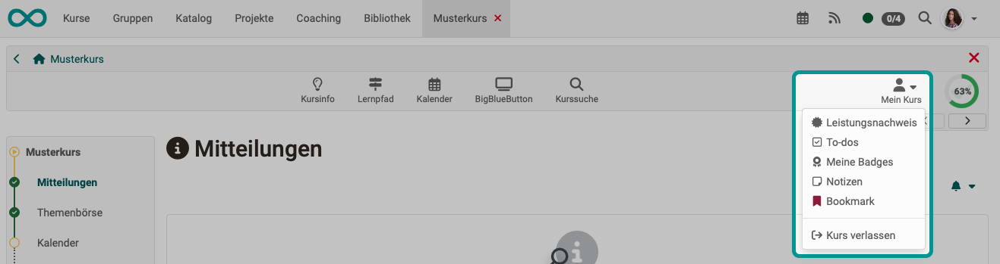

# Toolbar: Mein Kurs {: #my_course}

!!! warning "Attention"

    This article is still under construction.

Das Dropdown-Menü "Mein Kurs" der Toolbar bietet Zugriff auf personalisierte Bestandteile des Kurses.

{ class="shadow lightbox"}

Abhängig von der Konfiguration des Kurses werden eventuell nicht alle der folgenden Einträge angezeigt.

* Der [**Leistungsnachweis**](#evidence_of_achievement) zeigt die individuellen Bewertungen im Kurs an und gibt, sofern aktiviert, Zugriff auf das [Zertifikat](../learningresources/Course_Settings_Assessment.de.md#certificate) des Kurses.
* [**To-dos**](#to-dos) zeigt die aktuellen To-dos des Kurses an. 
* [**Notizen**](#notes): Hier können Sie kursspezifische Notizen eintragen, die nur Sie als Kursteilnehmer:in lesen können.
* [**Bookmark**](#bookmark): Aktivieren Sie den Bookmark, dann erscheint  der Kurs im Menü "Kurse" im Tab "Favoriten".
* [**Einwilligung**](#b): Sollte es im Kurs bestimmte Nutzungsbedingungen und/oder eine kursbezogene Datenschutzerklärung geben der Sie zugestimmt haben, können Sie diese hier einsehen und auch die Einwilligung widerrufen.  
* [**Gruppen**](#groups): Hier sehe Sie alle kursspezifischen Gruppen in denen Sie Mitglied sind und können direkt dorthin navigieren.
* Mit [**"Kurs verlassen"**](#leave_course):können Sie sich aus dem Kurs austragen.

## Leistungsnachweis {: #evidence_of_achievement}

Ein Leistungsnachweis ist eine Bestätigung einer erfolgten Leistungskontrolle und muss vom Kursbesitzer bzw. der Kursbesitzerin zunächst aktiviert werden. Lernende sehen dann die einzelnen absolvierten Assessmentbausteine des Kurses wie Tests, Aufgaben u.ä., ihre Punkte und weitere Informationen.

Falls für den Kurs ein [Zertifikat](../learningresources/Course_Settings_Assessment.de.md#certificate) ausgestellt wurde finden Sie dies ebenfalls unter "Leistungsnachweis" zum Herunterladen. Betreuende des Kurses können die Zertifikate im [Coaching-Tool](../area_modules/Coaching.de.md) einsehen.

Bei automatisch ausgestellten Zertifikaten nach erfolgreichem Abschluss eines Kurses erhalten Sie eine automatisch generierte Benachrichtigung per E-Mail.

!!! info "Info"

    Leistungsnachweise und Zertifikate aus all Ihren Kursen finden Sie im persönlichen Menü unter ["Leistungsnachweise"](../personal_menu/Personal_Tools.de.md#leistungsnachweise). 

[Zum Seitenanfang ^](#my_course)

---

## To-dos {: #to_dos}

Hier werden Teilnehmenden alle für Sie relevanten To-dos des Kurses angezeigt. 
Dabei kann es sich zum einen um automatisch generierte To-dos aus den [Aufgaben-Kursbausteinen](../learningresources/Course_Element_Task.de.md) handeln. Dann werden Sie aufgefordert einen bestimmten Schritt im Aufgabenablauf zu gehen, z.B. eine Aufgabe auszuwählen, eine Lösung abzugeben o.ä. 
Zum anderen können Lehrende allen Kursteilnehmenden oder auch nur einzelnen Personen bestimmte konkrete To-dos zuweisen. Lernende können den Status eines To-dos ändern, wenn sie die Aktion erledigt haben. 

Die To-dos dienen den Benutzer:innen als Orientierung, was aktuell im Kurs zu tun ist. 
Ein Überblick über alle persönlichen und kursbezogenen To-dos finden Benutzer:innen im Bereich ["Persönliche Werkzeuge"](../personal_menu/To-Dos.de.md). Dort können Sie auch eigene To-dos erstellen.

[Zum Seitenanfang ^](#my_course)

---

## Meine Badges {: #my_badges}

tbd

[Zum Seitenanfang ^](#my_course)

---

## Notizen {: #notes}

tbd

[Zum Seitenanfang ^](#my_course)

---

## Bookmark {: #bookmark}

tbd

[Zum Seitenanfang ^](#my_course)

---

## Einwilligung 

tbd

[Zum Seitenanfang ^](#my_course)

---

## Gruppen {: #groups}

tbd

[Zum Seitenanfang ^](#my_course)

---

## Kurs verlassen {: #leave_course}

Die "Kurs verlassen" Funktion beendet sofort Ihre Kurs- oder Gruppenmitgliedschaft, abhängig davon auf welche Weise Sie Zugriff zum Kurs haben. Im Anschluss daran haben Sie keinen Zugriff mehr auf den Kurs, bzw. Sie müssen den entsprechenden Kurs- oder Gruppenbetreuer kontaktieren um wieder Kurszugriff zu erhalten.

Die Möglichkeit, sich aus einem Kurs auszutragen muss zuvor von den Kursbesitzer*innen in den Einstellungen des Kurses im Tab "Freigabe" aktiviert worden sein und gilt nur für Kursteilnehmende, nicht für Betreuer:innen oder Besitzer:innen.

[Zum Seitenanfang ^](#my_course)

---

## Weiterführende Informationen {: #further_information}

[Toolbar Übersicht >](../learningresources/Toolbar.de.md) 

[Zum Seitenanfang ^](#my_course)
