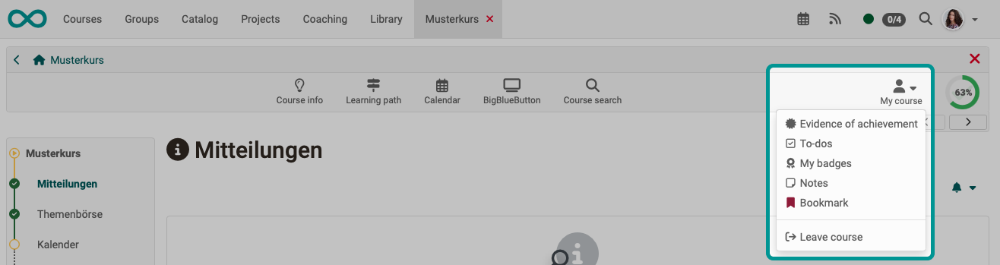

# Toolbar: My Course {: #my_course}

The "My Course" drop-down menu in the toolbar provides access to personalized components of the currently open course.

{ class="shadow lightbox"}

## How is the "My Course" icon displayed or removed from the toolbar?  {: #display_icon}

"My Course" is automatically displayed when **at least one** of the options it contains is available. 

Basically, "My Course" is only available to course participants, as personalized content is displayed.

[To the top of the page ^](#my_course)

---

## How do I add an entry to "My Course"? {: #display_entries}

The individual options under "My Course" appear **automatically** when the functions are available or have been activated.

**Example:** 
If "Performance record" is enabled in the course, this option will also appear under "My course"; otherwise, it will not. 

[To the top of the page ^](#my_course)

---

## What can be displayed in "My Course"?  {: #entries}

Under "My Course," you will find only tools that relate to your personal data in the current course. 
Depending on the configuration of the course, not all of the following entries may be displayed.

* The [**evidence of achievement**](#evidence_of_achievement) shows the individual assessments in the course and, if activated, gives access to the [certificate](../learningresources/Course_Settings_Assessment.md#certificate) for the course.
* [**To-dos**](#to-dos) displays the current to-dos for the course.
* [**My Badges**](#my_badges) displays your badges.
* [**Notes**](#notes): Here you can enter course-specific notes that only you as a course participant can read.
* [**Bookmark**](#bookmark): Activate the bookmark, and the course will appear in the "Courses" menu in the "Favorites" tab.
* [**Consent**](#terms_of_use): If there are specific terms of use and/or a course-related privacy policy that you have agreed to, you can view them here and also revoke your consent.  
* [**Groups**](#groups): Here you can see all course-specific groups you are a member of and navigate directly to them.
* With [**"Leave course"**](#leave_course):you can unsubscribe from the course.

[To the top of the page ^](#my_course)

---

### Evidence of achievement {: #evidence_of_achievement}

A performance record is a confirmation of a completed performance assessment and must first be activated by the course owner. Learners can then see the individual assessment modules of the course that they have completed, such as tests, assignments, etc., their scores, and further information.

If a [certificate](../learningresources/Course_Settings_Assessment.md#certificate) has been issued for the course, you will also find it under "Performance record" for download. Course coaches can view the certificates in the [Coaching Tool](../area_modules/Coaching.md).

For certificates issued automatically after successful completion of a course, you will receive an automatically generated notification by email.

!!! info "Info"

    You can find transcripts and certificates from **all** your courses in the personal menu under [“Transcripts”](../personal_menu/Personal_Tools.md#transcripts). 

[More about evidence of achievement >](../personal_menu/Evidence_of_Achievements.md)

[To the top of the page ^](#my_course)

---

### To dos  {: #to-dos}

Here, participants can see all the relevant to-dos for the course. 
These may be automatically generated to-dos from the [task course elements](../learningresources/Course_Element_Task.md). You will then be asked to take a specific step in the task process, e.g., select a task, submit a solution, or similar. 
On the other hand, teachers can assign specific tasks to all course participants or just to individual people. Learners can change the status of a task once they have completed the action. 

The to-dos serve as guidance for users on what currently needs to be done in the course. 
Users can find an overview of all personal and course-related to-dos in the ["Personal Tools"] section. There, they can also create their own to-dos.

[More about To dos >](../basic_concepts/To_Dos_Basics.md) 
[More about To dos in a course >](../learningresources/Course_todos.md)

[To the top of the page ^](#my_course)

---

### My Badges {: #my_badges}

If badges are enabled, access to all badges you have earned in this course will automatically be displayed in "My Course."

[More about badges >](../personal_menu/OpenBadges.md)

### Notes {: #notes}

You can take notes in every course. Under this item, you can see which notes you have taken and edit and print them.

[More about notes >](../personal_menu/Notes.md)

[To the top of the page ^](#my_course)

---

### Bookmark {: #bookmark}

Activate the bookmark, and these courses will appear in the "Courses" menu in the "Favorites" tab.

[To the top of the page ^](#my_course)

---

### Terms of use {: #terms_of_use}

If the course requires consent to the terms of use and/or privacy policy at the beginning, you can read them here at any time. 

[More about terms of use >](../basic_concepts/Terms_Of_Use.md)

[To the top of the page ^](#my_course)

---

### Groups {: #groups}

If you are participating in this course as a group member (group participant or group coach), this link will take you directly to your OpenOlat group.

[To the top of the page ^](#my_course)

---

### Leave course {: #leave_course}

The "Leave course" function immediately terminates your course or group membership, depending on how you access the course. After that, you will no longer have access to the course, or you will need to contact the relevant course or group administrator to regain access to the course.

The option to unsubscribe from a course must first be enabled by the course owner in the course settings under the "Sharing" tab and only applies to course participants, not to administrators or owners.

[To the top of the page ^](#my_course)

---

## Further information {: #further_information}

[Toolbar Overview >](../learningresources/Toolbar.md) 

[To the top of the page ^](#my_course)
