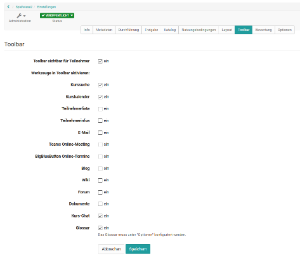
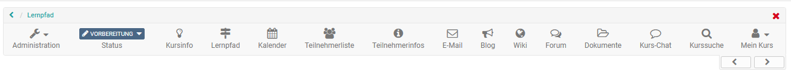
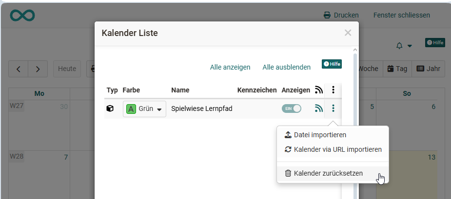
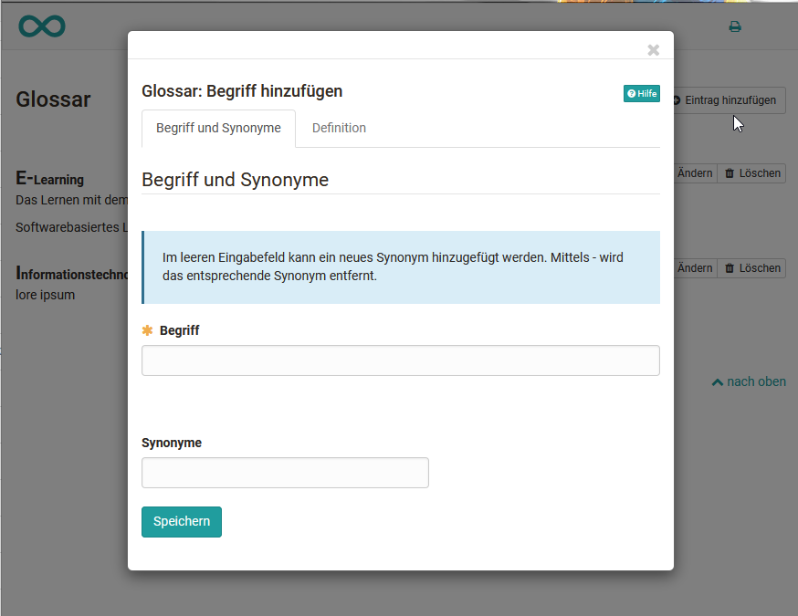
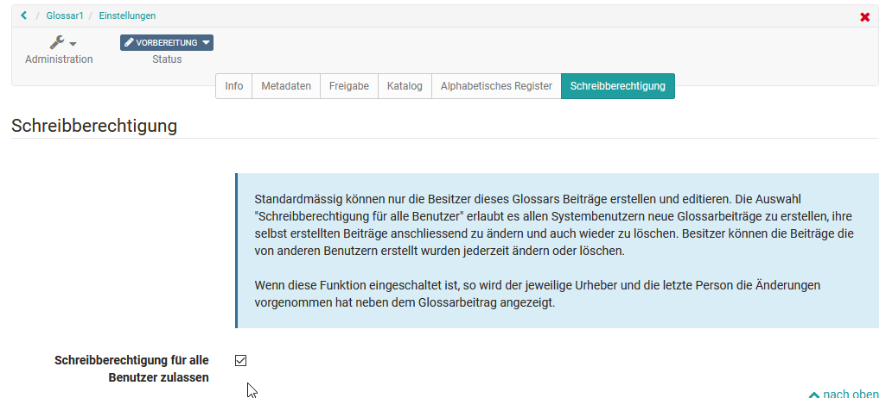

# Einsatz weiterer Kursfunktionen der Toolbar

Kursbesitzer:innen können in der Kurs "Administration" unter "Einstellungen" zusätzlich bestimmte Werkzeuge der Toolbar aktivieren. 

{ class="shadow lightbox" }

Aktivierte Werkzeuge werden anschliessend direkt in der Toolbar  unabhängig von der Kursstruktur angezeigt. 

{ class="shadow lightbox" }

## Kurssuche

Neben der Volltextsuche für das gesamte OpenOlat kann pro Kurs eine Kurssuche aktiviert werden. In dieser Suche werden folgende Elemente gefunden:

* Titel, Kurztitel und Beschreibung aller Kursbausteine
* Inhalt von HTML-Seiten
* Dokumente in Ordnern
* Titel Inhalt von Forumsbeiträgen
* Titel und Inhalt von Mitteilungen
* Wiki Beiträge

:octicons-device-camera-video-24: **Video-Einführung**: [Suchfunktion](<https://www.youtube.com/embed/GlUCyVl11ic>){:target="_blank”}

## Kurskalender

Ruft man den Kalender auf öffnet er sich in einem neuen Fenster. Pro Kurs kann grundsätzlich nur ein Kalender aktiviert werden. Selbst wenn man weitere Kalender über den Kursbaustein Kalender hinzufügt handelt es sich um denselben Kalender. 

Neue Termine lassen sich einfach durch einen Klick auf das gewünschte Datum erstellen. Anschliessend können Titel, Beschreibung, Beginn und Ende, Ort, Wiederholungen sowie die Sichtbarkeit festgelegt werden. Der Termin erscheint danach im Kalender bzw. in allen Instanzen des Kurskalenders.

Über einen Klick auf den Termin und die Option „Editieren“ lassen sich Termine anpassen. Hier können auch Verlinkungen zu Kursbausteinen oder externen Webseiten gesetzt oder der Termin gelöscht werden.

Sollen alle Termine eines Kurskalenders gelöscht werden, kann dies über das Zahnradsymbol im Kalenderbereich mit der Option „Kalender zurücksetzen“ erfolgen.

{ class="shadow lightbox" }

Standardmässig können nur Kursbesitzer:innen Termine im Kalender erstellen. Teilnehmende haben lediglich Leserechte und können weder neue Termine anlegen noch bestehende bearbeiten. Sollen Teilnehmende selbst Termine erstellen dürfen, kann statt des Kalenders in der Toolbar ein Kursbaustein „Kalender“ hinzugefügt und entsprechend konfiguriert werden.

Kurskalender werden automatisch in den [persönlichen Kalender](../personal_menu/Calendar.de.md) der Kursmitglieder übertragen. So können alle Termine auch direkt über den persönlichen OpenOlat Kalender aufgerufen werden. Gleiches gilt für Gruppenkalender. Bei Gruppenkalendern kann in der Gruppenadministration eingestellt werden welche Schreib- bzw. Leserechte die Mitglieder erhalten.

## Liste der Teilnehmenden

Hier können alle Kursbesitzer:innen, Betreuer:innen und Teilnehmenden eines Kurses zentral angezeigt werden. Kursteilnehmende können über die Teilnehmerliste E-Mails an bestimmte Personen, auch an einzelne Kursmitglieder, verschicken. Anders als im [Kursbaustein "Teilnehmerliste"](../learningresources/Course_Element_Participant_List.de.md) können hier jedoch keine weiteren Konfigurationen vorgenommen werden.  

## Mitteilungen

Das Tool entspricht dem [Kursbaustein "Mitteilungen"](../learningresources/Course_Element_Notifications.de.md). Teilnehmende können das Tool abonnieren und somit benachrichtigt werden, wenn es neue Informationen gibt. Anders als im Kursbaustein können hier jedoch keine weiteren Konfigurationen vorgenommen werden.  

## E-Mail

Hier können Kursbesitzer:innen konfigurieren an wen die Lernenden über diesen Link Mails verschicken können. Zur Auswahl stehen die drei Kursrollen "Kursbesitzer:innen", "Betreuer:innen" und "Teilnehmer:innen". Eine weitere Differenzierung ist nicht möglich. Falls Sie differenziertere Einstellungen für den Versand an Kursmitglieder benötigen, sollten Sie den [Kursbaustein "E-Mail"](../learningresources/Course_Element_EMail.de.md) oder den [Kursbaustein "Teilnehmerliste"](../learningresources/Course_Element_Participant_List.de.md) nutzen.

## Teams Online-Meeting

Ähnlich wie im [Kursbaustein Microsoft](../learningresources/Course_Element_Microsoft_Teams.de.md) Teams können hier Räume für synchrone Meetings mit Teams angelegt werden.

## BigBlueButton Online-Termine

Ähnlich wie im [Kursbaustein BigBlueButton](../learningresources/Course_Element_BigBlueButton.de.md) können hier Räume für synchrone Meetings angelegt werden.

## Blog

Hier können Sie einen [Blog (Lernressource)](../learningresources/Blog.de.md) erstellen oder importieren. Die Lernenden können den zentralen Kursblog abonnieren.

## Wiki

Hier können Sie ein [Wiki (Lernressource)](../learningresources/Wiki.de.md) erstellen oder importieren. Die Lernenden können das zentrale Wiki abonnieren.

## Forum

Ähnlich wie im [Kursbaustein Forum](../learningresources/Course_Element_Forum.de.md) kann hier ein Forum aktiviert werden. Kursmitglieder können das Forum wie gewohnt abonnieren. Differenzierte Einstellungen wie beim Kursbaustein "Forum" sind hier allerdings nicht möglich.

!!! Tip "Tipp"

    Verwenden Sie das Forum in der Toolbar, wenn in Ihrem Kurs die asynchrone Diskussion nicht im Vordergrund steht und Ihnen *ein* Forum für den gesamten Kurs ausreicht.
    
    Handelt es sich bei Ihrem Kurs jedoch um einen Kurs mit erhöhen asynchroner Diskussion und vielen Beiträgen, sollten Sie lieber mehrere Kursbausteine Forum verwenden.  

## Dokumente

Über diesen Link können Kursbesitzer:innen und Betreuer:innen zentral Dokumente zum Download bereitstellen. Lernende können die Dateien herunterladen, Benachrichtigungen bei neuen Dokumenten abonnieren und die Dateien bei Bedarf per E-Mail versenden. Die Konfigurationsmöglichkeiten sind aber nicht so umfangreich wie beim [Kursbaustein "Ordner"](../learningresources/Course_Element_Folder.md).

## Kurs-Chat

Der einfache Chat eignet sich für kurze, synchrone Austausche. Kursmitglieder können hier live mit anderen Teilnehmenden und Dozierenden kommunizieren, solange alle gleichzeitig eingeloggt sind.

Beim Aufruf des Chats kann jedes Kursmitglied wählen, ob es mit dem eigenen Namen oder anonym am Chat teilnimmt (Standard: anonym). Die Größe des Chatfensters lässt sich flexibel anpassen. Chat-Verläufe sind bis zu einem Monat einsehbar, der gewünschte Zeitraum kann oberhalb des Textfelds ausgewählt werden.

**Tipp** für die mobile Nutzung: Teilweise ist die Verwendung des Hochformats sinnvoller als das Querformat.

## Glossar {: #glossary}

In einem Glossar können die Begriffe eines Kurses, eines Fachs bzw. einer Veranstaltung erklärt werden. Die Begriffe werden automatisch alphabetisch sortiert und können mit Klick auf den entsprechenden Startbuchstaben aufgerufen werden. 

Aktivieren Lehrende das Glossar im Tab „Toolbar“ der Kurseinstellungen muss das Glossar im nächsten Schritt noch ein konkretes Glossar ausgewählt oder erstellt werden. Wechseln Sie dafür in den Tab „Optionen“. Hier kann eine existierende Lernressource Glossar ausgewählt oder eine neue Lernressource Glossar erstellt werden. 

Ist ein Glossar definiert erscheint der Glossar-Link in der Toolbar und User können das gesamte Glossar in einem neuen Fenster öffnen oder Glossarbegriffe in Lerninhalten z.B. im Kursbaustein HTML-Seite, Seite oder Foren-Postings einblenden lassen.  

Als Kursbesitzer:in können Sie, wenn Sie das Glossar über den entsprechenden Link geöffnet haben, Einträge hinzufügen, unabhängig davon, ob Sie auch Besitzer:in der  Glossar Lernressource  sind. 

Geben Sie den Begriff, den Sie definieren möchten sowie eventuelle Synonyme ein. Wechseln Sie zum Tab „Definition“ und ergänzen Sie die Definition des Begriffs. Speichern Sie die Einträge und fertig. 

{ class="shadow lightbox" }

Alle Einträge können später natürlich auch wieder geändert oder gelöscht werden.  

!!! info "Hinweis"

    Bitte beachten Sie: Pro Kurs kann nur *ein* Glossar eingebunden werden.

Wenn Sie das Glossar nicht mehr verwenden oder ein anderes Glossar einbinden möchten, kann unter Kursadministration ->  Einstellungen -> "Optionen" die gewünschte Änderung vorgenommen werden.

!!! warning "Achtung"

    Die Besitzer:innen eines Kurses sind nicht automatisch auch Besitzer:innen der Glossar Lernressource. Kursbesitzer:innen haben nur solange Zugriff auf die Lernressource wie sie auch im Kurs eingebunden ist. Wird das Glossar entfernt können nur Personen, die auch Besiter:in des Glossars sind dieses wieder dem Kurs hinzufügen. 

Ob auch Kursteilnehmende Glossareinträge hinzufügen und bearbeiten können ist abhängig von den Einstellungen in der Lernressource Glossar. Standardmaessig können nur Kurs-Besitzer:innen Einträge im Glossar vornehmen. 

### So konfigurieren Sie ein Glossar mit weiteren Schreibrechten

Hierfür gibt es zwei Wege:

**Schreibrechte in der Lernressource Glossar definieren**

Wechseln Sie in den Autorenbereich und rufen Sie die gewünschte Lernressource "Glossar" auf. Hier kann im Tab "Schreibberechtigung" definiert werden ob nur die Besitzer:innen der Lernressource Beiträge erstellen und editieren dürfen oder ob auch Benutzer:innen das Recht erhalten. 

{ class="shadow lightbox" }

**Schreibrechte für bestimmte Personen des Kurses definieren**

Möchte man dagegen nur bestimmten Personen z.B. den Teilnehmenden *eines Kurses* das Schreibrecht für ein im Kurs eingebundenes Glossar vergeben, geht man einen anderen Weg. 

Gehen Sie in den Kurs in dem das Glossar eingebunden ist und wechseln Sie in die "[Mitgliederverwaltung](Members_management.de.md)". Erstellen Sie dort eine neue Gruppe und benennen Sie sie eindeutig z.B. "Rechtegruppe Glossar". Nachdem die Gruppe angelegt wurde werden Sie automatisch zur Gruppe geführt und können über die Gruppen Administration im Tab "Mitglieder" die gewünschten Personen, die Schreibrechte erhalten sollen als Teilnehmer:innen der Gruppe hinzufügen. 

Wechseln Sie wieder in die "Mitgliederverwaltung" des Kurses und wählen Sie dort den Bereich "Rechte. Dort können Sie für die Teilnehmenden der Rechtegruppe Glossar das Glossarwerkzeug aktivieren. 

Nun können die Personen der Gruppe Glossareinträge hinzufügen und ändern.

