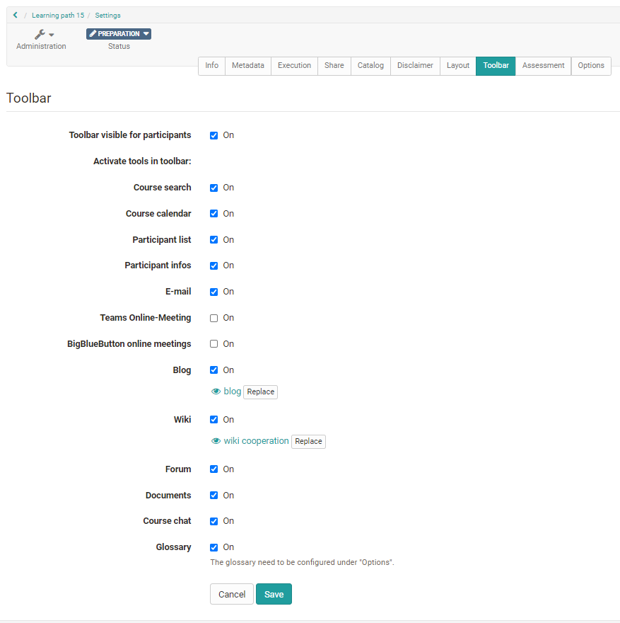
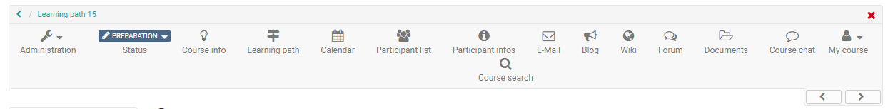
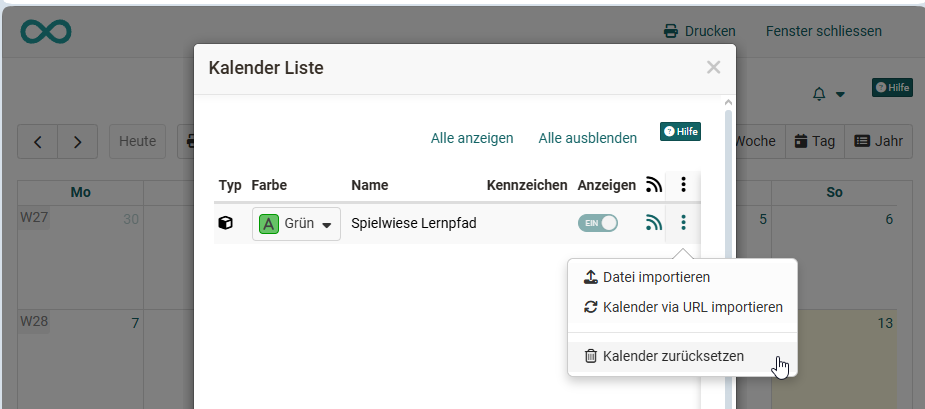
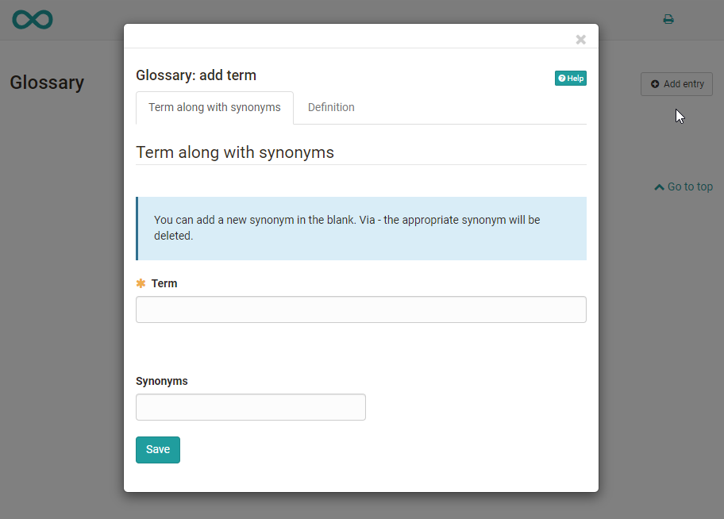
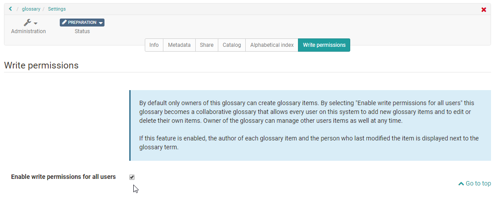

# Using Additional Course Features

Course owners can additionally activate certain toolbar tools under: 
`Course > Administration > Settings`

{ class="shadow lightbox" }

Activated tools are then displayed directly in the toolbar, independent of the course structure.

{ class="shadow lightbox" }

## Course Search [:octicons-tag-16:{ title="from Release 11.3 (OO-2581)" }](https://track.frentix.com/issue/OO-2581){:target="_blank"}

In addition to the full text search for all of OpenOlat, a course search can be activated per course. This search finds the following elements:

* Title, short title and description of all course elements
* Content of HTML pages
* Documents in folders
* Title and content of forum entries
* Title and content of notifications
* Wiki entries

:octicons-device-camera-video-24: **Video introduction (German)**: [Search function](<https://www.youtube.com/embed/GlUCyVl11ic>){:target="_blank"}

## Course Calendar

When you open the calendar, it opens in a new window. Only one calendar can be activated per course. Even if you add further calendars via the course element Calendar, it is still the same calendar.

New appointments can be created simply by clicking on the desired date. You can then set the title, description, start and end, location, repetitions and visibility. The appointment then appears in the calendar, or in all instances of the course calendar.

You can adjust appointments by clicking on the appointment and selecting the "Edit" option. Here you can also set links to course elements or external websites, or delete the appointment.

If you want to delete all appointments of a course calendar, you can do this via the gear icon in the calendar area with the option "Reset calendar".

{ class="shadow lightbox" }

By default, only course owners can create appointments in the calendar. Participants only have read rights and can neither create new appointments nor edit existing ones. If participants should be able to create appointments themselves, a course element "Calendar" can be added instead of the toolbar calendar and configured accordingly.

Course calendars are automatically transferred to the [personal calendar](../personal_menu/Calendar.md) of course members. Thus all dates can also be called up directly via the personal OpenOlat calendar. The same applies to group calendars. For group calendars, the group administration can be used to set which write or read rights the members receive.

## Participant list

Here all course owners, coaches and participants of a course can be displayed centrally. Participants can send e-mails to specific persons, even to individual course members, via the participant list. In contrast to the [course element "Participant list"](../learningresources/Course_Element_Participant_List.md), no further configurations can be made here.

## Notifications

This tool corresponds to the [course element "Notifications"](../learningresources/Course_Element_Notifications.md). Participants can subscribe to the tool and thus be notified when there is new information. In contrast to the course element, no further configurations can be made here.

## E-Mail

Here course owners can configure to whom the learners can send mails via this link. There are three course roles to choose from: "course owners", "coaches" and "participants". A further differentiation is not possible. If you need more differentiated settings for sending mails to course members, you should use the [course element "E-Mail"](../learningresources/Course_Element_EMail.md) or the [course element "Participant list"](../learningresources/Course_Element_Participant_List.md).

## Teams Online-Meeting

Similar to the [Microsoft Teams course element](../learningresources/Course_Element_Microsoft_Teams.md), rooms for synchronous meetings with Teams can be created here.

## BigBlueButton online meetings

Similar to the [course element BigBlueButton](../learningresources/bigbluebutton/index.md), rooms for synchronous meetings can be created here.

## Blog

Here you can create or import a [blog (learning resource)](../learningresources/Blog.md). Learners can subscribe to the central course blog.

## Wiki

Here you can create or import a [Wiki (learning resource)](../learningresources/Wiki.md). Learners can subscribe to the central Wiki.

## Forum

Similar to the [course element Forum](../learningresources/Course_Element_Forum.md), a forum can be activated here. Course members can subscribe to the forum as usual. However, differentiated settings as in the course element "Forum" are not possible here.

!!! tip "Tip"

    Use the forum in the toolbar if asynchronous discussion is not a priority in your course and *one* forum for the entire course is sufficient for you.

    However, if your course involves increased asynchronous discussion and many posts, you should use several course elements Forum instead.

## Documents

Course owners and coaches can use this link to provide central documents for download. Learners can download the files, subscribe to notifications about new documents and, if required, send the files by e-mail. However, the configuration options are not as extensive as in the [course element "Folder"](../learningresources/Course_Element_Folder.md).

## Course chat

The simple chat is suitable for short, synchronous exchanges. Course members can communicate live with other participants and lecturers here, as long as everyone is logged in at the same time.

When opening the chat, each course member can choose whether to participate under their own name or anonymously (default: anonymous). The size of the chat window can be adjusted flexibly. Chat histories are available for up to one month; the desired period can be selected above the text field.

**Tip** for mobile use: In some cases, using portrait mode is more useful than landscape mode.

## Glossary {: #glossary}

In a glossary, the terms of a course, a subject or an event can be explained. The terms are automatically sorted alphabetically and can be accessed by clicking on the corresponding initial letter.

If teachers activate the glossary in the "Toolbar" tab of the course settings, a specific glossary still needs to be selected or created in the next step. To do this, switch to the "Options" tab. Here you can select an existing learning resource Glossary or create a new learning resource Glossary.

Once a glossary is defined, the glossary link appears in the toolbar, and users can open the entire glossary in a new window or display glossary terms in learning content, e.g. in the course element HTML page, Page, or forum postings.

As a course owner, once you have opened the glossary via the corresponding link, you can add entries, regardless of whether you are also the owner of the glossary learning resource.

Enter the term you want to define as well as any synonyms. Switch to the "Definition" tab and add the definition of the term. Save the entries and you are done.

{ class="shadow lightbox" }

All entries can of course also be changed or deleted later.

!!! info "Note"

    Please note: only *one* glossary can be integrated per course.

If you no longer use the glossary or want to integrate another glossary, make the desired change under: 
`Course > Administration > Settings > Options`

!!! warning "Attention"

    The owners of a course are not automatically also owners of the glossary learning resource. Course owners only have access to the learning resource for as long as it is integrated into the course. If the glossary is removed, only persons who are also owners of the glossary can add it back to the course.

Whether participants can also add and edit glossary entries depends on the settings in the learning resource Glossary. By default, only course owners can make entries in the glossary.

### How to configure a glossary with additional write permissions

There are two ways to do this:

**Define write permissions in the learning resource Glossary**

Switch to the author area and open the desired learning resource "Glossary". Here, in the "Write permission" tab, you can define whether only the owners of the learning resource may create and edit entries, or whether users are also granted this right.

{ class="shadow lightbox" }

**Define write permissions for specific persons of the course**

If, on the other hand, you want to grant the write permission for a glossary integrated into a course only to specific persons, e.g. the participants *of one course*, you take a different approach.

Go to the course in which the glossary is integrated and switch to the "[Members management](Members_management.md)". Create a new group there and name it clearly, e.g. "Rights group Glossary". Once the group has been created, you are automatically taken to the group and can add the desired persons who should receive write permissions as participants of the group via the group administration in the "Members" tab.

Switch back to the "Members management" of the course and select the "Rights" area there. There you can activate the glossary tool for the participants of the rights group Glossary.

Now the persons in the group can add and change glossary entries.

## Further information {: #further_information}

**Mentioned on this page** 
[Personal tools: Calendar >](../personal_menu/Calendar.md) 
[Course Element "Participant list" >](../learningresources/Course_Element_Participant_List.md) 
[Course Element "Notifications" >](../learningresources/Course_Element_Notifications.md) 
[Course Element "E-Mail" >](../learningresources/Course_Element_EMail.md) 
[Course Element "Microsoft Teams" >](../learningresources/Course_Element_Microsoft_Teams.md) 
[Course Element "BigBlueButton" >](../learningresources/bigbluebutton/index.md) 
[Blog: Overview >](../learningresources/Blog.md) 
[Creating Wikis >](../learningresources/Wiki.md) 
[Course Element "Forum" >](../learningresources/Course_Element_Forum.md) 
[Course Element "Folder" >](../learningresources/Course_Element_Folder.md) 
[Members management >](Members_management.md)

**youtube** 
[Search function](<https://www.youtube.com/embed/GlUCyVl11ic>)

[To the top of the page ^](#using-additional-course-features)
