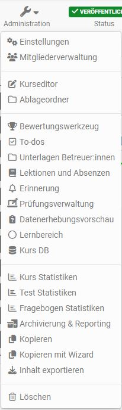

# Einsatz der Kurswerkzeuge

In Ihrem Kurs stehen Ihnen im Bereich der "Administration" eine Reihe von Werkzeugen zur Verfügung. 

.

Andere Lernressourcen verfügen ebenfalls über das Menü Administration, jedoch sind die Menüs nicht so umfangreich und variieren je nach Lernressource. 

Im Folgenden erhalten Sie einen Überblick über die **Menüs der "Administration" von Kursen**. 

## Einstellungen 
Hier werden Basic-Einstellungen vorgenommen und auch die Kursfreigabe eingerichtet. 

Infos zum Menü "Einstellungen" finden Sie im Kapitel [Kurseinstellungen](Course_Settings.de.md)

## Mitgliederverwaltung
Sie können in der [Mitgliederverwaltung](Members_management.de.md) die Kursteilnehmenden und kursbezogenen Gruppen sowie Rechte organisieren und auch Buchungen und Einladungen für Externe organisieren. 

## Ablageordner
Im [Ablageordner](Storage_folder.de.md) werden die Kursdateien gesammelt, die mit einzelnen Kursbausteinen z.B. der HTML-Seite oder dem Kursbaustein Ordner verknüpft werden können.

## Bewertungswerkzeug
Im Menü "Bewertungswerkzeug“, nicht zu verwechseln mit dem [Kursbaustein "Bewertung"](../learningresources/Course_Element_Assessment.de.md), erfolgt die gesamte Bewertung eines Kurses. Hier hat man Zugriff auf alle bewertbaren Kursbausteine und kann Bewertungen mit Punktevergabe, bestanden/nicht bestanden usw. vornehmen und individuelle Feedbacks bereitstellen.

Umfangreiche Informationen findet man im Kapitel ["Bewertungswerkzeug"](Assessment_tool_overview.de.md).

## To-dos
Hier können To-dos für alle oder einzelne  Kursteilnehmenden erstellt, editiert und angezeigt werden. Weitere Details finden Sie im Kapitel [To-dos im Kurs](Course_todos.de.md).

## Badges

Hier können kursbezogene Badges erstellt, editiert und angezeigt werden. Weitere Details finden Sie im Kapitel [Open Badges](OpenBadges.de.md)

## Unterlagen Betreuer:innen

Dieses Menü gibt Betreuern die Möglichkeit Dateien abzulegen. Alle Betreuer und Kursbesitzer können auf diesen Bereich zugreifen. 

Damit dieses Menü erscheint muss zunächst im Kurs unter "Administration" -> "Einstellungen" im Tab "Optionen" die Option "Unteralgen Betreuer:innen Ordner" aktiviert werden.

Als Ablageort kann im Tab Optionen ein bereits existierender Ordner des Ablageordners des Kurses gewählt oder ein neuer Ordner speziell für die Betreuer im Ablageordner generiert werden. Wird die Option "Automatisch generierter Ordner" gewählt, haben die Betreuer im Gegensatz zu Kursbesitzern keinen Zugriff auf andere Dateien oder Ordner, die sich im Ablageordner des Kurses befinden. Dagegen haben  Kursbesitzer bzw. Personen mit Zugriff auf den Kurseditor vollen Zugriff auf den Ablageordner und sehen auch die Dateien der Betreuer im automatisch generierten Ordner "coachdocuments". Das bedeutet Kursbesitzer haben immer Zugriff auf die Dateien des Betreuer Ordners und können sie auch für die Verknüpfung mit bestimmten Kursbausteinen z.B. einer Einzelseite nutzen. Umgekehrt erhalten Betreuer auch mit diesem Betreuer Ordner keine Möglichkeit Dateien in die Kursstruktur zu integrieren.

## Lektionen und Absenzen 
Hier können die Lektionenblöcke eines Kurses erstellt, angesehen und überarbeitet werden. Nähere Informationen zum Thema finden Sie im Kapitel [Lektionen und Absenzen](Lectures_and_absences.de.md). 

## Erinnerung
Hier können Erinnerungen für Kursteilnehmende erstellt, bearbeitet und angezeigt werden. Weitere Informationen finden Sie im Kapitel [Erinnerungen](Course_Reminders.de.md) 

## Prüfungsverwaltung
Hier können Sie Konfigurationen für den Prüfungsmodus erstellen, bearbeiten und anzeigen lassen. Sie können beispielweise einen Prüfungsmodus konfigurieren, der nur bestimmte Kursbausteine zulässt und in einem geschützten Kioskmodus mit eingeschränkten Möglichkeiten ausgeführt wird. Weitere Details find Sie [hier](../learningresources/Assessment_mode.de.md) an. 

## Datenerhebungsvorschau
Sofern vom Administrator aktiviert, erscheint der Menüpunkt in der Administration des Kurses. Hier können Kursbesitzer:innen die geplanten Erhebungen des Moduls [Qualitätsmanagement](../../manual_admin/administration/Modules_Quality_Management.de.md) des Kurses einsehen. Für Kursbesitzer:innen ist diese Vorschau rein _informativ_. Eine Bearbeitung ist lediglich für Qualitätsmanager:innen möglich.

## Lernbereich {: #learning_area}

Hier können die Lernbereiche des Kurses erstellt,  angezeigt und editiert werden. 

Mit Hilfe eines Lernbereichs können mehrere Gruppen eines Kurses gebündelt werden. Dies ist besonders bei vielen Gruppen innerhalb eines Kurses sinnvoll. Über die Schaltfläche "Lernbereich erstellen" weisen Sie dem Kurs einen neuen Lernbereich zu. Ordnen Sie anschliessend diesem Lernbereich die gewünschten im Kurs existierenden Gruppen zu. 

Lernbereiche können z.B. im Kurseditor beim Kursbaustein "Einschreibung" ausgewählt werden. Somit werden alle Gruppen eines Lernbereichs zur Einschreibung angeboten. Weiter stehen Lernbereiche in herkömmlichen Kursen jeweils in den Tabs "Sichtbarkeit" oder "Zugang" zur Auswahl, wenn die Option "gruppenabhängig" aktiviert ist.

Der Vorteil gegenüber der expliziten Auflistung aller relevanten Gruppen in den Zugangs- und Sichtbarkeitsbeschränkungen ist die grössere Flexibilität und die einfachere Handhabung im Kurseditor. Werden neue Gruppenregeln im Kurs definiert, so muss dieser neu publiziert werden. Ist stattdessen eine Lernbereichsregel definiert, so kann die Teilnahme einer Gruppe in der Lernbereichsverwaltung definiert werden. Der Kurs muss hierfür nicht neu publiziert werden.

!!! tip "Tipp"

    Lernbereiche können z.B. eingesetzt werden, wenn Sie denselben Kursbaustein mehreren Gruppen innerhalb eines Kurses verfügbar machen möchten, oder wenn bei einem Einschreibebaustein viele Gruppen zur Auswahl stehen, oder wenn Sie mehrere Gruppen für einen Betreuer bündeln möchten. Mit einem Lernbereich sparen Sie sich die wiederholte Auswahl jeder einzelnen Gruppe.

## Kurs DB

Hier können Sie eine neue kurspezifische Datenbank anlegen, die bestimmte kurspezifische Informationen speichern kann.

## Kurs, Test und Fragenbogen Statistiken
Menüs für den Abruf bestimmter statistischer Daten

### Kurs Statistiken {: #statistics}

Diese Kursfunktion zeigt Ihnen Statistiken über den Zugriff auf Ihren OpenOlat-Kurs an. Zugang zu den Statistiken haben alle Besitzer des Kurses. Sie erhalten jeweils sowohl eine tabellarische wie auch eine grafische Darstellung der Daten. Die Daten der Tabelle können Sie als Excel-Datei (z.B. für die Weiterverarbeitung) auf Ihren Rechner herunterladen.

Relevant für das Total der Kurszugriffe sind die Klicks eines Benutzers auf einen Kursbaustein, nicht aber die Klicks auf den Inhalt eines Kursbausteins. Wenn ein Benutzer beispielsweise dreimal das Wiki in der Kursnavigation wählt, wird dies als drei Klicks gezählt, aber es wird kein Klick gezählt, wenn er im Wiki selbst auf einen Link klickt.

Statistiken können pro Stunde, pro Tag, pro Wochentag und pro Woche erstellt werden. Weiter können Sie bei Statistiken pro Tag und pro Woche die Zeitspanne wählen, während der die Kurszugriffe in der Statistik angezeigt werden. Wenn Sie einen Kursbaustein in der Tabelle anwählen, wird jeweils die Grafik zu diesem Kursbaustein angezeigt. Wählen Sie in der Zeile "Total" die Anzahl Klicks an, zeigt die Grafik die Zugriffe verteilt auf die Kursbausteine.

### Test Statistiken

Die Test Statistiken erlauben generelle kursbezogene, anonymisierte statistische Auswertung der OpenOlat Tests eines Kurses. Angezeigt werden alle im Kurs enthaltenen Tests. 

Es werden sowohl die Kennzahlen für einen Test sowie weitere Analysen zur Bearbeitungsdauer, durchschnittlichen Punkten pro Frage und der prozentuale Anteil der richtigen Antworten pro Frage angezeigt. Des Weiteren werden für jede Frage Kennzahlen wie die Anzahl der Teilnehmenden die die Frage ausgefüllt haben, die durchschnittliche Punktzahl und Bearbeitungsdauer usw. angezeigt und visualisiert. Durch Kennwerte zur Testevaluation und Itemanalyse können Sie so einen Test im Hinblick auf z.B. Schwierigkeit und Eignung evaluieren.

Ein Download der Rohdaten sowie eine Druckversion stehen hier ebenfalls zur Verfügung. 

Zugang zu den Test Statistiken haben neben den Kursbesitzern auch alle Betreuer des Kurses.

### Fragebogen Statistiken

Die Fragebogen Statistiken erlauben Ihnen die generelle kursbezogene, anonymisierte statistische Auswertung Ihrer Umfragen. Für jede Umfrage gibt es eine Übersicht, Tabellen, Diagramme, sowie Zugriff auf die einzelnen Fragebogen Formulare.  Ferner ist ein Export der Daten als PDF oder Excel Tabelle sowie ein Ausdruck möglich. 

In der "Übersicht" geht es um Kennzahlen wie die Anzahl der ausgefüllten Fragebögen, Abgabezeitraum und Bearbeitungsdauer. Im Tab "Tabellen" liegen Auswertungen zu einzelnen Fragen vor. Im Tab „Diagramme“ werden die Ergebnisse in Form von Balkendiagrammen visualisiert und die zugehörigen statistischen Daten wie Median, Varianz und Standardabweichung angezeigt. Im Tab „Einzelne Formulare" haben Sie Zugriff auf jeden einzelnen Fragebogen. Alle Zugriffe sind anonymisiert.

Zugang zu den Fragebogen Statistiken haben neben den Kursbesitzern auch alle Betreuer des Kurses.

## Archivierung & Reporting {: #archive}

Hier können Elemente des Kurses mit Hilfe eines Wizards archiviert werden. Dabei kann entweder ein Gesamtarchiv oder Teilarchiv mit ausgewählten Kursbausteinen erstellt werden. Insbesondere die Speicherung von Ergebnissen der durchgeführten Umfragen, Tests, Selbsttests, Aufgaben, Gruppenaufgaben und die Kursresultate sind wichtige Elemente, die Sie zum Ende des Kurses sichern sollten.

Archive, die von  Kursbesitzer:innen erstellt werden sind anonymisiert. Die Ergebnisse werden in Form eines HTML-Dokuments sowie eines Excel-Rohdaten-Dokuments erstellt. Bei Bedarf kann auch noch ein PDF erstellt werden. Sobald das Archiv erstellt wurde erscheint es in der Übersicht.  

Darüber hinaus können noch separat Logfiles, Kursresultate, Chat-Historie sowie Foren archiviert werden. 

Details zur bisherigen Datenarchivierung findet man [hier](Data_archiving.de.md) 

## Buchungsmöglichkeiten

Hier erhalten Sie einen Überblick über alle Personen, die den Kurs gebucht haben.

Dieses Menü erscheint nur wenn in den "Einstellungen" der Administration im Tab "Freigabe" eine Buchungsmethode ausgewählt wurde. 

## Kopieren mit und ohne Wizard, Inhalt exportieren 

Und natürlich können Kurse und Lernressourcen auch kopiert, exportiert oder gelöscht werden.

### Kopieren

Ist ein Kurs abgelaufen, soll aber im nächsten Semester oder in einem gewissen Zeitabstand wiederholt durchgeführt werden, sollte dieser Kurs kopiert werden. Beim Kopieren eines Kurses werden die komplette Struktur, Ordnerinhalte, HTML-Seiten und Gruppennamen (ohne Gruppenmitglieder) übernommen. Das gesamte Kursgerüst bleibt also erhalten. Benutzerdaten wie Forenbeiträge, Gruppenmitglieder etc. werden jedoch nicht kopiert. Somit erhalten Sie auf diesem Weg einen komplett zurückgesetzten Kurs ohne userspezifische Datenreste.

!!! tip "Hinweis"

    Erstellen Sie auf jeden Fall eine Kurskopie, wenn Sie einen Kurs wiederholt durchführen möchten, anstatt nur die Personen aus der Mitgliederliste zu entfernen. Auf diese Weise entfallen auch alle Einträge im Bewertungswerkzeug und man erhält einen komplett bereinigten Kurs.

!!! tip "Tipp"

    Eine Kurs-Kopie kann auch sinnvollerweise nach Fertigstellung des Kurses und vor Beginn der Durchführung als Backup erstellt werden.

### Kopieren mit Wizard
Mit Hilfe des Wizards können die zu kopierenden Elemente eines Kurses ausgewählt werden und so noch effektiver eine Übertragung für einen neuen Kursdurchlauf erfolgen. Die Kopie kann automatisch oder benutzerdefiniert erfolgen. Bei der benutzerdefinierten Kopie können die zu kopierenden Kursobjekte gewählt und weitere Einstellungen z.B. bezüglich der Mitgliederverwaltung, bestimmten Kursbausteinen sowie weiteren Optionen vorgenommen werden. 

Diese Funktion ist nur für [Lernpfad-Kurse](../learningresources/Learning_path_course.de.md) verfügbar. 

### In Lernpfad-Kurs konvertieren

Herkömmliche Kurse und damit u.a. alle Kurse die vor der OpenOlat Version 15 erstellt wurden, können über diesen Link in einen [Lernpfad-Kurs](../learningresources/Learning_path_course.de.md) konvertiert werden.

Diese Funktion ist nur für herkömmliche Kurse verfügbar.

### Inhalt exportieren

Exportieren Sie Ihre Lernressourcen als ZIP-Datei um eine Sicherungskopie zu erhalten oder um die Lernressource in einer anderen OpenOlat Instanz z.B. einer anderen Bildungseinrichtung zu importieren und so weiterzuverwenden. Das Erlauben einer Kurskopie für andere Autoren bietet sich z.B. für Kursvorlagen an.

Als Besitzer einer Lernressource können Sie darüber hinaus im Administrationsmenü unter "Einstellungen" → "Freigabe für andere Autoren" bestimmen, ob Ihre Lernressource von allen anderen OpenOlat-Autoren des Systems exportiert, kopiert oder referenziert werden darf.  Weitere Infos dazu finden Sie [hier](../learningresources/Access_configuration.de.md).

## (Kurs bzw. Lernressource) Löschen  {: #delete}

Wenn ein Kurs bzw. Lernressource gelöscht wird, werden alle Benutzerdaten entfernt und der Kurs ist nun weder für die ehemaligen Teilnehmenden noch die Betreuer aufruf- oder einsehbar. Kursbesitzer finden die gelöschte Lernressource anschliessend im Autorenbereich im Tab "Gelöscht". Hier erscheint die Lernressource mit dem Status "Papierkorb". Es besteht weiter Zugriff auf die Menüpunkte der Administration. Der Status "Papierkorb" kann nicht geändert werden. Jedoch ist es möglich, über den Link im 3-Punkte Menü die Lernressource wiederherzustellen.

!!! info "Endgültiges Löschen"

    Das endgültige Löschen eines Kurses bzw. Lernressource aus dem Tab "Gelöscht" ist nur durch OpenOlat Administrator:innen möglich.

!!! info "Archivierung"

    Wenn Sie einen Kurs löschen, werden Benutzerdaten (z.B. Testresultate) zuerst als Excel-Datei in Ihrem [persönlichen Ordner](../personal_menu/Personal_folders.de.md) archiviert und im Anschluss gelöscht.

Es ist möglich, andere Kursbesitzer via E-Mail über das Beenden oder Löschen eines Kurses zu informieren. Dies kann entweder im Beenden/Löschen-Dialog optional ausgewählt oder vom OpenOlat Administrator systemweit eingestellt werden.

Bei einer gelöschten Lernressource erscheint in der Kurs Administration der Menüpunkt "Wiederherstellen". 

Ebenso kann ein Kurs auch automatisiert beendet bzw. gelöscht werden. Entsprechende Einstellungen nimmt ebenfalls der OpenOlat Administrator vor.

