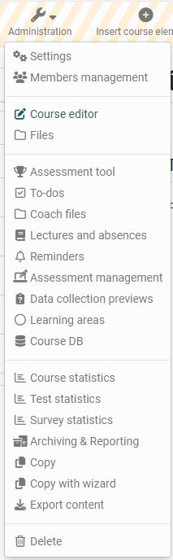

# Using Course Tools

A range of tools are available to you in the "Administration" section of your course. 

Other learning resources also have the Administration menu, but the menus are not as extensive and vary depending on the learning resource. 

Below you will find an overview of the **menus for the "Administration" of courses**. 

!!! info "Info"

    Depending on the configuration of the course, you may not see all of the menus listed.

## Settings
Basic settings are made here and the course activation is also set up. Information on the "Settings" menu can be found in the chapter [Course_Settings](Course_Settings.md)

## Members management
You can organize course participants and course-related groups and rights in [Members_management](Members_management.md) and also organize bookings and invitations for external parties. 

## Files

You will find the course-specific files in the Files menu. In the [Storage folder](Storage_folder.md) you can store your own course files and further customize the storage folder with subfolders. The menu also contains automatically generated folders such as "_archives", "_coachdocuments", "_courselementdata" and "_sharedfolder", depending on the design of the course. 

## Assessment tool

In the menu "Assessment tool", not to be confused with the [course element "Assessment"](../learningresources/Course_Element_Assessment.md), the entire assessment of a course is carried out. Here you have access to all course elements that can be assessed and you can make assessments with points awarded, passed/failed and give individual feedback.

Comprehensive information can be found in the chapter ["Assessment tool"](Assessment_tool_overview.md).

## To-dos
To-dos for all or individual course participants can be created, edited and displayed here. Further details can be found in the chapter [To-dos in the course](Course_todos.md).

## Badges

If activated, course-related badges can be created, edited and displayed here. Further details can be found in the chapter [Open Badges](OpenBadges.md)

## Coach files

This menu gives coaches the possibility to store files. All coaches and course owners can access this area.

In order for this menu to appear, the option "Documents coach folder" must first be activated in the course under "Administration" -> "Settings" in the "Options" tab. You can either select an existing folder of the storage folder or automatically generate a new folder for the storage folder.

If the “Automatically generated folder” option is selected, the “_coachdocuments” folder is created. This folder will then also appear for course owners in the “Files” administration menu.

As soon as the folder is created, supervisors only have access to this folder via the menu in the administration, but not to the entire storage folder, unless the top folder is selected as the supervisor folder. Course owners also have access to the supervisor folder. 

This means that course owners always have access to the files in the coach folder and can also use them to link to certain course elements, e.g. an individual page. Conversely, coaches do not have the option of integrating files into the course structure with this coach folder.

## Lectures and Absences
The lesson blocks of a course can be created, viewed and revised here. You can find more information on this topic in the chapter [Lectures and absences](Lectures_and_absences.md).

## Reminders
Reminders for course participants can be created, edited and displayed here. Further information can be found in the chapter [Reminders](Course_Reminders.md).

## Assessment management
Here you can create, edit and display configurations for the exam mode. For example, you can configure an exam mode that only allows certain course elements and is executed in a protected kiosk mode with limited options. Further details can be found [here](../learningresources/Assessment_mode.md). 

## Data collection previews
If activated by the administrator, the menu item appears in the administration of the course. Here, course owners can view the planned surveys for the [Quality Management](../../manual_admin/administration/Modules_Quality_Management.md) module of the course.
For course owners, this preview is purely _informative_. Editing is only possible for quality managers.

## Learning areas {: #learning_area}

The learning areas of the course can be created, displayed and edited here. 

With the help of a learning area several groups of a course can be bundled. This is especially useful when there are many groups within a course. Use the "Create learning area" button to assign a new learning area to the course. Then assign the desired groups existing in the course to this learning area.

Learning areas can be selected e.g. in the course editor at the course element "Enrolment". Thus, all groups in a learning area are offered for enrolment. Furthermore, learning areas in conventional courses are available for selection in the tabs "Visibility" or "Access" respectively, if the option "group-dependent" is activated.

The advantage over explicitly listing all relevant groups in the access and visibility restrictions is the greater flexibility and easier handling in the course editor. If new group rules are defined in the course, it must be republished. If a learning area rule is defined instead, the participation of a group can be defined in the learning area administration. The course does not need to be republished for this purpose.

!!! tip "Hint"

    Learning areas can be used, for example, if you want to make the same course element available to several groups within a course, or if there are many groups to choose from for an enrolment element, or if you want to bundle several groups for one coach. With a learning area you save the repetitive selection of each group.

## Course DB

Here you can create a new course-specific database that can store certain course-specific information.

## Course Statistics {: #statistics}

This course function provides you with statistics regarding access to your OpenOlat course. All course owners have access to those statistics. You will receive data in the form of tables as well as in the form of charts. Table data can be downloaded as Excel files (e.g. for further processing) to your computer.

Relevant for your total of course accesses are user clicks on a single course element; however, clicks on this element's content will not be counted. If a user selects the Wiki from course navigation and clicks it three times, three clicks will be counted; no click will be counted though when clicking on a link within that Wiki.

Statistics can be created per hour, per day, per weekday or per week. Furthermore you can choose a certain period of time per day and per week during which any course access should be displayed in your statistics.
When selecting a course element in your table its corresponding chart will be displayed. If you select the number of clicks in the row "Total" your chart will show all accesses sorted by course element.

## Test statistics

The test statistics allow you to perform general course-related, anonymous statistical evaluations of your tests. All tests included in the course are displayed. 

The key figures for a test as well as further analyses of the time taken to complete a test, average points per question and the percentage of correct answers per question are displayed. In addition, key figures such as the number of participants who completed the question, average score, time taken to complete the question, etc. are displayed and visualized for each question. You can evaluate a test with regard to e.g. difficulty and suitability by means of characteristic values for test evaluation and item analysis.

A download of the raw data and a print version are also available here. 

Access to the test statistics is not only available to the course owners but also to all coaches of the course.

## Survey statistics

The survey statistics allow you to perform a general course-related, anonymized statistical evaluation of your [surveys](../learningresources/Course_Element_Survey.md). For each survey there is an overview, tables, diagrams and access to the individual questionnaire forms.  It is also possible to export the data as a PDF or Excel table and to print it out. 

The overview includes key figures such as the number of completed questionnaires, submission period and processing time. The tab "Tables" contains evaluations for individual questions. In the tab "Diagrams" the results are visualised in the form of bar charts and the corresponding statistical data such as median, variance and standard deviation are displayed. In the tab "Individual forms" you have access to each individual questionnaire. All accesses are anonymous.

Besides course owners all coaches have access to survey statistics.

## Archiving & Reporting  {: #archive}

Elements of the course can be archived here with the help of a wizard. Either a complete archive or a partial archive with selected course elements can be created. In particular, saving the results of the surveys, tests, self-tests, assignments, group tasks and the course results are important elements that you should save at the end of the course.

Archives created by course owners are anonymized. The results are created in the form of an HTML document and an Excel raw data document. If required, a PDF can also be created. As soon as the archive has been created, it will appear in the overview.  

In addition, log files, course results, chat history and forums can be archived separately.

Details on data archiving to date can be found [here](Data_archiving.md).

## Booking methods

Here you will find an overview of all the people who have booked your course.  

This menu appears only if a booking method has been selected in the "Settings" of the administration in the tab "Share".

## Copy  
If a course has expired but is to be repeated in the next semester or at a certain interval, this course should be copied. When copying a course, the complete structure, folder contents, HTML pages and group names (without group members) are copied. The entire course structure is therefore retained. User data such as forum entries, group members, etc. are not copied. However, user data such as forum posts, group members, etc. will not be copied.
This way you get a completely reset course without user-specific data remains.

!!! tip "Hint"

    It is best to create a course copy if you want to run a course repeatedly instead of just removing the people from the member list. This way, all entries in the assessment tool are also omitted and you get a completely cleaned course.

!!! tip "Hint"

    A course copy can also usefully be created as a backup after the course has been completed and before the course begins.

## Copy with wizard
Wählt man die Option "Kopieren mit Wizard", lässt sich detailliert festlegen, was und wie genau kopiert werden soll. 
Dabei können bestimmte Grundeinstellungen wie Durchführungszeitraum, Kennzeichen oder Lizenz direkt ich für die Kopie angepasst werden. Auch kann gewählt werden ob die Kopie automatisch mit allen Kurselementen erstellt werden soll oder ob eine benutzerdefinierte Kopie mit ausgewählten Kursbausteinen erstellt werden soll bei der auch weitere Einstellungen zum Kopieren von Mitgliedern, Erinnerungen und Dokumenten berücksichtigt werden können. 

This function is only available for [learning path course](../learningresources/Learning_path_course.md). 

## Convert to learning path course

Traditional courses and courses created before OpenOlat version 15 can be converted into a [learning path course](../learningresources/Learning_path_course.md) via this link.

This function is only available for traditional courses.

## Export content

Export your course or learning resources as a ZIP file to keep a backup copy or to import the learning resource into another OpenOlat instance e.g. another educational institution for further use.
Allowing a course copy for other authors is useful for course templates, for example.

As the owner of a learning resource, you can also determine in the administration menu under "Settings" → "Shared to other authors" whether your learning resource may be exported, copied or referenced by all other OpenOlat authors in the system.
You can find further information [here](../learningresources/Access_configuration.md). Allowing a course copy for other authors is useful for course templates, for example.

## Delete (course/learning resource)   {: #delete}

When a course or learning resource is deleted, all user data is removed and the course can now neither be accessed nor viewed by former participants or coaches. Course owners will subsequently find the deleted learning resource in the authoring area in the "Deleted" tab. 
Here the learning resource appears with the status "Trash". There is still access to the administration menu items. 

If a learning resource has been deleted, the menu item “Restore” appears in the course administration. The course can also be restored in this way.

!!! info "Final deletion"

    The final deletion of a course or learning resource from the "Deleted" tab is only possible by OpenOlat administrators.

!!! info "Archiving"

    When you delete a course, user data (e.g. test results) is first archived as an Excel file in your [personal folder](../personal_menu/Personal_folders.de.md) and then deleted.

It is possible to inform other course owners via e-mail about the completion or deletion of a course. This can either be optionally selected in the Finish/Delete dialog or set in the administration. 

If a learning resource has been deleted, the menu item "Restore" appears in the course administration. 

A course can also be closed or deleted automatically. The administrator makes the appropriate settings. 
