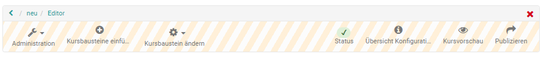
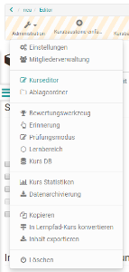
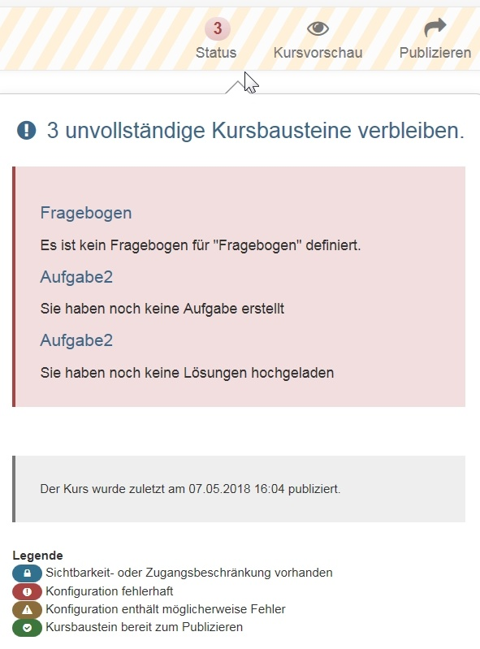
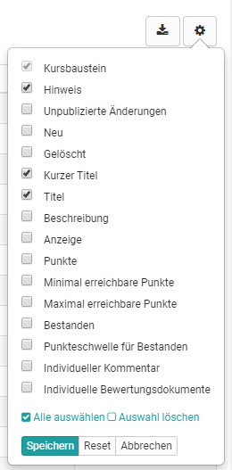
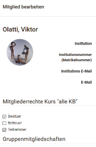

# Kurseditorwerkzeuge

Im Menü des Kurseditors haben Sie Zugriff auf den Administrationsbereich mit
diversen weiteren Konfigurationstools. Hier können Sie Kursbausteine einfügen
und ändern, sich den aktuellen Status und auch die Konfiguration sowie eine
Kursvorschau des Kurses anzeigen lassen und schließlich den Kurs publizieren.

## Administration

Hier haben Sie Zugriff auf diverse weitere Kurswerkzeuge. Informationen dazu
finden Sie auf den separaten Seiten der Werkzeuge.

  

## Kursbaustein einfügen

Hier haben Sie Zugriff auf alle [Kursbausteine](Course_Elements.de.md), die Sie
in einen Kurs einbauen können.

## Kursbaustein ändern

Hinzugefügte Bausteine können gelöscht, verschoben und kopiert werden. Darüber
hinaus ist ein Verschieben der Bausteine auch per drag & drop möglich.

## Status

Hier wird angezeigt, ob es bei der Konfiguration der Kursbausteine Probleme
gibt. Klicken Sie auf die angegebene Zahl und die zugehörigen Probleme werden
angezeigt und können behoben werden. Die Legende gibt ferner an um welche Art
von Problem es sich handelt.

Eventuelle Konfigurationsprobleme werden zusätzlich in der Kursnavigation
angezeigt.

## Übersicht Konfiguration

Hier erhalten Sie einen Überblick über die Konfiguration aller im Kurs
hinzugefügten Kursbausteine entsprechend der Kursstruktur in der linken
Navigation.

  

Wählen Sie die Spalten aus, über die Sie Überblicksinformationen erhalten
wollen.

Die Spalte "Punkte" ist nur für Assessmentbausteine relevant. Hier wird dann
angezeigt, ob für die jeweiligen Kursbausteine die Vergabe von Punkten
aktiviert ist oder nicht.

Wählen Sie gezielt nur die Spalten gezielt aus, die Sie wirklich benötigen. so
bleibt die Anzeige übersichtlich. Besonders die Spalte "Beschreibung" sollte
nur eingeblendet werden, wenn in den Kursbausteinen hier keine langen Texte
eingetragen sind.

Die Spalten zeigen _nicht die Bewertungen_ für einzelne Personen an, sondern
geben lediglich einen Überblick über die Konfiguration der Bausteine. Sollen
Punkte vergeben oder ein bestanden/nicht bestanden werden, erfolgt dies im
"[Bewertungswerkzeug](../learningresources/Assessment_tool_overview.de.md)"
des Kurses.

  

Über den Button "Konfiguration ändern" am Ende der Liste können weitere
Detaileinstellungen vorgenommen werden. Bei herkömmlichen Kursen kann die
Anzeige von ausgewählten Kursbausteinen auf einmal geändert und so z.B.
vereinheitlicht werden. Bei Lernpfad Kursen sind noch weitere Einstellungen
zur Bewertungskonfiguration und zum Lernpfad möglich.

## Kursvorschau {: #preview}

Das Editorwerkzeug „Kursvorschau“ gibt Ihnen die Möglichkeit, die
Kurseinstellungen und Inhalte aus der Sicht von Kursteilnehmenden zu
betrachten. Mit Klick auf „Kursvorschau“ wird Ihnen zunächst ein
Konfigurationsmenu angezeigt, um das Betreten des Kurses zu einem bestimmten
Datum, als Teilnehmer einer bestimmten Gruppe oder mit sonstigen im Kurs
verwendeten Attributen zu simulieren.

Im Gegensatz zur Kursinhaltsansicht werden in der Kursvorschau auch alle noch
nicht publizierten Kursbausteine und Änderungen angezeigt. Einige Funktionen
in der Kursvorschau, die eine Interaktion der Kursteilnehmenden mit dem System
bedingen, sind hingegen nicht verfügbar. Dies betrifft unter anderen das
Einschreiben in Gruppen, das Starten von Tests, Selbsttests und Umfragen sowie
die Abgabe von Lösungen im Kursbaustein „Aufgabe“.

 Weiterführende Informationen zur Konfiguration der Kursvorschau:

In diesem Formular können Sie bestimmen, welche Bedingungen für die
Kursvorschau gelten sollen.  
  
**Datum:** Dieses Feld müssen Sie ausfüllen. Geben Sie hier einen Zeitpunkt
(Datum und Uhrzeit) ein, zu dem die Kursvorschau angezeigt werden soll. Als
Voreinstellung sind das aktuelle Datum und die aktuelle Uhrzeit gesetzt.  
  
**Gruppen:** Markieren Sie den bzw. die Namen einer oder mehrere Gruppen, um
den Kurs aus Sicht der Mitglieder dieser Gruppe anzuzeigen.  
  
**Lernbereiche:** Geben Sie hier den Namen eines Lernbereichs ein, um den Kurs
aus Sicht der Mitglieder dieses Lernbereichs anzuzeigen.  
  
**Rolle:** Wählen Sie hier, für welche Benutzertypen die Vorschau angezeigt
werden soll.

  *  _«Registrierte OLAT-Benutzer»_ : Zeigt den Kurs, wie er sich einem normalen OLAT-Benutzer (i.d.R. Studierende) präsentiert.
  *  _«Gäste»_ : Zeigt den Kurs, wie er sich einem Gast (also Personen die sich ohne OpenOlat Account einwählen) präsentiert, sofern der Kurs für Gäste freigeschaltet ist.
  *  _«Betreuer»_ : Zeigt den Kurs, wie er sich einem Betreuer einer beliebigen Lerngruppe im Kurs präsentiert.
  *  _«Besitzer des Kurses»_ : Zeigt den Kurs, wie er sich den Besitzern des Kurses (Kursadministratoren) präsentiert.
  *  _«OLAT-Autoren»_ : Zeigt den Kurs, wie er sich den Benutzern mit OLAT-weiten Autorenrechten präsentiert.

 **Attribute:** In diesen Feldern können Sie bis zu fünf AAI-Attribut-Namen
mit ihren entsprechenden Werten angeben. In der Vorschau wird Ihnen der Kurs
angezeigt, wie er sich einem Benutzer mit diesen AAI-Attributen präsentieren
würde.  
  
**Beispiel:**  
Attribut-Name: swissEduPersonStudyBranch3  
Attribut-Wert: 4600  
Diese Eingabe zeigt den Kurs, wie er sich den Studierenden der Fachrichtung
Chemie präsentiert.  
  
Hier finden Sie weiterführende Informationen:  
[AAI-Attribute ](Access_Restrictions_in_the_Expert_Mode.de.md)  
[__ AAI - Generelle Informationen](http://www.switch.ch/aai/)

Die Kursvorschau bietet sich z.B. an um einen Kurs vor dem Start aus der
Teilnehmerperspektive zu betrachten oder bestimmte Sichtbarkeitsregeln zu
überprüfen.

Wollen sich Kursbesitzer lediglich die Kursdarstellung aus der
Lernendenperspektive anschauen, besteht die Möglichkeit, sich in der
Mitgliederverwaltung einfach zusätzlich als Teilnehmer einzutragen. So hat man
die Möglichkeit bei geschlossenem Kurseditor, zwischen den gewünschten
Kursrollen und Ansichten zu wechseln.

## Publizieren

Alle im Kurseditor vorgenommenen Einstellungen und Änderungen geben Sie über
das „Publizieren“ frei. So können Sie Ihren Kurs im Kurseditor in Ruhe
vorbereiten, aufbauen und gestalten.

Der Kurs kann entweder über den Link in der Toolbar oder direkt beim Schließen
des Kurseditors publiziert werden. Erst wenn Sie den Kurs publizieren, wird
dieser im Kursrun bei geschlossenem Editor sichtbar. Das bedeutet aber noch
nicht, dass die Lernenden auch schon den Kurs sehen. Hierfür muss dieser
veröffentlicht und der Zugang konfiguriert sein (vergl. Kapitel
"[Zugangskonfiguration](Access_configuration.de.md)")

Wollen Sie differenziertere Einstellungen beim Publizieren vornehmen, wählen
Sie den "Publizieren" Button in der Toolbar des Kurseditors.

 Button "Publizieren": Konfigurationsschritte

Schritt 1: Wählen Sie alle Kursbausteine aus, die Sie geändert haben und die
Sie veröffentlichen möchten. Die Auswahl ist dabei bereits auf publizierbare
Kursbausteine begrenzt.

Schritt 2: Hier erhalten Sie Zugang zu den generellen
Veröffentlichungsoptionen eines Kurses. Bestimmen Sie, welche OpenOlat-
Benutzer Zugriff auf Ihren Kurs haben sollen. Lesen Sie im Kapitel
„[Kurseinstellungen](Course_Settings.de.md)“ welche  Optionen Ihnen hier zur
Verfügung stehen. Nach diesem Schritt kann der Vorgang des Publizierens
bereits abgeschlossen werden. Klicken Sie dazu auf „Fertigstellen“.

Schritt 3: Sie können auswählen, ob der Kurs zu einem Katalog hinzugefügt
werden soll. Tipp: Tragen Sie nur fertige und funktionstüchtige Kurse in den
Katalog ein, keine Test- oder Spielkurse.

Schritt 4: Es werden Ihnen, sofern vorhanden, nicht vollständig konfigurierte
Kursbausteine und eventuell daraus resultierende Probleme beim Betreten des
Kurses angezeigt.

Schritt 5: Wurden im Hintergrund Kursbausteine aktualisiert, werden diese hier
aufgezeigt.

Schritt 6: Sie erhalten eine Zusammenfassung der zum Publizieren gewählten
Änderungen sowie einen Hinweis, wie viele Kursteilnehmer aktuell im Kurs
arbeiten.

Schließen Sie die Schritte mit "Fertigstellen" ab. Sie können den Prozess auch
verkürzen indem Sie einzelne Schritte überspringen und direkt auf
"Fertigstellen" klicken.

In den meisten Fällen reicht es aus, den Kurs einfach durch Schließen des
Kurseditors zu publizieren

Solange Sie Ihren Kurs nicht publiziert und veröffentlicht haben, finden ihn
die Kursteilnehmenden weder über die Suchmaske noch in der Liste der Kurse.

Sollten Sie den Kurs publizieren, während Kursteilnehmer im Kurs arbeiten,
gehen deren aktuelle Bewegungsdaten wie nicht gespeicherte Foren- und Wiki-
Einträge verloren.

  

  

