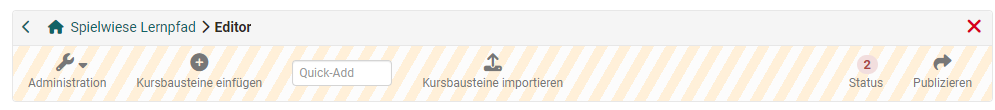
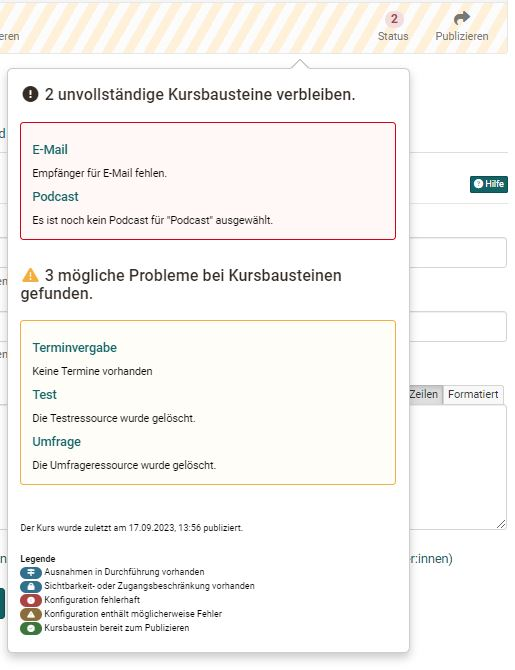

# Kurseditorwerkzeuge {: #course_editor_tools}

Im Menü des Kurseditors haben Sie Zugriff auf weitere Konfigurationstools in der Toolbar. Hier können Sie Kursbausteine einfügen, importieren und sich den aktuellen Status mit eventuellen Problemen anzeigen lassen.

{ class="shadow lightbox" }

## Administration

Über die Kurs-Administration haben Sie Zugriff auf diverse weitere Kurswerkzeuge. Informationen dazu finden Sie unter "[Kurs-Administration](../learningresources/Administration.de.md)".

## Kursbaustein einfügen

Hier haben Sie Zugriff auf alle [Kursbausteine](Course_Elements.de.md), die Sie in einen Kurs einbauen können. Einfach auswählen und dem Kurs hinzufügen. Weitere Informationen finden Sie unter "[Kursbausteine im Kurseditor](../learningresources/General_Configuration_of_Course_Elements.de.md)".

## Quick-Add

Je nach Grösse Ihres Bildschirmfensters steht Ihnen auch die Funktion "Quick-Add" zur Verfügung. Hierüber kann einfach der Name des gewünschten Kursbausteins in das Feld geschrieben und somit der Baustein noch schneller hinzugefügt werden.

## Kursbausteine importieren

An dieser Stelle können Sie Kursbausteine aus anderen Kursen mit Hilfe eines Wizards importieren.

Wählen Sie einen Kurs aus, bei dem Sie Besitzer:in sind, und entscheiden Sie sich für einen oder mehrere Kursbausteine dieses Kurses. Teilweise können Sie an den ausgewählten Bausteinen auch noch weitere Konfigurationen vornehmen. Abschliessend "Fertigstellen" auswählen und die gewünschten Kursbausteine werden dem aktuellen Kurs hinzugefügt.

## Status

Hier wird angezeigt, ob es bei der Konfiguration der Kursbausteine Probleme gibt. Klicken Sie auf die angegebene Zahl und die zugehörigen Probleme werden angezeigt. Folgen Sie den Links, um die Probleme zu beheben. Die Legende unten gibt ferner Auskunft, um welche Art von Problem es sich handelt.

{ class="shadow lightbox" }

Eventuelle Konfigurationsprobleme werden zusätzlich in der Kursnavigation bei den entsprechenden Kursbausteinen angezeigt.

!!! note "Hinweis"

    Verwechseln Sie den "Status" im Kurseditor nicht mit dem ["Status" bei geschlossenem Kurseditor](../learningresources/Access_configuration.de.md). Das sind zwei verschiedene Funktionen.

## Kursvorschau (nur für herkömmliche Kurse) {: #preview}

Das Editorwerkzeug "Kursvorschau" gibt die Möglichkeit, die Kurseinstellungen und Inhalte aus der Sicht von Teilnehmenden zu betrachten. Mit Klick auf "Kursvorschau" wird Ihnen zunächst ein Konfigurationsmenü angezeigt, um das Betreten des Kurses zu einem bestimmten Datum, als Teilnehmer:in einer bestimmten Gruppe oder mit sonstigen im Kurs verwendeten Attributen zu simulieren.

Im Gegensatz zur Kursinhaltsansicht werden in der Kursvorschau auch alle noch nicht publizierten Kursbausteine und Änderungen angezeigt. Einige Funktionen in der Kursvorschau, die eine Interaktion der Teilnehmenden mit dem System bedingen, sind hingegen nicht verfügbar. Dies betrifft unter anderem das Einschreiben in Gruppen, das Starten von Tests, Selbsttests und Umfragen sowie die Abgabe von Lösungen im Kursbaustein "Aufgabe".

### Konfiguration der Kursvorschau

In diesem Formular können Sie bestimmen, welche Bedingungen für die Kursvorschau gelten sollen.

**Datum**: Dieses Feld müssen Sie ausfüllen. Geben Sie hier einen Zeitpunkt (Datum und Uhrzeit) ein, zu dem die Kursvorschau angezeigt werden soll. Als Voreinstellung sind das aktuelle Datum und die aktuelle Uhrzeit gesetzt.

**Gruppen**: Markieren Sie den bzw. die Namen einer oder mehrerer Gruppen, um den Kurs aus Sicht der Mitglieder dieser Gruppen anzuzeigen.

**Lernbereiche**: Geben Sie hier den Namen eines Lernbereichs ein, um den Kurs aus Sicht der Mitglieder dieses Lernbereichs anzuzeigen.

**Rolle**: Wählen Sie hier, für welche Rolle die Vorschau angezeigt werden soll.

* "Registrierte OpenOlat-Benutzer:innen": Zeigt den Kurs, wie er sich Personen mit der Rolle "Benutzer:in" (in der Regel Teilnehmende) präsentiert.
* "Gäste": Zeigt den Kurs, wie er sich einem Gast (also Personen, die sich ohne OpenOlat-Konto anmelden) präsentiert, sofern der Kurs für Gäste freigeschaltet ist.
* "Betreuer:innen": Zeigt den Kurs, wie er sich einer Betreuer:in einer beliebigen Gruppe im Kurs präsentiert.
* "Besitzer:innen des Kurses": Zeigt den Kurs, wie er sich den Besitzer:innen des Kurses präsentiert.
* "OpenOlat-Autor:innen": Zeigt den Kurs, wie er sich Personen mit der Rolle "Autor:in" präsentiert.

**Attribute**: In diesen Feldern können Sie bis zu fünf AAI-Attribut-Namen mit ihren entsprechenden Werten angeben. In der Vorschau wird Ihnen der Kurs angezeigt, wie er sich einer Benutzer:in mit diesen AAI-Attributen präsentieren würde.

**Beispiel**: 
Attribut-Name: swissEduPersonStudyBranch3 
Attribut-Wert: 4600 
Diese Eingabe zeigt den Kurs, wie er sich den Studierenden der Fachrichtung Chemie präsentiert.

Die Kursvorschau bietet sich z. B. an, um einen Kurs vor dem Start aus der Perspektive der Teilnehmenden zu betrachten oder bestimmte Sichtbarkeitsregeln zu überprüfen.

Weiterführende Informationen zu AAI-Attributen finden Sie auf der Seite "[Zugriffsbeschränkungen im Expertenmodus](Access_Restrictions_in_the_Expert_Mode.de.md)" sowie bei [Switch](http://www.switch.ch/aai/).

!!! tip "Tipp"

    In der Regel ist diese Vorschau nicht notwendig, da bei geschlossenem Kurseditor einfach die "Teilnehmer:innenansicht" gewählt werden kann. Dieser Weg bietet sich auch für Lernpfadkurse an.

## Publizieren

Alle im Kurseditor vorgenommenen Einstellungen und Änderungen geben Sie über das "Publizieren" frei. So können Sie Ihren Kurs im Kurseditor in Ruhe vorbereiten, aufbauen und gestalten.

Erst wenn Sie den Kurs publizieren, werden die Kursbausteine und die vorgenommenen Änderungen bei geschlossenem Editor sichtbar. Das bedeutet aber noch nicht, dass die Lernenden auch schon den Kurs sehen. Hierfür muss dieser veröffentlicht und der Zugang konfiguriert sein (siehe Kapitel "[Zugangskonfiguration / Freigabe](Access_configuration.de.md)").

Am einfachsten geht ein schnelles Publizieren über das Schliessen des Kurseditors, indem Sie in der Breadcrumb-Navigation auf den Titel des Kurses klicken. Sie werden gefragt, ob Sie automatisch, manuell oder nicht publizieren wollen.

Die Wahl des manuellen Publizierens entspricht der Wahl "Publizieren" im Kurseditor und erfolgt mit einem Wizard.

!!! warning "Achtung"

    Sollten Sie den Kurs publizieren, während Teilnehmende im Kurs arbeiten, gehen deren aktuelle Bewegungsdaten wie nicht gespeicherte Foren- und Wiki-Einträge verloren.

### Manuelles Publizieren mit Wizard

Schritt 1 - Kursbausteine wählen: Wählen Sie alle Kursbausteine aus, die Sie geändert haben und die Sie veröffentlichen möchten. Die Auswahl ist dabei bereits auf publizierbare Kursbausteine begrenzt.

Schritt 2 - Änderung des Kurszugriffs: Hier erhalten Sie Zugang zu den generellen Veröffentlichungsoptionen eines Kurses. Bestimmen Sie, welche OpenOlat-Benutzer:innen Zugriff auf Ihren Kurs haben sollen. Lesen Sie im Kapitel "[Kurseinstellungen](Course_Settings.de.md)", welche Optionen Ihnen hier zur Verfügung stehen. Nach diesem Schritt kann der Vorgang des Publizierens bereits abgeschlossen werden. Klicken Sie dazu auf "Fertigstellen".

Eventuell gibt es noch Hinweise, die angezeigt werden. Auch ein gezielter Eintrag in den Katalog ist bei Verwendung des [Katalog 1.0](../area_modules/catalog1.0.de.md) möglich. Bei Verwendung des [Katalog 2.0](../area_modules/catalog2.0.de.md) erfolgt der Eintrag automatisch entsprechend der Taxonomie-Konfiguration.

## Weiterführende Informationen {: #further_information}

**Auf dieser Seite erwähnt** 
[Kurs-Administration: Übersicht >](../learningresources/Administration.de.md) 
[Kursbausteine >](Course_Elements.de.md) 
[Kursbausteine im Kurseditor >](../learningresources/General_Configuration_of_Course_Elements.de.md) 
[Zugangskonfiguration / Freigabe >](Access_configuration.de.md) 
[Zugriffsbeschränkungen im Expertenmodus >](Access_Restrictions_in_the_Expert_Mode.de.md) 
[Switch AAI >](http://www.switch.ch/aai/) 
[Kurseinstellungen >](Course_Settings.de.md) 
[Katalog 1.0 >](../area_modules/catalog1.0.de.md) 
[Katalog 2.0: Übersicht >](../area_modules/catalog2.0.de.md)

[Zum Seitenanfang ^](#course_editor_tools)
