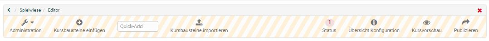
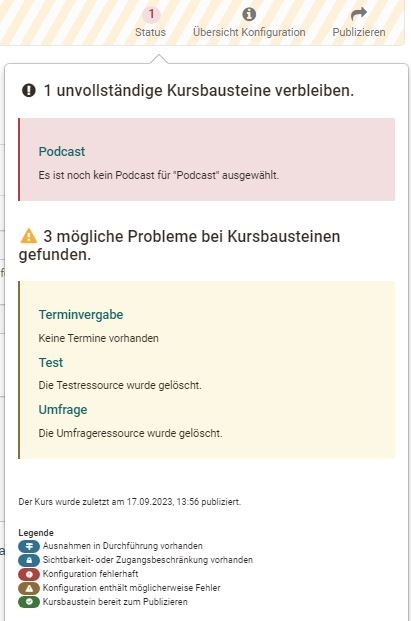
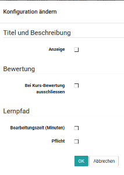

# Kurseditorwerkzeuge

Im Menü des Kurseditors haben Sie Zugriff auf weiteren Konfigurationstools in der Toolbar. Hier können Sie Kursbausteine einfügen, importieren und sich den aktuellen Status mit eventuellen Problemen anzeigen lassen.  

## Administration

Über die Administration des Kurses haben Sie Zugriff auf diverse weitere Kurswerkzeuge. Informationen dazu
finden Sie unter "[Einsatz der Kurswerkzeuge](../learningresources/Using_Course_Tools.de.md)"

## Kursbaustein einfügen

Hier haben Sie Zugriff auf alle [Kursbausteine](Course_Elements.de.md), die Sie in einen Kurs einbauen können. Einfach auswählen und dem Kurs hinzufügen.

## Quick Add

Je nach Größe Ihres Bildschirmfensters steht Ihnen auch die Funktion "Quick Add" zur Verfügung. Hierüber kann einfach der Name des gewünschten Kursbausteins in das Feld geschrieben und somit der Baustein noch schneller hinzugefügt werden. 

## Kursbausteine importieren

An dieser Stelle können Sie Kursbausteine aus anderen Kursen mit Hilfe eines Wizards importieren. 

Wählen Sie einen Kurs aus bei dem Sie Besitzer sind und entscheiden Sie sich für einen oder mehrere Kursbausteine dieses Kurses. Teilweise können Sie auch noch weitere Konfigurationen vornehmen an den ausgewählten Bausteinen vornehmen. Abschliessend "Fertigstellen" auswählen und die gewünschten Kursbausteine werden dem aktuellen Kurs hinzugefügt. 

## Status

Hier wird angezeigt, ob es bei der Konfiguration der Kursbausteine Probleme
gibt. Klicken Sie auf die angegebene Zahl und die zugehörigen Probleme werden
angezeigt. Folgen Sie den Links um die Probleme zu beheben. Die Legende unten gibt ferner Auskunft um welche Art
von Problem es sich handelt.

Eventuelle Konfigurationsprobleme werden zusätzlich in der Kursnavigation bei den entsprechenden Kursbausteinen angezeigt.

!!! note "Hinweis"

    Verwechseln Sie den "Status" im Kurseditor nicht mit dem ["Status" bei geschlossenem Kurseditor](../learningresources/Access_configuration.de.md). Das sind zwei verschiedene Funktionen.

## Übersicht Konfiguration

Hier erhalten Sie einen Überblick über die Konfiguration aller im Kurs
hinzugefügten Kursbausteine entsprechend der Kursstruktur in der linken
Navigation. 

Tipp: Wählen Sie nicht alle, sondern gezielt die Spalten aus, über die Sie Überblicksinformationen erhalten wollen. so bleibt die Anzeige übersichtlich. 
Besonders die Spalte "Beschreibung" sollte
nur eingeblendet werden, wenn in den Kursbausteinen hier keine langen Texte
eingetragen sind. Die Spalte "Punkte" ist nur für Assessmentbausteine relevant. Hier wird angezeigt, ob für die jeweiligen Kursbausteine die Vergabe von Punkten
aktiviert ist oder nicht.

Um Anpassungen vorzunehmen wählen sie die gewünschten Kursbausteine aus und es erscheint der Button "Konfiguration ändern".

!!! info "Hinweis"

    Die Spalten zeigen _nicht die Bewertungen_ für einzelne Personen an, sondern geben lediglich einen Überblick über die Konfiguration der Bausteine. Sollen Punkte vergeben oder ein bestanden/nicht bestanden werden, erfolgt dies im "[Bewertungswerkzeug](../learningresources/Assessment_tool_overview.de.md)" des Kurses.

## Kursvorschau {: #preview} (nur für herkömmliche Kurse )

Das Editorwerkzeug "Kursvorschau" gibt  die Möglichkeit, die Kurseinstellungen und Inhalte aus der Sicht von Kursteilnehmenden zu betrachten. Mit Klick auf "Kursvorschau" wird Ihnen zunächst ein
Konfigurationsmenu angezeigt, um das Betreten des Kurses zu einem bestimmten
Datum, als Teilnehmer einer bestimmten Gruppe oder mit sonstigen im Kurs
verwendeten Attributen zu simulieren.

Im Gegensatz zur Kursinhaltsansicht werden in der Kursvorschau auch alle noch
nicht publizierten Kursbausteine und Änderungen angezeigt. Einige Funktionen
in der Kursvorschau, die eine Interaktion der Kursteilnehmenden mit dem System
bedingen, sind hingegen nicht verfügbar. Dies betrifft unter anderen das
Einschreiben in Gruppen, das Starten von Tests, Selbsttests und Umfragen sowie
die Abgabe von Lösungen im Kursbaustein "Aufgabe".

### Weiterführende Informationen zur Konfiguration der Kursvorschau:

In diesem Formular können Sie bestimmen, welche Bedingungen für die
Kursvorschau gelten sollen.  
  
**Datum**: Dieses Feld müssen Sie ausfüllen. Geben Sie hier einen Zeitpunkt
(Datum und Uhrzeit) ein, zu dem die Kursvorschau angezeigt werden soll. Als
Voreinstellung sind das aktuelle Datum und die aktuelle Uhrzeit gesetzt.  
  
**Gruppen**: Markieren Sie den bzw. die Namen einer oder mehrere Gruppen, um
den Kurs aus Sicht der Mitglieder dieser Gruppe anzuzeigen.  
  
**Lernbereiche**: Geben Sie hier den Namen eines Lernbereichs ein, um den Kurs
aus Sicht der Mitglieder dieses Lernbereichs anzuzeigen.  
  
**Rolle**: Wählen Sie hier, für welche Benutzertypen die Vorschau angezeigt
werden soll.

  *  _«Registrierte OLAT-Benutzer»_ : Zeigt den Kurs, wie er sich einem normalen OLAT-Benutzer (i.d.R. Studierende) präsentiert.
  *  _«Gäste»_ : Zeigt den Kurs, wie er sich einem Gast (also Personen die sich ohne OpenOlat Account einwählen) präsentiert, sofern der Kurs für Gäste freigeschaltet ist.
  *  _«Betreuer»_ : Zeigt den Kurs, wie er sich einem Betreuer einer beliebigen Lerngruppe im Kurs präsentiert.
  *  _«Besitzer des Kurses»_ : Zeigt den Kurs, wie er sich den Besitzern des Kurses (Kursadministratoren) präsentiert.
  *  _«OLAT-Autoren»_ : Zeigt den Kurs, wie er sich den Benutzern mit OLAT-weiten Autorenrechten präsentiert.

 **Attribute**: In diesen Feldern können Sie bis zu fünf AAI-Attribut-Namen
mit ihren entsprechenden Werten angeben. In der Vorschau wird Ihnen der Kurs
angezeigt, wie er sich einem Benutzer mit diesen AAI-Attributen präsentieren
würde.  
  
**Beispiel**:  
Attribut-Name: swissEduPersonStudyBranch3  
Attribut-Wert: 4600  
Diese Eingabe zeigt den Kurs, wie er sich den Studierenden der Fachrichtung
Chemie präsentiert.  
  
Hier finden Sie weiterführende Informationen:  
[AAI-Attribute ](Access_Restrictions_in_the_Expert_Mode.de.md)  
[__ AAI - Generelle Informationen](http://www.switch.ch/aai/)

Die Kursvorschau bietet sich z.B. an um einen Kurs vor dem Start aus der
Teilnehmerperspektive zu betrachten oder bestimmte Sichtbarkeitsregeln zu
überprüfen.

In der Regel ist die Vorschau aber mehr notwendig, da bei geschlossenem Kurseditor einfach die "Teilnehmeransicht" gewählt werden kann. Dieser Weg bietet sich auch für Lernpfad Kurse an.

## Publizieren

Alle im Kurseditor vorgenommenen Einstellungen und Änderungen geben Sie über
das "Publizieren" frei. So können Sie Ihren Kurs im Kurseditor in Ruhe
vorbereiten, aufbauen und gestalten.

 Erst wenn Sie den Kurs publizieren, werden die Kursbausteine und die vorgenommenen Änderungen bei geschlossenem Editor sichtbar. Das bedeutet aber noch
nicht, dass die Lernenden auch schon den Kurs sehen. Hierfür muss dieser
veröffentlicht und der Zugang konfiguriert sein (vergl. Kapitel
"[Zugangskonfiguration](Access_configuration.de.md)")

Das Publizieren kann entweder einfach beim Schliessen des Kurses vorgenommen werden oder man nutzt den Link in der Toolbar des Kurseditors. Über den Link in der Toolbar gelangt man in die manuelle Konfiguration des Publizierens. Beim Schliessen des Kurses ist auch ein schnelles/automatisches Publizieren möglich, was in den meisten Fällen ausreicht und deutlich schneller geht. 

!!! warning "Hinweis"

    Sollten Sie den Kurs publizieren, während Kursteilnehmer im Kurs arbeiten, gehen deren aktuelle Bewegungsdaten wie nicht gespeicherte Foren- und Wiki-Einträge verloren.
    
### Manuelles Publizieren mit Wizard

Schritt 1 - Kursbausteine wählen: Wählen Sie alle Kursbausteine aus, die Sie geändert haben und die Sie veröffentlichen möchten. Die Auswahl ist dabei bereits auf publizierbare Kursbausteine begrenzt.

Schritt 2 - Änderung des Kurszugriffs: Hier erhalten Sie Zugang zu den generellen
Veröffentlichungsoptionen eines Kurses. Bestimmen Sie, welche OpenOlat-
Benutzer Zugriff auf Ihren Kurs haben sollen. Lesen Sie im Kapitel
„[Kurseinstellungen](Course_Settings.de.md)“ welche  Optionen Ihnen hier zur
Verfügung stehen. Nach diesem Schritt kann der Vorgang des Publizierens
bereits abgeschlossen werden. Klicken Sie dazu auf "Fertigstellen".

Eventuell gibt es noch Hinweise die angezeigt werden. Auch ein Eintrag in den Katalog ist bei Verwendung des [Katalog 1.0](../area_modules/catalog1.0.de.md) möglich.

  

  

