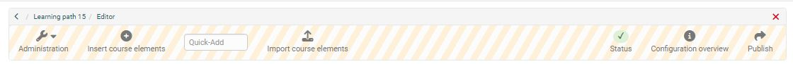
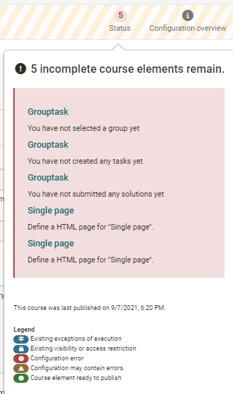
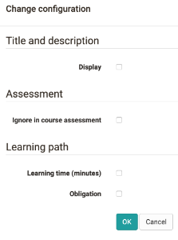

# Course editor tools

In the course editor menu you have access to the administration area with
various other configuration tools. Here you can insert and modify course
elements, view their current status and configuration as well as a course
preview and finally publish your course.

## Administration

Here you have access to various other course tools. You will find information
on the separate pages of the tools. More information you will find [here](../learningresources/Using_Course_Tools.md).

## Insert course elements

Here you have access to all [course elements](Course_Elements.md)
that you can integrate into a course.

## Quick-Add

Je nach Größe Ihres Bildschirmfensters steht Ihnen auch die Funktion "Quick Add" zur Verfügung. Hierüber kann einfach der Name des gewünschten Kursbausteins in das Feld geschrieben und somit der Baustein noch schneller hinzugefügt werden. 

## Kursbausteine importieren

An dieser Stelle können Sie Kursbausteine aus anderen Kursen mit Hilfe eines Wizards importieren. 

Wählen Sie einen Kurs aus bei dem Sie Besitzer sind und entscheiden Sie sich für einen oder mehrere Kursbausteine dieses Kurses. Teilweise können Sie auch noch weitere Konfigurationen vornehmen an den ausgewählten Bausteinen vornehmen. Abschliessend "Fertigstellen" auswählen und die gewünschten Kursbausteine werden dem aktuellen Kurs hinzugefügt. 

## Status

Here you can see if there are problems when configuring course elements. Click
on the number indicated and the corresponding problems will be displayed and
can be solved. The legend also indicates what kind of problem it is.

Possible configuration problems will additionally be displayed in the course
navigation.  

Eventuelle Konfigurationsprobleme werden zusätzlich in der Kursnavigation bei den entsprechenden Kursbausteinen angezeigt.

## Configuration overview

Here you will get an overview of the configuration of all course elements
added to your course according to the course structure in the left navigation.

Tip: Select the columns you want to obtain overview information on.
Select only those columns that you really need. This way the display remains
clear. Especially the column "Description" should only be displayed if there
are no long texts in course elements.

The column "Score" is only relevant for assessment elements. Here it will be
indicated whether or not points have been assigned for course elements.

Um Anpassungen vorzunehmen wählen sie die gewünschten Kursbausteine aus und es erscheint der Button "change configuration". In conventional courses you can change the display of selected course elements at once and thus e.g. standardize it. In
case of learning path courses further settings regarding assessment configuration and learning path are possible.

!!! info

    The columns _do not show the ratings_ for individual persons, but only give an  overview of the configuration of the course elements. If points are to be   awarded or a pass/fail is to be given, this will be done in the course's "[Assessment tool](../learningresources/Assessment_tool_overview.md)".

## Course preview (nur für herkömmliche Kurse) {: #preview}

The editor tool "Course preview" enables you to see course settings and
content from the course participant's point of view. By clicking on "Course
preview" you will first get to the configuration menu to simulate your course
at a certain point in time, as member of a distinct group, or with other
attributes used in your course.

In contrast to the view of the course content you will see all modifications
or course elements not yet published in the course preview. Features depending
on an interaction between participant and system will not be available in the
course preview, e.g. enrolling in groups, starting a test, self-test or questionnaire, and performing tasks in the course element "Task."

### More information on configuring the course preview:

By means of this form you can define the conditions of the course's preview.  
  
**Date**: This field is mandatory. Please enter date or time you want the
course preview to be displayed. The current date and time is pre-set.  
  
**Group**: Select the name(s) of one or more groups to view the course from the perspective of the members of that group. 
  
**Learning area**: Please enter the name of a learning area in order to make
this course available for members of this learning area.  
  
**Role**: Please select to whom this preview should be accessible.

  *  _«Registered OLAT users»_ : This is how the course is presented to a regular OLAT user (e.g. student).
  *  _«Guests»_ : This is how the course is presented to a guest user (who log in without an OpenOlat account), if this course is available for guests at all.
  *  _«Tutors»_ : This is how the course is presented to a tutor of any learning group during this course.
  *  _«Course owners»_ : This is how the course is presented to course owners (course administrators).
  *  _«OLAT authors»_ : This is how the course is presented to users with OLAT author rights.

 **Attributes**: By means of these fields you can enter up to five AAI attribute
names with their relevant values. By means of this preview, this course is
presented in the way a user with these AAI attributes would see it.  
  
**Example**:  
Attribute name: swissEduPersonStudyBranch3  
Attribute value: 4600  
This is how the course is presented to Chemistry students.  
  
For more information:  
[AAI attributes ](Access_Restrictions_in_the_Expert_Mode.md)  
[__ General information on AAI](http://www.switch.ch/aai/)

The course preview is useful, for example, to view a course from the participant's perspective before it starts or to check certain visibility
rules.

In der Regel ist die Vorschau aber mehr notwendig, da bei geschlossenem Kurseditor einfach die "Teilnehmeransicht" gewählt werden kann. Dieser Weg bietet sich auch für Lernpfad Kurse an.

## Publishing

All settings and modifications made in the course editor will be released by
means of "Publish". This way you can prepare, set up and design your course in
the course editor at your leisure.

Your course can either be published by clicking on that link in your toolbar or directly when closing your course editor. Only once you have published your course it will become visible in the course run with closed editor. This does not mean that learners will already see your course. In order to be able to do that you have to publish your course and configure your access (see chapter
"[Access configuration](Access_configuration.md)").

Das Publizieren kann entweder einfach beim Schliessen des Kurses vorgenommen werden oder man nutzt den Link in der Toolbar des Kurseditors. Über den Link in der Toolbar gelangt man in die manuelle Konfiguration des Publizierens. Beim Schliessen des Kurses ist auch ein schnelles/automatisches Publizieren möglich, was in den meisten Fällen ausreicht und deutlich schneller geht. 

!!! warning

    In case you publish a course while others are working on it all non-saved data (such as entries in forums or Wikis) will be lost.
    

If you want to make more differentiated settings when publishing, select the "Publish" button in the toolbar of the course editor.

### Manuelles Publizieren mit Wizard

Step 1: First you have to select all those course elements you have modified
and want to publish. Your choice will be reduced to course elements that are
available for publishing.

Step 2: Modification of course access: Here you get access to the general publishing options of a course. Determine which OpenOlat-
users should have access to your course. See
section "[Course Settings](Course_Settings.md)" to learn more about those options at your disposal. Now you can complete your publishing process.
Just click on "Finish".

Eventuell gibt es noch Hinweise die angezeigt werden. Auch ein Eintrag in den Katalog ist bei Verwendung des [Katalog 1.0](../area_modules/catalog1.0.md) möglich.

