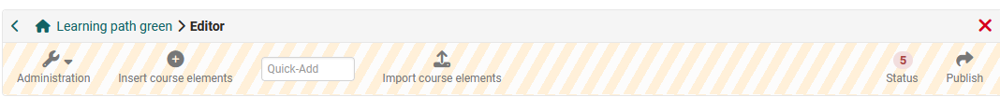
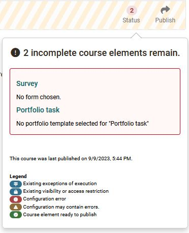

# Course editor tools

In the course editor menu you have access to further configuration tools in the toolbar.  Here you can insert and import course elements and display the current status with any problems. 

## Administration

Here you have access to various other course tools. You will find information
on the separate pages of the tools. More information you will find [here](../learningresources/Using_Course_Tools.md).

## Insert course elements

Here you have access to all [course elements](Course_Elements.md)
that you can integrate into a course. Simply select and add to the course. Further information can be found [here](../learningresources/General_Configuration_of_Course_Elements.md). 

## Quick-Add

Je nach Größe Ihres Bildschirmfensters steht Ihnen auch die Funktion "Quick Add" zur Verfügung. Hierüber kann einfach der Name des gewünschten Kursbausteins in das Feld geschrieben und somit der Baustein noch schneller hinzugefügt werden. 

## Kursbausteine importieren

An dieser Stelle können Sie Kursbausteine aus anderen Kursen mit Hilfe eines Wizards importieren. 

Wählen Sie einen Kurs aus bei dem Sie Besitzer sind und entscheiden Sie sich für einen oder mehrere Kursbausteine dieses Kurses. Teilweise können Sie auch noch weitere Konfigurationen vornehmen an den ausgewählten Bausteinen vornehmen. Abschliessend "Fertigstellen" auswählen und die gewünschten Kursbausteine werden dem aktuellen Kurs hinzugefügt. 

## Status

Here you can see if there are problems when configuring course elements. Click
on the number indicated and the corresponding problems will be displayed and
can be solved. The legend also indicates what kind of problem it is.

Possible configuration problems will additionally be displayed in the course
navigation.  

Eventuelle Konfigurationsprobleme werden zusätzlich in der Kursnavigation bei den entsprechenden Kursbausteinen angezeigt.

!!! note "Hinweis"

    Verwechseln Sie den "Status" im Kurseditor nicht mit dem ["Status" bei geschlossenem Kurseditor](../learningresources/Access_configuration.de.md). Das sind zwei verschiedene Funktionen.

## Course preview (nur für herkömmliche Kurse) {: #preview}

The editor tool "Course preview" enables you to see course settings and
content from the course participant's point of view. By clicking on "Course
preview" you will first get to the configuration menu to simulate your course
at a certain point in time, as member of a distinct group, or with other
attributes used in your course.

In contrast to the view of the course content you will see all modifications
or course elements not yet published in the course preview. Features depending
on an interaction between participant and system will not be available in the
course preview, e.g. enrolling in groups, starting a test, self-test or questionnaire, and performing tasks in the course element "Task."

### More information on configuring the course preview:

By means of this form you can define the conditions of the course's preview.  
  
**Date**: This field is mandatory. Please enter date or time you want the
course preview to be displayed. The current date and time is pre-set.  
  
**Group**: Select the name(s) of one or more groups to view the course from the perspective of the members of that group. 
  
**Learning area**: Please enter the name of a learning area in order to make
this course available for members of this learning area.  
  
**Role**: Please select to whom this preview should be accessible.

  *  _«Registered OLAT users»_ : This is how the course is presented to a regular OLAT user (e.g. student).
  *  _«Guests»_ : This is how the course is presented to a guest user (who log in without an OpenOlat account), if this course is available for guests at all.
  *  _«Tutors»_ : This is how the course is presented to a tutor of any learning group during this course.
  *  _«Course owners»_ : This is how the course is presented to course owners (course administrators).
  *  _«OLAT authors»_ : This is how the course is presented to users with OLAT author rights.

 **Attributes**: By means of these fields you can enter up to five AAI attribute
names with their relevant values. By means of this preview, this course is
presented in the way a user with these AAI attributes would see it.  
  
**Example**:  
Attribute name: swissEduPersonStudyBranch3  
Attribute value: 4600  
This is how the course is presented to Chemistry students.  
  
The course preview is useful, for example, to view a course from the participant's perspective before it starts or to check certain visibility
rules.

For more information:  
[AAI attributes ](Access_Restrictions_in_the_Expert_Mode.md)  
[__ General information on AAI](http://www.switch.ch/aai/)

!!! info "Hinweis"

    In der Regel ist diese Vorschau aber nicht mehr notwendig, da bei geschlossenem Kurseditor einfach die "Teilnehmeransicht" gewählt werden kann. Dieser Weg bietet sich auch für Lernpfad Kurse an.

## Publishing

All settings and modifications made in the course editor will be released by
means of "Publish". This way you can prepare, set up and design your course in
the course editor at your leisure.

Only once you have published your course it will become visible in the course run with closed editor. This does not mean that learners will already see your course. In order to be able to do that you have to publish your course and configure your access (see chapter
"[Access configuration](Access_configuration.md)").

Am einfachsten geht ein schnelles publizieren über das Schliessen des Kurseditors indem man einfach in der Bread-Crumb-Leiste auf den Titel des Kurses klickt. Hier wird man gefragt ob man automatisch, manuell oder nicht publizieren will. 

Die Wahl des manuellen Publizierens entspricht der Wahl "Publizieren" im Kurseditor und erfolgt mit einem Wizard. 

!!! warning

    In case you publish a course while others are working on it all non-saved data (such as entries in forums or Wikis) will be lost.
   
### Manual publishing with Wizard

Step 1: First you have to select all those course elements you have modified
and want to publish. Your choice will be reduced to course elements that are
available for publishing.

Step 2: Modification of course access: Here you get access to the general publishing options of a course. Determine which OpenOlat-
users should have access to your course. See
section "[Course Settings](Course_Settings.md)" to learn more about those options at your disposal. Now you can complete your publishing process.
Just click on "Finish".

Eventuell gibt es noch Hinweise die angezeigt werden. Auch ein gezielter Eintrag in den Katalog ist bei Verwendung des [Katalog 1.0](../area_modules/catalog1.0.de.md) möglich. Bei Verwendung des [Katalog 2.0](../area_modules/catalog2.0.de.md) erfolgt der Eintrag automatisch entsprechend der Taxonomie Konfiguration.

