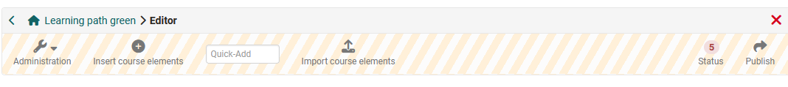
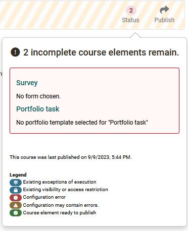

# Course editor tools {: #course_editor_tools}

In the course editor menu you have access to further configuration tools in the toolbar. Here you can insert and import course elements and display the current status with any problems.

{ class="shadow lightbox" }

## Administration

Via the course administration you have access to various other course tools. You will find information under "[Course Administration](../learningresources/Administration.md)".

## Insert course element

Here you have access to all [course elements](Course_Elements.md) that you can integrate into a course. Simply select and add to the course. Further information can be found under "[Elements](../learningresources/General_Configuration_of_Course_Elements.md)".

## Quick-Add

Depending on the size of your screen window, the "Quick-Add" function may also be available. This allows you to simply enter the name of the desired course element in the field and add the element even faster.

## Import course elements

Here you can import course elements from other courses using a wizard.

Select a course that you own and choose one or more course elements from that course. In some cases, you can also make further configurations to the selected elements. Finally, select "Finish" and the desired course elements will be added to the current course.

## Status

Here you can see if there are problems when configuring course elements. Click on the number indicated and the corresponding problems will be displayed. Follow the links to solve the problems. The legend below also indicates what kind of problem it is.

{ class="shadow lightbox" }

Any configuration problems are also displayed in the course navigation for the corresponding course elements.

!!! note "Note"

    Do not confuse the "Status" in the course editor with the ["Status" when the course editor is closed](../learningresources/Access_configuration.md). These are two different functions.

## Course preview (only for conventional courses) {: #preview}

The editor tool "Course preview" enables you to see course settings and content from the participants' point of view. By clicking on "Course preview" you will first get to a configuration menu to simulate entering the course at a certain date, as a participant of a certain group, or with other attributes used in your course.

In contrast to the view of the course content, the course preview also shows all course elements and modifications not yet published. Features that depend on an interaction between participants and the system are not available in the course preview. This includes enrolling in groups, starting tests, self-tests and surveys, and submitting solutions in the course element "Task".

### Configuration of the course preview

In this form you can define the conditions that apply to the course preview.

**Date**: This field is mandatory. Enter the date and time at which the course preview should be displayed. The current date and time are pre-set.

**Groups**: Select the name(s) of one or more groups to view the course from the perspective of the members of these groups.

**Learning areas**: Enter the name of a learning area to view the course from the perspective of the members of this learning area.

**Role**: Select the role for which the preview should be displayed.

* "Registered OLAT users": Shows the course as it is presented to persons with the role "User" (usually participants).
* "Guests": Shows the course as it is presented to a guest (persons who log in without an OpenOlat account), provided the course is available for guests.
* "Tutors": Shows the course as it is presented to a coach of any group in the course.
* "Course owners": Shows the course as it is presented to the owners of the course.
* "OLAT authors": Shows the course as it is presented to persons with the role "Author".

**Attributes**: In these fields you can enter up to five AAI attribute names with their corresponding values. The preview shows the course as it is presented to a user with these AAI attributes.

**Example**: 
Attribute name: swissEduPersonStudyBranch3 
Attribute value: 4600 
This entry shows the course as it is presented to Chemistry students.

The course preview is useful, for example, to view a course from the participants' perspective before it starts or to check certain visibility rules.

Further information on AAI attributes can be found on the page "[Access Restrictions in the Expert Mode](Access_Restrictions_in_the_Expert_Mode.md)" and at [Switch](http://www.switch.ch/aai/).

!!! tip "Tip"

    Usually this preview is not necessary, as you can simply select the "Participant view" when the course editor is closed. This method is also suitable for learning path courses.

## Publishing

All settings and modifications made in the course editor are released by means of "Publish". This way you can prepare, set up and design your course in the course editor at your leisure.

Only once you have published the course do the course elements and the modifications become visible with the editor closed. This does not mean that learners can already see the course. For this, the course must be published and the access configured (see chapter "[Access configuration](Access_configuration.md)").

The easiest way to publish quickly is to close the course editor by clicking on the course title in the breadcrumb navigation. You will be asked whether you want to publish automatically, manually, or not at all.

The option to publish manually corresponds to the "Publish" option in the course editor and is carried out using a wizard.

!!! warning "Attention"

    If you publish a course while participants are working in it, their current activity data such as unsaved forum and wiki entries will be lost.

### Manual publishing with wizard

Step 1 - Select course elements: Select all course elements that you have modified and want to publish. The selection is already limited to course elements that can be published.

Step 2 - Modification of course access: Here you get access to the general publishing options of a course. Determine which OpenOlat users should have access to your course. Read the chapter "[Course Settings](Course_Settings.md)" to learn which options are available here. After this step, the publishing process can already be completed. Click on "Finish".

There may still be some notes that are displayed. A specific entry in the catalog is also possible when using the [Catalog 1.0](../area_modules/catalog1.0.md). When using the [Catalog 2.0](../area_modules/catalog2.0.md), the entry is made automatically according to the taxonomy configuration.

## Further information {: #further_information}

**Mentioned on this page** 
[Course Administration: Overview >](../learningresources/Administration.md) 
[Types of Course Elements >](Course_Elements.md) 
[Elements >](../learningresources/General_Configuration_of_Course_Elements.md) 
[Access configuration >](Access_configuration.md) 
[Access Restrictions in the Expert Mode >](Access_Restrictions_in_the_Expert_Mode.md) 
[Switch AAI >](http://www.switch.ch/aai/) 
[Course Settings >](Course_Settings.md) 
[Catalog 1.0 >](../area_modules/catalog1.0.md) 
[Catalog 2.0: Overview >](../area_modules/catalog2.0.md)

[To the top of the page ^](#course_editor_tools)
