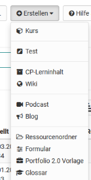

# Verschiedene Typen von Lernressourcen

OpenOlat kennt verschiedene Typen von Lernressourcen. Mit Ausnahme der Kurse
haben diese gemeinsam, dass sie in einem oder mehreren Kursen eingebunden
werden können. Folgende Lernressourcen können direkt in OpenOlat erstellt
werden.

Darüber hinaus können eventuell weitere Formate als Lernressourcen importiert
werden (siehe unten).

Im Folgenden werden die Lernressourcen kurz beschrieben:

## Kurs

Ein OpenOlat-Kurs kann als reiner Online-Kurs eingesetzt werden oder
Vorlesungen, Seminare oder andere Präsenzveranstaltungen begleiten. In einem
OLAT-Kurs können verschiedene didaktische Konzepte wie Webquest,
Gruppenpuzzles, problembasiertes Lernen, gamebasierte Ansätze usw. umgesetzt
werden. Ein OLAT-Kurs ist ein OpenOlat-eigener Dokumententyp der beliebig
viele "Kursbausteine" sowie weitere Funktionalitäten enthalten kann. Wie man
mit den verschiedenen Kursbausteinen arbeitet, wird im Kapitel
[„Lernaktivitäten im Kurs“](../learning_activities/index.de.md) ausführlich
erklärt. Wie Kurse erstellt werden, erfahren Sie im Kapitel [„Kurs erstellen"](../course_create/index.de.md). 
Details zu Kursbausteinen und dem Kurseditor
erfahren Sie im Kapitel [„Kursbausteine"](../course_elements/index.de.md).

## Test (QTI 2.1)

Tests können sowohl zu Prüfungs- als auch zu Übungszwecken verwendet werden.
Im ersten Fall können die Kursautoren die Testresultate einsehen und den
Testpersonen zuordnen, im zweiten Fall werden die Resultate anonymisiert
gespeichert. Jeder Test liegt in einem standardisierten Dokumentformat, dem
IMS-QTI-Format, vor.

Mehr Informationen zum Einsatz und Erstellung von Tests finden Sie im Kapitel
[„Tests erstellen“](../tests/index.de.md) .

## CP-Lerninhalt

Ein Content-Packaging (kurz CP) ist ein Lerninhalt in einem standardisierten
E-Learning-Format. Die Spezifikation dieses Datenformats kommt ebenfalls von
[IMS](http://www.imsglobal.org/ "IMS"). OpenOlat unterstützt die IMS-CP
Version 1.1.2. CPs eignen sich für die Verwendung in OpenOlat-Kursen oder auch
ausserhalb von OpenOlat. OpenOlat unterstützt dieses Format, damit Lerninhalte
nicht nur in OpenOlat, sondern auch in anderen LMS verwendet werden können.
Mehr Informationen zur Erstellung von Content-Packagings finden Sie im Kapitel
[„CP-Lerninhalt erstellen"](../resource_cp/index.de.md).

## Wiki

Mit Wikis können einfache Weise kooperativ, gemeinsam Inhalte erstellt werden.
Ein Wiki kann für Gruppenarbeiten, als Dokumentationswerkzeug oder als
Wissensbasis für Ihre Studien- oder Projektarbeit verwendet werden.

Mehr Informationen zur Erstellung von Wikis finden Sie im Kapitel 
[„Wiki erstellen"](../resource_wiki/index.de.md). Wie Sie im Wiki Inhalte erstellen und
sinnvoll arbeiten erfahren Sie [hier](../learning_activities/Working_with_Wiki.de.md).

## Podcast

Ein Podcast ermöglicht den Upload von Audio- oder Videodateien, die
anschliessend in OpenOlat zur Verfügung gestellt werden können. Podcasts
können entweder direkt in OpenOlat angehört oder angeschaut oder in Portalen
wie iTunes abonniert werden, um die einzelnen Podcast-Episoden später auf
mobile Endgeräte zu kopieren. Kursteilnehmer können Episoden auf einfache Art
bewerten und kommentieren.

Informationen dazu, wie Sie einen Podcast erstellen und in Ihren Kurs
einbinden, finden Sie im Kapitel [„Podcast erstellen"](../resource_podcast/index.de.md).

## Blog

In einem Blog können fachbezogene oder persönliche Informationen einfach
veröffentlicht und aktualisiert werden. Blogs werden häufig als eine Art
Online-Tagebuch oder Journal eingesetzt. Kursteilnehmer können Blogeinträge
auf einfache Art bewerten und kommentieren.

Informationen dazu, wie Sie einen Blog erstellen und in Ihren Kurs einbinden,
finden Sie im Kapitel [„Blog erstellen"](../resource_blog/index.de.md). Wie Sie als
Kursteilnehmer den Blog verwenden, erfahren Sie im Kapitel „Lernaktivitäten im
Kurs“ unter dem Punkt
[„Blog"](../learning_activities/Working_With_Course_Elements.de.md#blog).

  

## Ressourcenordner

Mit Hilfe des Ressourcenordners können Dateien (Inhalte, Informationen,
Grafiken usw.) in mehreren Kursen verwendet werden. Dabei werden die Dateien
aus dem Ressourcenordner referenziert und brauchen somit nicht mehrfach
erstellt werden. Der verknüpfte Ressourcenordner wird im Ablageordner des
verknüpften Kurses unter _sharedfolder angezeigt und es besteht Zugriff auf
alle im Ressourcenordner hinterlegten Dateien. Änderungen an den Dateien im
Ressourcenordner gelten dann für alle verknüpften Kurse. Zu beachten ist, dass
nur ein Ressourcenordner pro Kurs hinzugefügt werden kann. Weitere
Informationen finden Sie im Kapitel
"[Kurseinstellungen](../course_create/Course_Settings.de.md)""im Unterpunk "Ressourcenordner".

##  Formular

Ein Formular wird in der Regel zur Datenerhebung oder als Fragebogen
eingesetzt, beispielsweise zur Veranstaltungsevaluation. Jeder Kursteilnehmer
kann dasselbe Formular nur einmal ausfüllen. Die Resultate werden dabei
anonymisiert gespeichert. Mehr Informationen zum Einsatz und Erstellung von
Formularen für Umfragen, Rubriks usw. finden Sie im Kapitel 
[Fragebögen erstellen.](../forms/index.de.md)

## Portfolio 2.0 Vorlage

Eine Portfolio 2.0 Vorlage beinhaltet Aufgaben die im Rahmen eines Portfolio-
Assessments genutzt und als Portfolioaufgabe in einen OpenOlat-Kurs
eingebunden werden können. Mit Hilfe einer Portfolio 2.0 Vorlage können
Lehrende eine strukturierte Portfolio-Mappe gestalten, die die Lernenden
[abholen ](../portfolio/Portfolio_task_and_assignment_Collecting_and_editing.de.md)und
bearbeiten können. Weitere Informationen zur [Portfolio
Vorlage](../portfolio/Portfolio_template_Creation.de.md) und generell zum Thema
[ePortfolio](../portfolio/index.de.md) erfahren Sie im entsprechenden Kapitel.

## Glossar

In einem Glossar können Begriffe und Definitionen abgelegt und alphabetisch
sortiert zugänglich gemacht werden. Wird ein Glossar in einen OpenOlat Kurs
eingebaut können die Begriffe auch bei integrierten HTML-Dateien direkt zur
Erklärung angezeigt werden. Ferner ist es möglich Glossare so zu
konfigurieren, dass auch Lernende ein Glossar inhaltlich befüllen können.

Informationen dazu, wie Sie ein Glossar erstellen und in Ihren Kurs einbinden,
finden Sie im Kapitel „Kursbetrieb“ unter dem Punkt
[„Glossar"](../course_operation/Using_Additional_Course_Features.de.md#glossary). 
Wie Sie im Kurs das Glossar verwenden, erfahren Sie im Kapitel „Lernaktivitäten im Kurs“ unter dem Punkt
[„Glossar"](../learning_activities/Additional_Course_Features.de.md#glossary).

# Weitere Lernressourcen

  

## SCORM-Lerninhalt

Ein standardisiertes E-Learning-Format, das von OpenOlat unterstützt wird, ist
das SCORM-Format (Version 1.2). SCORM steht für „Sharable Content Object
Reference Model“ und ist ein Referenzmodell für austauschbare elektronische
Lerninhalte der [ „Advanced Distributed Learning Initiative“
(ADL)](http://www.adlnet.gov/). SCORM-Lerninhalte eignen sich für die
Verwendung in OpenOlat-Kursen oder ausserhalb von OpenOlat. OpenOlat
unterstützt dieses Format, damit Sie Ihre Lerninhalte nicht nur in OpenOlat,
sondern auch in anderen LMS verwenden können.

SCORM-Module können in OpenOlat nicht erstellt, sondern nur importiert werden.

## Video

  
Ein Video ist ein Lerninhalt im MPEG-4 Format mit der Dateiendung MP4. Die
Lernressource Video kann in OpenOLAT durch importieren oder importieren URL
hinzugefügt werden und anschließend weiter konfiguriert werden. OpenOlat
unterstützt die Anzeige von Untertiteln in mehreren Sprachen, integrierte
Quizzes, Anmerkungen und Sprungmarken. Generelle Informationen zu
Videoformaten und Upload in OpenOlat finden Sie im Kapitel "[Video erstellen](../resource_video/Learning_resource_Video.de.md)".

## Lernressourcen vom Typ Datei und andere Dateien

Neben den oben genannten Lernressourcen können Sie eine Reihe an weiteren
Dateitypen in OpenOlat importieren. Dazu gehören PDF-, PowerPoint-, Excel- und
Word-Dateien, sowie Bild,  Musik und Animationen.

Zudem können Sie, sofern ein entsprechender Dokumenteneditor aktiviert ist,
auch direkt  Word, Excel oder PowerPoint Dateien in OpenOlat als Lernressource
erstellen.

  

