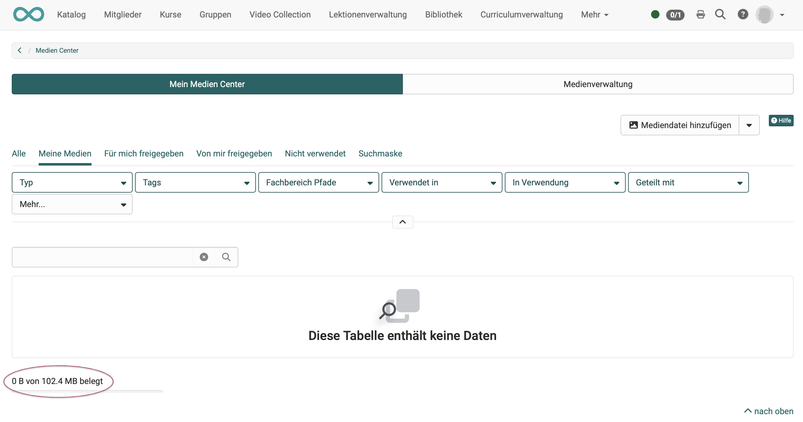

# Video aufnehmen

## Voaussetzungen

Wenn in OpenOlat Videos aufgenommen werden sollen, muss zunächst eine Kamera verfügbar sein. Sie muss grundsätzlich im Device aktiviert worden sein.

Damit die Kamera auch in OpenOlat für Aufnahmen genutzt werden kann, muss sie für OpenOlat frei gegeben sein. 

Auf der Gegenseite muss in OpenOlat die **Möglichkeit zu Videoaufnahmen** durch den/die Administrator:in aktiviert worden sein: 
**Administration > Module > Audio-/Videoaufnahmen**

Die Einstellungen für das **Transcoding** der Aufnahmen (Einstellungen zu Dateigrösse und Bildqualität) werden ebenfalls gemacht unter 
**Administration > Module > Audio-/Videoaufnahmen**.

## Wo können in OpenOlat Videos aufgenommen werden?

### Aufnahme im Medien Center
 
Öffnen Sie das **persönliche Menü** durch Klick auf das kleine Bild oder Dreieck rechts oben.
Öffnen Sie darin dann das Medien Center.

Unter den Möglichkeiten zum Hinzufügen neuer Mediendateien befindet sich auch **"Video aufzeichnen"**.

{ class=" shadow lightbox" }

### Aufnahme im Kursbaustein Seite

Im Kursbaustein Seite kann innerhalb eines Layout-Elements auch ein Video eingefügt werden. 

{ class=" shadow lightbox" }

Hat man sich dafür entschieden, erscheint ein Popup zur Auswahl eines vorhandenen Videos. Im Popup befindet sich zusätzlich ein Button zur Aufnahme eines eigenen Videos.

{ class=" shadow lightbox" }

### Aufnahme im Kursbaustein Aufgabe

tbd

### Aufnahme im Kursbaustein Gruppenaufgabe

tbd

## Wo werden die Videoaufnahmen gespeichert?

Speicherung im Medien Center

???Ablageordner

## In welchem Format und welcher Qualität werden Aufnahmen gespeichert?

Video-Aufnahmen werden als mp4-Dateien gespeichert.

Bildgrösse

Auflösung

## Wieviel Speicherplatz steht für meine Videos zur Verfügung?

Bsp.: Medien Center 
In der linken unteren Ecke sehen Sie den verfügbaren Speicherplatz (für das gesamte Medien Center) und wieviel davon bereits belegt ist. Der verfügbare Platz kann von den Administrator:innen bestimmt werden.

{ class=" shadow lightbox" }

## Wie lassen sich Videoaufnahmen exportieren?

tbd