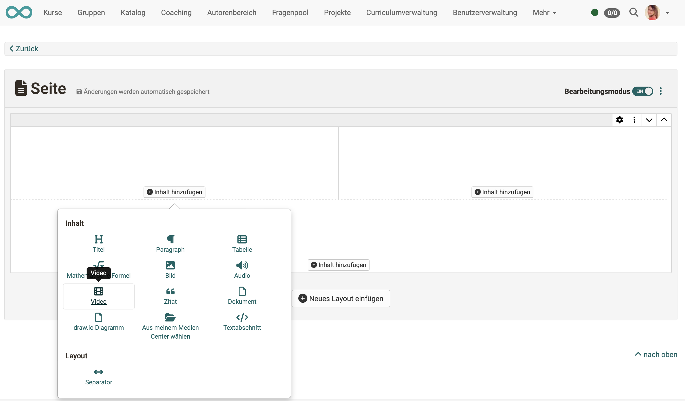

# Video aufnehmen

## Voraussetzungen

* Wenn in OpenOlat Videos aufgenommen werden sollen, muss zunächst eine Kamera verfügbar sein. Sie muss grundsätzlich im Device aktiviert worden sein.

* Damit die Kamera auch in OpenOlat für Aufnahmen genutzt werden kann, muss sie für OpenOlat frei gegeben sein. 

* *Nur MacOS:* In anderen Browsern als Safari muss die allgemeine Erlaubnis zur Verwendung des Mikrofons 
  und der Kamera erteilt werden. Stellen Sie diese Berechtigungen auf dem Mac unter  
  **System Settings -> Privacy & Security -> Microphone** und  
  **System Settings -> Privacy & Security -> Camera** 
  für den/die Browser ein, die Sie für OpenOlat verwenden.

* Auf der Gegenseite muss in OpenOlat die **Möglichkeit zu Videoaufnahmen** durch den/die Administrator:in aktiviert worden sein: 
**Administration > Module > Audio-/Videoaufnahmen**

* Die Einstellungen für das **Transcoding** der Aufnahmen (Einstellungen zu Dateigrösse und Bildqualität) werden ebenfalls gemacht unter 
**Administration > Module > Audio-/Videoaufnahmen**.

## Wo können in OpenOlat Videos aufgenommen werden?

### Aufnahme im Medien Center
 
Öffnen Sie das **persönliche Menü** durch Klick auf das kleine Bild oder Dreieck rechts oben.
Öffnen Sie darin dann das Medien Center.

Unter den Möglichkeiten zum Hinzufügen neuer Mediendateien befindet sich auch **"Video aufzeichnen"**.

{ class=" shadow lightbox" }

### Aufnahme im Kursbaustein Seite

Im Kursbaustein Seite kann innerhalb eines Layout-Elements auch ein Video eingefügt werden. 

{ class=" shadow lightbox" }

Hat man sich dafür entschieden, erscheint ein Popup zur Auswahl eines vorhandenen Videos. Im Popup befindet sich zusätzlich ein Button zur Aufnahme eines eigenen Videos.

{ class=" shadow lightbox" }

### Aufnahme im Kursbaustein HTML-Seite

Der in OpenOlat verwendete HTML-Editor (Tiny) wird auch für das Einfügen und Aufzeichnen von Videos verwendet. Die Option zum Aufzeichnen eines Videos befindet sich unter den Werkzeugen, die auch zum Einfügen bereits vorhandener Medien verwendet werden.  

{ class=" shadow lightbox" }

!!! Note "Hinweis"

    Im HTML-Editor sind Videoaufnahmen zwar prinzipiell möglich, an manchen Stellen werden bei Aufruf des Editors aber aus verschiedenen Gründen nicht alle Bearbeitungsmöglichkeiten angeboten. Es kann also sein, dass beim Aufruf des HTML-Editors die Option zum Aufzeichnen eines Videos angeboten wird, bei einem Aufruf von anderer Stelle aus nicht. 

### Aufnahme im Kursbaustein Aufgabe

Die Möglichkeit zu Videoaufnahmen in einer Aufgabe ist in den Workflow eingebettet. Sie finden die Recording-Funktion im Arbeitsschritt, wo das Video als Aufgabenstellung oder Musterlösung eingefügt werden soll.

{ class=" shadow lightbox" }

{ class=" shadow lightbox" }

Für Videoaufnahmen, die im Kursbaustein "Aufgabe" aufgezeichnet werden, besteht aktuell keine Möglichkeit zur Speicherung und Verlinkung im Medien Center.

### Aufnahme im Kursbaustein Gruppenaufgabe

Die Videoaufnahme im Kursbaustein "Gruppenaufgabe" funktioniert wie im Kursbaustein "Aufgabe".

## Wo werden die Videoaufnahmen gespeichert?

**Innerhalb eines Kursbausteins aufgenommene Videos** werden auch bei diesem Kursbaustein gespeichert. 
Die Aufnahmen sind nicht im Autorenbereich, Ablageordner oder im Medien Center aufgeführt (Ausnahme: Kursbaustein Seite).

{ class=" shadow lightbox" }

Wird dagegen die **Videoaufnahme im Medien Center** gestartet, wird das Video auch im Medien Center gespeichert.

## In welchem Format und welcher Qualität werden Aufnahmen gespeichert?

In OpenOlat gemachte Video-Aufnahmen werden immer als **mp4-Dateien** gespeichert. Dies ist dadurch begründet, dass nur das mp4-Format von allen Browsern unterstützt wird.

Für reine Audios ist es das m4a-Format.

In welcher **Bildgrösse** ein Video aufgenommen wird, ist in erster Linie abhängig von Browser und Kamera. Die Grösse wird im Aufnahmefenster links oben angezeigt.

Um den Speicherverbrauch durch Videos der Kursteilnehmer:innen etwas zu steuern, kann z.B. im Kursbaustein "Aufgabe" die **Auflösung** für die Videoaufnahmen nur durch die Kursbesitzer:innen eingestellt werden. Die Kursteilnehmer:innen machen dann alle Aufnahmen in dieser Standardqualität. 

!!! Note "Empfehlung"

    Verwenden Sie wenn möglich eine mittlere Auflösung. 
    Eine grosse Auflösung erzeugt wesentlich grössere Dateien und verbraucht entsprechend Speicherplatz.
    Bei einer kleinen Auflösung ist zwar die Dateigrösse optimiert, jedoch kann die Qualität des Bildes ungenügend werden. Berücksichtigen Sie in jedem Fall das aufgenommene Motiv. Wenn Details scharf abgebildet werden müssen, ist eine höhere Auflösung berechtigt. Bei grossen einheitlichen Flächen im Bild reduziert eine geringe Auflösung die Qualität so gut wie nicht. 

{ class=" shadow lightbox" }

Nachdem ein Video aufgenommen wurde, passt es OpenOlat in Bildgrösse, Auflösung und Qualität den voreingestellten Standards an. Dieses **Transcoding** wird automatisch von OpenOlat ausgeführt und die Videos werden dann gemäss der Voreinstellungen gespeichert. Das gewährleistet, dass die Videos bei der Anzeige in einem passenden Seitenverhältnis angezeigt werden und die Dateigrösse für die Speicherung optimiert wird.

## Wie viel Speicherplatz steht für meine Videos zur Verfügung?

Bsp.: Medien Center 
In der linken unteren Ecke sehen Sie den verfügbaren Speicherplatz (für das gesamte Medien Center) und wieviel davon bereits belegt ist. Der verfügbare Platz kann von den Administrator:innen bestimmt werden.

{ class=" shadow lightbox" }

## Wie lassen sich Videoaufnahmen exportieren?

### Download aus dem Kursbaustein Aufgabe und Gruppenaufgabe

Sowohl Videoaufnahmen aus Aufgabenstellung als auch Videoaufnahmen in der Musterlösung können direkt im Kursbaustein heruntergeladen werden. Verwenden Sie dazu die Option unter den 3 Punkten am Ende einer Zeile. 

{ class=" shadow lightbox" }

### Download aus dem Medien Center

Wählen und öffnen Sie im Medien Center das gewünschte Video. Unter dem Button mit den 3 Punkten finden Sie die Option zum Herunterladen. 

{ class=" shadow lightbox" }

!!! Note "Hinweis"

    Ein Video, das innerhalb eines Kursbausteins aufgenommen wurde, wird **nicht** im Ablageordner des Kurses abgelegt. 
