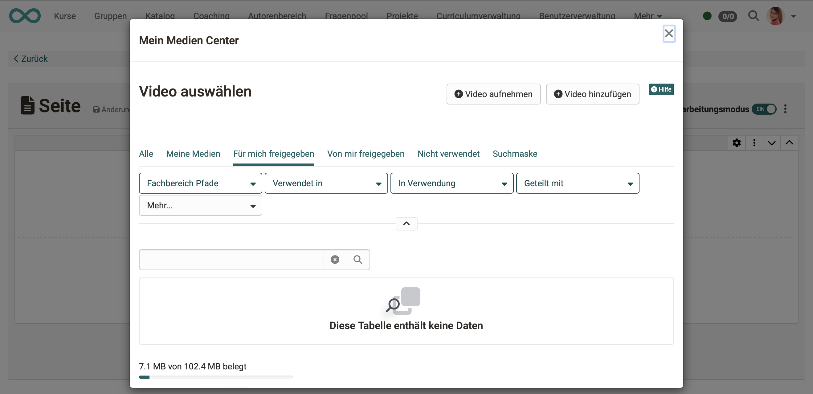
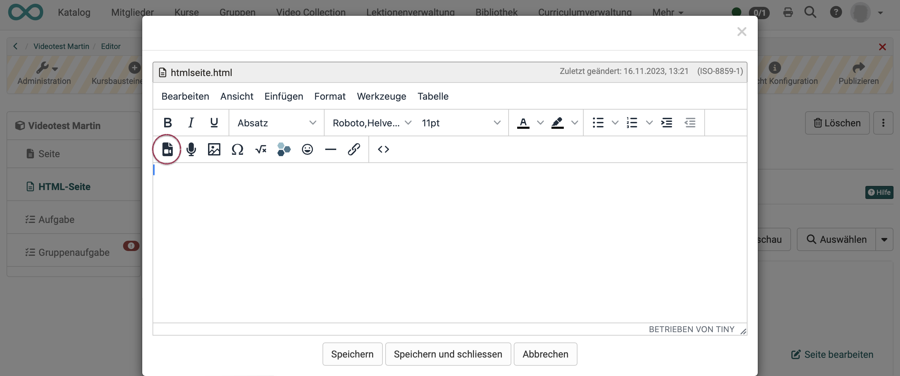
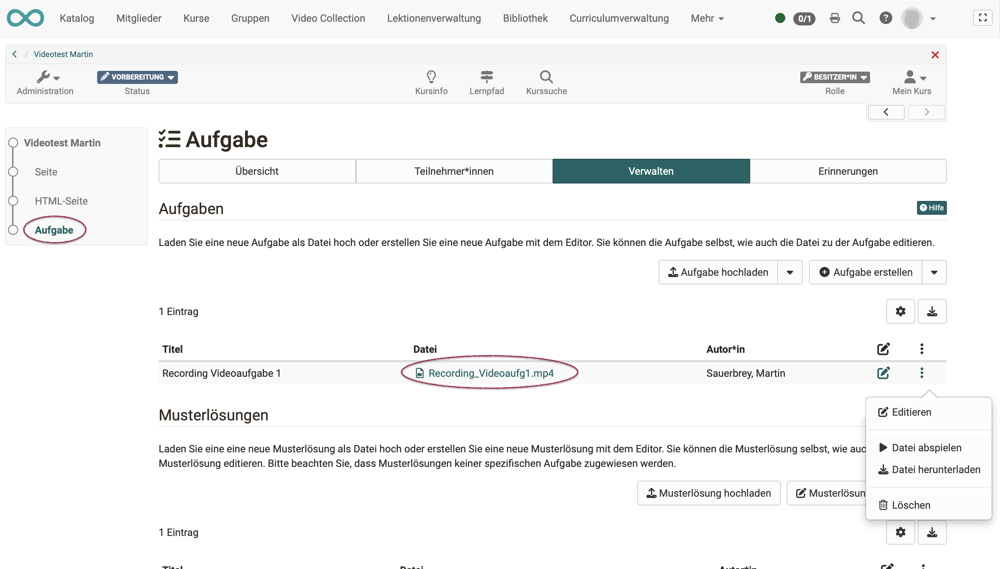
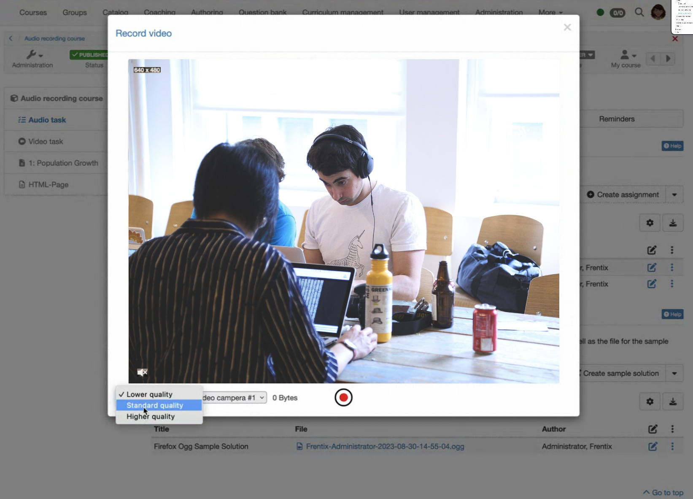
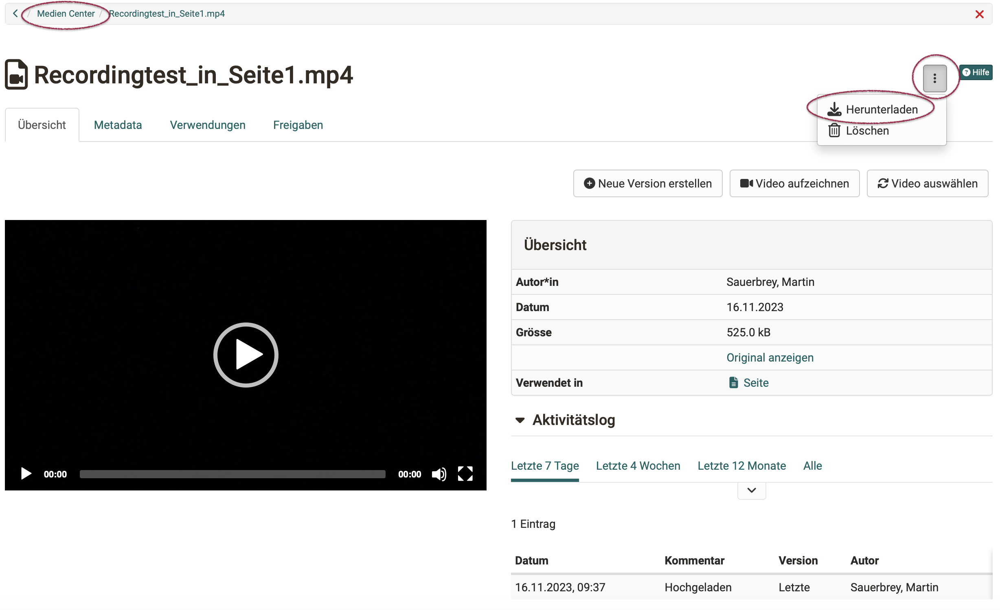

# Video Recording

## Requirements

* If videos are to be recorded in OpenOlat, a camera must first be available. It must always be activated in the device.

* The camera must be enabled for OpenOlat so that it can also be used for recordings in OpenOlat.

* *Only MacOS:* In browsers other than Safari, the general permission to use the microphone 
  and the camera must be granted. Set these permissions on the Mac under 
  **System Settings -> Privacy & Security -> Microphone** and 
  **System Settings -> Privacy & Security -> Camera** 
  for the browser(s) you use for OpenOlat.

* On the other side, the **option for video recordings** must be activated in OpenOlat by the administrator: 
**Administration > Module > Audio-/Video Recorings**

* The settings for the **transcoding** of the recordings (settings for file size and image quality) are also made under 
**Administration > Module > Audio-/Video Recording**.

## Where can videos be recorded in OpenOlat?

### Recording in the Media Center
 
Open the **personal menu** by clicking on the small picture or triangle at the top right.
Then open the Media Center.

The options for adding new media files also include **"Record video"**.

{ class=" shadow lightbox" }

### Recording in the course element page

A video can also be inserted within a layout element in the course element Page.

{ class=" shadow lightbox" }

Once you have decided on this, a pop-up appears to select an existing video. The pop-up also contains a button for recording your own video.

{ class=" shadow lightbox" }

### Recording in the HTML page course element

The HTML editor (Tiny) used in OpenOlat is also used for inserting and recording videos. The option to record a video is located under the tools that are also used to insert existing media.

{ class=" shadow lightbox" }

!!! Note "Note"

    In principle, video recordings are possible in the HTML editor, but in some places not all editing options are offered when the editor is called up for various reasons. It is therefore possible that the option to record a video is offered when the HTML editor is called up, but not when it is called up from another location. 

### Recording in the course element Task

The option to record videos in a task is embedded in the workflow. You will find the recording function in the step where the video is to be inserted as a task or sample solution.

{ class=" shadow lightbox" }

{ class=" shadow lightbox" }

For video recordings that are recorded in the course element "Task", there is currently no option for saving and linking in the Media Center.

### Recording in the course element Group task

The video recording in the "Group task" course element works in the same way as in the "Task" course element.

## Where are the video recordings stored?

**Videos recorded within a course element** are also saved for this course element.
The recordings are not listed in the author area, storage folder or in the Media Center (exception: course element page).

{ class=" shadow lightbox" }

However, if the **Video recording is started in the Media Center**, the video is also saved in the Media Center.

## In what format and quality are recordings saved?

Video recordings made in OpenOlat are always saved as **mp4 files**. This is due to the fact that only the mp4 format is supported by all browsers.

For pure audio it is the m4a format.

The **image size** in which a video is recorded depends primarily on the browser and camera. The size is displayed in the top left of the recording window.

In order to control the memory consumption by videos of the course participants, the **resolution** for the video recordings can only be set by the course owner in the course element "Task", for example. The course participants then make all recordings in this standard quality. 

!!! Note "Empfehlung"

    If possible, use a medium resolution. 
    A large resolution generates significantly larger files and consumes corresponding storage space.
    Although the file size is optimized at a low resolution, the quality of the image may be insufficient. Always take into account the motif you have captured. A higher resolution is justified if details need to be reproduced sharply. With large uniform areas in the image, a low resolution reduces the quality to virtually nothing. 

{ class=" shadow lightbox" }

After a video has been recorded, OpenOlat adjusts the image size, resolution and quality to the preset standards. This **transcoding** is carried out automatically by OpenOlat and the videos are then saved according to the default settings. This ensures that the videos are displayed in a suitable aspect ratio and that the file size is optimized for storage.

## How much storage space is available for my videos??

Example: Media Center 
In the bottom left-hand corner, you can see the available storage space (for the entire Media Center) and how much of it is already occupied. The available space can be determined by the administrator.

{ class=" shadow lightbox" }

## How can video recordings be exported?

### Download from the course element Task and Group task

Both video recordings from the task and video recordings in the sample solution can be downloaded directly in the course element. To do this, use the option under the 3 dots at the end of a line.

{ class=" shadow lightbox" }

### Download from the Media Center

Select and open the desired video in the Media Center. Under the button with the 3 dots you will find the option to download.

{ class=" shadow lightbox" }

!!! Note "Note"

    A video that was recorded within a course element is **not** stored in the course storage folder.
