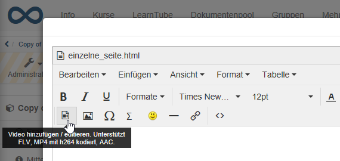
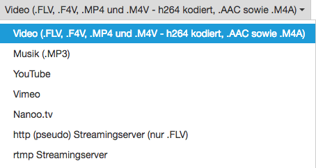
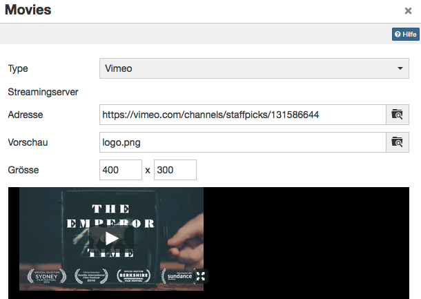
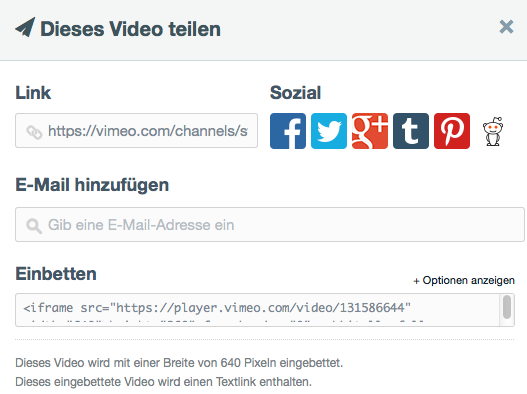
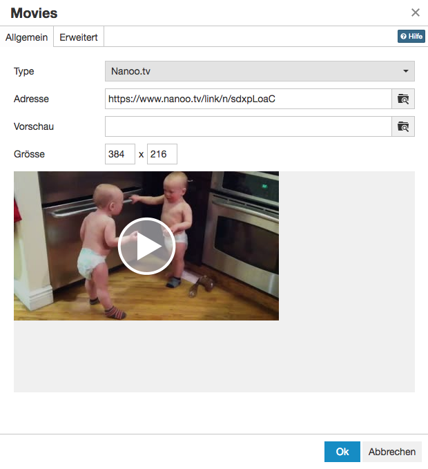

# Videos im Kursbaustein "HTML-Seite"

!!! warning "Achtung"

    Dieser Handbuchartikel ist noch in Bearbeitung.

### Video
reines Abspielen,
hochgeladene videos oder Links z.B. in Youtube 
keine Video-Lernressourcen (also ohne Annotationen, Quiz, usw.)

### Videorecording
Siehe [Videorecording](../learningresources/Video_Recording.de.md)

### Audiorecording
Siehe [Audiorecording](../learningresources/Audio_Recording.de.md)

--- 

Für die weitere Bearbeitung von HTML-Seiten können Sie den OpenOlat Editor nutzen. Er funktioniert ähnlich wie ein Textverarbeitungsprogramm. Eine automatisch erstellte Datei trägt bereits den Namen des Kurselements. Einmal angelegt, öffnen Sie die HTML-Datei mit dem Link "Seite bearbeiten" und Sie gelangen in den OpenOlat HTML Editor.

Im HTML Editor können Sie neben den verschiedenen Formatierungen auch Verlinkungen zu Bildern, Videos, den einzelnen Kursbausteinen des Kurses und zu den Tools in der [Toolbar](../learningresources/Using_Additional_Course_Features.de.md) einfügen.

Sie können auch Dateien die Sie zuvor erstellt haben in den Ablageordner des Kurses hochladen oder einen Ressourcenordner mit dem Kurs und dem Ablageordner verbinden. Über den Link "Auswählen" werden Ihnen alle Dateien angezeigt, die sich im Ablageordner befinden. Anschliessend können Sie diese Dateien über den Kursbaustein "Einzelne Seite" verlinken und so in Ihren Kurs einbinden. Dieser Weg empfiehlt sich, wenn Sie die Strukturierung des Ablageordners selbst beeinflussen möchten.

Mit der "Einzelnen Seite" können auf verschiedene Weise Videos und Audios in den Kurs eingebunden werden. Detaillierte Information finden Sie [hier](../learningresources/Single_Page_Add_edit_video.de.md).

Die Dateien können bei Bedarf später auch wieder ausgetauscht werden.

!!! warning "Achtung"

    Öffnen und speichern Sie HTML-Seiten, die Sie mit einem externen Editor
    erstellt haben, nicht mit dem eingebauten HTML-Editor, da dadurch Teile der Formatierung verloren gehen können. Der OpenOlat HTML-Editor enthält nur den < body > Bereich einer HTML Seite. Sollen Einträge im HTML < head > vorgenommen werden, muss dies in einem externen Editor erfolgen.

Unter "Sicherheitseinstellungen" können Sie festlegen, ob Verweise in Ihren HTML-Seiten nur auf Dateien des gleichen Ordners und auf darin enthaltene Unterordner möglich sind, oder ob alle Dateien des Ablageordners referenziert werden können. Dies ist beispielsweise notwendig, wenn Ihre HTML Seite Grafiken, CSS-Dateien oder Skripte enthält, die sich in anderen Ordnern befinden.

Ferner können Sie definieren, ob Betreuer die hinterlegte HTML-Datei bearbeiten dürfen. Die Betreuer benötigen dafür keine Kursbesitzerrechte oder Zugang zum Kurseditor.

##  Video hinzufügen / editieren

Eine weitere Möglichkeit Videos in OLAT Kursen einzubinden ist die Verwendung des Kursbausteins "**Einzelne Seite**".

Im Kursbaustein "Einzelne Seite" steht Ihnen ein Editor zur Verfügung über den Sie auch Videos in eine HTML-Seite einbinden können. Im Tab "Seiteninhalt" können Sie den Editor öffnen und gelangen zum Button "Video hinzufügen / editieren".

  

Für die Anzeige greift das Tool auf den in OpenOlat integrierten Mediaplayer zurück, was einige Vorteile hat.  

1. Der Player erkennt das Format selbst, solange die Video- und Audio-Daten richtig codiert sind.  
2. Der Player erkennt, ob ein Benutzer mit einem HTML5-fähigen und Codec- kompatiblen mobile-Browser auf das Video zugreift. In dem Fall werden die Filme mit einem HTML5-Tag versehen und können problemlos auch auf iPad o.ä. angezeigt werden.  

!!! tip "Tipp"

    Sie können Ihrer Mediendatei auch noch ein Startbild (Vorschau) hinzufügen.

Im Folgenden finden Sie die wichtigsten Informationen zur Nutzung des in Einzelseiten verwendeten TinyMCE Plugins "Video hinzufügen / editieren" (Unterstützt FLV, MP4 mit h264 codiert, AAC).

### Empfohlenes Format

In der Praxis hat sich der **mp4** (oder MPEG-4) Container mit dem H.264 Video-Codec für Video und dem **mp3** Audio-Codec für Audio etabliert. Aktuelle Versionen von Firefox, Chrome und Safari können solche Videos abspielen.

Die folgenden Optionen stehen Ihnen zur Verfügung:

| Option |  Beschreibung  |
---|---  
Video | Einbindung eines Videos mit spezifischer Codierung.  
Musik | Einbindung eines Audio-Files ohne Video.  
YouTube / Vimeo / Nanoo.tv | Einbindung eines YouTube / Vimeo / Nanoo.tv - Videos  
http | Streaming mit Flash-Datei von einem Webserver  
rtmp | Streaming mit Flash-Datei von einem speziellen Streaming-Server  
  
#### Video (.FLV, .F4V, .MP4 und .M4V - h264 kodiert, .AAC sowie .M4A)

Diese Einstellung eignet sich für die Integration von Videos auf OpenOlat am Besten. Als Container-Formate, d.h. die Formate die hochgeladen werden können, eignen sich die folgenden Kennzeichnungen:

| Format Container | Bezeichnung des Containers | Beschreibung  |
| ---|---|---  |
| .FLV | Flash Container | Flash-Videos mit Video und Audio, von Adobe definiert (Achtung: Flash Player
muss aktiviert sein)  
  .F4V | | Kein Container, sondern reines Video-Format ohne Audio, von Adobe definiert  
  .MP4| MPEG-4|MP4 Video- und Audioformat, von MPEG-Verbund definiert, verschiedene Codecs  
  .M4V|MPEG-4|MP4 Videoformat mit H.264 Videocodec und MP3 oder AAC Audiocodec; Format für iTunes  
  
In das Adressfeld können Sie entweder den Link auf das Video direkt eingeben oder die Datei entsprechend hochladen.

!!! tip "Tipp"

    Um optimale Kompatibilität sicherzustellen sollte ein MPEG-4 Container mit H.264 Kodierung für Video und AAC oder MP3 Kodierung für Audio verwendet werden. 
    
    Als Dateiendung stehen somit .mp4 oder .m4v zur Verfügung, wobei .m4v nicht von allen Geräten abgespielt werden kann. 
    
    Von Flash Filmen wird abgeraten, da diese auf vielen mobilen Geräten wie z.B. das iPad grundsätzlich nicht abspielbar sind.

#### YouTube  

YouTube Filme werden direkt verlinkt, d.h. die Auswahlbox für das Hochladen einer Datei wird hier nicht benötigt. Videos können mit dieser Konfiguration **direkt integriert** werden.

  

Benutzen Sie als "Adresse" einen direkten Link zu dem Video, erhältlich unter dem Link "**Teilen**".

#### Vimeo  

Vimeo Videos werden in OpenOlat ebenfalls direkt verlinkt. Unter "Adresse" geben Sie den Link des gewünschten Videos ein.

  

Einen direkten Link zum Vimeo-Video finden Sie unter dem Link "**Share**".  

#### Nanoo.tv

Videos von der Plattform [Nanoo.tv](https://portal.nanoo.tv/) können direkt verlinkt werden. Für die Nutzung und Anzeige der Videos ist ein Nanoo.tv-Account notwendig.

Über die URL kann - unabhängig vom Browser - gesteuert werden, ob das Video sofort automatisch startet oder nicht. Dafür muss die URL hinter /link/ entsprechend angepasst werden.

  * automatisch starten mit "n": https://www.nanoo.tv/link/ **n** /sdxpLoaC
  * manuell starten mit "v": https://www.nanoo.tv/link/ **v** /sdxpLoaC

Die Einstellungen im Tab "Erweitert" funktionieren hier nicht.

##### http (pseudo) Streamingserver (nur .FLV)

Mit dieser Funktion können **Flash-Filme** im Format **.flv** integriert werden. Wenn die Filme am Ursprungsort richtig exportiert werden, enthalten sie eine Indexierung. Mit Hilfe dieses Inhaltsverzeichnisses kann man auch innerhalb des Films schnell an eine beliebige Stelle springen, der Film muss nicht erst komplett geladen werden. Es handelt sich dabei nicht um ein richtiges Streaming, bei diesem muss auch auf dem Server eine entsprechende Streaming- Software installiert sein muss.

In das Feld "Streamingserver" muss die Adresse des Servers eingegeben werden. Unter "Adresse" wird die Adresse des eigentlichen Films eingegeben.

!!! warning "Achtung"

    Da mit dieser Variante der Einbettung die Inhalte nicht auf dem iPad und den meisten anderen mobilen Geräten angesehen werden können wird dieses Vorgehen **nicht empfohlen**.

#### rtmp Streamingserver

Mit dieser Funktion kann ein Flash Streaming-Server genutzt werden. Dabei wird ein spezielles Protokoll verwendet: RMTP - Real Time Messaging Protocol. Als Streaming-Server können verschiedene Produkte verwendet werden, z.B. das Akamai Netzwerk.

Dieses von Adobe entwickelte Protokoll ermöglicht die Übertragung des Videos vom Server zum Flash Player. Häufig kommt es bei dieser Variante aber zu Problemen mit Port-Einstellungen und Firewalls.

!!! warning "Achtung"

    Da mit dieser Variante der Einbettung die Inhalte nicht auf dem iPad und den meisten anderen mobilen Geräten angesehen werden können wird dieses Vorgehen **nicht empfohlen**.

    Da Flash von den meisten Browsern nicht mehr oder nur sehr eingeschränkt unterstützt wird, sollte generell auf den Einsatz von flashbasierten Videos verzichtet werden.

#### HTML5 Video

OpenOlat unterstützt auch HTML5 Videos welche in einer HTML Seite mit externen Werkzeugen eingebunden wurde. In diesem Fall muss der Autor selbst dafür sorgen, dass in dem HTML Tags verschiedene alternative Videoformate angegeben wurden (z.B. m4v und ogg) und diese allenfalls auch in unterschiedlichen Auflösungen in OpenOlat abgelegt werden.

OpenOlat unterstützt in diesem Fall das Pseudo-Streaming mittels Progressive Download bzw. Range-Requests.  

