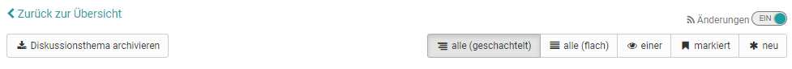
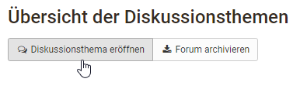

# Arbeiten mit Foren

## Wofür kann ein Forum verwendet werden?

Foren sind die zentralen Werkzeuge für die asynchrone Diskussion in Online-
Kursen und auch in OLAT Gruppen. Foren können für den Austausch zwischen den
Kursteilnehmenden, für organisatorische Absprachen oder die fachliche
Diskussion mit dem Lehrenden verwendet werden. Einige Online-Methoden
verwenden auch gezielt Foren z.B. für Pro-Contra-Diskussionen, die
strukturierte Sammlung von Ideen zu bestimmten Aspekten (Brainstorming) usw.

## Wie können Lernende ein Forum nutzen?

In einem Forumsthread stehen Ihnen folgende Optionen zur Verfügung:

Teilnehmer können in Foren ...

### Diskussionsthemen eröffnen

Wenn Sie im Forum eine neue Nachricht verfassen möchten, wählen Sie
„Diskussionsthema eröffnen“. Titel und Beitrag sind obligatorische Angaben.
Achten Sie darauf einen aussagekräftigen Titel zu verwenden und bei Reply-
Postings angemessen zu verändern.

Mit Hilfe des Foren-Editors können Sie Ihren Beitrag erstellen und formatieren
und auch Dateien anhängen. Je nach Konfiguration durch den Kursbesitzer können
Sie Ihren Beitrag eventuell auch unter einem Pseudonym veröffentlichen.

### Forumsbeiträge beantworten*

Wenn Sie einen bestehenden Forumsbeitrag beantworten möchten, öffnen Sie das
Diskussionsthema, indem Sie auf den Titel des Themas klicken. Wählen Sie dann
„Antwort mit Zitat“, wenn der Anfangsbeitrag unter Ihrer Antwort erscheinen
soll bzw. Sie direkt auf einzelne Passagen des Beitrags eingehen wollen. Oder
wählen Sie „Antwort ohne Zitat“, um den Anfangsbeitrag nicht nochmals
aufzuführen.

### Forumsbeiträge markieren

Einzelne Forumsbeiträge können markiert werden. Klicken Sie dazu in der
Detailansicht eines Themas auf die kleine Flagge in der rechten oberen Ecke
eines Beitrags. In der Forumsübersicht sehen Sie wie viele Beiträge pro Thema
markiert wurden. Auf diese Weise können einzelne Beiträge leichter
wiedergefunden oder für eine spätere Beantwortung gekennzeichnet werden.

### Foren archivieren

Wenn Sie das Forum archivieren, werden Forumsbeiträge und angefügte Dateien in
eine ZIP-Datei verpackt und können gespeichert werden.

### Foren abonnieren

:octicons-device-camera-video-24: **Video-Einführung**: [Abonnements](<https://www.youtube.com/embed/h9gOqt7TR7Q>){:target="_blank”}

Um bei neuen Forumsbeiträgen benachrichtigt zu werden, stellen Sie in der
Übersicht der Diskussionsthemen den Schieberegler bei den "Änderungen“ auf
"Ein". Dann erhalten Sie per E-Mail oder unter
Abonnements im Bereich "Persönliche Werkzeuge" eine Benachrichtigung. Dabei ist es egal ob
ein neuer Beitrag von einem registrierten OLAT Benutzer oder einem Gast
eingestellt wurde.

Eine Benachrichtigung erfolgt nur, wenn ein neuer Beitrag erstellt wurde,
nicht aber wenn ein bestehender Beitrag geändert wurde!

Sie können Ihrem Posting auch Dateien anhängen, z.B. wenn Ihr Beitrag
umfangreicher ist oder Sie sich auf eine bestimmte Datei beziehen. Als
Faustregel gilt: Postings, die länger sind als eine DIN A4 Seite sollten im
Anhang angefügt und im Posting selbst nur kurz angerissen werden. Sie können
Ihr Posting zu einem späteren Zeitpunkt auch wieder editieren oder löschen,
sofern noch niemand auf Ihren Beitrag geantwortet hat.

Es ist möglich, dass Kursteilnehmende vom Lehrenden zusätzlich
Moderationsrechte in einem Forum erhalten. Was genau damit verbunden ist,
erfahren Sie im Kapitel „[Kommunikation und
Kollaboration](../learningresources/Communication_and_Collaboration.de.md)“.

### Welche Darstellungsmöglichkeiten für Foren-Threads gibt es?

Es gibt verschiedene Darstellungsmöglichkeiten:

* alle (geschachtelt)
* alle (flach)
* einer
* markiert
* neu

User können sich alle Beiträge untereinander anzeigen lassen (alle), mit oder
ohne Einrückung. Der Startbeitrag erscheint dabei als erster und die weiteren
Beiträge werden entsprechend der Diskussionsstruktur angezeigt. Bei
umfangreichen Foren mit vielen Beiträgen bietet es sich an, sich über den
Button "neu", nur die neuen Beiträge anzeigen zu lassen. Besonders interessant
für komplexere Diskussionen ist auch die Ansicht "einer". Hier wird die
gesamte Thread-Struktur angezeigt und kann so sehr gut nachvollzogen werden.
Hilfreich dabei ist es, dass sich einzelne Parts ein- und ausblenden lassen.
Darüber hinaus erkennt man in dieser Darstellung auch rasch neue Forenbeiträge
an dem Sternchen.

Laden Sie impages
"[Profil](../personal_menu/Configuration.de.md#profil--profile)" ein Foto hoch, damit neben Ihren Forumsbeiträgen anstelle des
Standard-Profilbildes Ihr Foto erscheint.

###

**Dateidiskussion**

Die Dateidiskussion stellt eine Kombination aus Forum und Dateibereitstellung
dar. So können in Kursen Foren-Diskussionen zu bestimmten Dokumenten erstellt
werden z.B. zu einem Entwurf einer Seminararbeit, einem Bild, einem Konzept
oder einem inhaltlichen Dokument. Zu jeder hochgeladenen Datei wird
automatisch ein Forum erstellt.

Um an einer Diskussion teilzunehmen, klicken Sie auf den Link „Anzeigen“ neben
dem Dateinamen. Nun haben Sie dieselben Möglichkeiten, Diskussionsthemen zu
eröffnen oder Beiträge zu beantworten wie im Forum.

### Datei hochladen**

Standardmäßig können Kursteilnehmer keine Dateien hochladen. Diese Option kann
aber vom Kursbesitzer im Kurseditor aktiviert werden. Wenn Sie über diese
Möglichkeit verfügen, wählen Sie „Datei hochladen“, um eine eigene Datei
hochzuladen. Wer wann welche Datei hochgeladen hat ist über die Spalten
Vorname, Nachname bzw. Datum erkennbar.
