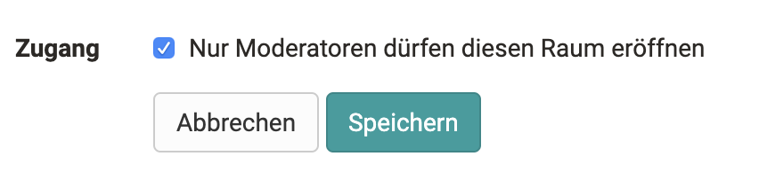
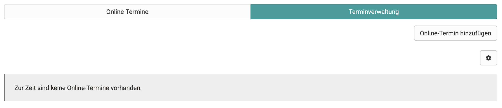
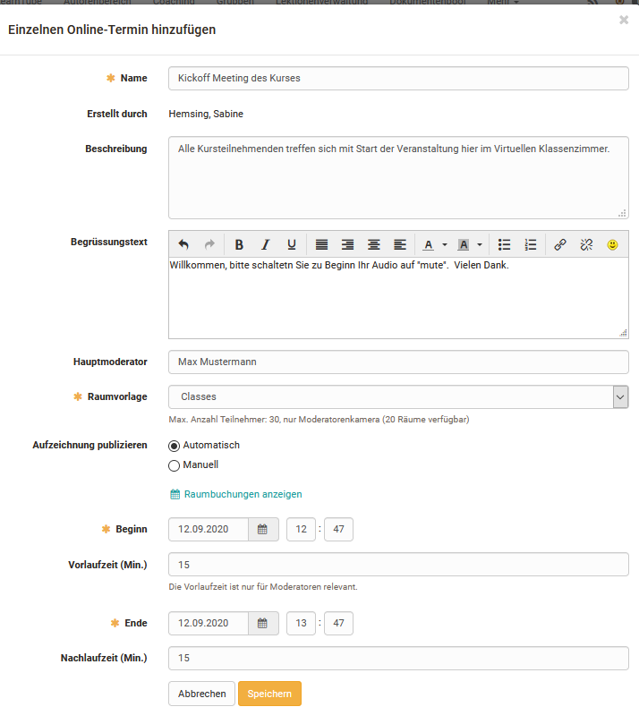
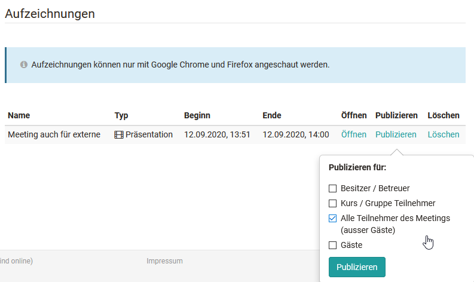

# Kursbaustein "BigBlueButton"

## Steckbrief

Name | BigBlueButton
---------|----------
Icon | :o_icon_o_vc_icon:
Verfügbar seit | 
Funktionsgruppe | Kommunikation und Kollaboration
Verwendungszweck | Integration der Webkonferenz-Software BigBlueButton
Bewertbar | nein
Spezialität / Hinweis | BigBlueButton ist eine Open-Source-Software (LGPL-Lizenz). Um den Kursbaustein zu nutzen, ist ein separates Serverhosting erforderlich.

## Allgemeines [:octicons-tag-16:{ title="ab Release 17.1 (OO-5191)" }](https://track.frentix.com/issue/OO-5191){:target="_blank"}

!!! note "Hinweis"

    BigBlueButton ist eine Open-Source-Software (LGPL-Lizenz). Um den Kursbaustein zu nutzen, ist ein separates Serverhosting erforderlich. Anbieter-Webseite: <https://bigbluebutton.org/>

:octicons-device-camera-video-24: **Video-Einführung**: [BigBlueButton](https://www.youtube.com/embed/yVZ4V4rXUJQ){:target="_blank"}

### Funktionen der Software

BigBlueButton ermöglicht virtuelle Klassenräume mit folgenden Funktionalitäten:

* Webcam- und Audio-Unterstützung
* Folienpräsentation, zum Beispiel als PDF
* Screensharing
* Multi-User-Whiteboard
* Umfrage-Funktionen
* Gruppenräume, Gruppenchat
* Privater Chat
* Gemeinsame Notizen

### Systemvoraussetzungen

BigBlueButton ist eine browserbasierte Software-Lösung und benötigt keine zusätzlichen Plugins oder Installationen. Für den vollen Funktionsumfang (für Betreuer:innen und Teilnehmende) wird **Google Chrome** oder **Mozilla Firefox** empfohlen. Unter Windows lässt sich auch die neue Version von **Edge mit Chromium Engine** verwenden. Für das Teilen des eigenen Bildschirms empfiehlt sich **Google Chrome**.

## Konfiguration im Kurseditor

Bei der Einbindung von BigBlueButton im Kurs lässt sich festlegen, ob die Online-Termine des Kursbausteins nur durch die Moderierenden oder auch durch Teilnehmende gestartet werden können. Moderierende sind die Besitzer:innen und Betreuer:innen des Kurses. Die Einstellung steht unter `Kurseditor > Kursbaustein BigBlueButton > Konfiguration` im Feld "Zugang" als Option "Nur Moderatoren dürfen diesen Raum eröffnen". Ist die Option gesetzt, können Teilnehmende den Online-Termin erst betreten, wenn die Moderation ihn gestartet hat.

{ class="shadow lightbox" }

## Räume erstellen, konfigurieren und betreten [:octicons-tag-16:{ title="ab Release 17.1 (OO-5191)" }](https://track.frentix.com/issue/OO-5191){:target="_blank"}

Folgende Einstellungen erfolgen bei geschlossenem Editor.

### Tab "Terminverwaltung"

Im Tab "Terminverwaltung" legen die Besitzer:innen des Kurses neue Online-Termine an und konfigurieren sie. Bereits angelegte Online-Termine lassen sich hier auch kopieren oder löschen.

{ class="shadow lightbox" }

Folgende Varianten lassen sich erstellen:

* **Einzelnen Online-Termin hinzufügen**
  Bietet sich an, wenn es nur einen konkreten Termin für den Kursbaustein geben soll.
* **Permanente Reservierung hinzufügen**
  Eignet sich für einen BigBlueButton-Raum, der permanent zur Verfügung steht und mehrfach genutzt wird.
* **Täglich wiederkehrende Online-Termine hinzufügen**
  Erstellt rasch tägliche Termine.
* **Wöchentlich wiederkehrende Online-Termine hinzufügen**
  Erstellt rasch wöchentliche Termine, zum Beispiel für Webinar-Serien oder ein Semester.

Die Varianten unterscheiden sich nur in der Erstellung der Termine. Es entstehen separate Online-Termine beziehungsweise Reservierungen, die sich anschliessend einzeln bearbeiten lassen. Je nach Konfiguration des Servers stehen unterschiedliche Auswahlmöglichkeiten bereit.

{ class="shadow lightbox" }

Die Einstellungen im Detail:

**Konfiguration Online-Termin**

* **Name**: Bezeichnung des Termins
* **Erstellt durch**: Der Name der erstellenden Person erscheint automatisch.
* **Beschreibung**: Beschreibung des Termins. Was ist der Inhalt beziehungsweise das Thema der synchronen Session?
* **Begrüssungstext**: Der Text erscheint im BigBlueButton-Raum als Willkommensnachricht im Chatbereich für alle Teilnehmenden.
* **Hauptmoderator:in**: Hier lässt sich der Name einer Person eintragen.
* **Präsentationsfolien**: Laden Sie Ihre Folien bereits im Vorfeld des Meetings über "Präsentationsfolien hochladen" hoch oder löschen Sie bereits hochgeladene Folien.
* **Raumvorlage**: Auswahl der konfigurierten Raumvorlagen. Die Raumvorlage bestimmt die Anzahl Teilnehmende und diverse Voreinstellungen im Online-Meeting. Die Details hängen von der Konfiguration des BigBlueButton-Servers ab.
* **Bevorzugter Server**: In der Regel automatisch gewählt.
* **Aufzeichnungen des Online-Termins zulassen**: ja oder nein
* **Aufnahme automatisch veröffentlichen für**: Wählen Sie hier die Rollen, denen Sie die Aufzeichnung später bereitstellen möchten.
* **Benutzer:in bei Eintritt akzeptieren (Warteraum)**: Legt fest, ob Personen zunächst in einem Warteraum landen und nicht sofort in den Meeting-Raum gelangen. Mit "Abgeschaltet" gelangen alle Personen direkt in den Meeting-Raum. Mit "Alle Benutzer:innen" landen alle im Warteraum. Mit "Nur Gäste und externe Benutzer:innen" gelangen die Teilnehmenden des Kurses direkt in den Meeting-Raum, alle anderen in den Warteraum.
* **Darstellung**: Standard oder Webcam-Termin, abhängig von der Konfiguration durch die BigBlueButton-Administration
* **Gäste**: Mit "erlauben" öffnen Sie den Online-Termin für Gäste. Die Option erscheint nur, wenn der Kurs selbst für Gäste freigeschaltet ist.
* **Zugang externe Benutzer:innen**: Sofern die Administration diese Option erlaubt hat, lässt sich hier die URL anpassen, die Sie an externe Personen versenden. Der Link erscheint anschliessend auch für Besitzer:innen und Betreuer:innen, bevor sie den Raum betreten. Teilnehmende sehen den Link nicht.
* **Passwort für externe Benutzer:innen**: Hinterlegen Sie hier ein Passwort, das Gäste, also Personen ohne OpenOlat Account, für den Zutritt zum Raum eingeben müssen.
* **Raumbuchungen anzeigen**: Kalenderansicht zur Prüfung von belegten Online-Meetings

Nur bei termingebundenen Räumen:

* **Beginn**: Geben Sie den Starttermin ein.
* **Vorlaufzeit (Min.)**: 0 bis 30 Minuten konfigurierbare Vorlaufzeit. In dieser Zeit können Betreuer:innen und Besitzer:innen das Meeting bereits starten, Teilnehmende dagegen nicht. So lässt sich zum Beispiel eine Präsentation vorbereiten.
* **Ende**: Ende des Meetings. Die maximale Laufzeit eines Meetings hängt von der gewählten Raumvorlage ab.
* **Nachlaufzeit (Min.)**: 0 bis 30 Minuten konfigurierbare Nachlaufzeit. Das Meeting verlängert sich nach Erreichen der Endzeit automatisch für alle Personen um die Nachlaufzeit. Es erscheint eine Anzeige mit der verbleibenden Konferenzzeit.

Nur bei wiederkehrenden Terminen:

* **Start wiederkehrendes Datum**: 1. Online-Termin. Bei wöchentlicher Wiederholung entspricht dies dem Wochentag der Serie.
* **Ende wiederkehrendes Datum**: Ende der wiederkehrenden Termine

Bei wiederkehrenden Terminen lassen sich die Termine im zweiten Prozessschritt "Datum" vor der Erstellung bearbeiten, löschen oder mit freien Daten ergänzen.

!!! warning "Achtung"

    Sobald ein BigBlueButton-Meeting gestartet, das heisst der Online-Raum geöffnet wurde, lassen sich die Einstellungen am Online-Termin nicht mehr bearbeiten.

### Tab "Online-Termine" [:octicons-tag-16:{ title="ab Release 15.2 (OO-4818)" }](https://track.frentix.com/issue/OO-4818){:target="_blank"}

Über den Tab "Online-Termine" erhalten Sie Zugang zu einem bestimmten Online-Termin beziehungsweise Raum.

Besitzer:innen und Betreuer:innen des Kurses können ihre Präsentationen bereits im Vorfeld hochladen, so dass sie bei Beginn des Meetings zur Verfügung stehen. Direkt angezeigt wird das oberste Dokument der Liste.

{ class="shadow lightbox" }

#### Aufzeichnungen

Die Aufzeichnungen eines Meetings finden Sie ebenfalls im Tab "Online-Termine". Automatisch veröffentlichte Aufzeichnungen sind hier direkt wählbar. Erfolgt die Veröffentlichung manuell, sehen zunächst nur Besitzer:innen und Betreuer:innen die Aufzeichnungen und legen fest, für welche Zielgruppe die Aufzeichnung bereitstehen soll. Je nach Serverkonfiguration steht auch ein Download einer Aufzeichnung zur Verfügung.

!!! warning "Achtung"

    Die Einstellungen unter "Publizieren" wie auch unter "Löschen" gelten sowohl für die Aufzeichnung als auch für den Download. Löschen Sie einen Eintrag, wird die gesamte Aufzeichnung gelöscht.

{ class="shadow lightbox" }

## Kalender Anzeige

Sofern es einen Kalender im Kurs gibt, erscheinen die BigBlueButton-Termine ebenfalls im Kalender.

In der Konfiguration eines Raums lässt sich sowohl während der Erstellung als auch später beim Bearbeiten über den Link "Raumbuchungen anzeigen" eine Übersicht über alle gebuchten BigBlueButton-Räume der Instanz einsehen. Das erleichtert es, zeitliche Engpässe beziehungsweise eine starke Auslastung des Systems frühzeitig zu erkennen und gegebenenfalls einen anderen Termin zu wählen.

Zusätzlich erscheinen die in BigBlueButton erstellten Online-Termine automatisch im kursspezifischen Kalender. Von hier aus gelangen alle Kursmitglieder rasch in den entsprechend verlinkten BigBlueButton-Raum.

{ class="shadow lightbox" }

## Teilnehmerperspektive

Rufen Teilnehmende einen BigBlueButton-Kursbaustein auf, sehen sie die Liste "Aktuelle und zukünftige Online-Termine" und, sofern vorhanden, die Liste "Abgelaufene Online-Termine". Permanente Reservierungen stehen ohne Datum in der ersten Liste. Ein Klick auf "Auswählen" führt zur Detailansicht des jeweiligen Online-Termins.

{ class="shadow lightbox" }

Aktuelle Sessions starten Sie mit "Meeting beitreten". Damit gelangen Sie in den BigBlueButton-Raum.

{ class="shadow lightbox" }

Abgelaufene Online-Termine lassen sich nicht mehr betreten. Die Detailansicht gibt aber Zugriff auf vorhandene Aufzeichnungen des Meetings. Betreuer:innen und Besitzer:innen des Kurses können Aufzeichnungen hier auch löschen.

## BigBlueButton Meeting Raum

{ class="shadow lightbox" }

Der Raum gliedert sich in die Personenliste mit den geteilten Notizen, den Chat-Bereich mit der Texteingabe, den Präsentationsbereich für Folien und den Webcam-Bereich. Am rechten Rand stehen die Whiteboard-Werkzeuge, oben die Schaltfläche zum Start der Aufzeichnung und die allgemeinen Einstellungen. Die Leiste am unteren Rand steuert Audio, Webcam und Screensharing sowie Umfragen, den Upload und das Teilen von Videos.

Der angezeigte Willkommenstext lässt sich bei der Einrichtung des Raums anpassen. Sofern Personen ein Profilbild hinterlegt haben, erscheint dieses auch in der Personenliste.

Je nach Raumeinstellung stehen unterschiedliche Möglichkeiten im Raum zur Verfügung.

## BigBlueButton für Gäste [:octicons-tag-16:{ title="ab Release 15.1 (OO-4733)" }](https://track.frentix.com/issue/OO-4733){:target="_blank"}

Je nach Konfiguration der BigBlueButton-Raumvorlage lassen sich Konferenz-Räume auch für Personen ohne OpenOlat Account zugänglich machen, also für externe Personen beziehungsweise Gäste.

!!! note "Gastzugang"

    Voraussetzung ist ein herkömmlicher Kurs, kein Lernpfad-Kurs, und der Kurs selbst muss für Gäste freigeschaltet sein. Gäste geben bei der Einwahl in den Raum einen beliebigen Namen ein. Mehr dazu unter [Gastzugang](../../basic_concepts/guest_access.de.md).

Der Gästelink erscheint auch für Besitzer:innen und Betreuer:innen des Kurses, bevor sie den Raum betreten. Zusätzlich lässt sich während der Konfiguration des Raums ein Passwort für Gäste generieren.

{ class="shadow lightbox" }
