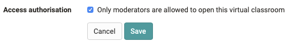
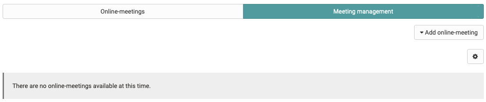
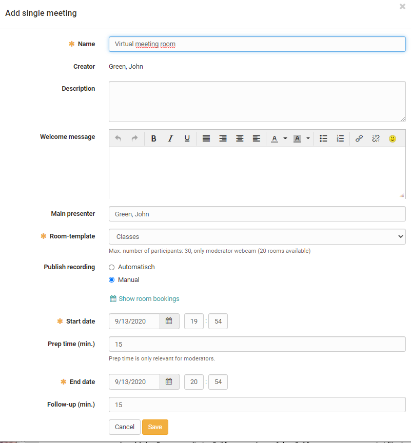
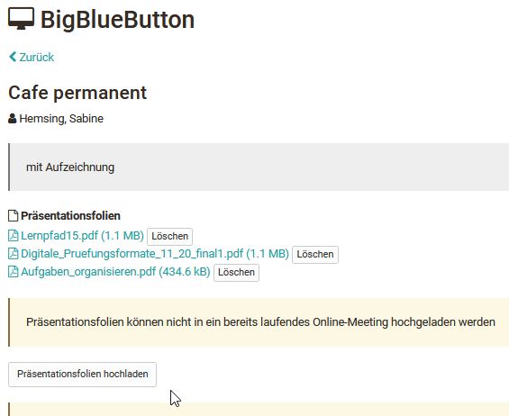
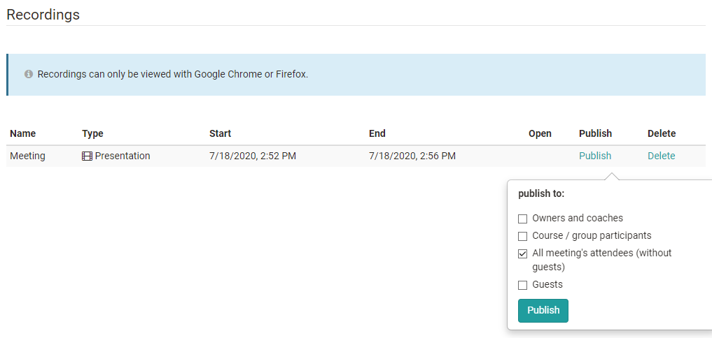
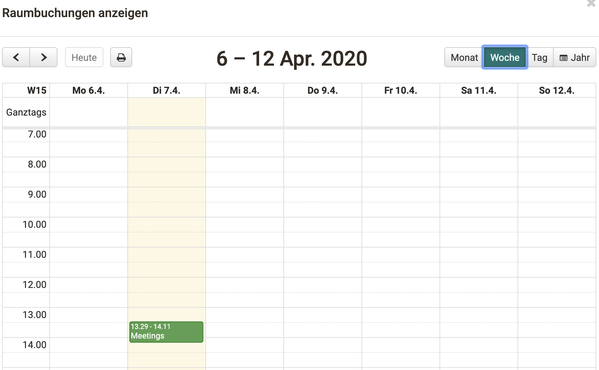
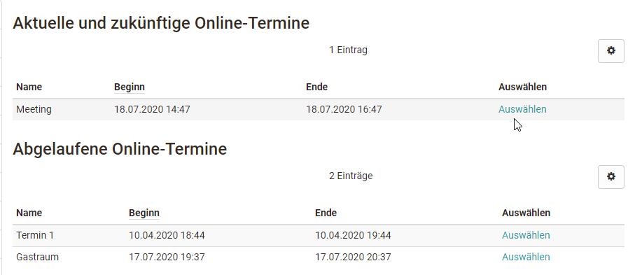
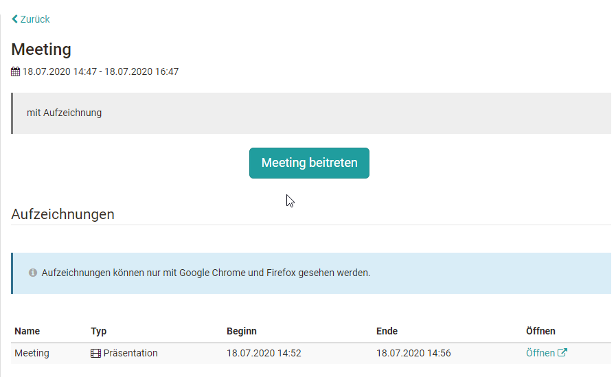
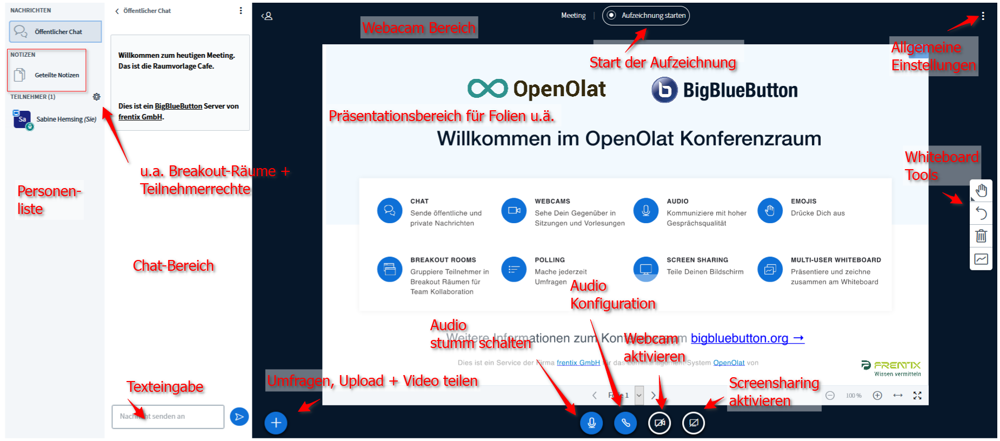
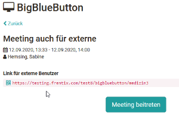

# Course Element "BigBlueButton"

## Profile

Name | BigBlueButton
---------|----------
Icon | :o_icon_o_vc_icon:
Available since | 
Functional group | Communication and collaboration
Purpose | Integration of the BigBlueButton web conferencing software
Assessable | no
Specialty / Note | BigBlueButton is an open source software (LGPL license). To use the course element, a separate server hosting is required.

## General [:octicons-tag-16:{ title="from Release 17.1 (OO-5191)" }](https://track.frentix.com/issue/OO-5191){:target="_blank"}

!!! note "Note"

    BigBlueButton is an open source software (LGPL license). To use the course element, a separate server hosting is required. Provider website: <https://bigbluebutton.org/>

:octicons-device-camera-video-24: **Video introduction (German)**: [BigBlueButton](https://www.youtube.com/embed/yVZ4V4rXUJQ){:target="_blank"}

### System functions

BigBlueButton enables virtual classrooms with the following functionalities:

* Webcam and audio support
* Slide presentation, for example as PDF
* Screen sharing
* Multi-user whiteboard
* Survey functionality
* Group rooms, group chat
* Private chat
* Shared notes

### System requirements

BigBlueButton is a browser-based software solution and requires no additional plug-ins or installations. For full functionality (for coaches and participants) **Google Chrome** or **Mozilla Firefox** is recommended. On Windows the new version of **Edge with Chromium Engine** can also be used. For sharing your own screen, **Google Chrome** is recommended.

## Configuration in the course editor

When integrating BigBlueButton into a course you can decide whether the online-meetings of the course element can be started by the moderators only or also by participants. Moderators are the owners and coaches of the course. The setting is located in `Course editor > BigBlueButton course element > Configuration` in the field "Access authorisation" as the option "Only moderators are allowed to open this virtual classroom". If the option is set, participants can only enter the online-meeting once the moderation has started it.

{ class="shadow lightbox" }

## Create, configure and enter rooms [:octicons-tag-16:{ title="from Release 17.1 (OO-5191)" }](https://track.frentix.com/issue/OO-5191){:target="_blank"}

The following settings are made with the editor closed.

### Tab "Meeting management"

In the tab "Meeting management" the owners of the course create and configure new online-meetings. Online-meetings that already exist can also be copied or deleted here.

{ class="shadow lightbox" }

The following variants can be created:

* **Add single meeting**
  Useful if there is to be only one specific date for the course element.
* **Add permanent meeting room**
  Suitable for a BigBlueButton room that is permanently available and used several times.
* **Add daily recurring meeting**
  Creates daily meetings quickly.
* **Add weekly recurring meeting**
  Creates weekly meetings quickly, for example for webinar series or a semester.

The variants only differ in the way the meetings are created. Separate online-meetings or reservations are created, which can then be edited individually. Depending on the configuration of the server, different options are available.

{ class="shadow lightbox" }

The settings in detail:

**Configuration of an online-meeting**

* **Name**: Name of the meeting
* **Creator**: The name of the person who created the meeting is displayed automatically.
* **Description**: Description of the meeting. What is the content or the topic of the synchronous session?
* **Welcome message**: The text is displayed in the BigBlueButton room as a welcome message in the chat area for all participants.
* **Main presenter**: The name of a person can be entered here.
* **Slides**: Upload your slides in advance of the meeting via "Upload slides" or delete slides that have already been uploaded.
* **Room-template**: Selection of the configured room templates. The room template determines the number of participants and various default settings in the online meeting. The details depend on the configuration of the BigBlueButton server.
* **Preferred server**: Usually selected automatically.
* **Allow meeting recording**: yes or no
* **Publish recording automatically for**: Select the roles to which you want to provide the recording later.
* **Accept joining users**: Determines whether people first land in a waiting room and do not enter the meeting room immediately. With "Disabled" all people enter the meeting room directly. With "All users" everybody lands in the waiting room. With "Only guests and external users" the participants of the course enter the meeting room directly, everybody else lands in the waiting room.
* **Layout**: standard or webcam meeting, depending on the configuration by the BigBlueButton administration
* **Guests**: With "allowed" you open the online-meeting for guests. The option only appears if the course itself has been activated for guests.
* **Access external users**: If the administration has allowed this option, the URL that you send to external people can be adjusted here. The link then also appears for owners and coaches before they enter the room. Participants do not see the link.
* **Password for external users**: Enter a password here that guests, i.e. people without an OpenOlat account, must enter to access the room.
* **Show room bookings**: calendar view for checking occupied online-meetings

Only for scheduled rooms:

* **Start date**: Enter the starting date.
* **Prep time (min.)**: 0 to 30 minutes configurable prep time. During this time coaches and owners can already start the meeting, participants cannot. This allows a presentation to be prepared, for example.
* **End date**: End of the meeting. The maximum duration of a meeting depends on the selected room template.
* **Follow-up (min.)**: 0 to 30 minutes configurable follow-up time. After the end time is reached, the meeting is automatically extended by the follow-up time for all people. A display with the remaining conference time appears.

Only for recurring meetings:

* **Start recurring date**: 1st online-meeting. With weekly repetition this corresponds to the weekday of the series.
* **End recurring date**: End of the recurring meetings

For recurring meetings, the meetings can be edited, deleted or supplemented with free dates in the second process step "Dates" before creation.

!!! warning "Attention"

    Once a BigBlueButton meeting has been started, i.e. the online room has been opened, the settings of the online-meeting can no longer be edited.

### Tab "Online-meetings" [:octicons-tag-16:{ title="from Release 15.2 (OO-4818)" }](https://track.frentix.com/issue/OO-4818){:target="_blank"}

The tab "Online-meetings" gives you access to a specific online-meeting or room.

Owners and coaches of the course can upload their presentations in advance so that they are available at the start of the meeting. The top document of the list is displayed directly.

{ class="shadow lightbox" }

#### Recordings

The recordings of a meeting can also be found in the tab "Online-meetings". Automatically published recordings are directly selectable here. If the publication is done manually, only owners and coaches see the recordings at first and define for which target group the recording should be provided. Depending on the server configuration, a download of a recording is also available.

!!! warning "Attention"

    The settings under "Publish" as well as under "Delete" apply to the recording as well as to the download. If you delete an entry, the whole recording is deleted.

{ class="shadow lightbox" }

## Calendar view

If there is a calendar in the course, the BigBlueButton meetings also appear in the calendar.

When configuring a room, an overview of all booked BigBlueButton rooms of the instance can be viewed both during creation and later when editing, using the link "Show room bookings". This makes it easier to identify time bottlenecks or a high system load early on and to choose a different date if necessary.

In addition, the online-meetings created in BigBlueButton automatically appear in the course-specific calendar. From here, all course members can quickly reach the correspondingly linked BigBlueButton room.

{ class="shadow lightbox" }

## View for participants

When participants call up a BigBlueButton course element, they see the list "Current and upcoming online-meetings" and, if available, the list "Past online-meetings". Permanent reservations appear without a date in the first list. A click on "Select" leads to the detail view of the respective online-meeting.

{ class="shadow lightbox" }

You start current sessions with "Join the online-meeting". This takes you into the BigBlueButton room.

{ class="shadow lightbox" }

Past online-meetings can no longer be entered. The detail view still gives access to existing recordings of the meeting. Coaches and owners of the course can also delete recordings here.

## BigBlueButton Room

{ class="shadow lightbox" }

The room is divided into the list of people with the shared notes, the chat area with the text input, the presentation area for slides and the webcam area. The whiteboard tools are located on the right-hand edge, the button to start the recording and the general settings at the top. The bar at the bottom controls audio, webcam and screen sharing as well as polls, upload and video sharing.

The welcome text displayed can be customized when setting up the room. If people have stored a profile picture, this also appears in the list of people.

Depending on the room settings, different options are available in the room.

## BigBlueButton for guests [:octicons-tag-16:{ title="from Release 15.1 (OO-4733)" }](https://track.frentix.com/issue/OO-4733){:target="_blank"}

Depending on the configuration of the BigBlueButton room template, conference rooms can also be made accessible to people without an OpenOlat account, i.e. to external people or guests.

!!! note "Guest access"

    The prerequisite is a conventional course, not a learning path course, and the course itself must be activated for guests. Guests enter a name of their choice when dialling into the room. For more information see [guest access](../../basic_concepts/guest_access.md).

The guest link also appears for owners and coaches of the course before they enter the room. In addition, a password for guests can be generated during the configuration of the room.

{ class="shadow lightbox" }
