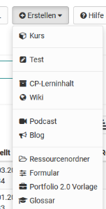

# Verschiedene Typen von Lernressourcen

OpenOlat kennt verschiedene Typen von Lernressourcen. Mit Ausnahme der Kurse
haben diese gemeinsam, dass sie in einem oder mehreren Kursen eingebunden
werden können. Folgende Lernressourcen können direkt in OpenOlat erstellt
werden.

Darüber hinaus können eventuell weitere Formate als Lernressourcen importiert
werden (siehe unten).

Im Folgenden werden die Lernressourcen kurz beschrieben:

## Kurs

Ein OpenOlat-Kurs kann als reiner Online-Kurs eingesetzt werden oder Vorlesungen, Seminare oder andere Präsenzveranstaltungen begleiten. In einem OLAT-Kurs können verschiedene didaktische Konzepte wie Webquest, Gruppenpuzzles, problembasiertes Lernen, gamebasierte Ansätze usw. umgesetzt werden. Ein Kurs ist in OpenOlat ein eigener Dokumententyp der beliebig viele "Kursbausteine" sowie weitere Funktionalitäten enthalten kann. 

Wie Kurse erstellt werden, erfahren Sie im Kapitel ["Kurs erstellen"](Creating_Course.de.md). Details zu Kursbausteinen und dem Kurseditor erfahren Sie im Kapitel ["Kursbausteine"](Course_Elements.de.md).

## Test (QTI 2.1)

Tests können sowohl zu Prüfungs- als auch zu Übungszwecken verwendet werden.
Im ersten Fall können die Kursautoren die Testresultate einsehen und den
Testpersonen zuordnen, im zweiten Fall werden die Resultate anonymisiert
gespeichert. Jeder Test liegt in einem standardisierten Dokumentformat, dem
IMS-QTI-Format, vor.

Mehr Informationen zum Einsatz und Erstellung von Tests finden Sie im Kapitel
["Tests erstellen"](../learningresources/Test.de.md).

## CP-Lerninhalt

Ein Content-Packaging (kurz CP) ist ein Lerninhalt in einem standardisierten E-Learning-Format. Die Spezifikation dieses Datenformats kommt ebenfalls von
[IMS bzw. 1EdTech Consortium](https://de.wikipedia.org/wiki/IMS_Content_Packaging  "IMS bzw. 1EdTech Consortium"). OpenOlat unterstützt die IMS-CP
Version 1.1.2. CPs eignen sich für die Verwendung in OpenOlat-Kursen oder auch
ausserhalb von OpenOlat. OpenOlat unterstützt dieses Format, damit Lerninhalte
nicht nur in OpenOlat, sondern auch in anderen LMS verwendet werden können.
Mehr Informationen zur Erstellung von Content-Packagings finden Sie im Kapitel
["CP-Lerninhalt erstellen"](../learningresources/CP_Editor.de.md).

## Wiki

Mit Wikis können auf einfache Weise kooperativ, gemeinsam Inhalte erstellt werden.
Ein Wiki kann für Gruppenarbeiten, als Dokumentationswerkzeug oder als
Wissensbasis für Ihre Studien- oder Projektarbeit verwendet werden.

Mehr Informationen zur Erstellung von Wikis finden Sie im Kapitel ["Wiki erstellen"](../learningresources/Wiki.de.md). Wie Sie im Wiki Inhalte erstellen und sinnvoll arbeiten erfahren Sie [hier](../learningresources/Course_Element_Wiki.de.md).

## Podcast

Ein Podcast ermöglicht den Upload von Audio- oder Videodateien, die anschliessend in OpenOlat zur Verfügung gestellt werden können. Podcasts
können entweder direkt in OpenOlat angehört oder angeschaut oder in Portalen wie iTunes abonniert werden, um die einzelnen Podcast-Episoden später auf mobile Endgeräte zu kopieren. Kursteilnehmende können Episoden auf einfache Art
bewerten und kommentieren.

Weitere Informationen zum Thema Podcast finden Sie [hier](../learningresources/Podcast.de.md).

## Blog

In einem Blog können fachbezogene oder persönliche Informationen zeitlich strukturiert veröffentlicht und kommentiert werden. Blogs werden häufig als Online-Tagebuch oder Online-Journal eingesetzt. In Kursen eingebundene Blogs können auch von Kursteilnehmenden auf einfache Art bewerte und kommentiert werden.

Hier finden Sie weitere Infos über den [Kursbaustein Blog](../learningresources/Course_Element_Blog.de.md). Informationen dazu, wie Sie einen Blog erstellen und in Ihren Kurs einbinden,
finden Sie im ["How to Bereich"](../../../manual_how-to/docs/blog/blog.de.md). 
  

## Ressourcenordner

Mit Hilfe des Ressourcenordners können Dateien (Inhalte, Informationen, Grafiken usw.) in mehreren Kursen verwendet werden. Dabei werden die Dateien aus dem Ressourcenordner referenziert und brauchen somit nicht mehrfach erstellt werden. Der verknüpfte Ressourcenordner wird in den Dateien des verknüpften Kurses unter _sharedfolder angezeigt und es besteht Zugriff auf alle im Ressourcenordner hinterlegten Dateien. Änderungen an den Dateien im Ressourcenordner gelten dann für alle verknüpften Kurse. Zu beachten ist, dass
nur *ein* Ressourcenordner pro Kurs hinzugefügt werden kann. Weitere Informationen finden Sie im Kapitel ["Kurseinstellungen"](../learningresources/Course_Settings.de.md) im Unterpunkt "Ressourcenordner".

##  Formular

Formulare können in OpenOlat für vielfältige Zwecke und an unterschiedlichen Stellen eingesetzt werden. Sie eignen sich z.B. für Umfragen, Datenerhebungen, Selbsteinschätzungen, Fragebogen oder Rubrikbewertung. Zum Einsatz kommen sie in den Kursbausteinen Formular, Umfrage oder als Rubrikbewertung im Kursbaustein Bewertung oder Aufgabe. 

Kursteilnehmende können dasselbe Formular nur einmal ausfüllen. Die Resultate werden anonymisiert gespeichert, sofern keine personalisierten Felder eingefügt werden. Mehr Informationen zum Einsatz und Erstellung von Formularen für Umfragen, Rubriks usw. finden Sie im Kapitel 
[Formulare erstellen](../learningresources/Form.de.md).

## Portfolio 2.0 Vorlage

Eine Portfolio 2.0 Vorlage beinhaltet Aufgaben die im Rahmen eines Portfolio-Assessments genutzt und als Portfolioaufgabe in einen OpenOlat-Kurs eingebunden werden können. Mit Hilfe einer Portfolio 2.0 Vorlage können Lehrende eine strukturierte Portfolio-Mappe gestalten, die die Lernende abholen und bearbeiten können. Weitere Informationen zur [Portfolio Vorlage](Portfolio_template_Creation.de.md) erhalten Sie im entsprechenden Kapitel.

## Glossar

In einem Glossar können Begriffe und Definitionen abgelegt und alphabetisch
sortiert zugänglich gemacht werden. Wird ein Glossar in einen OpenOlat Kurs
eingebaut können die Begriffe auch bei integrierten HTML-Dateien direkt zur
Erklärung angezeigt werden. Ferner ist es möglich Glossare so zu
konfigurieren, dass auch Lernende ein Glossar inhaltlich befüllen können.

Weitere Infos zur [Erstellung](../learningresources/Glossary_create.de.md) und [Verwendung](../learningresources/Glossary_usage.de.md) von Glossaren finden Sie in den entsprechenden Kapiteln. 

# Weitere Lernressourcen
Neben den Lernressourcen, die direkt in OpenOlat erstellt werden gibt es noch weitere Lernressourcen die durch Upload angelegt werden.
  

## SCORM-Lerninhalt

Ein standardisiertes E-Learning-Format, das von OpenOlat unterstützt wird, ist
das SCORM-Format (Version 1.2). SCORM steht für „Sharable Content Object
Reference Model“ und ist ein Referenzmodell für austauschbare elektronische
Lerninhalte der ["Advanced Distributed Learning Initiative"(ADL)](http://www.adlnet.gov/). SCORM-Lerninhalte eignen sich für die
Verwendung in OpenOlat-Kursen oder ausserhalb von OpenOlat. OpenOlat
unterstützt dieses Format, damit Sie Ihre Lerninhalte nicht nur in OpenOlat,
sondern auch in anderen LMS verwenden können.

SCORM-Module können in OpenOlat nicht erstellt, sondern nur importiert werden.

## Video

  
Ein Video ist ein Lerninhalt im MPEG-4 Format mit der Dateiendung MP4. Die
Lernressource Video kann in OpenOlat durch importieren oder importieren URL
hinzugefügt werden und anschliessend weiter konfiguriert werden. OpenOlat
unterstützt die Anzeige von Untertiteln in mehreren Sprachen, integrierte
Quizzes, Anmerkungen und Sprungmarken. Generelle Informationen zur [Lernressource Video](../learningresources/Learning_resource_Video.de.md). 

## Lernressourcen vom Typ Datei und andere Dateien

Neben den oben genannten Lernressourcen können Sie eine Reihe an weiteren
Dateitypen in OpenOlat importieren. Dazu gehören PDF-, PowerPoint-, Excel- und
Word-Dateien, sowie Bild, Musik und Animationen.

Zudem können Sie, sofern ein entsprechender Dokumenteneditor aktiviert ist,
auch direkt Word, Excel oder PowerPoint Dateien in OpenOlat als Lernressource
erstellen. Welche Dateien genau erstellt werden können sehen Sie in der angezeigten "Erstellen" Liste. 

!!! info "Info"

    Diagramm Dateien (draw.io) lassen sich hier in der Regel nicht direkt erstellen. Nutzen Sie hierfür z.B. das Media Center, einen Kurs oder den Projekt Bereich. 

  

