# Lernressourcen {: #learning_resources}

OpenOlat kennt verschiedene Typen von [Lernressourcen](../learningresources/General_Functions_Concept.de.md). 
Meistens werden sie in [Kursbausteine](../learningresources/Course_Elements.de.md) eingebunden. 
Einige Lernressourcen können direkt im Autorenbereich erstellt werden. 
Darüber hinaus können [weitere Lernressourcen-Typen](#further_learningresources) erstellt oder importiert werden.

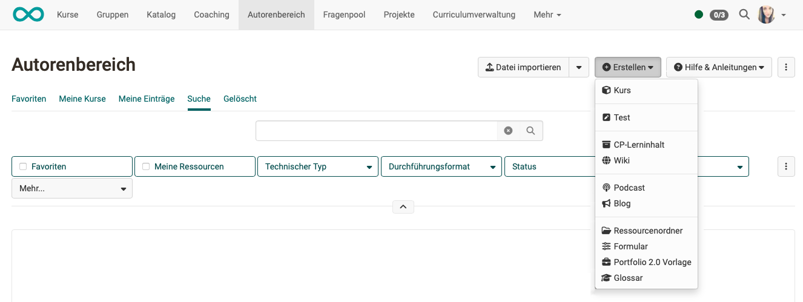{ class="shadow lightbox" }

---

## Kurs {: #course}

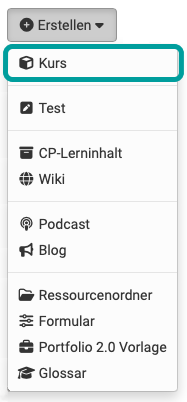{ class="aside-right lightbox"}

Ein OpenOlat-Kurs kann als reiner Online-Kurs eingesetzt werden oder Vorlesungen, Seminare oder andere Präsenzveranstaltungen begleiten. In einem OpenOlat-Kurs können verschiedene didaktische Konzepte wie Webquest, Gruppenpuzzles, kooperative Online-Seminare, problembasiertes Lernen, gamebasierte Ansätze usw. umgesetzt werden. Ein Kurs ist in OpenOlat ein eigener Dokumententyp, der beliebig viele "Kursbausteine" sowie weitere Funktionalitäten enthalten kann.

Wie Kurse erstellt werden, erfahren Sie im Kapitel ["Kurs erstellen"](Creating_Course.de.md). Details zu Kursbausteinen und dem Kurseditor erfahren Sie im Kapitel ["Kursbausteine"](Course_Elements.de.md).

[zum Seitenanfang ^](#learning_resources)

---

## Test {: #test}

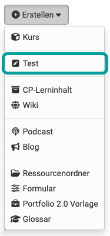{ class="aside-right lightbox"}

:fontawesome-solid-square-pen:

OpenOlat-Tests können sowohl zu Prüfungs- als auch zu Übungszwecken verwendet werden. Im ersten Fall können die Kursautor:innen die Testresultate einsehen und den Teilnehmenden zuordnen, im zweiten Fall werden die Resultate anonymisiert gespeichert. Jeder Test liegt im standardisierten Format IMS QTI 2.1 vor.

Mehr Informationen zum Einsatz und zur Erstellung von Tests finden Sie im Kapitel ["Tests erstellen"](../learningresources/Test.de.md).

[zum Seitenanfang ^](#learning_resources)

---

## CP-Lerninhalt {: #cp-content}

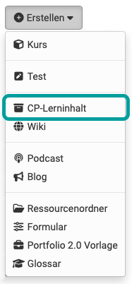{ class="aside-right lightbox"}

:fontawesome-solid-box-archive:

Ein Content-Packaging (kurz CP) ist ein Lerninhalt in einem standardisierten E-Learning-Format. Die Spezifikation dieses Datenformats kommt ebenfalls von [IMS bzw. 1EdTech Consortium](https://de.wikipedia.org/wiki/IMS_Content_Packaging "IMS bzw. 1EdTech Consortium"). OpenOlat unterstützt die IMS-CP Version 1.1.2. CPs eignen sich für die Verwendung in OpenOlat-Kursen oder auch ausserhalb von OpenOlat. OpenOlat unterstützt dieses Format, damit Lerninhalte nicht nur in OpenOlat, sondern auch in anderen LMS verwendet werden können. Mehr Informationen zur Erstellung von Content-Packagings finden Sie im Kapitel ["CP-Lerninhalt erstellen"](../learningresources/CP_Editor.de.md).

[zum Seitenanfang ^](#learning_resources)

---

## Wiki {: #wiki}

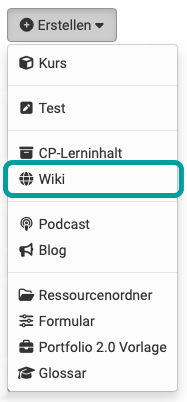{ class="aside-right lightbox"}

Mit Wikis können auf einfache Weise gemeinsam Inhalte erstellt werden. Ein Wiki kann für Gruppenarbeiten, als Dokumentationswerkzeug oder als Wissensbasis für Studien- oder Projektarbeiten verwendet werden.

Mehr Informationen zur Erstellung von Wikis finden Sie im Kapitel ["Wiki erstellen"](../learningresources/Wiki.de.md). Wie Sie im Wiki Inhalte erstellen und sinnvoll arbeiten, erfahren Sie im Kapitel [Kursbaustein "Wiki"](../learningresources/Course_Element_Wiki.de.md).

[zum Seitenanfang ^](#learning_resources)

---

## Podcast {: #podcast}

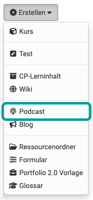{ class="aside-right lightbox"}

:fontawesome-solid-podcast:

Ein Podcast ermöglicht den Upload von Audio- oder Videodateien, die anschliessend in OpenOlat zur Verfügung gestellt werden können. Podcasts können entweder direkt in OpenOlat angehört oder angeschaut oder in Portalen wie iTunes abonniert werden, um die einzelnen Podcast-Episoden später auf mobile Endgeräte zu kopieren. Teilnehmende können Episoden auf einfache Art bewerten und kommentieren.

Weitere Informationen zum Thema Podcast finden Sie im Kapitel ["Podcast: Übersicht"](../learningresources/Podcast.de.md).

[zum Seitenanfang ^](#learning_resources)

---

## Blog {: #blog}

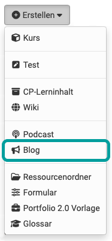{ class="aside-right lightbox"}

:fontawesome-solid-bullhorn:

In einem Blog können fachbezogene oder persönliche Informationen zeitlich strukturiert veröffentlicht und kommentiert werden. Blogs werden häufig als Online-Tagebuch oder Online-Journal eingesetzt. In Kursen eingebundene Blogs können auch von Teilnehmenden auf einfache Art bewertet und kommentiert werden.

Hier finden Sie weitere Infos über den [Kursbaustein Blog](../learningresources/Course_Element_Blog.de.md). Informationen dazu, wie Sie einen Blog erstellen und in Ihren Kurs einbinden, finden Sie im ["How to Bereich"](../../manual_how-to/blog/blog.de.md).

[zum Seitenanfang ^](#learning_resources)

---

## :o_icon_o_FileResource-SHAREDFOLDER_icon: Ressourcenordner {: #resource_folder}

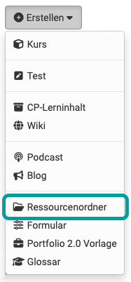{ class="aside-right lightbox"}

Mit Hilfe des Ressourcenordners können Dateien (Inhalte, Informationen, Grafiken usw.) in mehreren Kursen verwendet werden. Dabei werden die Dateien aus dem Ressourcenordner referenziert und müssen somit nicht mehrfach erstellt werden. Der verknüpfte Ressourcenordner wird in den Dateien des verknüpften Kurses unter `_sharedfolder` angezeigt, und es besteht Zugriff auf alle im Ressourcenordner hinterlegten Dateien. Änderungen an den Dateien im Ressourcenordner gelten dann für alle verknüpften Kurse. Zu beachten ist, dass nur *ein* Ressourcenordner pro Kurs hinzugefügt werden kann. Weitere Informationen finden Sie im Kapitel ["Kurseinstellungen"](../learningresources/Course_Settings.de.md#options) im Tab "Optionen".

[zum Seitenanfang ^](#learning_resources)

---

## Formular {: #form}

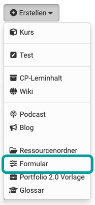{ class="aside-right lightbox"}

Formulare können in OpenOlat für vielfältige Zwecke und an unterschiedlichen Stellen eingesetzt werden. Sie eignen sich z.B. für Umfragen, Datenerhebungen, Selbsteinschätzungen, Fragebogen oder Rubrikbewertung. Zum Einsatz kommen sie im Kursbaustein "Formular", im Kursbaustein "Umfrage" oder als Rubrikbewertung im Kursbaustein "Bewertung" oder Kursbaustein "Aufgabe".

Mehr Informationen zum Einsatz und zur Erstellung von Formularen für Umfragen, Rubriks usw. finden Sie im Kapitel [Formulare erstellen](../learningresources/Form.de.md).

[zum Seitenanfang ^](#learning_resources)

---

## Portfolio 2.0 Vorlage {: #portfolio}

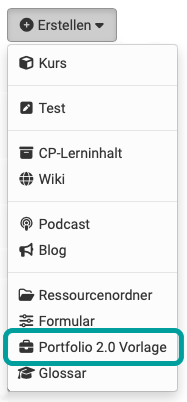{ class="aside-right lightbox"}

Eine Portfolio 2.0 Vorlage beinhaltet Aufgaben, die im Rahmen eines Portfolio-Assessments genutzt und als Portfolioaufgabe in einen OpenOlat-Kurs eingebunden werden können. Mit Hilfe einer Portfolio 2.0 Vorlage können Lehrende eine strukturierte Portfoliomappe gestalten, die die Lernenden abholen und bearbeiten können. Weitere Informationen zur [Portfolio 2.0 Vorlage](Portfolio_template_Creation.de.md) erhalten Sie im entsprechenden Kapitel.

[zum Seitenanfang ^](#learning_resources)

---

## Glossar {: #glossary}

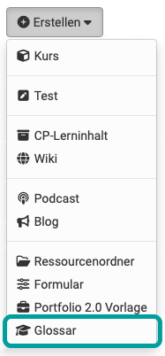{ class="aside-right lightbox"}

In einem Glossar können Begriffe und Definitionen abgelegt und alphabetisch sortiert zugänglich gemacht werden. Wird ein Glossar in einen OpenOlat-Kurs eingebaut, können die Begriffe auch bei integrierten HTML-Dateien direkt zur Erklärung angezeigt werden. Ferner ist es möglich, Glossare so zu konfigurieren, dass auch Lernende ein Glossar inhaltlich befüllen können.

Weitere Infos zur [Erstellung](../learningresources/Glossary_create.de.md) und [Verwendung](../learningresources/Glossary_usage.de.md) von Glossaren finden Sie in den entsprechenden Kapiteln.

[zum Seitenanfang ^](#learning_resources)

---

## Weitere Lernressourcen {: #further_learningresources}

Neben den Lernressourcen, die direkt in OpenOlat erstellt werden, gibt es weitere Lernressourcen, die durch Upload angelegt werden.

### SCORM 1.2

:fontawesome-solid-box-archive:

Ein standardisiertes E-Learning-Format, das von OpenOlat unterstützt wird, ist das SCORM-Format (Version 1.2). SCORM steht für "Sharable Content Object Reference Model" und ist ein Referenzmodell für austauschbare elektronische Lerninhalte der ["Advanced Distributed Learning Initiative" (ADL)](http://www.adlnet.gov/). SCORM-Lerninhalte eignen sich für die Verwendung in OpenOlat-Kursen oder ausserhalb von OpenOlat. OpenOlat unterstützt dieses Format, damit Sie Ihre Lerninhalte nicht nur in OpenOlat, sondern auch in anderen LMS verwenden können.

SCORM-Module können in OpenOlat nicht erstellt, sondern nur importiert werden.

[zum Seitenanfang ^](#learning_resources)

---

### Audio

Audiodateien können in OpenOlat hochgeladen und an einigen Stellen auch direkt [in OpenOlat aufgenommen](../learningresources/Audio_Recording.de.md) werden.

[zum Seitenanfang ^](#learning_resources)

---

### Video

OpenOlat verwendet Video-Lerninhalt im MPEG-4-Format mit der Dateiendung MP4. Die Lernressource Video kann in OpenOlat über "Datei importieren" oder "Per URL einbinden" hinzugefügt und anschliessend weiter konfiguriert werden. OpenOlat unterstützt die Anzeige von Untertiteln in mehreren Sprachen, integrierte Quizzes, Anmerkungen und Sprungmarken. Generelle Informationen finden Sie im Kapitel [Lernressource: Video](../learningresources/Learning_resource_Video.de.md).

[zum Seitenanfang ^](#learning_resources)

---

### Lernressourcen vom Typ Datei und andere Dateien

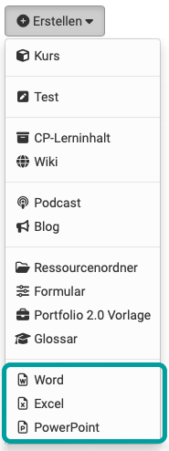{ class="aside-right lightbox"}

Neben den oben genannten Lernressourcen können Sie eine Reihe weiterer Dateitypen in OpenOlat importieren. Dazu gehören PDF-, PowerPoint-, Excel- und Word-Dateien sowie Bilder, Musik und Animationen.

Zudem können Sie, sofern ein entsprechender Dokumenteneditor aktiviert ist, Word-, Excel- oder PowerPoint-Dateien direkt in OpenOlat als Lernressource erstellen. Welche Dateien mit Ihrer Konfiguration erstellt werden können, sehen Sie in der Liste "Erstellen".

!!! info "Wichtig"

    Diagramm-Dateien (draw.io) lassen sich hier in der Regel nicht direkt erstellen. Nutzen Sie dafür z.B. das Media Center, einen Kurs oder den Bereich "Projekte".

[zum Seitenanfang ^](#learning_resources)
