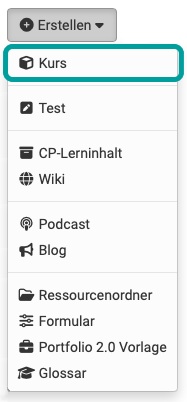
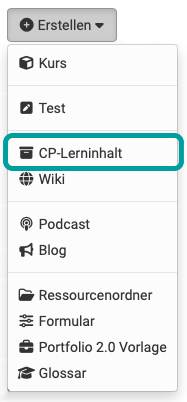
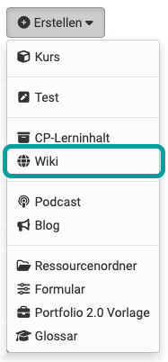
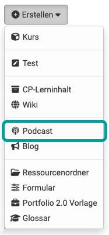
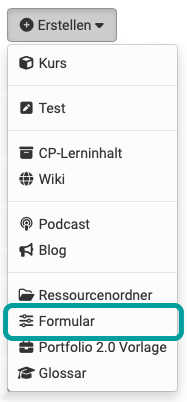
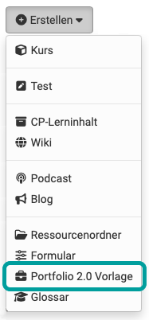
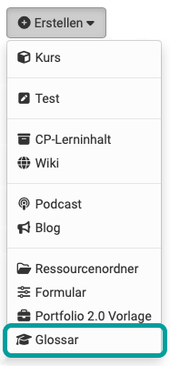

# Various Types of Learning Resources {: #learning_resources} 

OpenOlat comprises different types of [Learning Resources](../learningresources/General_Functions_Concept.md). Most of the time, these are embedded into [Course Elements](../learningresources/Course_Elements.md). Some learning resources can be created directly in the authoring area. In addition, [further learning resource types](#further_learningresources) can be created or imported.

{ class=" shadow lightbox" }

---

## Course {: #course}

{ class="aside-right lightbox"}

{class="size16"}

An OpenOlat course can be used as an online-only course or accompany lectures, seminars or other face-to-face events. In an OLAT course different didactic concepts like webquest, group puzzles, problem-based learning, game-based approaches etc. can be implemented.
OpenOlat courses are unique document types. They can contain any number of "course elements", as well as other functionalities. 

How to create courses will be illustrated in the chapter ["Creating Courses"](../learningresources/Creating_Course.md). 
More information on course elements and the course editor can be found in the chapter ["Types of Course Elements"](Course_Elements.md).

[To the top of the page ^](#learning_resources)

---

## Test (QTI 2.1) {: #test}

{ class="aside-right lightbox"}

Tests can be used for both examination and practice purposes. In the first case, the course authors can view the test results and assign them to the test subjects; in the second case, the results are stored anonymously. Each test is available in a standardized document format, the IMS QTI format.

More information on using and creating tests can be found in the chapter ["Creating Tests"](../learningresources/Test.md).

[To the top of the page ^](#learning_resources)

---

## CP Learning Content {: #cp-content}

{ class="aside-right lightbox"}

Content Packaging (abbr.: CP) is a kind of learning content in standardized e-learning format.  The specification of this format also comes from
[IMS resp. 1EdTech Consortium](http://www.imsglobal.org/ "IMS"). OpenOlat supports the IMS CP version
1.1.2. CPs are suitable for being either used in OpenOlat courses or outside of it. OpenOlat supports this format; therefore learning content cannot only be used in OpenOlat but in other LMS as well. Further information on generating Content Packages can be found in the chapter  ["CP Editor"](../learningresources/CP_Editor.md).

[To the top of the page ^](#learning_resources)

---

## Wiki {: #wiki}

{ class="aside-right lightbox"}

Wikis are particularly suited for creating content jointly in an easy way. A Wiki can be used for working in groups, as documentation tool or as knowledge base for your studies and projects.

For more information on how to create Wikis and embed those in your course, please go to the chapter ["Creating Wikis"](../learningresources/Wiki.md). How to generate content within a Wiki you can find [here](../learningresources/Course_Element_Wiki.md).

[To the top of the page ^](#learning_resources)

---

## Podcast {: #podcast}

{ class="aside-right lightbox"}

A podcast allows you to upload audio or video files that can later be made available in OpenOlat. Podcasts can either be accessed directly in OpenOlat or they can be subscribed via online services such as iTunes in order to copy single episodes to mobile devices later on. Your course participants will be able to easily assess or comment on such podcast episodes.

Further information about podcasts can be found [here](../learningresources/Podcast.md).

[To the top of the page ^](#learning_resources)

---

## Blog {: #blog}

{ class="aside-right lightbox"}

In a blog, subject-related or personal information can be published and commented on in a time-structured manner. Blogs are often used as a kind of diary or journal. Course participants will be able to comfortably assess or comment on blog entries.

Here you can find more information about the [course element blog](../learningresources/Course_Element_Blog.md). Information on how to create a blog and integrate it into your course, can be found in the ["How to section"](../../manual_how-to/blog/blog.md). 

[To the top of the page ^](#learning_resources)

---

## Resource Folder {: #resource_folder}

{ class="aside-right lightbox"}

With the help of the resource folder, files (content, information, graphics, etc.) can be used in multiple courses. In doing so, the files are referenced from the resource folder and thus do not need to be created multiple times. The linked resource folder is displayed in the storage folder of the linked course under _sharedfolder and there is access to all files stored in the resource folder. Changes to the files in the resource folder then apply to all linked courses. It should be noted that only *one* resource folder can be added per course. Further information can be found in the chapter  ["Course settings"](../learningresources/Course_Settings.md#CourseSettings-_detail_ressourcen) in the submenu "Resource folder".

[To the top of the page ^](#learning_resources)

---

## Form {: #form}

{ class="aside-right lightbox"}

Forms can be used in OpenOlat for a variety of purposes and in different places. They are suitable, for example, for surveys, data collection, self-assessments, questionnaires or rubric assessment. They are used in the course element "Form", in the course element "Survey" or as rubric assessment in the course element "Assessment" or course element "Task". 

Each course participant can fill out the same questionnaire only once. The results are stored anonymously.  You can find more information on the use and creation of forms for surveys, rubrics etc. in the chapter [Creating forms](../learningresources/Form.md).
  
[To the top of the page ^](#learning_resources)

---

## Portfolio 2.0 Template {: #portfolio}

{ class="aside-right lightbox"}

A Portfolio 2.0 template contains tasks that can be used as part of a portfolio assessment and entered into an OLAT course as a portfolio task.  With the help of a Portfolio 2.0 template, lecturers can create a structured portfolio folder that learners can collect and edit. Further information on the [Portfolio template](Portfolio_template_Creation.md) can be found in the corresponding chapter.

[To the top of the page ^](#learning_resources)

---

## Glossary {: #glossary}

{ class="aside-right lightbox"}

A glossary can be used to store terms and definitions and make them accessible alphabetically sorted. If a glossary is integrated into an OpenOlat course the terms can also be displayed directly for explanation in integrated HTML files. Furthermore, it is possible to configure glossaries that learners can also fill in the content of a glossary.

Further information on the [creation](../learningresources/Glossary_create.md) and [usage](../learningresources/Glossary_usage.md) of glossaries can be found in the corresponding chapters.

[To the top of the page ^](#learning_resources)

---

## Further learning resources {: #further_learningresources}
In addition to the learning resources that are created directly in OpenOlat, there are other learning resources that are created by uploading.

### SCORM Learning Content
{class="size16"}

Another standardized e-learning format supported by OpenOlat is the SCORM format (version 1.2). SCORM is short for "Sharable Content Object Reference Model" and a reference model for exchangeable electronic learning content of the ["Advanced Distributed Learning Initiative" (ADL)](http://www.adlnet.gov/).  SCORM learning content is suitable for courses within OpenOlat as well as courses outside. OpenOlat supports this format; therefore your learning content can be applied not only in OpenOlat but also in other LMS.

SCORM modules cannot be created in OpenOlat, only imported.

[To the top of the page ^](#learning_resources)

---

### Audio

Audio files can be uploaded to OpenOlat and in some places can also be recorded directly [in OpenOlat](../learningresources/Audio_Recording.md).

[To the top of the page ^](#learning_resources)

---

### Video
{class="size16"}

A video is a learning content in the MPEG-4 format with the file extension .mp4, and is used for audio and video playback. The learning resource video can be added to OpenOLAT by importing or import URL and then further configured. OpenOlat supports the display of subtitles in multiple languages, integrated quizzes, annotations and jump labels. Further information can be found in the ["Creating Videos"](../learningresources/Video.md) chapter.

[To the top of the page ^](#learning_resources)

---

## Learning resources of the type "File"

Apart from the above-mentioned learning resources, a comprehensive number of other file types may be imported into OpenOlat. Among these are PDF, PowerPoint, Excel and Word, as well as movie, image, sound or animation files.

If a corresponding document editor is activated, you can also create Word, Excel or PowerPoint files directly in OpenOlat as a learning resource. In the displayed "Create" list you can see exactly which files can be created.

!!! info 

    Diagram files (draw.io) can usually not be created directly here. Use the Media Center, a course or the project area for creating draw.io diagrams.   

  
[To the top of the page ^](#learning_resources)

