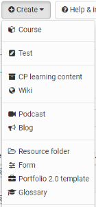

# Various Types of Learning Resources

OpenOlat comprises different types of learning resources. With the exception
of courses, they have in common that they can be embedded into one or more
courses. The following learning resources can be created directly in OpenOlat.  

 

In addition, other formats can be imported as learning resources (see below).

In the following the learning resources are briefly described:

## Course 
{class="size16"}

An OpenOlat course can be used as an online-only course or accompany lectures, seminars or other face-to-face events. In an OLAT course different didactic concepts like webquest, group puzzles, problem-based learning, game-based approaches etc. can be implemented.
OpenOlat courses are unique document types. They can contain any number of
"course elements", as well as other functionalities. How to create
courses will be illustrated in the chapter ["Creating Courses"](../learningresources/Creating_Course.md). 
More information on course elements and the
course editor can be found in the chapter ["Types of Course Elements"](Course_Elements.md).

  

## Test (QTI 2.1) {class="size16"}

Tests can be used for examinations or exercises in general. In the first case
course authors can see all test results along with corresponding test
participants; in the second case all results are saved anonymously. Each test
exists in a standardized file format, the so-called IMSQTI format.

More information on using and creating tests can be found in the chapter
["Creating Tests"](../learningresources/Test.md).

## CP Learning Content {class="size16"}

Content Packaging (abbr.: CP) is a kind of learning content in standardized
e-learning format. The specification of this format also comes from
[IMS](http://www.imsglobal.org/ "IMS"). OpenOlat supports the IMS CP version
1.1.2. CPs are suitable for being either used in OpenOlat courses or outside
of it. OpenOlat supports this format; therefore learning content cannot only
be used in OpenOlat but in other LMS as well. Further information on
generating Content Packages can be found in the chapter 
["CP Editor"](../learningresources/CP_Editor.md).

## Wiki
{class="size16"}

Wikis are particularly suited for creating content jointly in an easy way. A
Wiki can be used for working in groups, as documentation tool or as knowledge
base for your studies and projects.

For more information on how to create Wikis and embed those in your course
please go to the chapter ["Creating Wikis"](../resource_wiki/Four_Steps_to_Your_Wiki.md). How
to generate content within a Wiki you can find [here](../learningresources/Working_with_Wiki.md).

## Podcast
{class="size16"}

A podcast allows you to upload audio or video files that can later be made
available in OpenOlat. Podcasts can either be accessed directly in OpenOlat or
they can be subscribed via online services such as iTunes in order to copy
single episodes to mobile devices later on. Your course participants will be
able to easily assess or comment on such podcast episodes.

Information on how to create and embed podcasts in your course can be found in
the chapter ["Creating Podcasts"](../learningresources/Course_Element_Podcast.md).

## Blog
{class="size16"}

In a blog you can easily publish or update personal as well as professional
information. Blogs are often used as a kind of diary or journal. Course
participants will be able to comfortably assess or comment on blog entries.

Information on how to create and embed a blog in your course will be found in
the chapter ["Creating Blogs"](../learningresources/Blog.md). Further details on how to
use blogs as course participant will be explained in the chapter "Learning
Activities in Courses", section
["Blog"](../learningresources/Course_Element_Blog.md).

  

## Resource Folder
{class="size16"}

With the help of the resource folder, files (content, information, graphics,
etc.) can be used in multiple courses. In doing so, the files are referenced
from the resource folder and thus do not need to be created multiple times.
The linked resource folder is displayed in the storage folder of the linked
course under _sharedfolder and there is access to all files stored in the
resource folder. Changes to the files in the resource folder then apply to all
linked courses. It should be noted that only one resource folder can be added
per course. Further information can be found in the chapter 
["Course settings"](../learningresources/Course_Settings.md#CourseSettings-_detail_ressourcen) in the
submenu "Resource folder".

## Form
{class="size16"}

A form is usually used to collect data, for example for event evaluation. Each
course participant can fill out the same questionnaire only once. The results
are stored anonymously. For more information on the use and creation of form,
see the chapter [Creating questionnaires](../learningresources/Form.md).

  

## Portfolio 2.0 Template
{class="size16"}

A Portfolio 2.0 template contains tasks that can be used as part of a
portfolio assessment and entered into an OLAT course as a portfolio task. With
the help of a Portfolio 2.0 template, lecturers can design a structured
portfolio folder that the students can
[collect](../learningresources/Portfolio_task_and_assignment_Collecting_and_editing.md)
and edit. Further information on the [Portfolio Template](../learningresources/Portfolio_template_Creation.md) and on
[ePortfolio](../area_modules/index.md) in general can be found in the
corresponding chapter.

## Glossary
{class="size16"}

A glossary can be used to store terms and definitions and make them accessible
alphabetically sorted. If a glossary is integrated into an OpenOlat course
the terms can also be displayed directly for explanation in integrated HTML files. Furthermore, it is possible to configure glossaries
that learners can also fill in the content of a glossary.

More information on how to create a glossary and embed it into your course can
be found in chapter "Course Operation," section
["Glossary"](../learningresources/Using_Additional_Course_Features.md#glossary). 
How to use your glossary within a course will be explained in the chapter "Learning Activities in Courses," section
["Glossary"](../learningresources/Additional_Course_Features.md#glossary).

## Other learning resources:

### SCORM Learning Content
{class="size16"}

Another standardized e-learning format supported by OpenOlat is the SCORM
format (version 1.2). SCORM is short for "Sharable Content Object Reference
Model" and a reference model for exchangeable electronic learning content of
the ["Advanced Distributed Learning Initiative" (ADL)](http://www.adlnet.gov/). 
SCORM learning content is suitable for courses
within OpenOlat as well as courses outside. OpenOlat supports this format;
therefore your learning content can be applied not only in OpenOlat but also
in other LMS.

SCORM modules cannot be created in OpenOlat, only imported.

### Video
{class="size16"}

A video is a learning content in the MPEG-4 format with the file extension
.mp4, and is used for audio and video playback. The
learning resource video can be added to OpenOLAT by importing or import URL and then further configured. OpenOlat supports the display of subtitles in multiple languages, integrated quizzes, annotations and jump labels. Further information on
video formats and upload in OpenOlat can be found in the ["Creating Videos"](../learningresources/Video.md)
chapter.

### Learning resources of the type "File"

Apart from the above-mentioned learning resources, a comprehensive number of
other file types may be imported into OpenOlat. Among these are PDF,
PowerPoint, Excel and Word, as well as movie, image, sound or animation files.

If a corresponding document editor is activated, you can also create Word,
Excel or PowerPoint files directly in OpenOlat as a learning resource.

  

  

