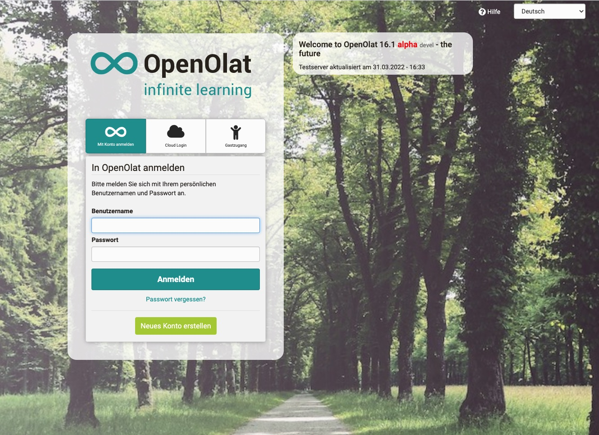

# Login-Seite

:octicons-device-camera-video-24: **Video-Einführung**: [Login](<https://www.youtube.com/embed/Sy5cXJL7K90>){:target="_blank”} 

Sie können sich jederzeit über die Zugangsseite Ihrer Organisation in OpenOlat
einloggen. Beachten Sie, dass die genauen Zugangsmöglichkeiten je nach
OpenOlat Instanz etwas variieren können.

Auf der Einstiegsseite wählen Sie Ihre Hochschule aus. Sie werden
weitergeleitet und aufgefordert, Ihre Zugangsdaten einzugeben. Wenn Sie keiner
der aufgelisteten Hochschulen angehören, wählen Sie  die Anmeldung mit
OpenOlat-Konto. So können Sie die volle Funktionalität von OpenOlat benutzen.

Sollten Sie ihre Zugangsdaten (Benutzername und/oder Passwort) nicht mehr zu
Hand haben, wenden Sie sich an Ihre zuständige Beratungsstelle.

  
## Gastzugang

Alternativ können Sie OpenOlat auch als Gast besuchen. Der Gastzugang gewährt
Ihnen einen Einblick in OpenOlat mit eingeschränkter Funktionalität: Sie haben
nur Zugriff auf Lerninhalte, die ausdrücklich für Gäste freigegeben sind. Um
Zugang zu weiteren Lernmaterialien und -aktivitäten zu erhalten, müssen Sie
sich bei OpenOlat registrieren. Weitere Informationen zum Gastzugang finden
Sie [hier](../access_roles_rights/guest_access.de.md).

## Browser {: #browsercheck}

OpenOlat funktioniert optimal, wenn Sie mit folgenden Browsern arbeiten (Mobile oder Desktop):

* [Google Chrome](http://www.google.com/chrome/)
* [Apple Safari](http://www.apple.com/safari/)
* [Microsoft Edge](https://www.microsoft.com/edge)
* [Firefox](http://www.mozilla.org/firefox/)

Der Internet Explorer in der Version 6 bis 11 von Microsoft wird nicht
mehr durchgängig unterstützt. Diese Versionen werden von Microsoft nicht mehr
weiter gepflegt. Sollten Sie einen älteren Browser verwenden der nicht mehr
unterstützt wird erscheint beim Login eine entsprechende Warnung. Sie können
dann OpenOlat auf eigene Gefahr nutzen oder Ihren Browser aktualisieren. Diese
Warnung kann auch vom Administrator per CSS ausgeblendet werden.

## Cookies & Javascript

Grundsätzlich muss ihr Browser Session Cookies akzeptieren und Javascript muss
aktiviert sein.
