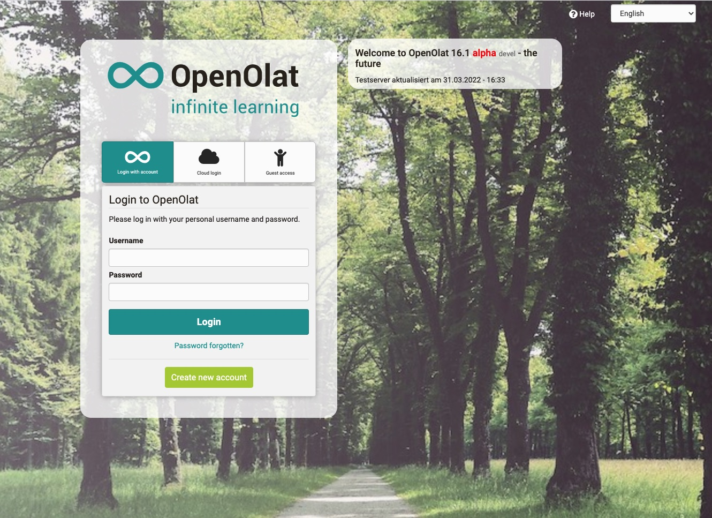

# Login Page

  

Login to OpenOlat is possible anytime through your organisation's access page.
Please consider that the access configuration can vary from OpenOlat instance
to instance.

First select your university on the intro page. You will then be passed on and
invited to enter your access data. If you do not belong to any of the listed
universities, choose "Login with OpenOlat account". Now you can use the full
functionality of OpenOlat.

In case you should forget your password you can contact your responsible
helpdesk.

## Guest Access

You can use OpenOlat as guest as well. The so-called guest access provides an
insight into OpenOlat with limited access to certain features: you will only
get to learning content that is explicitly open to the public. In order to
have access to other material and activities you will have to register first.
Further information to the guest access can be found
[here](../general/Guest_access.md).

## Browser Check {: #browsercheck}

OpenOlat is optimized for the following browser software (mobile or desktop):

  * [Google Chrome](http://www.google.com/chrome/)
  * [Apple Safari(http://www.apple.com/safari/)
  * [Microsoft Edge](https://www.microsoft.com/edge)
  * [Firefox](http://www.mozilla.org/firefox/)

Internet Explorer in version 6 to 11 by Microsoft is not fully
supported anymore. Microsoft dropped support for these versions, and security
updates are no longer provided for. Should you use an older browser which is
not supported anymore the corresponding warning will be shown by the login.
They you can use OpenOlat at your own risk or update your browser. This
warning can be hidden through CSS by your system administrator.  

## Cookies & Javascript

In any case, your browser must accept session cookies, and Javascript must be
enabled.

  

