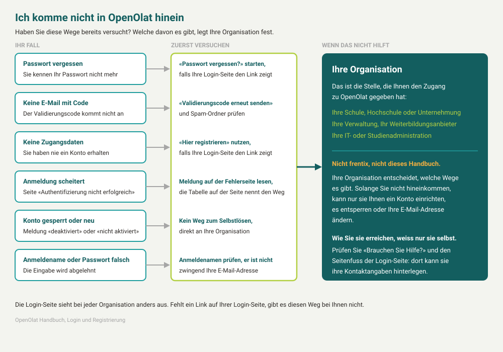
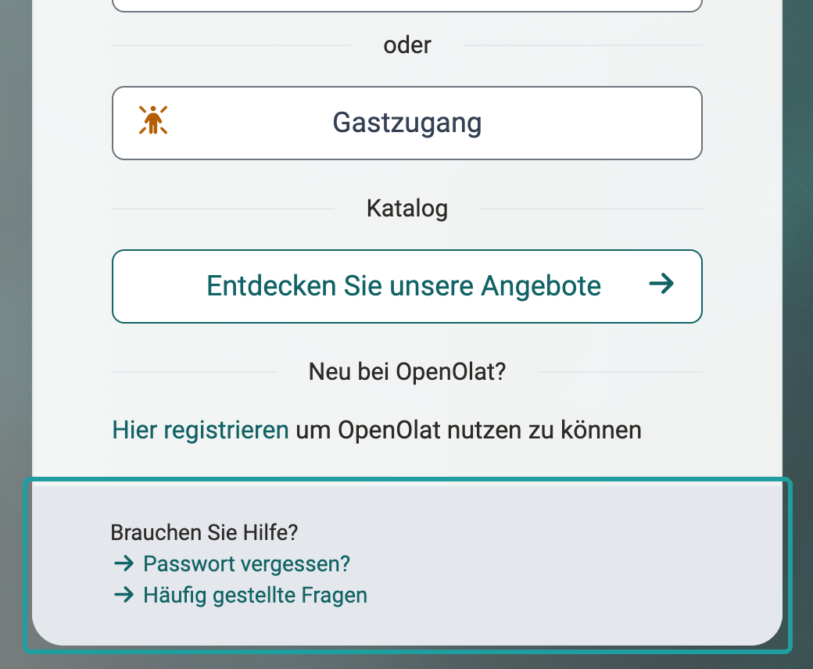

# Login-Seite {: #login}

:octicons-device-camera-video-24: **Video-Einführung**: [Login](<https://www.youtube.com/embed/Sy5cXJL7K90>){:target="_blank"}

Auf der Login-Seite weisen Sie nach, dass Sie zu OpenOlat Zutritt haben. Wie die Seite aussieht, legt Ihre Organisation fest. Deshalb sehen Sie möglicherweise nicht alle hier beschriebenen Möglichkeiten. Können Sie das Login nicht erfolgreich durchführen, finden Sie weiter unten unter [Ich komme nicht hinein](#no_access) den passenden Weg.

{ class="shadow lightbox" }

## So melden Sie sich an {: #how_to_login}

Welchen Weg Sie nehmen, hängt davon ab, wo Ihr Konto liegt. Es gibt drei Möglichkeiten, und Ihre Organisation entscheidet, welche davon auf Ihrer Login-Seite angeboten werden.

* **Mit dem Konto Ihrer Organisation.** Die Buttons unter "Bitte wählen Sie Ihren Identitätsanbieter." führen zu einem externen Dienst, zum Beispiel "Microsoft Azure AD". Sie melden sich dort mit den Zugangsdaten an, die Sie auch für die übrigen Dienste Ihrer Organisation verwenden. OpenOlat speichert dieses Passwort nicht. Haben Sie sich bei Ihrer Organisation bereits angemeldet, gelangen Sie unter Umständen ohne weitere Eingabe direkt in OpenOlat (Single Sign On).
* **Mit einem lokalen OpenOlat-Konto.** Anmeldename und Passwort sind hier in OpenOlat gespeichert. Wo Sie beides eingeben, legt Ihre Organisation fest: Entweder steht die Eingabe direkt auf der Login-Seite, eingeleitet mit "Bitte melden Sie sich mit Ihrem persönlichen Anmeldenamen und Passwort an.", oder sie liegt hinter dem Link "Mit Konto anmelden" unter der Frage "Gehören Sie keiner der oben aufgelisteten Institutionen an oder haben ein lokales Konto?".
* **Ohne Konto.** "Gastzugang" und "Entdecken Sie unsere Angebote" geben Einblick ohne Anmeldung, "Hier registrieren" legt ein eigenes Konto an, sofern Ihre Organisation die Selbstregistrierung erlaubt.

Je nach Sicherheitsstufe folgt nach dem Passwort ein zweiter Schritt: eine Bestätigung per [Passkey](Passkey.de.md) oder die Eingabe eines [One Time Code](One_Time_Code.de.md), den OpenOlat Ihnen per E-Mail zustellt. [:octicons-tag-16:{ title="ab Release 21.0 (OO-9509)" }](https://track.frentix.com/issue/OO-9509)

## Ich komme nicht hinein {: #no_access}

Sie stehen vor der Anmeldung und kommen nicht weiter. Suchen Sie unten den Fall, der Ihrer Situation entspricht: jeder Fall nennt den nächsten Schritt und sagt, ob Sie ihn selbst gehen können. Welche dieser Wege Ihre Login-Seite anbietet, legt Ihre Organisation fest.

Zeigt die Login-Seite "Sie wurden abgemeldet", ist kein Anmeldeproblem die Ursache, sondern Ihre Sitzung ist abgelaufen. Melden Sie sich erneut an, siehe [Session-Timeout und Logout](../basic_concepts/Session_Timeout_and_Logout.de.md).

{ class="shadow lightbox" }

### Ich habe mein Passwort vergessen {: #forgot_password}

Ein neues Passwort setzen Sie sich selbst, sofern Ihre Organisation das erlaubt und an Ihrem Konto eine E-Mail-Adresse hinterlegt ist. Der Link "Passwort vergessen?" steht unterhalb der Anmeldung im Bereich "Brauchen Sie Hilfe?", zusammen mit dem Link "Häufig gestellte Fragen". Sehen Sie den Bereich nicht, klicken Sie zuerst auf "Mit Konto anmelden". Der Link startet den Assistenten "Zugangsdaten setzen", der Sie über einen Validierungscode ausweist und danach ein neues Passwort setzen lässt. Die Schritte beschreibt die Seite [Passwort](Password.de.md#reset_password).

{ class="shadow lightbox" }

Ob und wohin der Link führt, hat Ihre Organisation eingerichtet. Er kann den OpenOlat-Assistenten öffnen, in einem neuen Fenster eine Seite Ihrer Organisation öffnen oder fehlen. Fehlt der Link, liegt Ihr Passwort nicht in OpenOlat. Das ist der Fall, wenn Sie sich mit einem der Buttons unter "Bitte wählen Sie Ihren Identitätsanbieter." anmelden. Ändern Sie das Passwort dann dort, wo Sie es auch für Ihre übrigen Dienste ändern, oder wenden Sie sich an [Ihre Organisation](#contact_support).

### Ich erhalte keine E-Mail mit dem Validierungscode {: #no_mail}

Erscheint der Schritt "Login - Validierung" direkt bei der Anmeldung und nicht im Assistenten "Zugangsdaten setzen", geht es um den zweiten Faktor. Diesen Fall beschreibt die Seite [One Time Code](One_Time_Code.de.md#no_code).

Ohne den Validierungscode kommen Sie im Assistenten "Zugangsdaten setzen" nicht weiter. Vier Dinge helfen, in dieser Reihenfolge:

1. Im Schritt "Validierung" steht "Sie haben Ihren Validierungscode nicht erhalten?" mit dem Button "Validierungscode erneut senden". Damit erzeugt OpenOlat einen neuen Code. Alle früheren Codes werden ungültig.
2. Prüfen Sie den Spam-Ordner. Die E-Mail trägt den Betreff "Validierungscode für neue OpenOlat-Zugangsdaten".
3. OpenOlat schickt die E-Mail an die Adresse, die an Ihrem Konto hinterlegt ist. Ist dort eine alte oder gar keine Adresse hinterlegt, erreicht Sie die E-Mail nicht. Diese Adresse können Sie ohne Anmeldung nicht ändern, das kann nur [die Stelle, die Ihr Konto verwaltet](#contact_support).
4. Meldet OpenOlat "Konto konnte nicht eindeutig identifiziert werden", gehört die eingegebene E-Mail-Adresse oder der Anmeldename zu keinem oder zu mehreren Konten. Versuchen Sie es mit der jeweils anderen Angabe.

Verwenden Sie für Ihr Konto einen Passkey, trägt die E-Mail den Betreff "Schlüssel für neues OpenOlat-Passwort" und enthält keinen Code, sondern den Hinweis, Ihre Recovery Keys zu verwenden oder die Supportstelle zu kontaktieren. Recovery Keys sind die Ersatzcodes, die OpenOlat Ihnen beim Einrichten des Passkeys angezeigt hat, siehe [Passkey](Passkey.de.md). Haben Sie keinen Recovery Key mehr, hilft nur [Ihre Organisation](#contact_support).

### Ich habe von meiner Institution keine Zugangsdaten erhalten {: #no_account}

OpenOlat legt keine Konten von sich aus an. Entweder legt Ihre Organisation das Konto für Sie an und teilt Ihnen den Anmeldenamen mit, oder sie erlaubt die Selbstregistrierung. Erhalten Sie nichts und zeigt die Login-Seite keinen Link "Hier registrieren", hat OpenOlat keinen Weg, Ihnen zu helfen: wenden Sie sich an [Ihre Organisation](#contact_support).

Zeigt die Login-Seite den Link "Hier registrieren", können Sie sich selbst ein Konto anlegen. Meldet OpenOlat dabei "Die Domäne Ihrer E-Mail Adresse ist nicht für die Selbstregistration freigeschaltet. Bitte verwenden Sie die E-Mail Adresse Ihrer Institution.", sind nur bestimmte E-Mail-Domänen für die Selbstregistrierung freigegeben. Welche das sind, weiss Ihre Organisation.

### Die Anmeldung über meine Institution schlägt fehl {: #external_login}

Wirft Sie der Identitätsanbieter Ihrer Organisation zurück, sagt Ihnen die Meldung auf der Seite "Authentifizierung nicht erfolgreich", ob Sie selbst etwas tun können. Das gilt für Identitätsanbieter wie Microsoft Azure AD oder Keycloak. Bei Shibboleth lauten die Meldungen anders, zum Beispiel "Sie dürfen nicht auf OpenOlat einloggen."; der Weg ist derselbe: [Ihre Organisation](#contact_support).

| Meldung | Was sie bedeutet | Was Sie tun |
|---|---|---|
| "Sie sind nicht berechtigt auf den OpenOlat Dienst zuzugreifen (access_denied). Bitte kontaktieren Sie die Systemadministration." | Der Zugriff wurde nicht erteilt: entweder hat Ihre Organisation ihn nicht freigegeben, oder Sie haben die Anmeldung beim Identitätsanbieter abgebrochen. | Erneut anmelden und dem Zugriff zustimmen, sonst an Ihre Organisation wenden. |
| "Sie sind nicht berechtigt auf den OpenOlat Dienst zuzugreifen (invalid_grant). Bitte kontaktieren Sie die Systemadministration." | Der Identitätsanbieter hat die Anfrage von OpenOlat zurückgewiesen. | An Ihre Organisation wenden. |
| "Ihr Konto wurde auf dem OpenOlat Dienst noch nicht angelegt, dies ist notwendig um sich anmelden zu können. Bitte kontaktieren Sie die Systemadministration." | Die Anmeldung war erfolgreich, ein OpenOlat-Konto fehlt aber. | An Ihre Organisation wenden. |
| "Sie konnten nicht identifiziert werden. Bitte kontaktieren Sie die Systemadministration." | Der Identitätsanbieter hat OpenOlat keine Angabe geliefert, mit der sich Ihr Konto zuordnen lässt. | An Ihre Organisation wenden. |
| "Ein technisches Problem ist aufgetreten (token_rejected). Bitte versuchen Sie es später noch einmal." | Der Austausch zwischen OpenOlat und dem Identitätsanbieter ist fehlgeschlagen. | Später erneut versuchen, sonst an Ihre Organisation wenden. |
| "Ein unerwarteter Fehler ist aufgetreten. Bitte versuchen Sie es später noch einmal." | Ein Fehler ohne nähere Angabe. | Später erneut versuchen, sonst an Ihre Organisation wenden. |

Die Meldungen bitten Sie, "die Systemadministration" zu kontaktieren. Gemeint ist damit die Stelle, die Ihnen den Zugang gegeben hat, nicht frentix. Wer das ist, steht unter [Nichts davon hilft](#contact_support).

Unter der Meldung kann eine E-Mail-Adresse stehen, eingeleitet mit "Bei wiederkehrenden Problemen wenden Sie sich bitte an den Support unter:". Diese Adresse hat Ihre Organisation hinterlegt, sie ist nicht zwingend die Stelle, die Ihr Konto verwaltet. Mit dem Button "Zur Loginseite" kommen Sie zurück zur Anmeldung.

### Mein Konto ist gesperrt oder noch nicht aktiv [:octicons-tag-16:{ title="ab Release 20.0 (OO-8466)" }](https://track.frentix.com/issue/OO-8466) {: #account_blocked}

Diese beiden Meldungen betreffen den Zustand Ihres Kontos, nicht Ihre Eingabe. OpenOlat zeigt nach der Eingabe Ihrer Zugangsdaten entweder "Ihr Konto ist deaktiviert." oder "Ihr Konto wurde noch nicht aktiviert.", jeweils mit einem Link zum Support. Beides kann nur [Ihre Organisation](#contact_support) ändern.

### Anmeldename oder Passwort falsch {: #wrong_credentials}

Prüfen Sie zuerst den Anmeldenamen, denn er ist nicht zwingend Ihre E-Mail-Adresse. Welche Angabe gilt, legt Ihre Organisation fest. Die Meldung lautet "Anmeldename oder Passwort falsch. Bitte versuchen Sie es erneut oder nutzen Sie die Funktion «Passwort vergessen?»".

Nach zu vielen Fehlversuchen sperrt OpenOlat die Anmeldung für diesen Anmeldenamen vorübergehend und meldet "Anmeldung ist für diesen Anmeldenamen gesperrt.". Warten Sie die in der Meldung genannte Zeit ab und melden Sie sich danach erneut an. Kennen Sie Ihren Anmeldenamen nicht, hilft nur [Ihre Organisation](#contact_support).

## Nichts davon hilft {: #contact_support}

Bringt Sie keiner der Wege oben weiter, brauchen Sie eine Person, die Ihr Konto verwalten darf. Diese Stelle ist immer dieselbe, unabhängig davon, woran die Anmeldung gescheitert ist.

!!! tip "Das ist Ihr Support"

    Der richtige Support ist immer die Stelle, die Ihnen den Zugang zu OpenOlat gegeben hat: Ihre Schule, Ihre Hochschule, Ihre Unternehmung, Ihre Verwaltung, Ihr Weiterbildungsanbieter oder deren IT- und Studienadministration. Solange Sie nicht hineinkommen, kann nur diese Stelle Ihnen ein Konto einrichten, es entsperren oder Ihre E-Mail-Adresse ändern. frentix entwickelt OpenOlat und beantwortet keine Fragen zu einzelnen Konten. Wie Sie Ihre Organisation erreichen, weiss nur sie selbst. Prüfen Sie den Bereich "Brauchen Sie Hilfe?" und den Seitenfuss der Login-Seite: dort kann Ihre Organisation ihre Kontaktangaben hinterlegen. Sonst fragen Sie die Person, von der Sie den Kurs oder den Zugang erhalten haben.

## Gastzugang {: #guest}

Alternativ können Sie OpenOlat auch als Gast besuchen. Der Gastzugang gewährt Ihnen einen Einblick in OpenOlat mit eingeschränkter Funktionalität: Sie haben nur Zugriff auf Lerninhalte, die ausdrücklich für Gäste freigegeben sind. Um Zugang zu weiteren Lernmaterialien und -aktivitäten zu erhalten, müssen Sie sich bei OpenOlat registrieren. Weitere Informationen zum Gastzugang finden Sie [hier](../basic_concepts/guest_access.de.md).

## Browser {: #browsercheck}

OpenOlat funktioniert optimal mit den folgenden Browsern in einer aktuellen Version (mobil oder Desktop):

* [Apple Safari](https://www.apple.com/safari/)
* [Firefox](https://www.mozilla.org/firefox/)
* [Microsoft Edge](https://www.microsoft.com/edge)
* [Google Chrome](https://www.google.com/chrome/)

## Cookies & Javascript {: #cookies}

Grundsätzlich muss Ihr Browser Session Cookies akzeptieren und Javascript muss aktiviert sein.

## Nach dem Login {: #after_login}

Nach dem Login gelangen Sie entweder

* auf Ihre persönliche Startseite in OpenOlat,
* auf eine Infoseite, eine Seite die in der Regel generelle Informationen zu verschiedenen Themen enthält,
* auf das [OpenOlat Portal](../basic_concepts/Portal_configuration.de.md) oder
* auf eine von Ihnen selbst festgelegte Startseite.

## Nach dem Aufruf des Katalogs [:octicons-tag-16:{ title="ab Release 20.0 (OO-8002)" }](https://track.frentix.com/issue/OO-8002) {: #webcatalog}

Beim Aufruf des Katalogs auf der Login-Seite wird der [Web-Katalog](../area_modules/catalog2.0_web.de.md) angezeigt, eine gespiegelte Version des Katalogs 2.0, die ohne Registrierung durchsucht werden kann. Erst wenn ein bestimmter Kurs gebucht werden soll, werden Personen ohne Konto durch die Registrierung geführt.

## Weiterführende Informationen {: #further_information}

**Auf dieser Seite erwähnt** 
[Passkey >](Passkey.de.md) 
[One Time Code >](One_Time_Code.de.md) 
[Passwort >](Password.de.md) 
[Rollen und Rechte: Gastzugang >](../basic_concepts/guest_access.de.md) 
[Apple Safari >](https://www.apple.com/safari/) 
[Firefox >](https://www.mozilla.org/firefox/) 
[Microsoft Edge >](https://www.microsoft.com/edge) 
[Google Chrome >](https://www.google.com/chrome/) 
[Portal konfigurieren >](../basic_concepts/Portal_configuration.de.md) 
[Extern verfügbarer Katalog >](../area_modules/catalog2.0_web.de.md)

**Weiterführend** 
[Session-Timeout und Logout >](../basic_concepts/Session_Timeout_and_Logout.de.md) 
[Sicherheitsstufen >](Security_levels.de.md) 
[Login-Konzept >](Login_Concept.de.md)

**youtube** 
[Login](<https://www.youtube.com/embed/Sy5cXJL7K90>)

[Zum Seitenanfang ^](#login)
