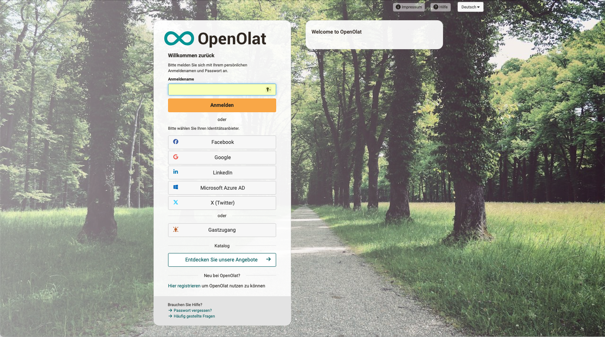

# Login-Seite {: #login}

:octicons-device-camera-video-24: **Video-Einführung**: [Login](<https://www.youtube.com/embed/Sy5cXJL7K90>){:target="_blank”} 

Auf der Startseite müssen Sie nachweisen, dass Sie eine Zugangsberechtigung zu OpenOlat haben. Sie können aber auch als Gast Zutritt erhalten.
Beachten Sie, dass die genauen Zugangsmöglichkeiten je nach OpenOlat Instanz etwas variieren können.

Sie finden auf der Einstiegsseite je nach Konfiguration und Gestaltung

* ein Eingabefeld für den Benutzernamen
* ein Eingabefeld für das Passwort (aus Sicherheitsgründen meistens in einem zweiten Schritt)
* je nach Sicherheitsstufe (mit oder ohne Passkey) eine Aufforderung zur Bestätigung
* einen Button für das OpenOlat-Login
* evtl. verschiedene Buttons von anderen Authentifizierungsdiensten
* einen Button/Link zur Selbstregistrierung
* einen Button für einen Zugang als Gast
* einen Button zum Aufruf des Katalogs (ohne vorherige Registrierung)
* einen Button/Link um ein neues Passwort anzufordern 
* einen Link zu Ihrem Support (Telefonnummer, Mailadresse)
* einen Link zu Hilfe-Seiten

Oft ist die Einstiegsseite auch so eingerichtet, dass Sie zuerst Ihre Bildungseinrichtung oder eine Abteilung wählen können. Sie werden dann weitergeleitet und aufgefordert, Ihre Zugangsdaten einzugeben.

Es ist auch möglich, dass Sie nach einer einmaligen Anmeldung in Ihrer Bildungseinrichtung automatisch eine Zutrittsbereichtigung zu OpenOlat erhalten haben und ohne weitere Anmeldung direkt Zugang zu OpenOlat erhalten (Single Sign On).

Wenn Sie keinen der angebotenen externen Authentifizierungsdienste nutzen wollen, wählen Sie die direkte Anmeldung mit dem OpenOlat-Konto.

Sollten Sie ihre Zugangsdaten (Benutzername und/oder Passwort) nicht mehr zu Hand haben, klicken Sie bitte auf "Passwort vergessen" oder wenden Sie sich an Ihren zuständigen Support.

{ class=" shadow lightbox" }
  
## Gastzugang {: #guest}

Alternativ können Sie OpenOlat auch als Gast besuchen. Der Gastzugang gewährt Ihnen einen Einblick in OpenOlat mit eingeschränkter Funktionalität: Sie haben nur Zugriff auf Lerninhalte, die ausdrücklich für Gäste freigegeben sind. Um Zugang zu weiteren Lernmaterialien und -aktivitäten zu erhalten, müssen Sie sich bei OpenOlat registrieren. Weitere Informationen zum Gastzugang finden Sie [hier](../basic_concepts/guest_access.de.md).

## Browser {: #browsercheck}

OpenOlat funktioniert optimal mit den folgenden Browsern in einer aktuellen Version (mobil oder Desktop):

* [Apple Safari](https://www.apple.com/safari/)
* [Firefox](https://www.mozilla.org/firefox/)
* [Microsoft Edge](https://www.microsoft.com/edge)
* [Google Chrome](https://www.google.com/chrome/)

## Cookies & Javascript {: #cookies}

Grundsätzlich muss ihr Browser Session Cookies akzeptieren und Javascript muss aktiviert sein.

## Nach dem Login {: #after_login}

Nach dem Login gelangen Sie entweder

* auf Ihre persönliche Startseite in OpenOlat, 
* auf eine Infoseite, eine Seite die in der Regel generelle Informationen zu verschiedenen Themen enthält, 
* das [OpenOlat Portal](../basic_concepts/Portal_configuration.de.md) oder 
* auf eine von Ihnen selbst festgelegte Startseite. 

## Nach dem Aufruf des Katalogs {: #webcatalog}

Beim Aufruf des Katalogs auf der Login-Seite wird eine gespiegelte Version des Katalogs V2 angezeigt, für die keine Benutzerregistrierung zum Durchsuchen erforderlich ist. Erst wenn ein bestimmter Kurs gebucht werden soll, werden die Benutzer:innen durch einen Registrierungsprozess geführt.