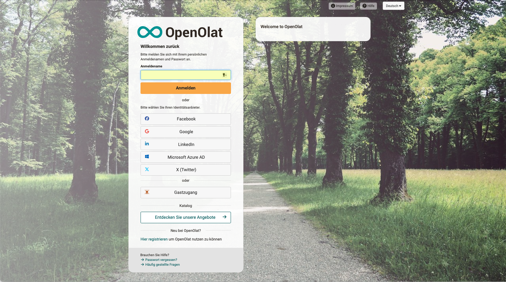

# Login Page {: #login}

:octicons-device-camera-video-24: **Video Introduction (German)**: [Login](<https://www.youtube.com/embed/Sy5cXJL7K90>){:target="_blank"}

On the login page, you must prove that you have access authorization to OpenOlat. However, you can also gain access as a guest.
Please note that the exact access options may vary slightly depending on the OpenOlat instance.

Depending on the configuration and design, you will find the following on the login page

* an input field for the username
* an input field for the password (for security reasons, usually in a second step)
* depending on the security level (with or without passkey), a request for confirmation
* depending on the configuration, the entry of a [one time code](One_Time_Code.md) (confirmation code by e-mail) [:octicons-tag-16:{ title="from Release 21.0 (OO-9509)" }](https://track.frentix.com/issue/OO-9509)
* the button "Login" for the OpenOlat login
* possibly various buttons of other authentication services
* the link "Register here" for self-registration
* the button "Guest access" for access as a guest
* the button "Explore our offers" to open the catalog (without prior registration)
* the link "Forgot password?" to request a new password
* a link to your support (telephone number, e-mail address)
* the link "Frequently asked questions" to help pages
* the language selection

The login page is often set up so that you can first select your educational institution or a department. You will then be redirected and asked to enter your access data.

It is also possible that after a one-time login at your educational institution you automatically receive an access authorization for OpenOlat and gain direct access to OpenOlat without further login (single sign on).

If you do not wish to use any of the external authentication services offered, select the direct login with the OpenOlat account.

If you no longer have your access data (username and/or password) to hand, please click on "Forgot password?" or contact your responsible support team.

If your account is deactivated or not yet activated, OpenOlat shows the message "Your account is deactivated." or "Your account has not yet been activated." with a link to support after you have entered your access data. [:octicons-tag-16:{ title="from Release 20.0 (OO-8466)" }](https://track.frentix.com/issue/OO-8466)

{ class="shadow lightbox" }

## Guest Access {: #guest}

Alternatively, you can also visit OpenOlat as a guest. The guest access provides an insight into OpenOlat with limited functionality: you only have access to learning content that is explicitly released for guests. In order to have access to other learning materials and activities, you have to register with OpenOlat. Further information on the guest access can be found [here](../basic_concepts/guest_access.md).

## Browser {: #browsercheck}

OpenOlat works optimally with the following browsers in a current version (mobile or desktop):

* [Apple Safari](https://www.apple.com/safari/)
* [Firefox](https://www.mozilla.org/firefox/)
* [Microsoft Edge](https://www.microsoft.com/edge)
* [Google Chrome](https://www.google.com/chrome/)

## Cookies & Javascript {: #cookies}

In any case, your browser must accept session cookies, and Javascript must be enabled.

## After login {: #after_login}

After your login you will navigate either to

* your personal landing page in OpenOlat,
* an info page, a page which usually contains general information on various topics,
* the [OpenOlat portal](../basic_concepts/Portal_configuration.md) or
* a landing page defined by yourself.

## After calling up the catalog {: #webcatalog}

When you call up the catalog on the login page, the [web catalog](../area_modules/catalog2.0_web.md) is displayed, a mirrored version of catalog 2.0 that can be browsed without registration. Only when a specific course is to be booked are persons without an account guided through the registration.

## Further information {: #further_information}

**Mentioned on this page** 
[One Time Code >](One_Time_Code.md) 
[Roles and Rights: Guest access >](../basic_concepts/guest_access.md) 
[Apple Safari >](https://www.apple.com/safari/) 
[Firefox >](https://www.mozilla.org/firefox/) 
[Microsoft Edge >](https://www.microsoft.com/edge) 
[Google Chrome >](https://www.google.com/chrome/) 
[Portal configuration >](../basic_concepts/Portal_configuration.md) 
[Externally available catalog >](../area_modules/catalog2.0_web.md)

**youtube** 
[Login](<https://www.youtube.com/embed/Sy5cXJL7K90>)

[To the top of the page ^](#login)
