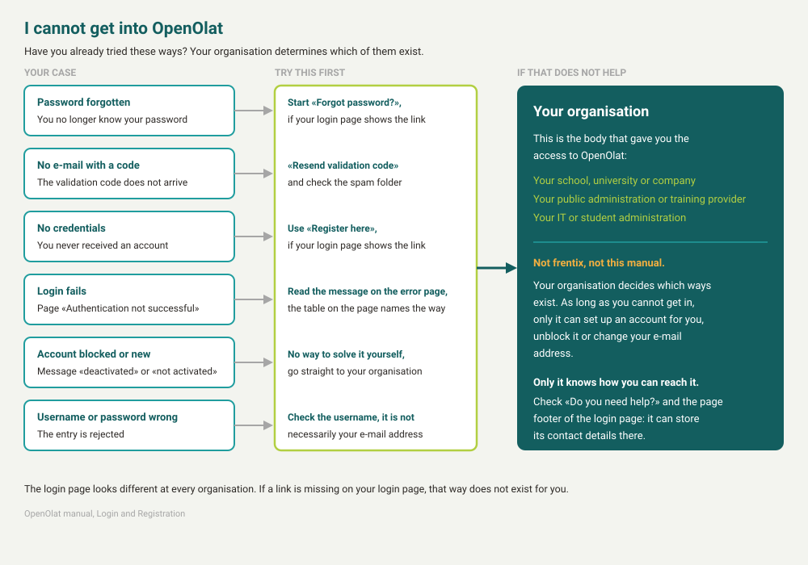
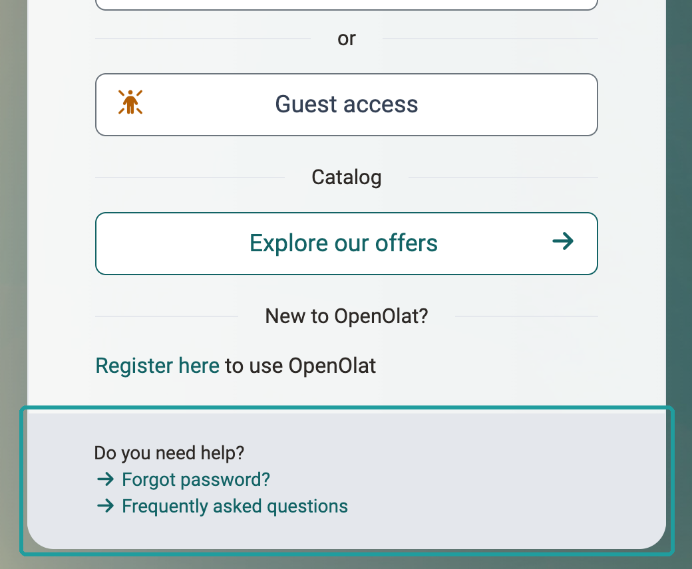

# Login Page {: #login}

:octicons-device-camera-video-24: **Video Introduction (German)**: [Login](<https://www.youtube.com/embed/Sy5cXJL7K90>){:target="_blank"}

On the login page you prove that you have access to OpenOlat. Your organisation determines what the page looks like. This is why you may not see all the options described here. If you cannot log in successfully, you will find the right way below under [I cannot get in](#no_access).

{ class="shadow lightbox" }

## How to log in {: #how_to_login}

Which way you take depends on where your account is stored. There are three possibilities, and your organisation decides which of them are offered on your login page.

* **With the account of your organisation.** The buttons below "Please select your identity provider." lead to an external service, for example "Microsoft Azure AD". You log in there with the credentials that you also use for the other services of your organisation. OpenOlat does not store this password. If you have already logged in at your organisation, you may reach OpenOlat directly without any further entry (single sign on).
* **With a local OpenOlat account.** Below the buttons you find "Don't you belong to one of the institutions mentioned above or have a local user account?" with the link "Login with account". Username and password are stored in OpenOlat here.
* **Without an account.** "Guest access" and "Explore our offers" provide an insight without logging in, "Register here" creates your own account, provided that your organisation allows self-registration.

Depending on the security level, a second step follows after the password: a confirmation by [Passkey](Passkey.md) or the entry of a [one time code](One_Time_Code.md) that OpenOlat sends you by e-mail. [:octicons-tag-16:{ title="from Release 21.0 (OO-9509)" }](https://track.frentix.com/issue/OO-9509)

## I cannot get in {: #no_access}

You are in front of the login and cannot get any further. Find the case below that matches your situation: every case names the next step and says whether you can take it yourself. Your organisation determines which of these ways your login page offers.

If the login page shows "You have been logged out", the cause is not a login problem: your session has expired. Log in again, see [Session Timeout and Logout](../basic_concepts/Session_Timeout_and_Logout.md).

{ class="shadow lightbox" }

### I have forgotten my password {: #forgot_password}

You set a new password yourself, provided that your organisation allows this and an e-mail address is stored on your account. The link "Forgot password?" is below the login in the area "Do you need help?", together with the link "Frequently asked questions". If you do not see the area, click "Login with account" first. The link starts the wizard "Set login credentials", which identifies you by a validation code and then lets you set a new password. The page [Password](Password.md#reset_password) describes the steps.

{ class="shadow lightbox" }

Your organisation has set up whether and where the link leads. It can open the OpenOlat wizard, open a page of your organisation in a new window, or be missing. If the link is missing, your password is not stored in OpenOlat. This is the case if you log in with one of the buttons below "Please select your identity provider.". Change the password where you also change it for your other services, or contact [your organisation](#contact_support).

### I do not receive an e-mail with the validation code {: #no_mail}

If the step "Login - Validation" appears directly during the login and not in the wizard "Set login credentials", it is about the second factor. The page [One Time Code](One_Time_Code.md#no_code) describes this case.

Without the validation code you cannot get any further in the wizard "Set login credentials". Four things help, in this order:

1. In the step "Validation" you find "Did you not receive your validation code?" with the button "Resend validation code". OpenOlat then generates a new code. All earlier codes become invalid.
2. Check the spam folder. The e-mail has the subject "Validation code for new OpenOlat credentials".
3. OpenOlat sends the e-mail to the address stored on your account. If an old address or no address at all is stored there, the e-mail does not reach you. You cannot change this address without logging in, only [the body that manages your account](#contact_support) can do that.
4. If OpenOlat reports "User could not be identified clearly.", the e-mail address or the username you entered belongs to no account or to several accounts. Try the other entry instead.

If you use a passkey for your account, the e-mail has the subject "Key for new OpenOlat password" and contains no code, but the note to use your recovery keys or to contact the support centre. Recovery keys are the replacement codes that OpenOlat showed you when you set up the passkey, see [Passkey](Passkey.md). If you no longer have a recovery key, only [your organisation](#contact_support) can help.

### I have not received any credentials from my institution {: #no_account}

OpenOlat does not create accounts on its own. Either your organisation creates the account for you and tells you the username, or it allows self-registration. If you receive nothing and the login page shows no link "Register here", OpenOlat has no way to help you: contact [your organisation](#contact_support).

If the login page shows the link "Register here", you can create an account yourself. If OpenOlat reports "Your e-mail address doesn't match our list. Please use your institutional e-mail address." while you do so, only certain e-mail domains are released for self-registration. Your organisation knows which ones.

### The login through my institution fails {: #external_login}

If the identity provider of your organisation throws you back, the message on the page "Authentication not successful" tells you whether you can do something yourself. This applies to identity providers such as Microsoft Azure AD or Keycloak. With Shibboleth the messages read differently, for example "You are not authorized to log in OpenOlat."; the way is the same: [your organisation](#contact_support).

| Message | What it means | What you do |
|---|---|---|
| "You are not authorized to use the OpenOlat service (access_denied). Please contact the system administrator." | The access was not granted: either your organisation has not released it, or you cancelled the login at the identity provider. | Log in again and agree to the access, otherwise contact your organisation. |
| "You are not allowed to access the OpenOlat service (invalid_grant). Please contact the system administrator." | The identity provider rejected the request from OpenOlat. | Contact your organisation. |
| "Your account is not yet created on the OpenOlat service. This is required for beeing able to log in. Please contact the system administrator." | The login was successful, but an OpenOlat account is missing. | Contact your organisation. |
| "We were not able to identify you. Please contact the system administrator." | The identity provider did not supply OpenOlat with any information that allows your account to be matched. | Contact your organisation. |
| "A technical problem occurred (token_rejected). Please try it again later." | The exchange between OpenOlat and the identity provider failed. | Try again later, otherwise contact your organisation. |
| "An unexpected error occurred. Please try it again later." | An error without further detail. | Try again later, otherwise contact your organisation. |

The messages ask you to contact "the system administrator". This means the body that gave you the access, not frentix. Who this is, is described under [None of this helps](#contact_support).

### My account is blocked or not yet active [:octicons-tag-16:{ title="from Release 20.0 (OO-8466)" }](https://track.frentix.com/issue/OO-8466) {: #account_blocked}

These two messages concern the state of your account, not your entry. After you have entered your credentials, OpenOlat shows either "Your account is deactivated." or "Your account has not yet been activated.", each with a link to support. Only [your organisation](#contact_support) can change either of them.

### Username or password wrong {: #wrong_credentials}

Check the username first, because it is not necessarily your e-mail address. Your organisation determines which entry applies. The message reads "Username or password wrong. Please try again or use the function «Forgot password?»".

After too many failed attempts, OpenOlat temporarily blocks the login for this username and reports "Login blocked for this username.". Wait for the time named in the message and log in again afterwards. If you do not know your username, only [your organisation](#contact_support) can help.

## None of this helps {: #contact_support}

If none of the ways above gets you any further, you need a person who is allowed to manage your account. This body is always the same, no matter why the login failed.

!!! tip "This is your support"

    The right support is always the body that gave you the access to OpenOlat: your school, university, company, public administration or training provider, or their IT and student administration. As long as you cannot get in, only this body can set up an account for you, unblock it or change your e-mail address. frentix develops OpenOlat and does not answer questions about individual accounts. Only your organisation itself knows how to reach it. Check the area "Do you need help?" and the page footer of the login page: your organisation can store its contact details there. Otherwise ask the person from whom you received the course or the access.

## Guest Access {: #guest}

Alternatively, you can also visit OpenOlat as a guest. The guest access provides an insight into OpenOlat with limited functionality: you only have access to learning content that is explicitly released for guests. In order to have access to other learning materials and activities, you have to register with OpenOlat. Further information on the guest access can be found [here](../basic_concepts/guest_access.md).

## Browser {: #browsercheck}

OpenOlat works optimally with the following browsers in a current version (mobile or desktop):

* [Apple Safari](https://www.apple.com/safari/)
* [Firefox](https://www.mozilla.org/firefox/)
* [Microsoft Edge](https://www.microsoft.com/edge)
* [Google Chrome](https://www.google.com/chrome/)

## Cookies & Javascript {: #cookies}

In any case, your browser must accept session cookies, and Javascript must be enabled.

## After login {: #after_login}

After your login you will navigate either to

* your personal landing page in OpenOlat,
* an info page, a page which usually contains general information on various topics,
* the [OpenOlat portal](../basic_concepts/Portal_configuration.md) or
* a landing page defined by yourself.

## After calling up the catalog {: #webcatalog}

When you call up the catalog on the login page, the [web catalog](../area_modules/catalog2.0_web.md) is displayed, a mirrored version of catalog 2.0 that can be browsed without registration. Only when a specific course is to be booked are persons without an account guided through the registration.

## Further information {: #further_information}

**Mentioned on this page** 
[Passkey >](Passkey.md) 
[One Time Code >](One_Time_Code.md) 
[Password >](Password.md) 
[Roles and Rights: Guest access >](../basic_concepts/guest_access.md) 
[Apple Safari >](https://www.apple.com/safari/) 
[Firefox >](https://www.mozilla.org/firefox/) 
[Microsoft Edge >](https://www.microsoft.com/edge) 
[Google Chrome >](https://www.google.com/chrome/) 
[Portal configuration >](../basic_concepts/Portal_configuration.md) 
[Externally available catalog >](../area_modules/catalog2.0_web.md)

**Further reading** 
[Session Timeout and Logout >](../basic_concepts/Session_Timeout_and_Logout.md) 
[Security Levels >](Security_levels.md) 
[Login Concept >](Login_Concept.md)

**youtube** 
[Login](<https://www.youtube.com/embed/Sy5cXJL7K90>)

[To the top of the page ^](#login)
